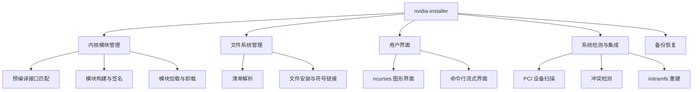
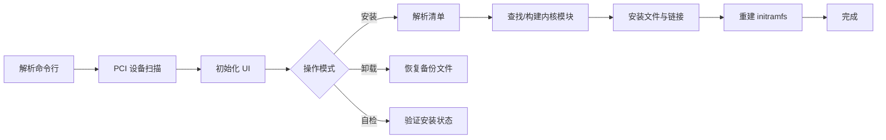

# NVIDIA Installer - 项目Wiki主页

## 项目简介

NVIDIA Installer 是 NVIDIA 官方用于 Linux 系统的图形驱动安装工具，采用纯 C 语言编写，通过统一的安装流程完成驱动软件包的解析、校验、内核模块构建与加载、用户态库部署，并处理与系统现有组件（X Server、DKMS、SELinux、systemd、initramfs）的集成。



## 技术栈

| 类别 | 技术 |
|------|------|
| 编程语言 | C (C99) |
| 构建系统 | GNU Make |
| UI 框架 | ncurses (动态加载多版本DSO) |
| 硬件检测 | libpciaccess / pciutils |
| 模块管理 | modprobe / rmmod / depmod |
| 包格式 | makeself 自解压包 |

## 文档导航

### 入门指南

| 文档 | 说明 |
|------|------|
| [项目概述](项目概述.md) | 项目背景、核心组件与架构总览 |
| [快速开始](快速开始.md) | 系统要求、编译安装步骤与基本使用 |
| [安装和配置指南](安装和配置指南.md) | 详细的安装配置参考 |
| [命令行接口参考](命令行接口参考.md) | 完整的命令行选项说明 |

### 技术架构

| 文档 | 说明 |
|------|------|
| [技术架构](技术架构/技术架构.md) | 整体架构设计与分层说明 |
| [核心程序架构](技术架构/核心程序架构.md) | 主程序入口与控制流 |
| [用户界面架构](技术架构/用户界面架构.md) | UI 抽象层与多后端支持 |
| [内核管理架构](技术架构/内核管理架构.md) | 内核模块构建、签名与加载 |
| [文件系统管理架构](技术架构/文件系统管理架构.md) | 文件安装与清单解析 |
| [系统集成架构](技术架构/系统集成架构.md) | 与系统服务和工具的集成 |

### 核心模块详解

| 文档 | 说明 |
|------|------|
| [核心模块详解](核心模块详解/核心模块详解.md) | 模块总览 |
| [主程序模块](核心模块详解/主程序模块.md) | nvidia-installer.c 主控逻辑 |
| [用户界面模块](核心模块详解/用户界面模块.md) | ncurses-ui.c / stream-ui.c |
| [内核管理模块](核心模块详解/内核管理模块.md) | kernel.c 内核模块管理 |
| [文件管理系统](核心模块详解/文件管理系统.md) | files.c 文件安装 |
| [备份恢复模块](核心模块详解/备份恢复模块.md) | backup.c 备份与回滚 |
| [工具函数模块](核心模块详解/工具函数模块.md) | common-utils 通用工具库 |

### API 参考

| 文档 | 说明 |
|------|------|
| [API参考文档](API参考文档/API参考文档.md) | API 总览 |
| [核心API接口](API参考文档/核心API接口.md) | 核心数据结构与函数 |
| [用户界面API](API参考文档/用户界面API.md) | UI 回调与接口定义 |
| [内核管理API](API参考文档/内核管理API.md) | 内核模块操作接口 |
| [文件管理API](API参考文档/文件管理API.md) | 文件操作与清单接口 |
| [备份恢复API](API参考文档/备份恢复API.md) | 备份与恢复接口 |
| [工具函数API](API参考文档/工具函数API.md) | 通用工具函数 |

### 开发者资源

| 文档 | 说明 |
|------|------|
| [开发者指南](开发者指南.md) | 开发环境搭建与编码规范 |
| [扩展和插件开发](扩展和插件开发.md) | UI 插件与扩展机制 |
| [故障排除和FAQ](故障排除和FAQ.md) | 常见问题与调试指南 |

## 项目结构

```
nvidia-installer/
├── nvidia-installer.c      # 主程序入口
├── install-from-cwd.c      # 安装执行逻辑
├── kernel.c/h              # 内核模块管理
├── files.c/h               # 文件安装
├── manifest.c/h            # 清单解析与文件类型
├── backup.c/h              # 备份与回滚
├── misc.c/h                # 系统检查与 PCI 扫描
├── sanity.c/h              # 完整性自检
├── initramfs.c/h           # initramfs 处理
├── user-interface.c/h      # UI 抽象层
├── ncurses-ui.c            # ncurses UI 实现
├── stream-ui.c             # 流式 UI 实现
├── precompiled.c/h         # 预编译内核接口
├── mkprecompiled.c         # 预编译打包工具
├── option_table.h          # 命令行选项定义
├── nvidia-installer.h      # 核心数据结构
├── common-utils/           # 通用工具库
│   ├── common-utils.c/h    # 字符串/路径工具
│   ├── nvgetopt.c/h        # 选项解析
│   ├── nvpci-utils.c/h     # PCI 工具
│   └── msg.c/h             # 消息输出
├── Makefile                # 构建规则
├── dist-files.mk           # 源文件清单
└── version.mk              # 版本信息
```

## 核心工作流



## 快速开始

```bash
# 编译
make -j$(nproc)

# 查看帮助
./nvidia-installer --help

# 标准安装
sudo ./nvidia-installer

# 静默安装
sudo ./nvidia-installer --silent --no-questions

# 卸载
sudo ./nvidia-installer --uninstall
```

详细信息请参阅 [快速开始](快速开始.md) 文档。
