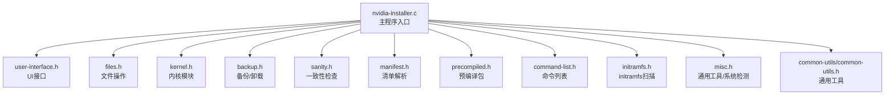
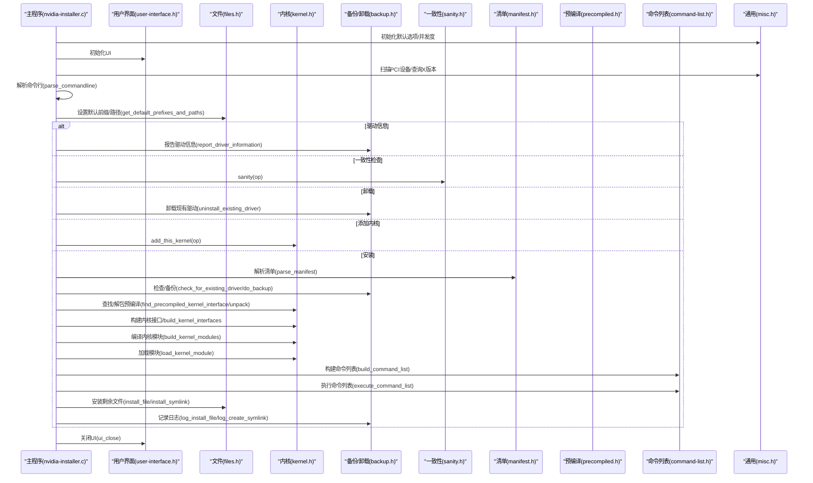
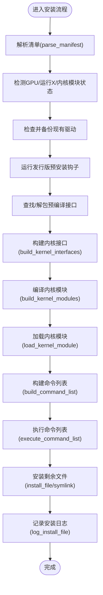
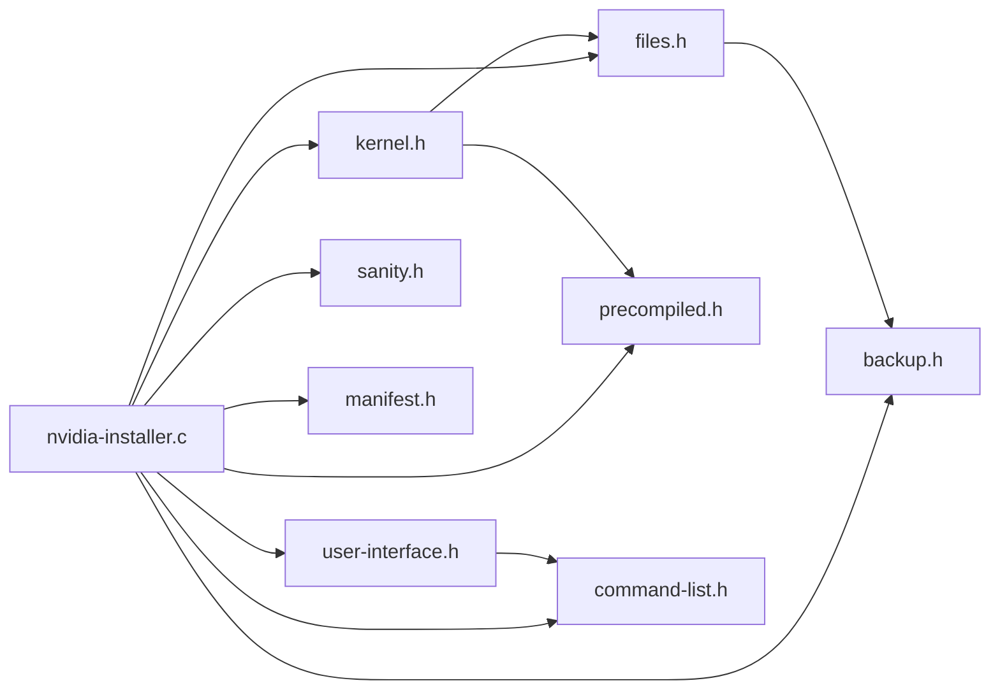

# API参考文档

<cite>
**本文档引用的文件**
- [nvidia-installer.h](file://nvidia-installer.h)
- [nvidia-installer.c](file://nvidia-installer.c)
- [common-utils.h](file://common-utils/common-utils.h)
- [kernel.h](file://kernel.h)
- [manifest.h](file://manifest.h)
- [user-interface.h](file://user-interface.h)
- [files.h](file://files.h)
- [sanity.h](file://sanity.h)
- [backup.h](file://backup.h)
- [misc.h](file://misc.h)
- [command-list.h](file://command-list.h)
- [initramfs.h](file://initramfs.h)
- [precompiled.h](file://precompiled.h)
- [install-from-cwd.c](file://install-from-cwd.c)
- [kernel.c](file://kernel.c)
- [files.c](file://files.c)
- [README](file://README)
</cite>

## 目录
1. [简介](#简介)
2. [项目结构](#项目结构)
3. [核心组件](#核心组件)
4. [架构总览](#架构总览)
5. [详细组件分析](#详细组件分析)
6. [依赖关系分析](#依赖关系分析)
7. [性能考量](#性能考量)
8. [故障排查指南](#故障排查指南)
9. [结论](#结论)
10. [附录](#附录)

## 简介
本文件为 NVIDIA 安装程序（nvidia-installer）的完整 API 参考文档，覆盖公共接口函数、核心数据结构、调用约定与错误处理机制，并提供接口间依赖关系、调用顺序、版本兼容性与性能优化建议。目标读者包括需要集成或二次开发该安装器的第三方开发者。

## 项目结构
该项目采用模块化设计，按功能域划分头文件与实现文件：
- 核心入口与选项解析：nvidia-installer.c、nvidia-installer.h
- 用户界面抽象：user-interface.h
- 文件系统操作：files.h、files.c
- 内核模块构建与加载：kernel.h、kernel.c
- 预编译内核接口包格式：precompiled.h
- 命令列表与执行：command-list.h
- 备份与卸载：backup.h
- 检查与一致性测试：sanity.h、misc.h
- 公共工具与类型：common-utils/common-utils.h
- 初始化ramfs扫描：initramfs.h

**图表来源**
- [nvidia-installer.c:648-762](file://nvidia-installer.c#L648-L762)
- [user-interface.h:36-61](file://user-interface.h#L36-L61)
- [files.h:26-77](file://files.h#L26-L77)
- [kernel.h:47-80](file://kernel.h#L47-L80)
- [backup.h:30-45](file://backup.h#L30-L45)
- [sanity.h:26-28](file://sanity.h#L26-L28)
- [manifest.h:25-41](file://manifest.h#L25-L41)
- [precompiled.h:163-195](file://precompiled.h#L163-L195)
- [command-list.h:46-49](file://command-list.h#L46-L49)
- [initramfs.h:22-24](file://initramfs.h#L22-L24)
- [misc.h:69-121](file://misc.h#L69-L121)
- [common-utils.h:54-82](file://common-utils/common-utils.h#L54-L82)

**章节来源**
- [nvidia-installer.c:648-762](file://nvidia-installer.c#L648-L762)
- [README:1-134](file://README#L1-L134)

## 核心组件
本节概述安装器的核心数据结构与公共接口，便于快速定位与使用。

- 选项结构 Options
  - 描述：安装器全局配置与运行时状态，由命令行解析填充，贯穿安装流程。
  - 关键字段类别：布尔开关（如 uninstall、debug、no_backup）、路径前缀（如 opengl_prefix、x_prefix）、内核相关路径（kernel_source_path 等）、UI 与日志配置（ui、log_file_name）、SELinux/DKMS/Initramfs 等可选能力。
  - 使用规则：在 main() 中初始化默认值，随后 parse_commandline() 解析命令行，再进行后续步骤。

- 包结构 Package 与条目 PackageEntry
  - Package：描述驱动包信息（版本、描述、内核模块信息等），以及清单条目数组。
  - PackageEntry：单个文件条目的元数据（源路径、目标路径、类型、权限、兼容架构等）。

- 内核模块信息 KernelModuleInfo
  - 记录模块名、文件名、是否可选、可选依赖、禁用选项偏移等，用于条件安装与卸载。

- 文件类型枚举 PackageEntryFileType
  - 覆盖 OpenGL、CUDA、Vulkan、X/OldGL、Wine、SystemD、GBM、Firmware 等多种类型，配合清单解析与安装逻辑使用。

- UI 接口
  - 提供初始化、消息输出、确认、进度、命令审批等接口，统一错误/警告/日志输出。

- 文件系统接口
  - 封装复制、安装、目录创建、临时文件、安全删除等常用操作。

- 内核模块接口
  - 安装路径确定、源码/输出路径解析、预编译接口查找与解包、内核接口构建、模块加载/卸载、签名等。

- 备份与卸载接口
  - 备份现有文件、记录日志、卸载旧驱动、报告驱动信息等。

- 预编译包接口
  - 读取/解包/打包预编译内核接口或模块，校验CRC与签名。

- 命令列表接口
  - 构建待执行命令序列、批准与执行命令列表。

- 通用工具接口
  - 版本编码、字符串处理、权限转换、并发度设置、系统工具检测、SELinux/SystemD 检测等。

**章节来源**
- [nvidia-installer.h:185-342](file://nvidia-installer.h#L185-L342)
- [nvidia-installer.h:457-471](file://nvidia-installer.h#L457-L471)
- [nvidia-installer.h:444-454](file://nvidia-installer.h#L444-L454)
- [nvidia-installer.h:101-169](file://nvidia-installer.h#L101-L169)
- [user-interface.h:36-61](file://user-interface.h#L36-L61)
- [files.h:26-77](file://files.h#L26-L77)
- [kernel.h:47-80](file://kernel.h#L47-L80)
- [backup.h:30-45](file://backup.h#L30-L45)
- [precompiled.h:163-195](file://precompiled.h#L163-L195)
- [command-list.h:46-49](file://command-list.h#L46-L49)
- [common-utils.h:54-82](file://common-utils/common-utils.h#L54-L82)
- [common-utils.h:103-124](file://common-utils/common-utils.h#L103-L124)

## 架构总览
下图展示从主程序入口到各子系统的调用关系与控制流。

**图表来源**
- [nvidia-installer.c:648-762](file://nvidia-installer.c#L648-L762)
- [install-from-cwd.c:96-200](file://install-from-cwd.c#L96-L200)
- [kernel.c:99-146](file://kernel.c#L99-L146)
- [files.c:56-116](file://files.c#L56-L116)
- [backup.h:37-41](file://backup.h#L37-L41)
- [sanity.h:26-28](file://sanity.h#L26-L28)
- [manifest.h:25-41](file://manifest.h#L25-L41)
- [precompiled.h:163-195](file://precompiled.h#L163-L195)
- [command-list.h:46-49](file://command-list.h#L46-L49)
- [misc.h:69-121](file://misc.h#L69-L121)

## 详细组件分析

### 主程序入口与生命周期
- 函数：main()
  - 功能：初始化默认选项、扫描PCI设备、解析命令行、初始化日志、调整工作目录、初始化UI、并发度设置、系统工具检测、X版本查询、默认路径解析、根据模式执行安装/卸载/一致性检查/驱动信息/添加内核，最后关闭UI并返回退出码。
  - 参数：argc/argv
  - 返回：0 表示成功，非0表示失败
  - 错误处理：遇到权限不足、工具缺失、命令行无效等情况会输出错误并提前返回
  - 调用约定：严格遵循“初始化-检测-决策-执行-收尾”的顺序

- 函数：parse_commandline()
  - 功能：解析命令行选项，填充 Options 结构；支持帮助、静默、无备份、内核路径、DKMS、SELinux、SystemD、并发度、文件类型覆盖等大量选项
  - 参数：argc/argv/op
  - 返回：无（通过 op 影响全局状态）
  - 错误处理：非法选项时打印帮助并退出

- 函数：load_default_options()
  - 功能：分配并初始化 Options 的默认值（如日志开启、默认前缀、SELinux策略、DKMS启用等）
  - 返回：Options* 或 NULL（内存不足）

**章节来源**
- [nvidia-installer.c:648-762](file://nvidia-installer.c#L648-L762)
- [nvidia-installer.c:225-640](file://nvidia-installer.c#L225-L640)
- [nvidia-installer.c:119-157](file://nvidia-installer.c#L119-L157)

### 用户界面接口
- 函数：ui_init()/ui_close()
  - 功能：初始化/关闭UI，建立消息输出通道
- 函数：ui_message()/ui_warn()/ui_error()/ui_log()
  - 功能：统一的日志/警告/错误输出，支持格式化字符串
- 函数：ui_approve_command_list()/execute_command_list()
  - 功能：审批并执行命令列表，支持交互式确认
- 函数：ui_yes_no()/ui_multiple_choice()/ui_paged_prompt()
  - 功能：用户交互选择与分页提示
- 函数：ui_status_begin()/ui_status_update()/ui_status_end()
  - 功能：进度条开始/更新/结束
- 函数：ui_indeterminate_begin()/ui_indeterminate_end()
  - 功能：不确定进度指示器

**章节来源**
- [user-interface.h:36-61](file://user-interface.h#L36-L61)

### 文件系统与安装接口
- 函数：remove_directory()/touch_directory()
  - 功能：递归删除/触碰目录时间戳
- 函数：copy_file()/install_file()/install_symlink()
  - 功能：复制文件/安装文件/创建符号链接
- 函数：mkdir_recursive()/mkdir_with_log()
  - 功能：递归创建目录并记录日志
- 函数：write_temp_file()/make_tmpdir()/get_tmpdir()
  - 功能：临时文件/目录管理
- 函数：set_destinations()/get_prefixes()
  - 功能：根据清单与选项计算目标路径
- 函数：secure_delete()/get_filename()
  - 功能：安全删除/交互式输入文件名
- 函数：process_template_file()/process_dot_desktop_files()/process_dkms_conf()
  - 功能：模板处理、桌面文件处理、DKMS配置处理

**章节来源**
- [files.h:26-77](file://files.h#L26-L77)
- [files.c:56-200](file://files.c#L56-L200)

### 内核模块接口
- 函数：determine_kernel_module_installation_path()
  - 功能：确定内核模块安装路径，必要时交互确认
- 函数：determine_kernel_source_path()/determine_kernel_output_path()
  - 功能：解析内核源码与输出目录
- 函数：find_precompiled_kernel_interface()/unpack_kernel_modules()
  - 功能：查找并解包预编译内核接口/模块
- 函数：build_kernel_interfaces()/build_kernel_modules()
  - 功能：构建内核接口与模块
- 函数：load_kernel_module()/rmmod_kernel_module()
  - 功能：加载/卸载内核模块
- 函数：sign_kernel_module()/guess_module_signing_hash()
  - 功能：内核模块签名与哈希推断
- 函数：test_kernel_modules()/test_kernel_config_option()
  - 功能：模块测试与内核配置项检测
- 函数：valid_kernel_module_types()/override_kernel_module_type()
  - 功能：有效模块类型与类型覆盖

**章节来源**
- [kernel.h:47-80](file://kernel.h#L47-L80)
- [kernel.c:99-146](file://kernel.c#L99-L146)
- [kernel.c:155-193](file://kernel.c#L155-L193)

### 备份与卸载接口
- 函数：init_backup()/do_backup()
  - 功能：初始化备份/执行备份
- 函数：check_for_existing_driver()/uninstall_existing_driver()
  - 功能：检查并卸载现有驱动
- 函数：report_driver_information()
  - 功能：报告当前已安装驱动信息
- 函数：log_install_file()/log_create_symlink()/log_mkdir()
  - 功能：安装/链接/目录创建日志记录

**章节来源**
- [backup.h:30-45](file://backup.h#L30-L45)

### 清单与文件类型接口
- 函数：parse_manifest_file_type()/get_file_type_capabilities()
  - 功能：解析文件类型字符串/获取类型能力位
- 函数：get_installable_file_type_list()/add_symlinks_to_file_type_list()
  - 功能：生成可安装文件类型列表/追加符号链接类型
- 函数：remove_file_type_from_file_type_list()
  - 功能：从列表中移除指定类型

**章节来源**
- [manifest.h:25-41](file://manifest.h#L25-L41)
- [nvidia-installer.h:350-369](file://nvidia-installer.h#L350-L369)

### 预编译包接口
- 结构体：PrecompiledInfo/PrecompiledFileInfo
  - 字段：版本/描述/proc版本串、文件数量、文件数组、属性掩码、CRC、签名等
- 函数：get_precompiled_info()/precompiled_unpack()/precompiled_pack()
  - 功能：读取/解包/打包预编译包
- 函数：precompiled_read_interface()/precompiled_read_module()
  - 功能：读取接口/模块文件
- 函数：free_precompiled()/free_precompiled_file_data()
  - 功能：释放预编译资源

**章节来源**
- [precompiled.h:136-195](file://precompiled.h#L136-L195)
- [precompiled.h:163-195](file://precompiled.h#L163-L195)

### 命令列表接口
- 结构体：CommandList/FileList
  - 字段：命令数/描述/命令指针；文件数/文件名数组
- 函数：build_command_list()/execute_command_list()/free_command_list()
  - 功能：构建/执行/释放命令列表

**章节来源**
- [command-list.h:29-49](file://command-list.h#L29-L49)

### 通用工具与系统检测
- 函数：check_euid()/adjust_cwd()/set_concurrency_level()
  - 功能：检查权限/调整工作目录/设置并发度
- 函数：find_system_utils()/find_module_utils()/check_selinux()/check_systemd()
  - 功能：系统工具/模块工具/SELinux/SystemD 检测
- 函数：run_command()/run_distro_hook()
  - 功能：执行外部命令/运行发行版钩子脚本
- 函数：nv_encode_version()/NV_VERSION2/3/4
  - 功能：版本编码宏，便于比较

**章节来源**
- [misc.h:69-121](file://misc.h#L69-L121)
- [common-utils.h:103-124](file://common-utils/common-utils.h#L103-L124)

### 安装流程（install_from_cwd）
- 流程要点：
  - 解析清单并构建 Package
  - 检测GPU/运行X服务器/卸载内核模块
  - 检查/备份现有驱动，处理替代安装
  - 运行发行版预安装钩子
  - 查找/解包预编译接口，构建内核接口
  - 编译内核模块，加载模块
  - 构建并执行命令列表，安装剩余文件
  - 记录安装日志，提示重启

**图表来源**
- [install-from-cwd.c:96-200](file://install-from-cwd.c#L96-L200)
- [kernel.c:99-146](file://kernel.c#L99-L146)
- [files.c:56-116](file://files.c#L56-L116)
- [backup.h:37-41](file://backup.h#L37-L41)
- [command-list.h:46-49](file://command-list.h#L46-L49)

**章节来源**
- [install-from-cwd.c:96-200](file://install-from-cwd.c#L96-L200)

## 依赖关系分析
- 组件耦合
  - 主程序对 UI、文件系统、内核、备份、清单、预编译、命令列表、通用工具均有直接依赖
  - 内核模块接口与预编译包紧密耦合，用于加速构建与减少编译依赖
  - 备份与卸载接口贯穿安装/升级/卸载流程，确保可回滚性

- 外部依赖
  - ncurses、pciutils（构建依赖）
  - 系统工具：ldconfig、grep、dmseg、modprobe/rmmod、depmod、systemd 工具链、objcopy、openssl 等（运行时检测）

- 循环依赖
  - 未发现直接循环依赖；模块间通过头文件声明与实现分离避免环状包含

**图表来源**
- [nvidia-installer.c:648-762](file://nvidia-installer.c#L648-L762)
- [kernel.h:47-80](file://kernel.h#L47-L80)
- [files.h:26-77](file://files.h#L26-L77)
- [backup.h:30-45](file://backup.h#L30-L45)
- [manifest.h:25-41](file://manifest.h#L25-L41)
- [precompiled.h:163-195](file://precompiled.h#L163-L195)
- [command-list.h:46-49](file://command-list.h#L46-L49)
- [user-interface.h:36-61](file://user-interface.h#L36-L61)

**章节来源**
- [README:20-44](file://README#L20-L44)

## 性能考量
- 并发度设置
  - 使用 set_concurrency_level() 根据CPU数量自动或手动设定并发级别，提升文件与命令执行效率
- 预编译接口优先
  - 优先查找/使用预编译内核接口，避免重复编译，显著缩短安装时间
- 目录批量操作
  - 使用递归创建/删除与批量安装，减少系统调用次数
- 日志与UI
  - 合理使用 ui_status_begin/update/end 与日志级别，平衡可观测性与性能

[本节为通用性能建议，不直接分析具体文件]

## 故障排查指南
- 权限问题
  - 确保以 root 运行（check_euid），否则安装无法继续
- 工具缺失
  - 系统工具与模块工具检测失败时，安装会提前终止；请安装缺失工具或修正 PATH
- SELinux/SystemD
  - 检测失败时需按提示调整策略或禁用相关特性
- 内核源码/输出路径
  - 若未找到预编译接口，需正确设置内核源码与输出路径，或使用 --kernel-source-path/--kernel-output-path
- 预编译包校验
  - CRC/签名不匹配会导致解包失败；请重新获取或验证包完整性
- 发行版钩子失败
  - 钩子脚本失败时可选择继续或中止；注意可能需要先重启系统

**章节来源**
- [misc.h:69-121](file://misc.h#L69-L121)
- [kernel.c:155-193](file://kernel.c#L155-L193)
- [precompiled.h:163-195](file://precompiled.h#L163-L195)
- [backup.h:37-41](file://backup.h#L37-L41)

## 结论
本参考文档梳理了 nvidia-installer 的核心数据结构与公共接口，明确了安装器的调用流程、依赖关系与错误处理机制。第三方开发者可据此进行二次开发、扩展 UI、增强日志与诊断能力，或集成到自动化部署平台。

[本节为总结性内容，不直接分析具体文件]

## 附录

### 版本兼容性与变更历史
- 版本编码
  - 使用 nv_encode_version()/NV_VERSION2/3/4 对版本进行编码比较，便于跨版本兼容判断
- 变更点
  - README 提及若干废弃选项（如 force-tls、no-runlevel-check 等），安装器会忽略并给出警告
  - 某些选项不再使用（如 no-network），安装器会忽略并提示

**章节来源**
- [common-utils.h:103-124](file://common-utils/common-utils.h#L103-L124)
- [nvidia-installer.c:367-400](file://nvidia-installer.c#L367-L400)
- [README:95-119](file://README#L95-L119)

### 最佳实践建议
- 在生产环境使用静默/无交互模式（--silent/--no-questions），并预先设置好路径与选项
- 优先使用预编译内核接口，减少编译时间与失败风险
- 安装前执行一致性检查（--sanity），确保系统满足要求
- 升级/降级时保留备份（默认开启），以便快速回滚
- 对于多核机器，合理设置并发度（--concurrency-level），提升吞吐

[本节为通用建议，不直接分析具体文件]