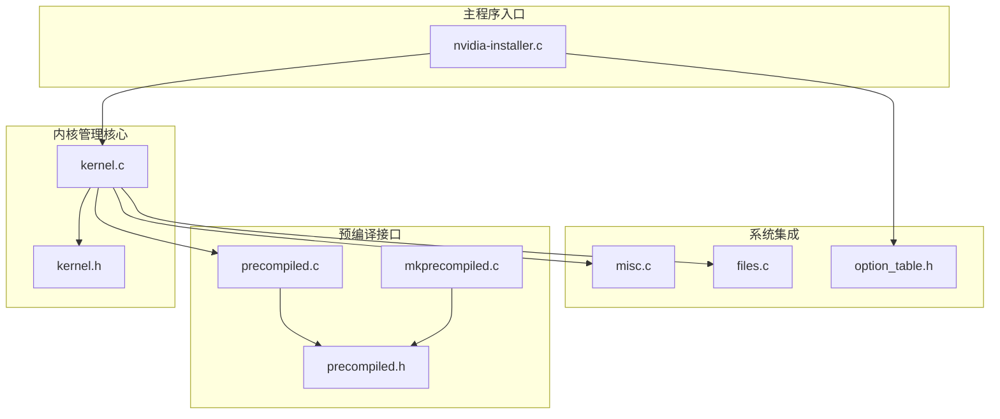
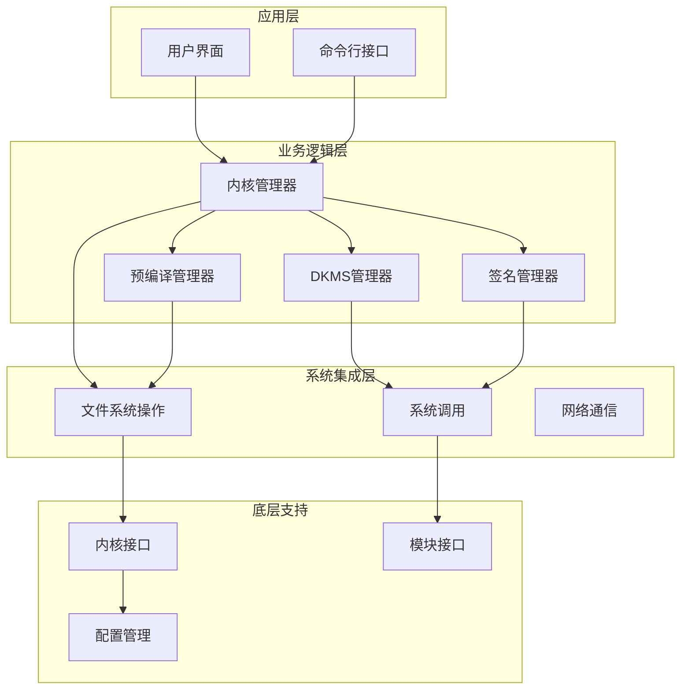
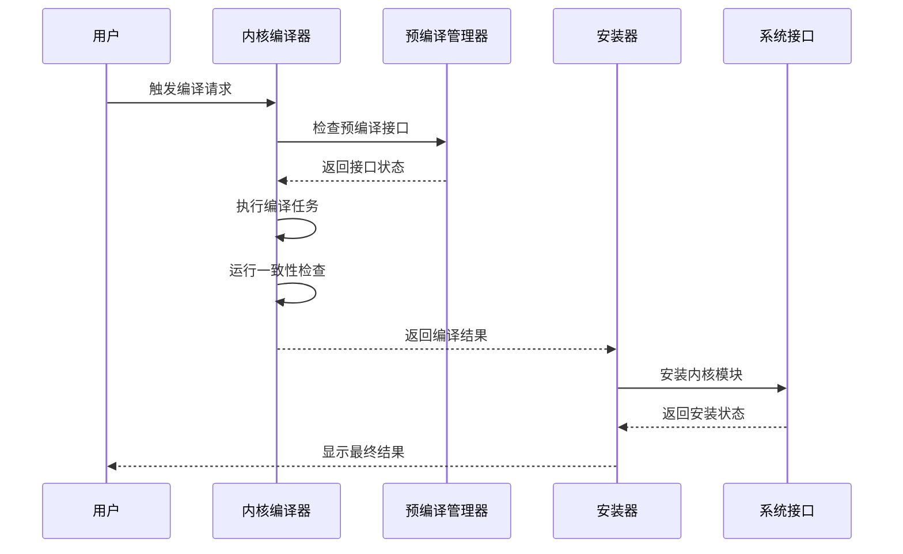
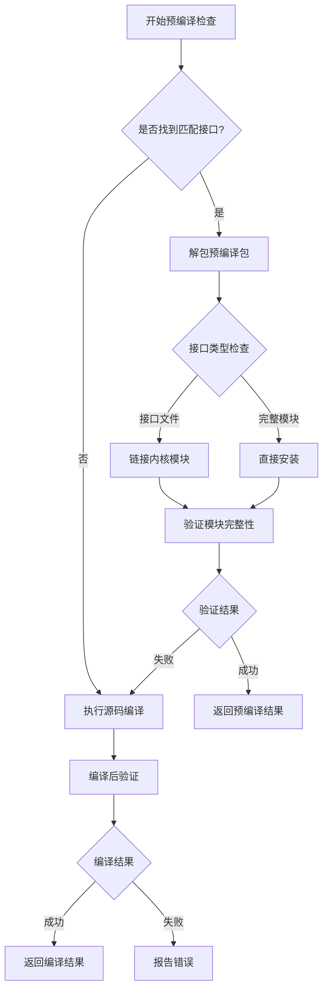
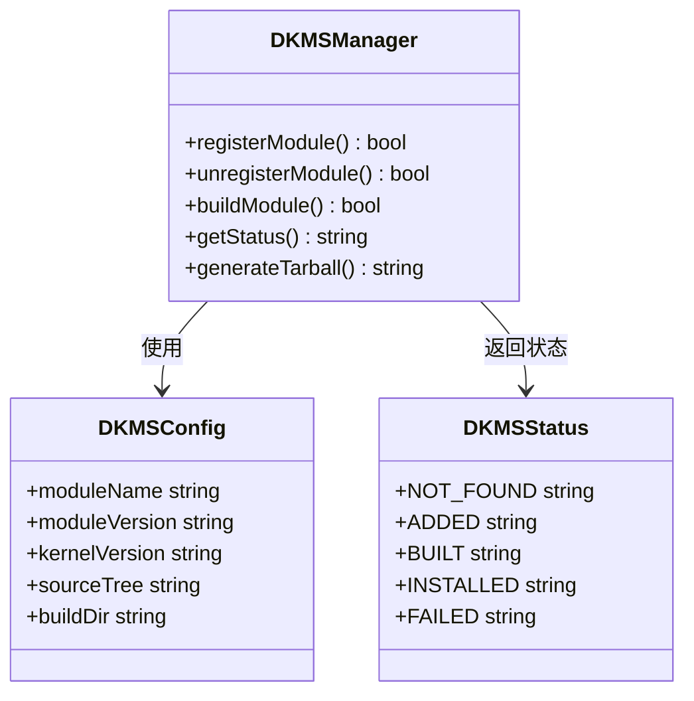
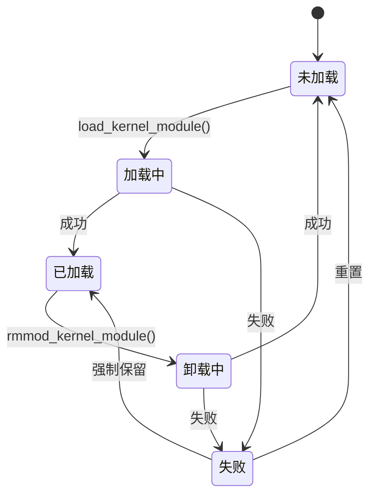
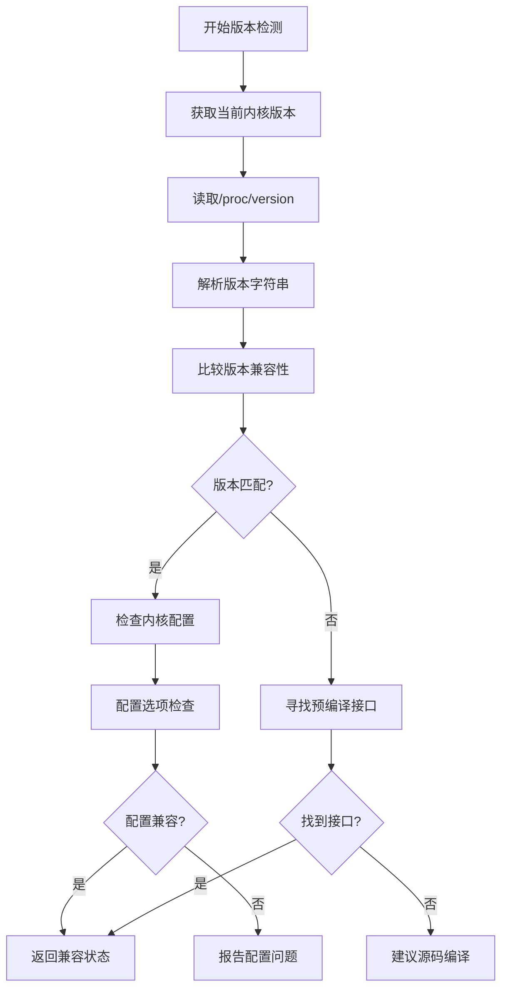
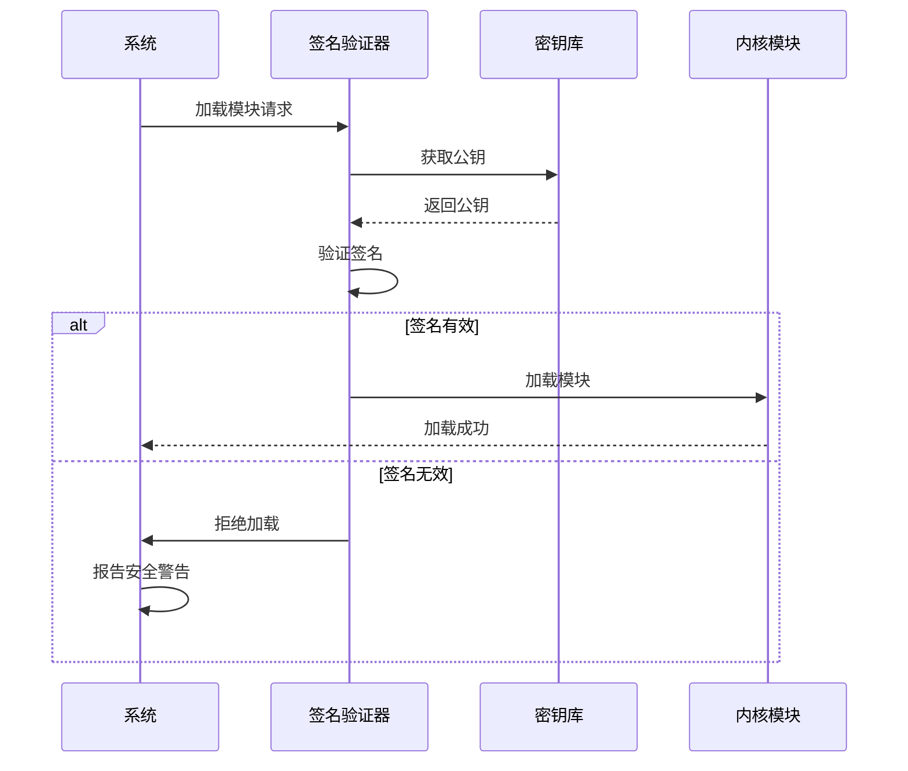
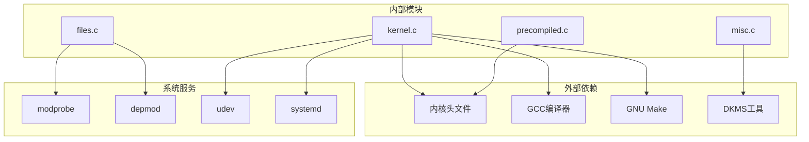

# 内核管理API

<cite>
**本文档引用的文件**
- [kernel.c](file://kernel.c)
- [kernel.h](file://kernel.h)
- [precompiled.c](file://precompiled.c)
- [precompiled.h](file://precompiled.h)
- [mkprecompiled.c](file://mkprecompiled.c)
- [misc.c](file://misc.c)
- [option_table.h](file://option_table.h)
- [nvidia-installer.c](file://nvidia-installer.c)
- [files.c](file://files.c)
</cite>

## 目录
1. [简介](#简介)
2. [项目结构](#项目结构)
3. [核心组件](#核心组件)
4. [架构概览](#架构概览)
5. [详细组件分析](#详细组件分析)
6. [依赖分析](#依赖分析)
7. [性能考虑](#性能考虑)
8. [故障排除指南](#故障排除指南)
9. [结论](#结论)
10. [附录](#附录)

## 简介

本文档详细记录了NVIDIA安装器中的内核管理API，这是一个用于管理Linux内核模块的完整解决方案。该系统提供了从内核模块编译、安装到卸载的全生命周期管理，包括预编译内核接口、DKMS集成、模块签名验证等高级功能。

该内核管理API支持多种内核模块类型（专有和开源），提供灵活的配置选项，并集成了现代Linux发行版的各种特性，如systemd、initramfs、SELinux等。

## 项目结构

该项目采用模块化设计，主要分为以下几个核心模块：

**图表来源**
- [kernel.c:1-50](file://kernel.c#L1-50)
- [precompiled.c:1-50](file://precompiled.c#L1-50)
- [nvidia-installer.c:1-50](file://nvidia-installer.c#L1-50)

**章节来源**
- [kernel.c:1-100](file://kernel.c#L1-L100)
- [precompiled.c:1-100](file://precompiled.c#L1-L100)
- [nvidia-installer.c:1-100](file://nvidia-installer.c#L1-L100)

## 核心组件

### 内核模块编译接口

内核模块编译接口提供了完整的内核模块构建和打包功能：

- **源码路径解析**：自动检测和解析内核源码路径
- **输出路径配置**：支持独立的内核输出目录
- **并发构建**：支持多线程并行编译
- **构建日志管理**：完整的构建过程跟踪和日志记录

### 预编译内核接口

预编译内核接口支持快速部署，避免复杂的编译过程：

- **包格式规范**：定义了标准的预编译包格式
- **接口匹配**：自动匹配当前运行内核的预编译接口
- **文件打包**：支持接口文件和完整模块的打包
- **签名管理**：内置模块签名和验证机制

### DKMS集成API

DKMS（动态内核模块支持）集成为内核升级后的自动重新编译提供了完整支持：

- **模块注册**：自动注册内核模块源码到DKMS系统
- **版本管理**：支持多版本内核模块的并存管理
- **自动重建**：内核更新时自动触发模块重建
- **状态监控**：实时监控DKMS模块状态

### 模块签名验证

内置的模块签名验证确保了内核模块的安全性：

- **签名生成**：支持多种哈希算法的模块签名
- **验证机制**：自动验证模块签名的有效性
- **密钥管理**：安全的密钥存储和管理
- **兼容性检查**：与不同内核版本的签名兼容性

**章节来源**
- [kernel.h:26-80](file://kernel.h#L26-L80)
- [precompiled.h:22-88](file://precompiled.h#L22-L88)
- [option_table.h:564-572](file://option_table.h#L564-L572)

## 架构概览

内核管理API采用分层架构设计，确保了良好的可扩展性和维护性：

**图表来源**
- [kernel.c:938-1078](file://kernel.c#L938-L1078)
- [misc.c:2857-2935](file://misc.c#L2857-L2935)

## 详细组件分析

### 内核模块编译流程

内核模块编译流程是整个内核管理API的核心，提供了完整的编译、链接和安装功能：

**图表来源**
- [kernel.c:938-1078](file://kernel.c#L938-L1078)
- [kernel.c:1006-1029](file://kernel.c#L1006-L1029)

#### 编译参数配置

编译参数通过命令行选项进行配置，支持丰富的自定义选项：

| 参数类别 | 关键字 | 描述 | 默认值 |
|---------|--------|------|--------|
| 源码路径 | `--kernel-source-path` | 内核源码路径 | 自动检测 |
| 输出路径 | `--kernel-output-path` | 内核输出路径 | SYSSRC环境变量 |
| 安装路径 | `--kernel-install-path` | 模块安装路径 | `/lib/modules/$(uname -r)` |
| 并发级别 | `-j` | 并发编译级别 | CPU核心数 |

#### 构建流程控制

构建流程包含多个阶段的验证和检查：

1. **环境准备阶段**：检查内核配置和依赖项
2. **预编译检查阶段**：查找可用的预编译接口
3. **编译执行阶段**：执行实际的内核模块编译
4. **测试验证阶段**：验证编译结果的有效性
5. **安装部署阶段**：将模块安装到系统中

**章节来源**
- [kernel.c:938-1078](file://kernel.c#L938-L1078)
- [kernel.c:1006-1029](file://kernel.c#L1006-L1029)

### 预编译内核接口API

预编译内核接口API提供了高效的内核模块部署方案，避免了复杂的编译过程：

**图表来源**
- [kernel.c:1762-1864](file://kernel.c#L1762-L1864)
- [precompiled.c:152-360](file://precompiled.c#L152-L360)

#### 包格式规范

预编译包采用标准化的二进制格式，确保跨平台兼容性：

- **头部标识**：8字节的包标识符
- **版本信息**：4字节的包格式版本
- **元数据区**：包含版本、描述和内核版本字符串
- **文件列表**：动态数量的文件条目
- **数据区**：实际的文件内容和签名数据

#### 接口匹配机制

系统会自动匹配当前运行内核的预编译接口：

1. **内核版本识别**：从`/proc/version`读取内核版本信息
2. **包格式验证**：检查预编译包的完整性和有效性
3. **文件完整性校验**：验证所有打包文件的CRC校验和
4. **接口兼容性检查**：确保接口与当前内核完全兼容

**章节来源**
- [precompiled.h:22-88](file://precompiled.h#L22-L88)
- [kernel.c:1762-1864](file://kernel.c#L1762-L1864)
- [precompiled.c:152-360](file://precompiled.c#L152-L360)

### DKMS集成API

DKMS（Dynamic Kernel Module Support）集成为内核升级后的自动重新编译提供了完整支持：

**图表来源**
- [misc.c:2857-2935](file://misc.c#L2857-L2935)
- [misc.c:2712-2847](file://misc.c#L2712-L2847)

#### 模块注册流程

DKMS模块注册包含以下关键步骤：

1. **环境检测**：检查DKMS工具和tar工具的可用性
2. **源码打包**：生成符合DKMS格式的tarball
3. **导入系统**：使用`dkms ldtarball`导入模块
4. **状态验证**：确认模块已正确注册到DKMS数据库
5. **自动重建**：设置内核变更时的自动重建机制

#### 版本管理策略

系统支持多版本内核模块的并存管理：

- **版本标识**：使用驱动程序版本号作为DKMS模块标识
- **内核隔离**：每个内核版本的模块独立管理
- **自动清理**：内核卸载时自动清理对应的模块
- **冲突解决**：处理多个版本之间的潜在冲突

**章节来源**
- [misc.c:2857-2935](file://misc.c#L2857-L2935)
- [misc.c:2712-2847](file://misc.c#L2712-L2847)

### 模块加载、卸载和查询接口

内核模块的生命周期管理提供了完整的加载、卸载和查询功能：

**图表来源**
- [kernel.c:1629-1642](file://kernel.c#L1629-L1642)
- [kernel.c:2229-2244](file://kernel.c#L2229-L2244)

#### 加载机制

模块加载支持多种模式：

- **正常加载**：使用`modprobe`进行标准加载
- **静默加载**：抑制加载过程中的输出信息
- **测试加载**：仅验证模块的可用性而不实际加载
- **强制加载**：忽略某些加载限制条件

#### 卸载策略

模块卸载采用安全的逐步卸载策略：

- **依赖检查**：检查是否有其他模块依赖目标模块
- **级联卸载**：自动卸载依赖于目标模块的其他模块
- **资源清理**：清理模块使用的系统资源
- **状态恢复**：恢复系统到卸载前的状态

#### 查询功能

系统提供多种查询方式：

- **状态查询**：检查模块的当前加载状态
- **依赖查询**：查询模块的依赖关系
- **版本查询**：获取模块的版本信息
- **配置查询**：查询模块的配置参数

**章节来源**
- [kernel.c:1629-1642](file://kernel.c#L1629-L1642)
- [kernel.c:2229-2244](file://kernel.c#L2229-L2244)

### 内核版本检测和兼容性验证

内核版本检测和兼容性验证确保了模块与目标系统的完美兼容：

**图表来源**
- [kernel.c:1873-1905](file://kernel.c#L1873-L1905)
- [kernel.c:1914-1931](file://kernel.c#L1914-L1931)

#### 版本识别机制

系统采用多层版本识别机制：

1. **内核版本获取**：通过`uname`系统调用获取内核版本
2. **进程版本解析**：从`/proc/version`读取详细的版本信息
3. **配置选项检测**：检查内核配置选项的兼容性
4. **硬件特性检查**：验证目标硬件的兼容性

#### 兼容性验证

兼容性验证涵盖多个方面：

- **内核版本兼容**：检查内核版本范围的兼容性
- **编译器兼容**：验证编译器版本和配置的兼容性
- **硬件支持**：确认目标硬件在当前内核下的支持情况
- **功能特性**：检查所需内核特性的可用性

**章节来源**
- [kernel.c:1873-1905](file://kernel.c#L1873-L1905)
- [kernel.c:1914-1931](file://kernel.c#L1914-L1931)

### 模块签名验证和安全API

模块签名验证确保了内核模块的完整性和真实性，提供了企业级的安全保障：

**图表来源**
- [kernel.c:414-488](file://kernel.c#L414-L488)
- [kernel.c:703-762](file://kernel.c#L703-L762)

#### 签名生成流程

模块签名生成支持多种加密算法：

1. **密钥生成**：生成RSA或ECDSA密钥对
2. **模块签名**：使用私钥对模块进行数字签名
3. **证书链**：建立完整的证书信任链
4. **签名嵌入**：将签名数据嵌入到模块文件中

#### 验证机制

签名验证采用多层次的安全检查：

- **格式验证**：检查签名数据的格式正确性
- **完整性检查**：验证模块文件的完整性
- **信任链验证**：验证签名者的可信度
- **时间戳验证**：检查签名的有效期

#### 安全配置选项

系统提供了丰富的安全配置选项：

- **强制签名**：要求所有内核模块都必须签名
- **密钥轮换**：支持定期更换签名密钥
- **审计日志**：记录所有签名验证活动
- **安全策略**：根据环境调整安全策略

**章节来源**
- [kernel.c:414-488](file://kernel.c#L414-L488)
- [kernel.c:703-762](file://kernel.c#L703-L762)

## 依赖分析

内核管理API的依赖关系体现了清晰的模块化设计：

**图表来源**
- [kernel.c:2422-2484](file://kernel.c#L2422-L2484)
- [misc.c:2857-2935](file://misc.c#L2857-L2935)

### 内部模块依赖

各模块之间的依赖关系清晰明确：

- **kernel.c** 是核心模块，依赖于所有其他模块
- **precompiled.c** 专门处理预编译包管理
- **misc.c** 提供通用的系统工具集成
- **files.c** 负责文件系统操作和包管理

### 外部系统依赖

系统需要依赖以下外部组件：

- **内核头文件**：用于编译内核模块
- **GCC编译器**：内核模块的主要编译器
- **GNU Make**：构建系统的自动化工具
- **DKMS工具**：动态内核模块支持
- **系统工具**：modprobe、depmod、udev等

**章节来源**
- [kernel.c:2422-2484](file://kernel.c#L2422-L2484)
- [misc.c:2857-2935](file://misc.c#L2857-L2935)

## 性能考虑

内核管理API在设计时充分考虑了性能优化：

### 并发编译优化

系统支持多线程并行编译，显著提升编译效率：

- **智能并发**：根据CPU核心数自动设置并发级别
- **资源管理**：避免过度消耗系统资源
- **进度跟踪**：实时显示编译进度和状态

### 内存使用优化

预编译包采用内存映射技术，减少内存占用：

- **mmap技术**：使用内存映射读取大文件
- **延迟加载**：按需加载必要的数据
- **垃圾回收**：及时释放不再使用的内存

### I/O性能优化

文件操作采用高效的I/O策略：

- **批量操作**：减少系统调用次数
- **缓存机制**：利用文件系统缓存提升性能
- **异步处理**：非阻塞的文件操作

## 故障排除指南

### 常见编译错误

| 错误类型 | 可能原因 | 解决方案 |
|---------|---------|---------|
| 编译器错误 | GCC版本不兼容 | 更新GCC到推荐版本 |
| 头文件缺失 | 内核头文件未安装 | 安装对应内核版本的头文件 |
| 配置不匹配 | 内核配置与模块需求不符 | 调整内核配置或选择其他模块类型 |
| 内存不足 | 编译过程中内存不足 | 增加系统内存或减少并发级别 |

### DKMS相关问题

- **DKMS未找到**：确保DKMS工具已正确安装
- **模块注册失败**：检查DKMS配置和权限设置
- **自动重建失败**：验证内核升级脚本的正确性

### 签名验证问题

- **签名无效**：检查密钥对的完整性和正确性
- **信任链中断**：验证证书链的完整性和有效性
- **时间戳过期**：更新证书或调整系统时间

**章节来源**
- [kernel.c:1222-1328](file://kernel.c#L1222-L1328)
- [misc.c:2676-2706](file://misc.c#L2676-L2706)

## 结论

内核管理API提供了一个完整、可靠且高性能的内核模块管理解决方案。该系统具有以下优势：

1. **全面的功能覆盖**：从编译到部署的全生命周期管理
2. **灵活的配置选项**：支持各种不同的部署场景
3. **强大的集成能力**：与现代Linux发行版深度集成
4. **严格的安全保障**：内置的签名验证和安全机制
5. **优秀的性能表现**：优化的编译和部署流程

该API为内核开发和部署提供了坚实的基础，适用于各种规模的部署场景，从个人开发者到大型企业环境都能找到合适的使用方式。

## 附录

### 命令行选项参考

系统提供了丰富的命令行选项来控制内核管理行为：

- **内核路径选项**：`--kernel-source-path`、`--kernel-output-path`、`--kernel-install-path`
- **编译控制选项**：`-j`、`--no-precompiled-interface`、`--kernel-modules-only`
- **DKMS选项**：`--dkms`、`--no-dkms`
- **签名选项**：`--module-signing-secret-key`、`--module-signing-public-key`、`--module-signing-hash`

### 最佳实践建议

1. **预编译优先**：优先使用预编译接口以节省编译时间
2. **DKMS启用**：在生产环境中启用DKMS以支持内核自动重建
3. **签名验证**：始终启用模块签名验证确保安全性
4. **并发优化**：根据系统资源合理设置编译并发级别
5. **监控日志**：定期检查内核模块的日志和状态