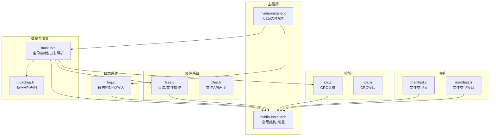
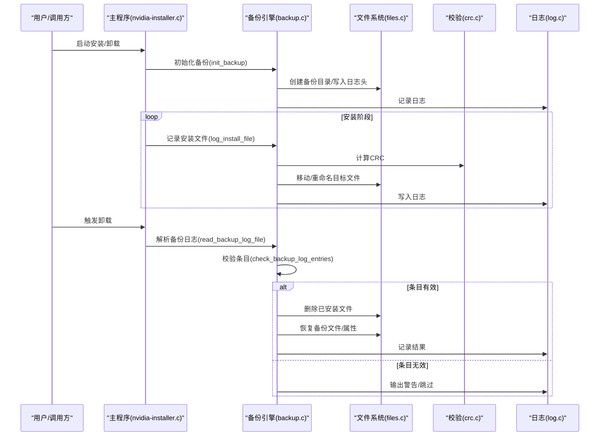
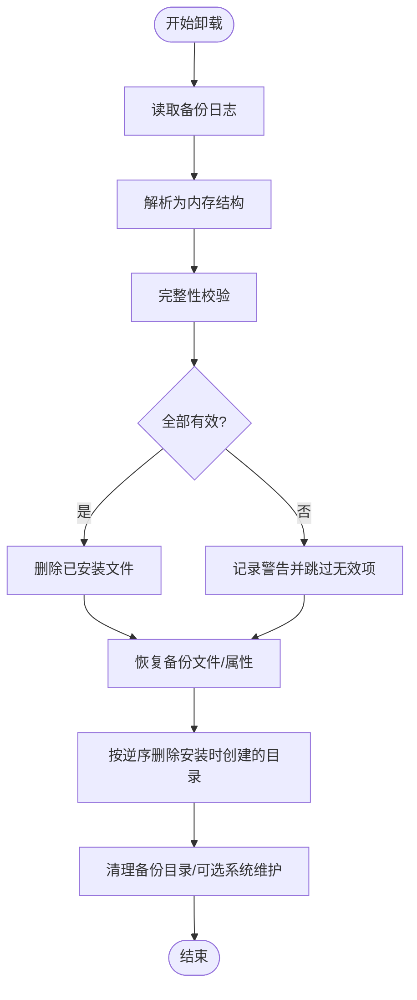
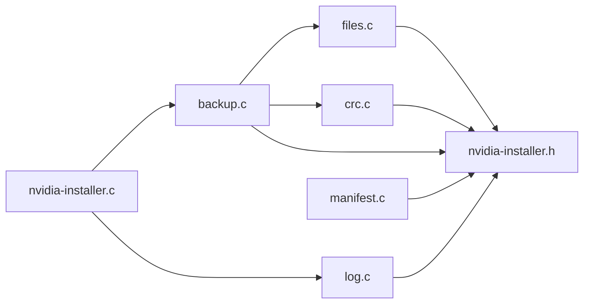

# 备份恢复API

<cite>
**本文引用的文件**
- [backup.c](file://backup.c)
- [backup.h](file://backup.h)
- [log.c](file://log.c)
- [nvidia-installer.h](file://nvidia-installer.h)
- [files.c](file://files.c)
- [files.h](file://files.h)
- [crc.c](file://crc.c)
- [crc.h](file://crc.h)
- [nvidia-installer.c](file://nvidia-installer.c)
- [manifest.c](file://manifest.c)
- [manifest.h](file://manifest.h)
</cite>

## 目录
1. [简介](#简介)
2. [项目结构](#项目结构)
3. [核心组件](#核心组件)
4. [架构总览](#架构总览)
5. [详细组件分析](#详细组件分析)
6. [依赖分析](#依赖分析)
7. [性能考虑](#性能考虑)
8. [故障排除指南](#故障排除指南)
9. [结论](#结论)
10. [附录](#附录)

## 简介
本文件面向“备份与恢复API”的设计与实现，基于仓库中的备份子系统，系统化梳理备份策略接口、恢复机制、日志接口、完整性校验与错误处理等能力。文档同时给出接口规范、流程图与时序图，帮助开发者与使用者正确集成与扩展备份恢复功能。

## 项目结构
备份恢复相关的核心文件组织如下：
- 备份引擎与日志：backup.c、backup.h
- 日志系统：log.c
- 文件系统与目录操作：files.c、files.h
- 校验算法（CRC）：crc.c、crc.h
- 主程序入口与选项：nvidia-installer.c、nvidia-installer.h
- 安装清单与文件类型：manifest.c、manifest.h

图表来源
- [backup.c](file://backup.c)
- [backup.h](file://backup.h)
- [log.c](file://log.c)
- [files.c](file://files.c)
- [files.h](file://files.h)
- [crc.c](file://crc.c)
- [crc.h](file://crc.h)
- [nvidia-installer.c](file://nvidia-installer.c)
- [nvidia-installer.h](file://nvidia-installer.h)
- [manifest.c](file://manifest.c)
- [manifest.h](file://manifest.h)

章节来源
- [backup.c](file://backup.c)
- [backup.h](file://backup.h)
- [log.c](file://log.c)
- [files.c](file://files.c)
- [files.h](file://files.h)
- [crc.c](file://crc.c)
- [crc.h](file://crc.h)
- [nvidia-installer.c](file://nvidia-installer.c)
- [nvidia-installer.h](file://nvidia-installer.h)
- [manifest.c](file://manifest.c)
- [manifest.h](file://manifest.h)

## 核心组件
- 备份引擎与卸载器：负责初始化备份目录、记录备份条目、执行卸载与恢复、解析备份日志、校验完整性。
- 日志系统：统一的日志初始化、格式化输出与落盘。
- 文件系统工具：递归删除、目录遍历、复制、临时文件创建、重命名等。
- 校验模块：基于映射的文件CRC计算，用于备份完整性与恢复一致性校验。
- 主程序与选项：命令行解析、默认选项设置、卸载/安装流程调度。

章节来源
- [backup.c](file://backup.c)
- [backup.h](file://backup.h)
- [log.c](file://log.c)
- [files.c](file://files.c)
- [files.h](file://files.h)
- [crc.c](file://crc.c)
- [crc.h](file://crc.h)
- [nvidia-installer.c](file://nvidia-installer.c)
- [nvidia-installer.h](file://nvidia-installer.h)

## 架构总览
备份恢复的整体流程由“安装前备份”和“卸载时恢复”两条主线构成。安装前通过初始化备份目录并记录安装信息；卸载时先解析备份日志，进行完整性校验，再按规则删除已安装文件并恢复备份文件。

图表来源
- [nvidia-installer.c](file://nvidia-installer.c)
- [backup.c](file://backup.c)
- [files.c](file://files.c)
- [crc.c](file://crc.c)
- [log.c](file://log.c)

## 详细组件分析

### 备份策略接口
- 初始化备份
  - 接口：init_backup(op, pkg)
  - 行为：删除旧备份目录、创建新备份目录、以受限权限创建备份日志、写入版本与描述。
  - 关键点：备份根目录与日志文件权限严格控制，确保审计性与安全性。
- 备份单个文件
  - 接口：do_backup(op, filename)
  - 行为：对常规文件计算CRC并移动到备份目录，记录文件名与属性；对符号链接删除并记录目标与属性；不支持目录备份（保留扩展位）。
  - 关键点：使用原子重命名避免并发覆盖；日志采用追加写入。
- 记录安装文件
  - 接口：log_install_file(op, filename)
  - 行为：记录已安装文件与其CRC，便于卸载时删除。
- 记录符号链接
  - 接口：log_create_symlink(op, filename, target)
  - 行为：记录安装的符号链接及其目标。
- 目录创建追踪
  - 接口：log_mkdir(op, dirs)
  - 行为：将安装过程中创建的目录列表写入“dirs”日志，卸载时按逆序删除。

章节来源
- [backup.c](file://backup.c)
- [backup.h](file://backup.h)

### 卸载与恢复机制
- 检测并卸载现有驱动
  - 接口：check_for_existing_driver(op, pkg)、uninstall_existing_driver(op, interactive, skip_depmod)
  - 行为：读取备份日志提取版本与描述，确认交互后执行卸载。
- 执行卸载与恢复
  - 接口：do_uninstall(op, version, skip_depmod)
  - 流程：
    1) 解析备份日志为内存结构；
    2) 校验条目完整性（文件存在性、CRC一致、符号链接目标匹配）；
    3) 先删除已安装文件，再恢复备份文件与属性；
    4) 递归删除安装时创建的目录；
    5) 可选运行depmod/ldconfig/systemctl等系统维护命令。
  - 关键点：双阶段处理（删除安装项、恢复备份项），百分比进度反馈，失败项单独告警。

图表来源
- [backup.c](file://backup.c)

章节来源
- [backup.c](file://backup.c)

### 日志记录系统
- 初始化
  - 接口：log_init(op, argc, argv)
  - 行为：根据配置打开日志文件，写入头部、时间戳、安装器版本、命令行参数等。
- 写入
  - 接口：log_printf(op, prefix, fmt, ...)
  - 行为：格式化输出，自动换行，刷新流，保证持久化。
- 使用建议
  - 在备份/卸载关键节点写入状态与结果，便于排障与审计。

章节来源
- [log.c](file://log.c)
- [nvidia-installer.h](file://nvidia-installer.h)

### 数据完整性与校验
- CRC计算
  - 接口：compute_crc(op, filename)、compute_crc_from_buffer(buf, len)
  - 行为：使用内存映射读取文件，按预设多项式计算CRC，空文件返回固定值。
- 备份完整性
  - 在备份时记录CRC，在卸载恢复前重新计算并比对，确保文件未被篡改或损坏。
- 符号链接一致性
  - 对符号链接目标进行比对，若不一致则跳过该条目，避免误删/误恢复。

章节来源
- [crc.c](file://crc.c)
- [crc.h](file://crc.h)
- [backup.c](file://backup.c)

### 文件系统与目录操作
- 递归删除：remove_directory(op, path)
- 目录遍历与更新时间：touch_directory(op, path)
- 文件复制：copy_file(op, src, dst, mode)
- 临时文件：write_temp_file(op, len, data, perm)
- 重命名：nvrename(op, src, dst)

章节来源
- [files.c](file://files.c)
- [files.h](file://files.h)

### 备份范围与时机
- 备份范围
  - 已安装文件与符号链接：通过log_install_file/log_create_symlink记录；
  - 备份文件：通过do_backup移动至备份目录并记录CRC与属性。
- 备份时机
  - 安装前：init_backup初始化备份环境；
  - 安装中：对即将覆盖的文件执行do_backup；
  - 卸载时：do_uninstall按日志恢复。
- 增量与部分恢复
  - 当前实现为全量备份/恢复；如需增量，可在应用层基于清单(manifest)与CRC差异实现。

章节来源
- [backup.c](file://backup.c)
- [manifest.c](file://manifest.c)
- [manifest.h](file://manifest.h)

### 错误处理与失败恢复
- 权限与完整性检查
  - 备份目录与日志文件权限在初始化与解析阶段均进行校验，若被修改则拒绝继续。
- 失败处理
  - 对无法删除/恢复的文件记录警告与错误，不影响整体流程；
  - 卸载完成后尝试清理备份目录，失败不中断。
- 用户交互
  - 在检测到冲突安装时提示确认，避免误卸载。

章节来源
- [backup.c](file://backup.c)
- [nvidia-installer.c](file://nvidia-installer.c)

## 依赖分析
- 组件耦合
  - 备份引擎依赖文件系统与校验模块，日志模块贯穿安装/卸载全流程。
  - 主程序通过选项控制是否启用备份、是否跳过depmod等。
- 外部依赖
  - 系统工具：ldconfig、depmod、systemctl（可选）。
  - SELinux/安全上下文：可选支持。

图表来源
- [nvidia-installer.c](file://nvidia-installer.c)
- [backup.c](file://backup.c)
- [log.c](file://log.c)
- [files.c](file://files.c)
- [crc.c](file://crc.c)
- [nvidia-installer.h](file://nvidia-installer.h)
- [manifest.c](file://manifest.c)

章节来源
- [nvidia-installer.c](file://nvidia-installer.c)
- [backup.c](file://backup.c)
- [log.c](file://log.c)
- [files.c](file://files.c)
- [crc.c](file://crc.c)
- [nvidia-installer.h](file://nvidia-installer.h)
- [manifest.c](file://manifest.c)

## 性能考虑
- 内存映射：CRC计算与文件复制均采用mmap，减少拷贝开销，适合大文件。
- 批处理与进度：卸载/恢复过程分两阶段并显示百分比，提升可观测性。
- I/O优化：日志追加写入，避免频繁截断；临时文件使用内存映射与一次性写入。

## 故障排除指南
- 备份目录/日志权限异常
  - 现象：初始化或解析阶段报权限不符。
  - 处理：检查备份根目录与日志文件权限，确保仅属主可读写。
- 文件被修改导致CRC不一致
  - 现象：恢复阶段提示备份文件CRC变化。
  - 处理：确认文件未被外部修改；必要时重新备份。
- 符号链接目标不匹配
  - 现象：已安装符号链接目标与备份记录不同，跳过恢复。
  - 处理：确认X配置或其他组件未修改目标；手动调整或重新生成。
- 目录删除失败
  - 现象：卸载后残留目录或删除失败告警。
  - 处理：检查权限与占用进程，手动清理后重试。

章节来源
- [backup.c](file://backup.c)
- [log.c](file://log.c)

## 结论
备份恢复API以“日志驱动的全量备份/恢复”为核心，结合严格的权限控制、CRC完整性校验与系统工具集成，提供了可靠的卸载与恢复能力。当前实现聚焦于稳定性与可审计性，未来可在应用层扩展增量备份与细粒度恢复策略。

## 附录

### API规范摘要
- 备份初始化
  - init_backup(op, pkg) → 成功/失败
- 备份文件
  - do_backup(op, filename) → 成功/失败
- 记录安装
  - log_install_file(op, filename) → 成功/失败
  - log_create_symlink(op, filename, target) → 成功/失败
- 目录创建追踪
  - log_mkdir(op, dirs) → 成功/失败
- 卸载与恢复
  - check_for_existing_driver(op, pkg) → 是否继续
  - uninstall_existing_driver(op, interactive, skip_depmod) → 成功/失败
  - do_uninstall(op, version, skip_depmod) → 成功/失败
- 日志
  - log_init(op, argc, argv) → void
  - log_printf(op, prefix, fmt, ...) → void
- 校验
  - compute_crc(op, filename) → CRC
  - compute_crc_from_buffer(buf, len) → CRC

章节来源
- [backup.h](file://backup.h)
- [log.c](file://log.c)
- [crc.h](file://crc.h)
- [nvidia-installer.h](file://nvidia-installer.h)