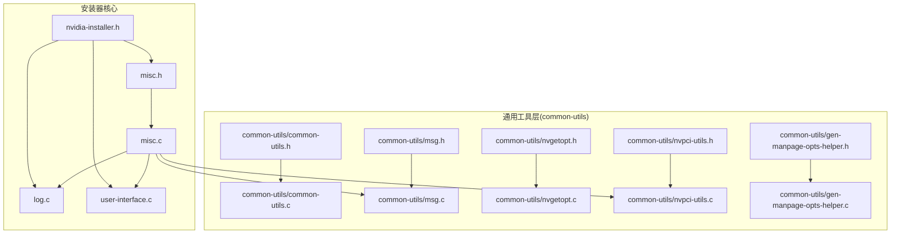
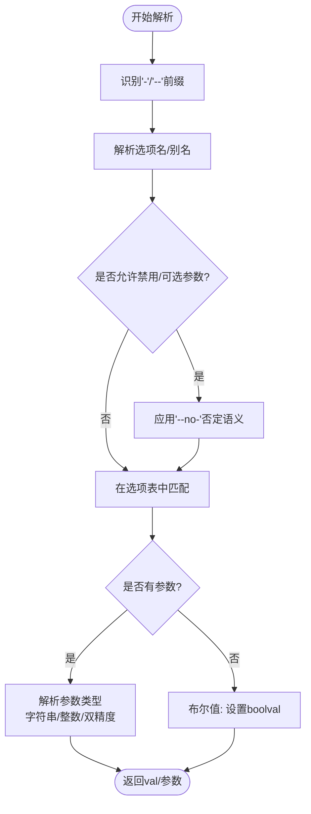
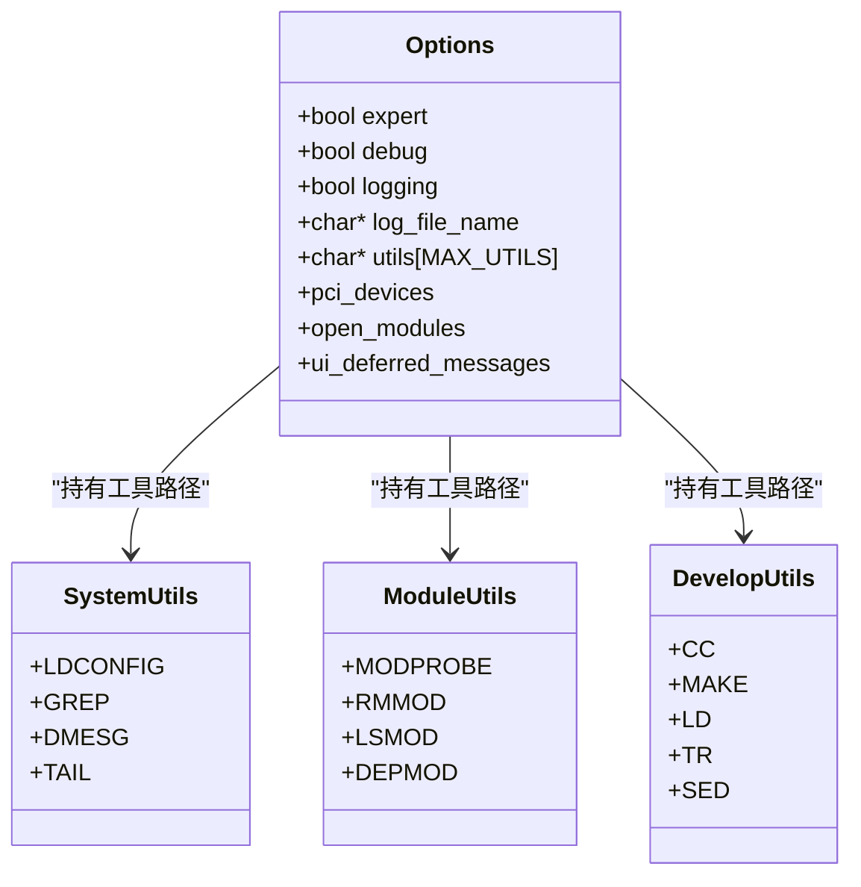
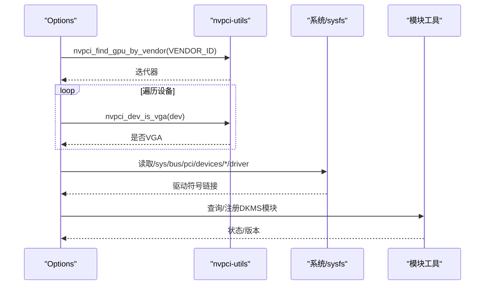
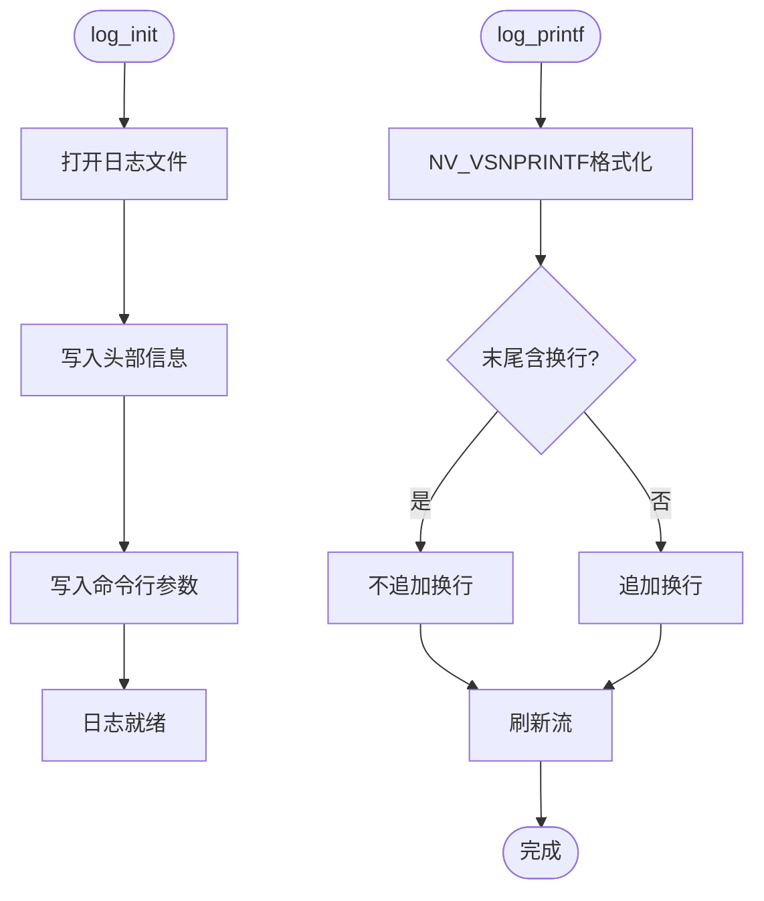
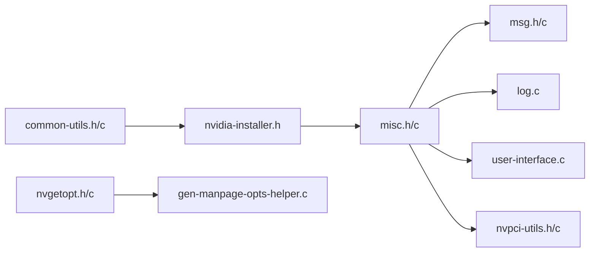

# 工具函数API

<cite>
**本文引用的文件**
- [common-utils/common-utils.h](file://common-utils/common-utils.h)
- [common-utils/common-utils.c](file://common-utils/common-utils.c)
- [common-utils/msg.h](file://common-utils/msg.h)
- [common-utils/msg.c](file://common-utils/msg.c)
- [common-utils/nvpci-utils.h](file://common-utils/nvpci-utils.h)
- [common-utils/nvpci-utils.c](file://common-utils/nvpci-utils.c)
- [common-utils/nvgetopt.h](file://common-utils/nvgetopt.h)
- [common-utils/nvgetopt.c](file://common-utils/nvgetopt.c)
- [common-utils/gen-manpage-opts-helper.h](file://common-utils/gen-manpage-opts-helper.h)
- [common-utils/gen-manpage-opts-helper.c](file://common-utils/gen-manpage-opts-helper.c)
- [nvidia-installer.h](file://nvidia-installer.h)
- [misc.h](file://misc.h)
- [misc.c](file://misc.c)
- [log.c](file://log.c)
- [user-interface.c](file://user-interface.c)
</cite>

## 目录
1. [简介](#简介)
2. [项目结构](#项目结构)
3. [核心组件](#核心组件)
4. [架构总览](#架构总览)
5. [详细组件分析](#详细组件分析)
6. [依赖分析](#依赖分析)
7. [性能考虑](#性能考虑)
8. [故障排查指南](#故障排查指南)
9. [结论](#结论)
10. [附录：使用示例与最佳实践](#附录使用示例与最佳实践)

## 简介
本文件系统化梳理了 NVIDIA 安装器项目中“工具函数API”的设计与实现，覆盖以下主题：
- 通用工具函数：字符串处理、内存管理、系统调用封装与路径操作
- 消息处理系统：消息格式、优先级与输出控制
- 系统工具集成接口：工具检测、版本验证与参数传递
- PCI 设备扫描、内核模块检测与系统信息获取
- 错误处理、日志记录与调试辅助
- 性能考量与优化建议
- 使用示例与最佳实践

## 项目结构
该仓库采用按功能域分层组织方式，工具函数API主要集中在 common-utils 子目录，并在安装器主程序与工具链中广泛复用。



**图表来源**
- [common-utils/common-utils.h:23-144](file://common-utils/common-utils.h#L23-L144)
- [common-utils/common-utils.c:24-200](file://common-utils/common-utils.c#L24-L200)
- [common-utils/msg.h:23-144](file://common-utils/msg.h#L23-L144)
- [common-utils/msg.c:23-200](file://common-utils/msg.c#L23-L200)
- [common-utils/nvgetopt.h:23-206](file://common-utils/nvgetopt.h#L23-L206)
- [common-utils/nvgetopt.c:27-200](file://common-utils/nvgetopt.c#L27-L200)
- [common-utils/nvpci-utils.h:23-34](file://common-utils/nvpci-utils.h#L23-L34)
- [common-utils/nvpci-utils.c:23-66](file://common-utils/nvpci-utils.c#L23-L66)
- [common-utils/gen-manpage-opts-helper.h:23-31](file://common-utils/gen-manpage-opts-helper.h#L23-L31)
- [common-utils/gen-manpage-opts-helper.c:23-225](file://common-utils/gen-manpage-opts-helper.c#L23-L225)
- [nvidia-installer.h:23-603](file://nvidia-installer.h#L23-L603)
- [misc.h:23-121](file://misc.h#L23-L121)
- [misc.c:23-200](file://misc.c#L23-L200)
- [log.c:23-157](file://log.c#L23-L157)
- [user-interface.c:187-351](file://user-interface.c#L187-L351)

**章节来源**
- [common-utils/common-utils.h:23-144](file://common-utils/common-utils.h#L23-L144)
- [common-utils/msg.h:23-144](file://common-utils/msg.h#L23-L144)
- [common-utils/nvgetopt.h:23-206](file://common-utils/nvgetopt.h#L23-L206)
- [common-utils/nvpci-utils.h:23-34](file://common-utils/nvpci-utils.h#L23-L34)
- [nvidia-installer.h:23-603](file://nvidia-installer.h#L23-L603)
- [misc.h:23-121](file://misc.h#L23-L121)

## 核心组件
- 内存与字符串工具：统一的内存分配/重分配/释放包装，安全的字符串拼接与复制，路径与目录操作，大小写转换等
- 消息与日志系统：可配置的冗余级别、终端宽度自适应、文本换行与对齐、统一的错误/警告/信息输出接口，以及持久化日志
- 命令行解析：跨平台的 getopt 长选项解析，支持布尔开关、可选参数、禁用开关（--no-）与帮助生成
- PCI 设备扫描：基于 libpciaccess 的 GPU 设备发现与分类
- 系统工具集成：系统/模块/开发工具检测、SELinux/系统服务状态检查、运行命令与进度匹配

**章节来源**
- [common-utils/common-utils.c:52-198](file://common-utils/common-utils.c#L52-L198)
- [common-utils/msg.c:47-182](file://common-utils/msg.c#L47-L182)
- [common-utils/nvgetopt.c:37-200](file://common-utils/nvgetopt.c#L37-L200)
- [common-utils/nvpci-utils.c:39-66](file://common-utils/nvpci-utils.c#L39-L66)
- [misc.c:1795-1805](file://misc.c#L1795-L1805)

## 架构总览
工具函数API贯穿安装器生命周期：初始化阶段进行系统工具检测与日志初始化；运行期通过消息系统输出状态与错误；命令行解析负责参数处理；PCI 扫描与内核模块检测为策略决策提供依据；最终落盘与清理由安装器主流程协调。

```mermaid
sequenceDiagram
participant CLI as "命令行"
participant OPT as "nvgetopt"
participant MSG as "消息系统"
participant LOG as "日志"
participant PCI as "PCI扫描"
participant UI as "用户界面"
CLI->>OPT : 解析选项(--help/--advanced-help)
OPT-->>CLI : 返回解析结果/帮助
CLI->>LOG : 初始化日志
LOG-->>CLI : 日志句柄可用
CLI->>PCI : 触发设备扫描
PCI-->>CLI : 返回设备列表/状态
CLI->>MSG : 输出信息/警告/错误
MSG-->>UI : 终端或文件输出
CLI->>UI : 交互式提示/进度
```

**图表来源**
- [common-utils/nvgetopt.c:37-200](file://common-utils/nvgetopt.c#L37-L200)
- [common-utils/msg.c:126-182](file://common-utils/msg.c#L126-L182)
- [log.c:65-156](file://log.c#L65-156)
- [misc.c:1795-1805](file://misc.c#L1795-L1805)
- [user-interface.c:187-351](file://user-interface.c#L187-L351)

## 详细组件分析

### 内存与字符串工具API
- 分配与释放
  - nvalloc(size_t): 安全calloc包装，失败直接退出
  - nvrealloc(void*, size_t): 安全realloc包装，失败直接退出
  - nvfree(void*): 统一释放入口
- 字符串处理
  - nvstrcat(...) / nvvstrcat(..., va_list): 可变参数字符串拼接
  - nvstrdup(const char*) / nvstrndup(const char*, size_t): 安全复制
  - nvstrtolower / nvstrtoupper / nvstrchrnul：常用字符串处理
  - nvasprintf / nv_append_sprintf：动态格式化输出
- 路径与目录
  - nv_basename / nv_dirname / nvdircat(...)：路径拼接与分解
  - nv_mkdir_recursive(...)：递归创建目录
  - nv_trim_space / nv_trim_char / nv_trim_char_strict：空白与字符裁剪
  - remove_trailing_slashes / collapse_multiple_slashes：路径规范化
- 文件与映射
  - nv_open / nv_get_file_length / nv_set_file_length / nv_mmap：文件系统与内存映射封装
- 版本编码与枚举
  - nv_encode_version(...) 与 NV_VERSION2/3/4：版本号编码宏
  - NVOptionalBool：可选布尔值枚举，避免默认值误判

复杂度与性能要点
- 字符串拼接：O(n) 时间与一次分配，建议批量拼接时先计算长度
- 递归目录创建：O(h) 层级深度，注意权限与并发
- 版本编码：O(1)，便于快速比较

**章节来源**
- [common-utils/common-utils.h:54-87](file://common-utils/common-utils.h#L54-L87)
- [common-utils/common-utils.h:103-123](file://common-utils/common-utils.h#L103-L123)
- [common-utils/common-utils.h:135-139](file://common-utils/common-utils.h#L135-L139)
- [common-utils/common-utils.c:52-198](file://common-utils/common-utils.c#L52-L198)

### 消息处理系统API
- 冗余级别
  - NvVerbosity：NONE/ERROR/DEPRECATED/WARNING/ALL/DEFAULT
  - nv_get_verbosity / nv_set_verbosity：全局控制
- 输出接口
  - nv_error_msg / nv_deprecated_msg / nv_warning_msg / nv_info_msg / nv_info_msg_to_file
  - nv_msg / nv_msg_preserve_whitespace：带前缀与空白保留
- 文本排版
  - TextRows 结构体与 nv_format_text_rows / nv_text_rows_append / nv_concat_text_rows / nv_free_text_rows
  - 自适应终端宽度：reset_current_terminal_width，自动回绕
- 宏与属性
  - NV_ATTRIBUTE_PRINTF：编译期格式校验
  - NV_VSNPRINTF：动态缓冲区格式化，自动扩容

使用建议
- 在非交互环境（管道/文件）中，消息会直出，无需换行符
- 通过设置冗余级别控制输出量，便于调试与生产

**章节来源**
- [common-utils/msg.h:94-141](file://common-utils/msg.h#L94-L141)
- [common-utils/msg.c:47-182](file://common-utils/msg.c#L47-L182)

### 命令行解析API（nvgetopt）
- 选项表结构
  - NVGetoptOption{name, val, flags, arg_name, description}
  - 支持布尔、字符串、整数、双精度参数
  - 支持可选参数、禁用开关（--no-）、帮助始终打印标记
- 主要接口
  - nvgetopt(...)：解析一次选项，返回匹配项的 val，同时填充 boolval/intval/doubleval/strval/disable_val
  - nvgetopt_print_help(...)：按 include_mask 过滤并回调输出帮助
- 行为特性
  - 支持短选项组合（无参数时），支持 --/--no- 前缀
  - 参数可内联（name=value），或后续参数形式



**图表来源**
- [common-utils/nvgetopt.h:135-178](file://common-utils/nvgetopt.h#L135-L178)
- [common-utils/nvgetopt.c:37-200](file://common-utils/nvgetopt.c#L37-L200)

**章节来源**
- [common-utils/nvgetopt.h:26-134](file://common-utils/nvgetopt.h#L26-L134)
- [common-utils/nvgetopt.c:37-200](file://common-utils/nvgetopt.c#L37-L200)

### 系统工具集成接口
- 工具检测与版本验证
  - 系统工具：ldconfig、grep、dmesg、tail 等
  - 模块工具：modprobe/rmmod/lsmod/depmod
  - 开发工具：cc/make/ld/tr/sed 等
  - 通过枚举 SystemUtils/SystemOptionalUtils/ModuleUtils/DevelopUtils 与工具名数组保持一致
- 参数传递与运行命令
  - run_command(...) 支持输出匹配与进度更新
  - find_system_utils/find_module_utils/check_development_tools：集中检测
- SELinux 与 systemd 状态检查
  - check_selinux、check_systemd：根据系统能力调整行为
- 版本提取与CRC校验
  - extract_version_string、verify_crc：用于包与二进制一致性校验



**图表来源**
- [nvidia-installer.h:37-95](file://nvidia-installer.h#L37-L95)
- [misc.h:77-83](file://misc.h#L77-L83)

**章节来源**
- [nvidia-installer.h:37-95](file://nvidia-installer.h#L37-L95)
- [misc.h:77-83](file://misc.h#L77-L83)

### PCI 设备扫描与内核模块检测API
- PCI 扫描
  - nvpci_find_gpu_by_vendor(vendor_id)：基于 libpciaccess 的迭代器
  - nvpci_dev_is_vga(dev)：区分 VGA 与 3D 控制器
  - misc.c 中 pci_device_scan：遍历设备、记录支持/不支持 GPU，影响后续策略
- 内核模块检测
  - check_for_nouveau / nouveau_is_present：检测当前驱动占用
  - dkms_module_installed / dkms_register_module / dkms_remove_module：DKMS 生命周期管理
- 系统信息获取
  - check_for_nvidia_graphics_devices：结合 PCI 与模块状态综合判断



**图表来源**
- [common-utils/nvpci-utils.c:39-66](file://common-utils/nvpci-utils.c#L39-L66)
- [misc.c:1795-1805](file://misc.c#L1795-L1805)
- [misc.c:2315-2349](file://misc.c#L2315-L2349)

**章节来源**
- [common-utils/nvpci-utils.h:30-32](file://common-utils/nvpci-utils.h#L30-L32)
- [common-utils/nvpci-utils.c:39-66](file://common-utils/nvpci-utils.c#L39-L66)
- [misc.c:1795-1805](file://misc.c#L1795-L1805)
- [misc.c:2315-2349](file://misc.c#L2315-L2349)

### 日志记录与调试辅助API
- 日志初始化与写入
  - log_init：打开日志文件、记录时间/版本/PATH/命令行
  - log_printf：格式化输出，自动追加换行，刷新流
- 调试与状态
  - reset_current_terminal_width：终端宽度探测
  - NV_VSNPRINTF：动态缓冲区格式化，兼容不同 glibc 行为
  - 用户界面延迟消息：defer_message → 实时输出 + 后续日志



**图表来源**
- [log.c:65-156](file://log.c#L65-156)
- [common-utils/msg.h:60-86](file://common-utils/msg.h#L60-L86)

**章节来源**
- [log.c:65-156](file://log.c#L65-156)
- [common-utils/msg.c:73-116](file://common-utils/msg.c#L73-L116)

### 帮助生成与手册页辅助API
- gen_manpage_opts_helper：将 NVGetoptOption 表渲染为 man 手册格式，支持简单/高级选项分组
- 与 nvgetopt 协同：通过 description 与标志位控制帮助输出

**章节来源**
- [common-utils/gen-manpage-opts-helper.h:28](file://common-utils/gen-manpage-opts-helper.h#L28)
- [common-utils/gen-manpage-opts-helper.c:182-224](file://common-utils/gen-manpage-opts-helper.c#L182-L224)

## 依赖分析
- 头文件依赖
  - common-utils/*.h 之间低耦合，公共头仅声明接口
  - 安装器主头 nvidia-installer.h 引入通用工具与消息系统
  - misc.c 作为粘合层，汇聚系统工具、PCI、日志、UI 等
- 外部库
  - libpciaccess：PCI 设备访问
  - POSIX 文件/进程/终端接口：内存映射、文件描述符、终端窗口尺寸
- 循环依赖
  - 未见直接循环；消息与UI通过 Options 间接交互



**图表来源**
- [nvidia-installer.h:29](file://nvidia-installer.h#L29)
- [misc.h:30-33](file://misc.h#L30-L33)
- [common-utils/nvgetopt.h:33](file://common-utils/nvgetopt.h#L33)
- [common-utils/gen-manpage-opts-helper.c:28-30](file://common-utils/gen-manpage-opts-helper.c#L28-L30)

**章节来源**
- [nvidia-installer.h:29](file://nvidia-installer.h#L29)
- [misc.h:30-33](file://misc.h#L30-L33)

## 性能考虑
- 内存管理
  - 统一使用 nvalloc/nvrealloc/nvfree，减少碎片与泄漏风险
  - 字符串拼接建议先计算总长度，避免多次扩容
- I/O 与终端
  - 文本换行与宽度计算在交互模式下进行，非交互模式直出，减少不必要的格式化开销
  - 日志写入后主动 flush，确保关键信息及时落盘
- PCI 扫描
  - 迭代器遍历设备时避免重复解析，缓存必要字段
- 命令执行
  - run_command 支持输出匹配与进度更新，避免阻塞式等待

[本节为通用指导，无需特定文件来源]

## 故障排查指南
- 内存分配失败
  - 现象：nvalloc/nvrealloc 直接退出
  - 排查：检查系统可用内存、路径长度、字符串拼接逻辑
- 日志无法打开
  - 现象：log_init 报错并禁用日志
  - 排查：确认路径权限、临时目录可用性
- 选项解析异常
  - 现象：nvgetopt 返回错误或未识别选项
  - 排查：确认选项表 flags 与参数形式匹配，检查 --no- 语义
- PCI 设备未被识别
  - 现象：nvpci_find_gpu_by_vendor 返回空迭代器
  - 排查：确认 libpciaccess 初始化、权限、内核模块加载状态
- UI 延迟消息
  - 现象：ui 初始化前的消息被延迟到 UI 初始化后输出
  - 排查：检查 deferred_messages 列表与日志写入顺序

**章节来源**
- [common-utils/common-utils.c:52-63](file://common-utils/common-utils.c#L52-L63)
- [log.c:87-95](file://log.c#L87-L95)
- [common-utils/nvgetopt.c:79-81](file://common-utils/nvgetopt.c#L79-L81)
- [common-utils/nvpci-utils.c:40-54](file://common-utils/nvpci-utils.c#L40-L54)
- [user-interface.c:294-318](file://user-interface.c#L294-L318)

## 结论
本工具函数API以“安全、可移植、可维护”为核心设计原则，覆盖从内存/字符串到消息/日志、从命令行解析到系统工具集成与 PCI/内核模块检测的全栈能力。通过统一的接口与严格的错误处理，显著降低了安装器主流程的复杂度，并提升了可测试性与可扩展性。

[本节为总结性内容，无需特定文件来源]

## 附录：使用示例与最佳实践
- 字符串与路径
  - 使用 nvstrcat/nvdircat 组合路径，避免手工拼接导致的越界
  - 使用 nv_trim_space/collapse_multiple_slashes 规范化输入
- 内存管理
  - 优先使用 nvalloc/nvrealloc，确保失败即退出，简化错误路径
  - 对外暴露的字符串参数在使用后及时 nvfree
- 消息与日志
  - 通过 nv_set_verbosity 控制输出级别，调试时设为 ALL
  - 使用 nv_info_msg_to_file 将关键信息定向到文件
  - 日志初始化失败时，回退到标准输出并禁用日志
- 命令行解析
  - 选项表中明确 flags，布尔与禁用开关配合 --no- 语义清晰
  - 使用 nvgetopt_print_help 输出帮助，按 include_mask 区分简单/高级
- PCI 与模块
  - 先初始化 libpciaccess，再创建迭代器，最后销毁迭代器
  - 检测驱动占用时，结合 sysfs 与模块工具双重验证
- 性能与健壮性
  - 大量字符串拼接前预估长度，减少二次分配
  - I/O 操作后及时刷新，保证关键信息可见
  - 对外部工具调用设置超时与重试策略（如适用）

[本节为通用指导，无需特定文件来源]