# 文件管理API

<cite>
**本文引用的文件**   
- [files.h](file://files.h)
- [files.c](file://files.c)
- [manifest.h](file://manifest.h)
- [manifest.c](file://manifest.c)
- [backup.h](file://backup.h)
- [backup.c](file://backup.c)
- [nvidia-installer.h](file://nvidia-installer.h)
- [crc.h](file://crc.h)
- [crc.c](file://crc.c)
</cite>

## 目录
1. [简介](#简介)
2. [项目结构](#项目结构)
3. [核心组件](#核心组件)
4. [架构总览](#架构总览)
5. [详细组件分析](#详细组件分析)
6. [依赖分析](#依赖分析)
7. [性能考虑](#性能考虑)
8. [故障排查指南](#故障排查指南)
9. [结论](#结论)
10. [附录](#附录)

## 简介
本文件管理API文档面向需要在Unix/Linux系统上进行文件操作与软件包安装的开发者与维护者，覆盖以下主题：
- 文件复制、移动、删除与权限设置
- 软件包清单（manifest）解析与文件类型识别
- 路径解析、冲突检测与符号链接处理
- 文件完整性验证（CRC）、临时文件与目录管理
- 错误处理与回滚机制
- 与备份恢复模块的协作关系
- 实际使用示例与性能优化建议

## 项目结构
围绕文件管理的核心源文件与头文件如下：
- 文件操作与路径工具：files.h / files.c
- 清单解析与文件类型能力：manifest.h / manifest.c
- 备份与回滚：backup.h / backup.c
- 数据结构与枚举：nvidia-installer.h
- 校验和计算：crc.h / crc.c

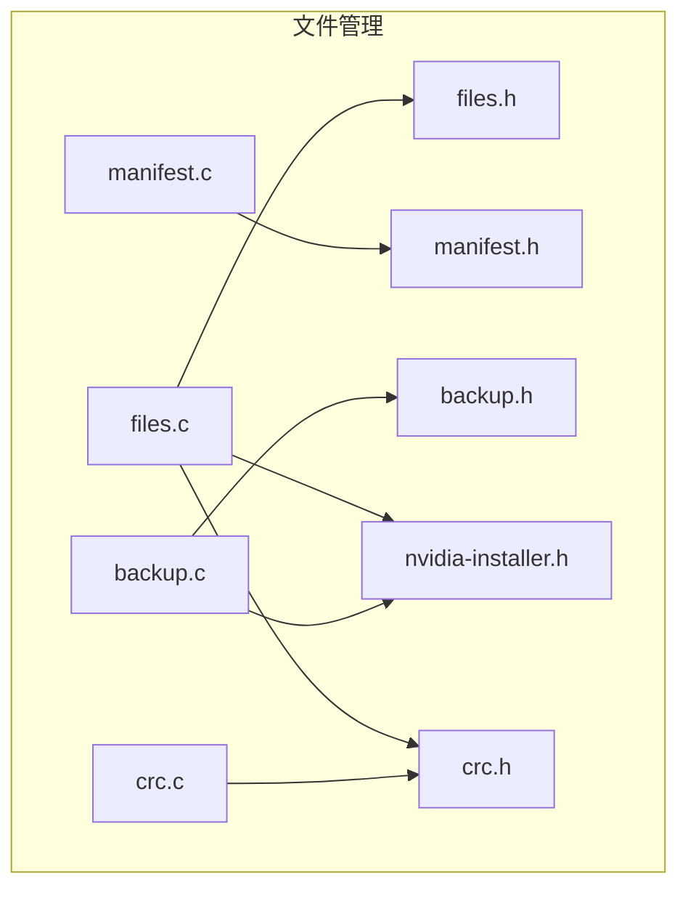

**图表来源**
- [files.h](file://files.h)
- [files.c](file://files.c)
- [manifest.h](file://manifest.h)
- [manifest.c](file://manifest.c)
- [backup.h](file://backup.h)
- [backup.c](file://backup.c)
- [nvidia-installer.h](file://nvidia-installer.h)
- [crc.h](file://crc.h)
- [crc.c](file://crc.c)

**章节来源**
- [files.h:26-76](file://files.h#L26-L76)
- [manifest.h:25-41](file://manifest.h#L25-L41)
- [backup.h:30-45](file://backup.h#L30-L45)
- [nvidia-installer.h:101-169](file://nvidia-installer.h#L101-L169)

## 核心组件
- 文件操作与目录管理：提供递归删除、递归touch、复制、重命名、临时文件与目录创建等能力。
- 软件包清单解析：将字符串映射到文件类型，并查询文件类型的属性（是否可安装、是否符号链接、是否OpenGL库等）。
- 备份与回滚：对已安装文件与符号链接进行备份，支持卸载时按日志回滚。
- 完整性校验：基于CRC32的文件内容校验，用于备份一致性检查与卸载前的安全性验证。
- 符号链接与路径解析：读取与解析符号链接目标，支持相对路径解析为绝对路径。

**章节来源**
- [files.c:56-116](file://files.c#L56-L116)
- [files.c:218-312](file://files.c#L218-L312)
- [files.c:1606-1634](file://files.c#L1606-L1634)
- [files.c:323-406](file://files.c#L323-L406)
- [manifest.c:144-180](file://manifest.c#L144-L180)
- [backup.c:208-298](file://backup.c#L208-L298)
- [crc.c:94-135](file://crc.c#L94-L135)

## 架构总览
文件管理API由“文件操作层”“清单解析层”“备份回滚层”“完整性校验层”构成，彼此通过共享的数据结构与函数接口协同工作。

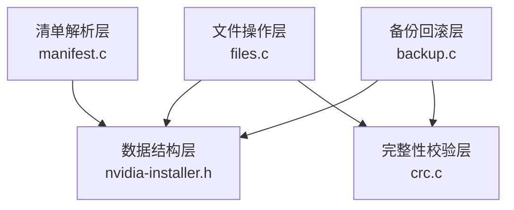

**图表来源**
- [files.c](file://files.c)
- [manifest.c](file://manifest.c)
- [backup.c](file://backup.c)
- [crc.c](file://crc.c)
- [nvidia-installer.h](file://nvidia-installer.h)

## 详细组件分析

### 文件复制、移动、删除与权限设置
- 复制文件：使用内存映射与块拷贝，确保原子性与高性能；复制后显式设置权限以规避umask影响。
- 移动/重命名：跨文件系统场景下提供替代实现，保留时间戳并在失败时给出明确错误。
- 删除：递归删除目录树，逐项处理文件与子目录，失败时记录错误并返回。
- 权限设置：统一通过模式参数设置，复制后再次调用chmod保证结果一致。

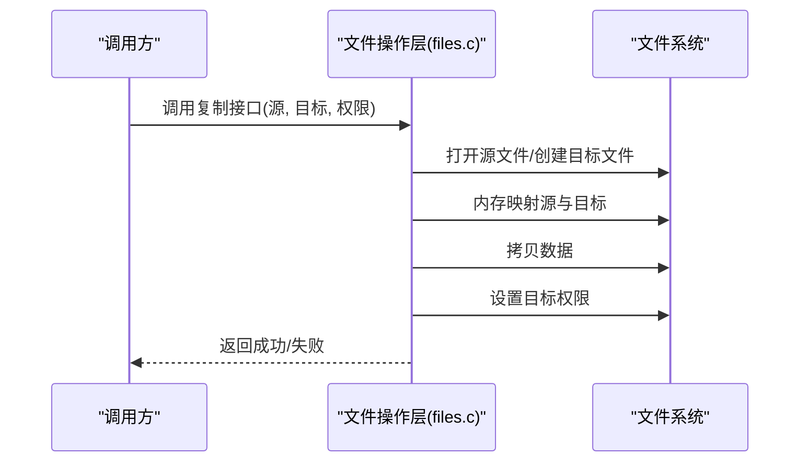

**图表来源**
- [files.c:218-312](file://files.c#L218-L312)

**章节来源**
- [files.c:218-312](file://files.c#L218-L312)
- [files.c:56-116](file://files.c#L56-L116)
- [files.c:1606-1634](file://files.c#L1606-L1634)

### 软件包清单解析API
- 类型解析：将字符串转换为文件类型枚举，并返回该类型的能力位掩码（是否可安装、是否符号链接、是否OpenGL库等）。
- 可安装类型列表：根据用户选项过滤不可安装类型（如禁用内核模块源、DKMS已注册等）。
- 符号链接类型扩展：在移除列表中加入所有符号链接类型，便于清理。

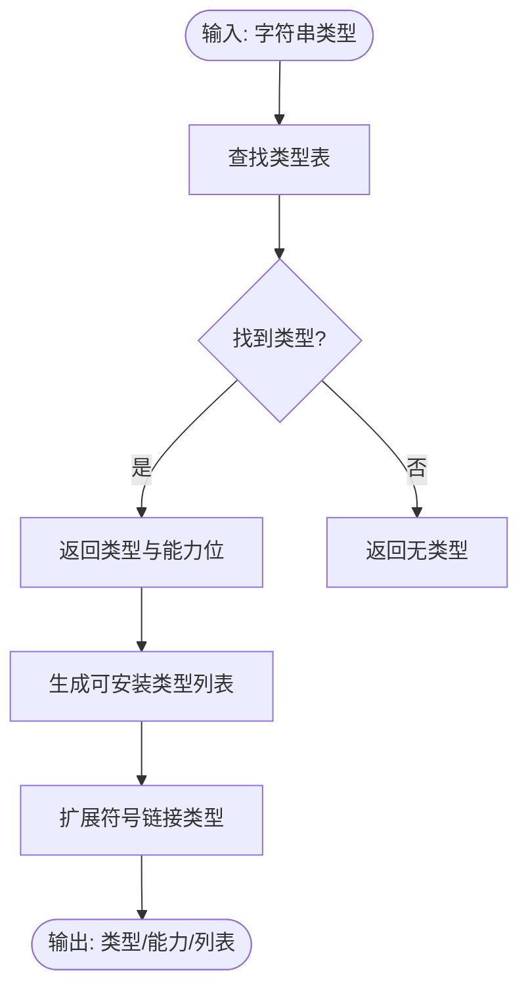

**图表来源**
- [manifest.c:144-180](file://manifest.c#L144-L180)
- [manifest.c:185-225](file://manifest.c#L185-L225)
- [manifest.c:231-245](file://manifest.c#L231-L245)

**章节来源**
- [manifest.h:25-41](file://manifest.h#L25-L41)
- [manifest.c:144-180](file://manifest.c#L144-L180)
- [manifest.c:185-225](file://manifest.c#L185-L225)
- [manifest.c:231-245](file://manifest.c#L231-L245)

### 文件类型识别与路径解析
- 文件类型识别：通过类型枚举与能力位判断文件类别（OpenGL库、CUDA库、系统服务单元、固件等），并决定安装路径。
- 路径解析：根据前缀与目录配置生成最终安装路径，兼容32位与64位架构及特定发行版布局。
- 符号链接目标解析：支持读取符号链接目标，以及将相对路径解析为绝对路径。

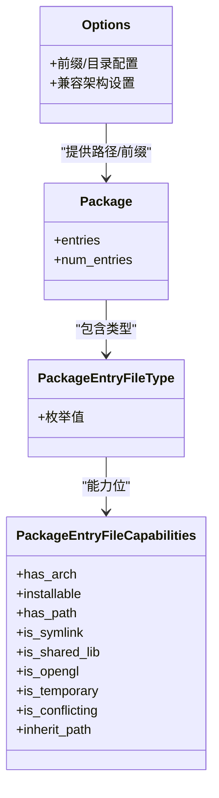

**图表来源**
- [nvidia-installer.h:101-169](file://nvidia-installer.h#L101-L169)
- [nvidia-installer.h:350-418](file://nvidia-installer.h#L350-L418)
- [nvidia-installer.h:241-313](file://nvidia-installer.h#L241-L313)

**章节来源**
- [files.c:528-894](file://files.c#L528-L894)
- [files.c:1386-1457](file://files.c#L1386-L1457)

### 冲突检测与符号链接处理
- 冲突检测：通过类型能力中的“冲突标记”与名称匹配策略，识别潜在冲突文件。
- 符号链接处理：读取/解析符号链接目标，必要时进行目标合法性检查与修正。

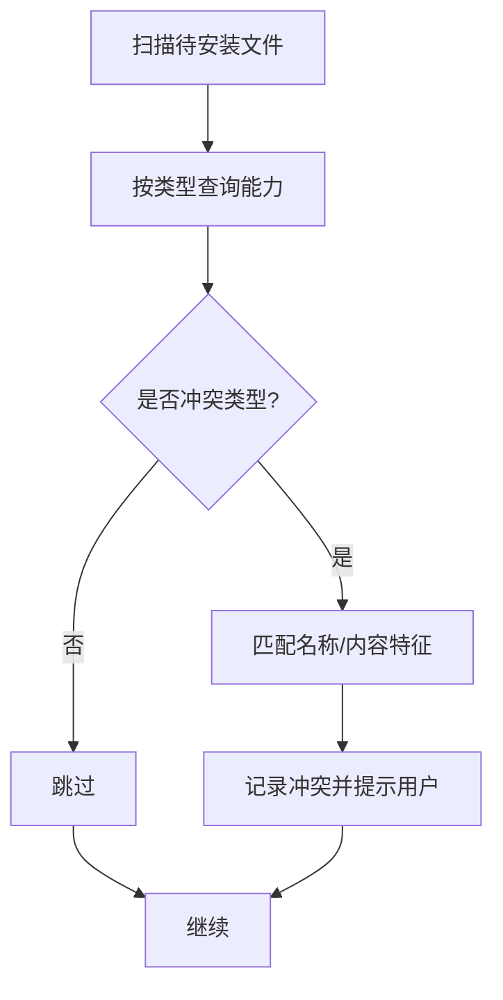

**图表来源**
- [manifest.c:73-138](file://manifest.c#L73-L138)
- [files.c:1386-1457](file://files.c#L1386-L1457)

**章节来源**
- [manifest.c:73-138](file://manifest.c#L73-L138)
- [files.c:1386-1457](file://files.c#L1386-L1457)

### 文件完整性验证与校验和计算
- CRC32计算：对文件内容进行一次性内存映射与查表计算，避免多次I/O。
- 备份一致性：备份日志记录CRC、权限、UID/GID；卸载前校验备份文件未被篡改。

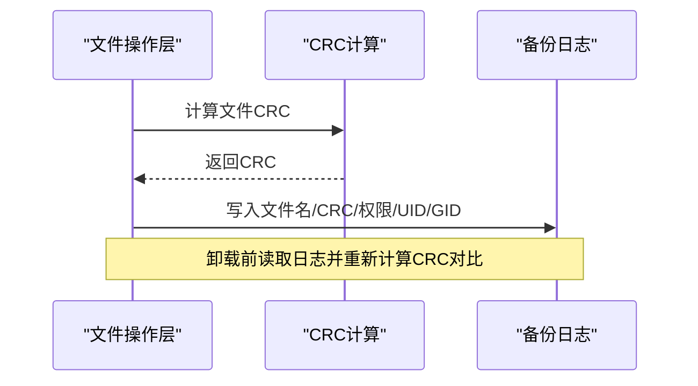

**图表来源**
- [crc.c:94-135](file://crc.c#L94-L135)
- [backup.c:208-298](file://backup.c#L208-L298)
- [backup.c:1108-1226](file://backup.c#L1108-L1226)

**章节来源**
- [crc.h:24-26](file://crc.h#L24-L26)
- [crc.c:94-135](file://crc.c#L94-L135)
- [backup.c:208-298](file://backup.c#L208-L298)
- [backup.c:1108-1226](file://backup.c#L1108-L1226)

### 目录管理与临时文件处理
- 递归创建目录：带日志记录，便于卸载时反向删除。
- 临时文件：使用模板文件创建，支持预设大小与权限，完成后释放资源。
- 临时目录：基于进程ID创建隔离目录，避免竞态与冲突。

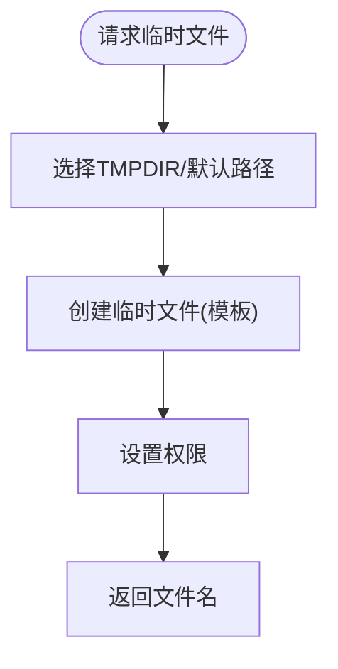

**图表来源**
- [files.c:323-406](file://files.c#L323-L406)
- [files.c:1576-1594](file://files.c#L1576-L1594)

**章节来源**
- [files.c:1372-1375](file://files.c#L1372-L1375)
- [files.c:323-406](file://files.c#L323-L406)
- [files.c:1576-1594](file://files.c#L1576-L1594)

### 符号链接创建与管理
- 创建符号链接：自动创建父目录，再执行符号链接创建。
- 解析符号链接：支持相对路径解析为绝对路径，便于冲突检测与一致性校验。

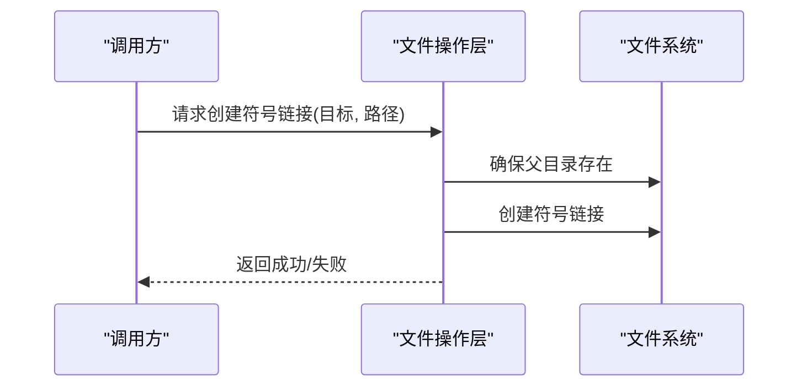

**图表来源**
- [files.c:1495-1515](file://files.c#L1495-L1515)
- [files.c:1386-1457](file://files.c#L1386-L1457)

**章节来源**
- [files.c:1495-1515](file://files.c#L1495-L1515)
- [files.c:1386-1457](file://files.c#L1386-L1457)

### 备份恢复与错误处理
- 初始化备份：清理旧备份目录，创建新备份目录与日志文件。
- 备份文件：常规文件移动至备份目录并记录元信息；符号链接单独处理。
- 卸载回滚：按日志顺序删除已安装文件，再恢复备份文件与符号链接，失败时记录并继续。
- 错误处理：统一通过UI接口输出错误信息，确保可诊断性与可恢复性。

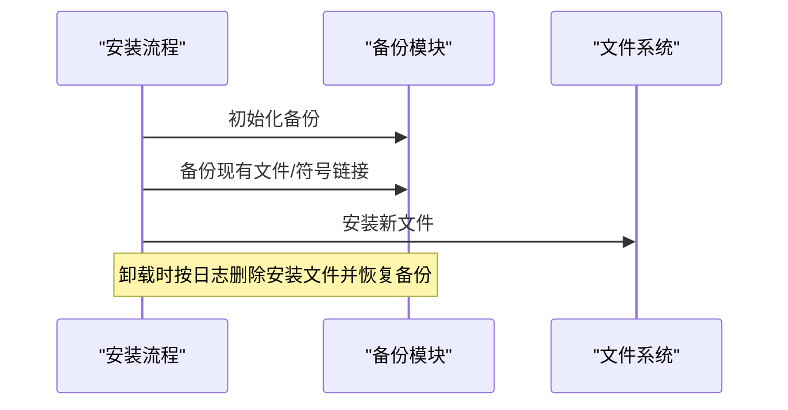

**图表来源**
- [backup.c:137-198](file://backup.c#L137-L198)
- [backup.c:208-298](file://backup.c#L208-L298)
- [backup.c:631-889](file://backup.c#L631-L889)

**章节来源**
- [backup.h:30-45](file://backup.h#L30-L45)
- [backup.c:137-198](file://backup.c#L137-L198)
- [backup.c:208-298](file://backup.c#L208-L298)
- [backup.c:631-889](file://backup.c#L631-L889)

## 依赖分析
- 文件操作依赖于系统调用与UI接口，错误通过统一错误通道上报。
- 清单解析依赖类型表与能力位，受用户选项影响。
- 备份模块依赖CRC计算与文件系统操作，日志格式固定以便解析。
- 数据结构层提供跨模块共享的类型与配置。

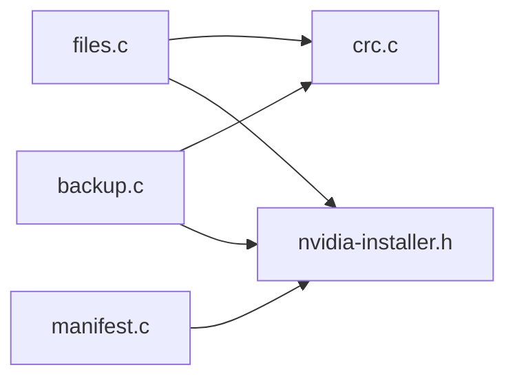

**图表来源**
- [files.c](file://files.c)
- [manifest.c](file://manifest.c)
- [backup.c](file://backup.c)
- [crc.c](file://crc.c)
- [nvidia-installer.h](file://nvidia-installer.h)

**章节来源**
- [files.c](file://files.c)
- [manifest.c](file://manifest.c)
- [backup.c](file://backup.c)
- [crc.c](file://crc.c)
- [nvidia-installer.h](file://nvidia-installer.h)

## 性能考虑
- 使用内存映射进行大文件复制，减少系统调用次数与数据拷贝开销。
- 递归删除与复制采用目录遍历，避免不必要的I/O；对空文件快速路径短路。
- 备份与卸载阶段采用日志驱动，避免全盘扫描，提升效率。
- 临时文件与目录采用模板与进程隔离，降低竞争与碎片化风险。

[本节为通用指导，无需具体文件分析]

## 故障排查指南
- 复制失败：检查源文件权限、目标路径权限与磁盘空间；确认umask未影响目标权限。
- 删除失败：确认目录权限与子项权限；查看错误消息定位具体条目。
- 备份/回滚异常：检查备份目录权限与日志文件权限；核对CRC一致性；确认日志未被外部修改。
- 符号链接问题：确认目标路径是否存在；相对路径需解析为绝对路径后再比对。

**章节来源**
- [files.c:218-312](file://files.c#L218-L312)
- [files.c:56-116](file://files.c#L56-L116)
- [backup.c:900-1072](file://backup.c#L900-L1072)
- [backup.c:1108-1226](file://backup.c#L1108-L1226)

## 结论
本文件管理API通过清晰的分层设计与严格的错误处理，提供了从文件复制、移动、删除到权限设置、符号链接管理、路径解析与冲突检测的完整能力。结合清单解析与备份回滚机制，能够安全可靠地完成复杂软件包的安装与卸载任务。配合CRC完整性校验与临时文件管理，进一步提升了系统的稳定性与可维护性。

[本节为总结，无需具体文件分析]

## 附录

### API规范摘要
- 文件复制：接收源路径、目标路径与权限，返回布尔状态。
- 文件移动/重命名：跨文件系统场景下的替代实现，保留时间戳。
- 目录删除：递归删除，逐项处理并记录错误。
- 临时文件：创建模板文件并设置权限，返回文件名。
- 符号链接：创建父目录并建立链接，返回布尔状态。
- 路径解析：根据类型与前缀生成最终安装路径。
- 清单解析：字符串转类型、查询能力、生成可安装类型列表。
- 备份：写入日志并记录元信息；卸载时按日志回滚。
- 完整性校验：计算CRC并用于备份一致性检查。

**章节来源**
- [files.h:26-76](file://files.h#L26-L76)
- [manifest.h:25-41](file://manifest.h#L25-L41)
- [backup.h:30-45](file://backup.h#L30-L45)
- [crc.h:24-26](file://crc.h#L24-L26)