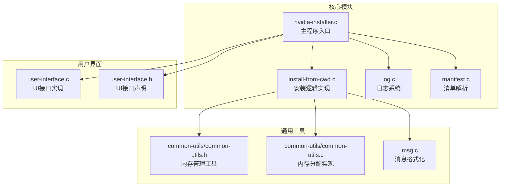
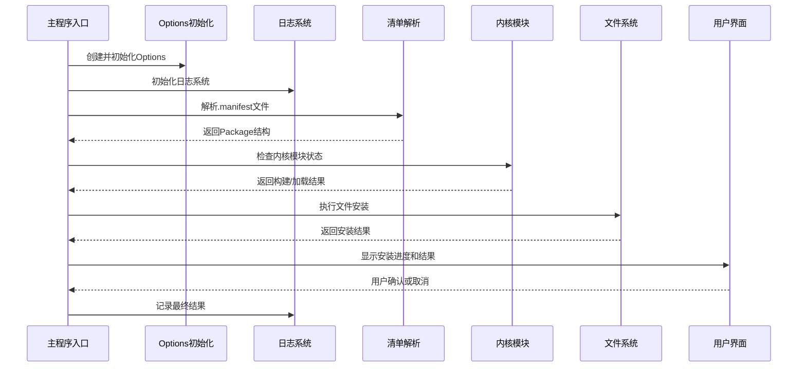
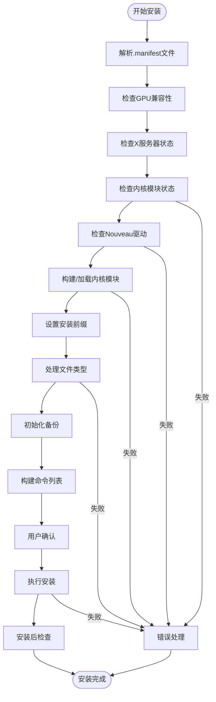
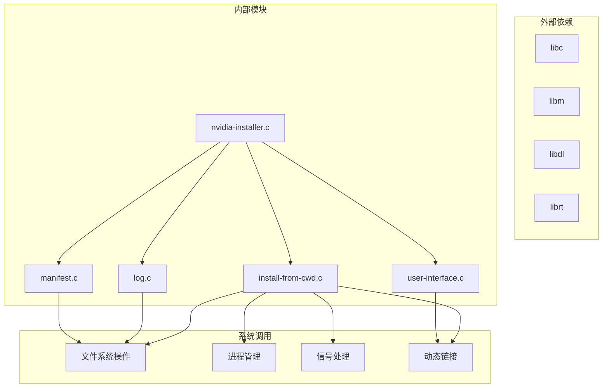

# 核心API接口

<cite>
**本文档引用的文件**
- [nvidia-installer.c](file://nvidia-installer.c)
- [nvidia-installer.h](file://nvidia-installer.h)
- [install-from-cwd.c](file://install-from-cwd.c)
- [log.c](file://log.c)
- [common-utils/common-utils.h](file://common-utils/common-utils.h)
- [common-utils/common-utils.c](file://common-utils/common-utils.c)
- [manifest.c](file://manifest.c)
- [user-interface.c](file://user-interface.c)
- [user-interface.h](file://user-interface.h)
- [msg.c](file://msg.c)
</cite>

## 目录
1. [简介](#简介)
2. [项目结构](#项目结构)
3. [核心组件](#核心组件)
4. [架构概览](#架构概览)
5. [详细组件分析](#详细组件分析)
6. [依赖关系分析](#依赖关系分析)
7. [性能考虑](#性能考虑)
8. [故障排除指南](#故障排除指南)
9. [结论](#结论)

## 简介

本文档详细记录了NVIDIA驱动安装器的核心API接口规范，重点关注以下关键API：

- 主程序入口函数 `install_from_cwd()` 的完整接口规范
- `Options` 结构体的详细字段说明和配置方法
- `Package` 和 `PackageEntry` 等核心数据结构的定义和生命周期管理
- 日志系统 `log_init()` 和 `log_printf()` 的完整API规范
- 错误处理机制、异常情况处理和调试接口

该安装器是一个复杂的系统工具，负责在Unix和Linux系统上安装NVIDIA软件包，涉及内核模块构建、用户界面交互、文件系统操作等多个方面。

## 项目结构

该项目采用模块化设计，主要包含以下核心模块：



**图表来源**
- [nvidia-installer.c:1-762](file://nvidia-installer.c#L1-L762)
- [install-from-cwd.c:1-800](file://install-from-cwd.c#L1-L800)
- [log.c:1-157](file://log.c#L1-L157)

**章节来源**
- [nvidia-installer.c:1-762](file://nvidia-installer.c#L1-L762)
- [install-from-cwd.c:1-800](file://install-from-cwd.c#L1-L800)

## 核心组件

### 主程序入口函数 install_from_cwd()

#### 函数签名
```c
int install_from_cwd(Options *op);
```

#### 参数说明
- `op`: 指向 `Options` 结构体的指针，包含所有安装配置选项
- 返回值: 成功时返回 `TRUE`，失败时返回 `FALSE`

#### 调用约定
- 必须在调用前确保 `Options` 结构体已正确初始化
- 安装过程会自动处理内存分配和释放
- 支持中断和恢复机制

#### 功能概述
该函数执行从当前工作目录安装NVIDIA驱动的完整流程，包括：
1. 解析 `.manifest` 清单文件
2. 验证GPU兼容性
3. 检查X服务器状态
4. 处理内核模块构建或预编译
5. 执行文件安装
6. 配置系统服务

**章节来源**
- [install-from-cwd.c:96-454](file://install-from-cwd.c#L96-L454)

### Options 结构体详解

#### 基本字段定义
`Options` 结构体是整个安装器的核心配置容器，包含以下主要分类：

##### 布尔配置选项
- `expert`: 专家模式开关
- `uninstall`: 卸载模式标志
- `driver_info`: 显示驱动信息
- `debug`: 调试模式
- `logging`: 日志启用标志
- `nvidia_modprobe`: 启用nvidia-modprobe
- `no_questions`: 静默模式
- `sanity`: 运行完整性检查
- `kernel_modules_only`: 仅安装内核模块

##### 路径和前缀配置
- `opengl_prefix`: OpenGL安装前缀
- `x_prefix`: X服务器安装前缀
- `utility_prefix`: 工具安装前缀
- `documentation_prefix`: 文档安装前缀
- `kernel_module_installation_path`: 内核模块安装路径
- `kernel_source_path`: 内核源码路径

##### 内核模块配置
- `kernel_name`: 目标内核名称
- `dkms`: DKMS集成开关
- `install_uvm`: Unified Virtual Memory安装
- `install_drm`: DRM模块安装
- `install_peermem`: Peer Memory模块安装

##### 文件类型配置
- `file_type_destination_overrides[]`: 文件类型目标覆盖数组
- `compat32_files_packaged`: 32位兼容文件标记
- `x_files_packaged`: X文件包标记

#### 配置方法
1. **默认初始化**: 使用 `load_default_options()` 函数
2. **命令行解析**: 通过 `parse_commandline()` 解析参数
3. **动态修改**: 在安装过程中根据需要调整配置

**章节来源**
- [nvidia-installer.h:185-342](file://nvidia-installer.h#L185-L342)
- [nvidia-installer.c:119-157](file://nvidia-installer.c#L119-L157)

### Package 数据结构

#### 字段定义
```c
typedef struct __package {
    char *description;                    // 包描述
    char *version;                        // 版本号
    char *kernel_module_build_directory;  // 内核模块构建目录
    char *kernel_make_logs;               // 内核构建日志
    
    PackageEntry *entries;               // 文件条目数组
    int num_entries;                     // 条目数量
    
    KernelModuleInfo *kernel_modules;    // 内核模块信息
    int num_kernel_modules;              // 内核模块数量
    char *excluded_kernel_modules;       // 排除的内核模块
} Package;
```

#### 生命周期管理
1. **创建**: 通过 `parse_manifest()` 解析清单文件创建
2. **使用**: 在安装过程中进行文件处理和验证
3. **销毁**: 通过 `free_package()` 函数释放所有资源

#### 内存管理策略
- 使用 `nvrealloc()` 动态扩展数组
- 使用 `nvstrdup()` 分配字符串副本
- 所有动态分配的内存都必须在 `free_package()` 中释放

**章节来源**
- [nvidia-installer.h:457-471](file://nvidia-installer.h#L457-L471)
- [install-from-cwd.c:1104-1140](file://install-from-cwd.c#L1104-L1140)

### PackageEntry 数据结构

#### 字段定义
```c
typedef struct __package_entry {
    char *file;                          // 包内文件名
    char *path;                          // 目标路径
    char *name;                          // 文件名（无路径）
    char *target;                        // 符号链接目标
    char *dst;                           // 完整目标路径
    
    PackageEntryFileCapabilities caps;   // 文件能力标志
    PackageEntryFileType type;           // 文件类型
    PackageEntryFileCompatArch compat_arch; // 兼容架构
    int inherit_path_depth;              // 继承路径深度
    
    mode_t mode;                         // 文件权限
    ino_t inode;                         // inode编号
    dev_t device;                        // 设备号
} PackageEntry;
```

#### 文件能力标志
- `has_arch`: 是否有架构信息
- `installable`: 是否可安装
- `has_path`: 是否有路径
- `is_symlink`: 是否为符号链接
- `is_shared_lib`: 是否为共享库
- `is_opengl`: 是否为OpenGL文件
- `is_temporary`: 是否为临时文件
- `is_conflicting`: 是否存在冲突
- `inherit_path`: 是否继承路径

**章节来源**
- [nvidia-installer.h:371-418](file://nvidia-installer.h#L371-L418)

### 日志系统 API

#### log_init() 函数
```c
void log_init(Options *op, int argc, char * const argv[]);
```

**功能**: 初始化日志系统，打开日志文件并写入初始信息

**参数**:
- `op`: Options结构体指针
- `argc`: 命令行参数个数
- `argv`: 命令行参数数组

**行为**:
- 如果 `op->logging` 为 `FALSE`，直接返回
- 处理 `--add-this-kernel` 模式的特殊权限要求
- 打开日志文件，失败时禁用日志功能
- 写入时间戳、版本信息和命令行参数

#### log_printf() 函数
```c
void log_printf(Options *op, const char *prefix, const char *fmt, ...);
```

**功能**: 格式化写入日志信息

**参数**:
- `op`: Options结构体指针
- `prefix`: 日志前缀
- `fmt`: 格式化字符串
- `...`: 可变参数

**行为**:
- 检查 `op->logging` 标志
- 使用 `NV_VSNPRINTF` 宏处理可变参数
- 自动处理换行符
- 刷新输出缓冲区

**章节来源**
- [log.c:65-156](file://log.c#L65-L156)

## 架构概览



**图表来源**
- [nvidia-installer.c:648-761](file://nvidia-installer.c#L648-L761)
- [install-from-cwd.c:96-454](file://install-from-cwd.c#L96-L454)

## 详细组件分析

### install_from_cwd() 函数详细分析

#### 函数流程图


**图表来源**
- [install-from-cwd.c:96-454](file://install-from-cwd.c#L96-L454)

#### 关键处理步骤

1. **清单文件解析**: 使用 `parse_manifest()` 函数解析 `.manifest` 文件
2. **GPU兼容性检查**: 通过 `check_for_nvidia_graphics_devices()` 验证硬件支持
3. **内核模块处理**: 
   - 检查预编译内核接口
   - 编译内核模块或链接预编译文件
   - 可选的模块签名处理
4. **文件系统操作**: 
   - 设置目标路径
   - 处理不同类型的文件
   - 执行备份和恢复
5. **用户界面交互**: 
   - 显示安装进度
   - 获取用户确认
   - 处理错误和警告

**章节来源**
- [install-from-cwd.c:96-454](file://install-from-cwd.c#L96-L454)

### 内存管理系统

#### 内存分配函数
```c
void *nvalloc(size_t size);        // 分配并清零内存
void *nvrealloc(void *ptr, size_t size); // 重新分配内存
char *nvstrdup(const char *s);     // 字符串复制
void nvfree(void *s);              // 释放内存
```

#### 使用原则
1. **统一管理**: 所有动态内存分配都通过这些函数进行
2. **错误处理**: 失败时打印错误信息并退出程序
3. **生命周期**: 确保每个分配的内存都有对应的释放操作

#### 内存泄漏防护
- 所有 `nvrealloc()` 调用都有对应的 `nvfree()` 或数组释放
- `Package` 结构体提供了完整的清理函数 `free_package()`
- 字符串资源使用 `nvstrdup()` 分配，确保正确的生命周期管理

**章节来源**
- [common-utils/common-utils.c:52-291](file://common-utils/common-utils.c#L52-L291)

### 用户界面系统

#### UI接口函数
```c
void ui_error(Options *op, const char *fmt, ...);
void ui_warn(Options *op, const char *fmt, ...);
void ui_message(Options *op, const char *fmt, ...);
void ui_log(Options *op, const char *fmt, ...);
void ui_expert(Options *op, const char *fmt, ...);
int ui_approve_command_list(Options *op, CommandList *c, const char *fmt, ...);
```

#### 消息级别
- `NV_MSG_LEVEL_ERROR`: 错误消息
- `NV_MSG_LEVEL_WARNING`: 警告消息  
- `NV_MSG_LEVEL_MESSAGE`: 普通消息
- `NV_MSG_LEVEL_LOG`: 日志消息

#### 信号处理
- 支持多种Unix信号处理
- 提供优雅的中断处理机制
- 确保在中断情况下也能正确清理资源

**章节来源**
- [user-interface.c:335-411](file://user-interface.c#L335-L411)
- [user-interface.h:36-51](file://user-interface.h#L36-L51)

## 依赖关系分析



**图表来源**
- [nvidia-installer.c:24-47](file://nvidia-installer.c#L24-L47)
- [install-from-cwd.c:24-50](file://install-from-cwd.c#L24-L50)

### 关键依赖关系

1. **文件系统依赖**: 所有文件操作都依赖标准C库的文件操作函数
2. **动态链接依赖**: 使用 `dlopen()` 和 `dlsym()` 实现插件化UI系统
3. **进程管理依赖**: 通过 `fork()` 和 `exec()` 执行系统命令
4. **信号处理依赖**: 实现优雅的中断处理和清理机制

**章节来源**
- [nvidia-installer.c:24-47](file://nvidia-installer.c#L24-L47)
- [install-from-cwd.c:24-50](file://install-from-cwd.c#L24-L50)

## 性能考虑

### 内存优化策略
1. **延迟分配**: 只在需要时分配内存，避免不必要的资源占用
2. **批量操作**: 对于大量文件操作，使用批量处理减少系统调用次数
3. **缓存机制**: 缓存常用的系统信息，避免重复查询

### 并发处理
- 支持多线程并发处理多个文件
- 使用原子操作保护共享资源
- 实现任务队列管理

### I/O优化
- 使用内存映射文件处理大型清单文件
- 实现异步I/O操作
- 优化磁盘空间检测算法

## 故障排除指南

### 常见错误类型

#### 安装失败
**症状**: 安装过程中断，返回 `FALSE`
**可能原因**:
- 权限不足（非root用户）
- 内核头文件缺失
- X服务器仍在运行
- Nouveau驱动冲突

**解决方法**:
1. 确保以root权限运行
2. 安装对应内核版本的头文件
3. 停止X服务器或使用 `--no-nouveau-check`
4. 按提示卸载冲突的驱动

#### 清单文件解析错误
**症状**: 提示无效的 `.manifest` 文件
**可能原因**:
- 文件损坏或不完整
- 格式不符合规范
- 缺少必需的文件

**解决方法**:
1. 重新下载安装包
2. 检查文件完整性
3. 确认文件未被修改

#### 内核模块构建失败
**症状**: 内核模块编译或链接失败
**可能原因**:
- 缺少编译工具链
- 内核版本不匹配
- 系统配置不正确

**解决方法**:
1. 安装完整的开发工具包
2. 确认内核版本与源码匹配
3. 检查系统配置是否满足要求

### 调试接口

#### 调试模式
启用调试模式可以获取更详细的日志信息：
- 使用 `-d` 或 `--debug` 选项
- 查看 `/var/log/nvidia-installer.log` 文件
- 监控系统信号处理

#### 日志级别控制
- `ERROR`: 严重错误
- `WARNING`: 可能的问题
- `MESSAGE`: 一般信息
- `LOG`: 详细日志

**章节来源**
- [nvidia-installer.c:635-640](file://nvidia-installer.c#L635-L640)
- [log.c:127-156](file://log.c#L127-L156)

## 结论

本文档详细记录了NVIDIA驱动安装器的核心API接口规范，涵盖了：

1. **主程序入口**: `install_from_cwd()` 函数的完整接口规范
2. **配置管理**: `Options` 结构体的详细字段说明和使用方法
3. **数据结构**: `Package` 和 `PackageEntry` 的生命周期管理
4. **日志系统**: `log_init()` 和 `log_printf()` 的完整API规范
5. **错误处理**: 完整的错误处理机制和调试接口

该安装器采用了模块化设计，具有良好的可维护性和扩展性。通过标准化的API接口和完善的错误处理机制，确保了在各种Linux发行版上的稳定安装体验。

对于开发者而言，理解这些核心API的使用方法和依赖关系，有助于更好地集成和扩展安装器功能。对于用户而言，了解这些API的工作原理有助于更好地诊断和解决安装过程中遇到的问题。