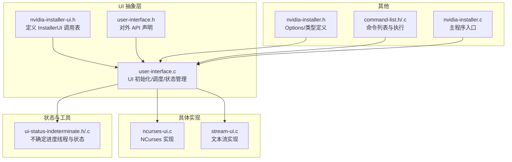
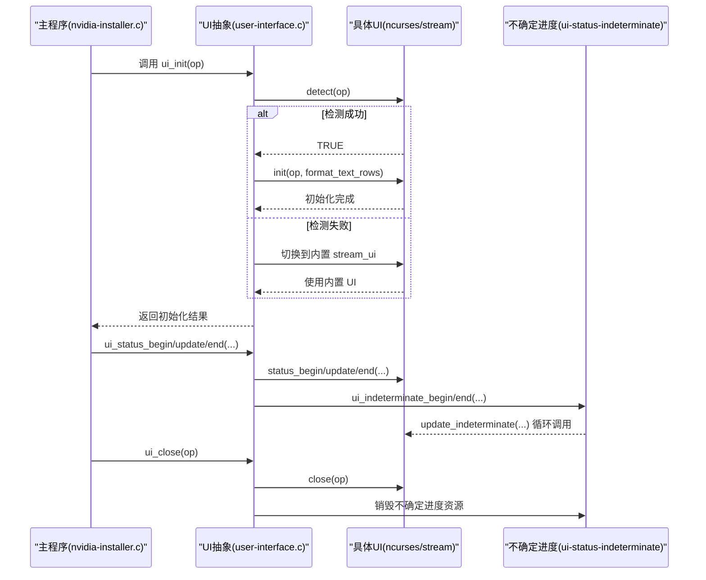

# 用户界面API

<cite>
**本文引用的文件**
- [nvidia-installer-ui.h](file://nvidia-installer-ui.h)
- [user-interface.h](file://user-interface.h)
- [user-interface.c](file://user-interface.c)
- [ncurses-ui.c](file://ncurses-ui.c)
- [stream-ui.c](file://stream-ui.c)
- [ui-status-indeterminate.h](file://ui-status-indeterminate.h)
- [ui-status-indeterminate.c](file://ui-status-indeterminate.c)
- [nvidia-installer.h](file://nvidia-installer.h)
- [command-list.h](file://command-list.h)
- [command-list.c](file://command-list.c)
- [nvidia-installer.c](file://nvidia-installer.c)
</cite>

## 目录
1. [简介](#简介)
2. [项目结构](#项目结构)
3. [核心组件](#核心组件)
4. [架构总览](#架构总览)
5. [详细组件分析](#详细组件分析)
6. [依赖关系分析](#依赖关系分析)
7. [性能考虑](#性能考虑)
8. [故障排查指南](#故障排查指南)
9. [结论](#结论)
10. [附录：API与使用示例](#附录api与使用示例)

## 简介
本文件系统性地梳理了 NVIDIA 安装器中的“用户界面API”，包括：
- UI 抽象层接口设计与实现规范
- 回调函数定义、参数传递与状态管理
- NCurses 界面与文本界面（stream）的实现差异与切换机制
- UI 状态管理、进度显示与用户交互的 API 规范
- 界面初始化、更新与清理的完整流程
- UI 插件架构与扩展点的使用方法
- 面向 UI 开发者的接口使用示例与集成指南
- 不同 UI 实现之间的兼容性与迁移方案

## 项目结构
围绕 UI 的核心文件组织如下：
- 抽象接口与对外 API：nvidia-installer-ui.h、user-interface.h、user-interface.c
- 具体 UI 实现：ncurses-ui.c、stream-ui.c
- 进度/状态辅助：ui-status-indeterminate.h、ui-status-indeterminate.c
- 选项与类型：nvidia-installer.h
- 命令列表：command-list.h、command-list.c
- 主程序入口：nvidia-installer.c



图表来源
- [nvidia-installer-ui.h:39-176](file://nvidia-installer-ui.h#L39-L176)
- [user-interface.h:29-61](file://user-interface.h#L29-L61)
- [user-interface.c:116-238](file://user-interface.c#L116-L238)
- [ncurses-ui.c:245-261](file://ncurses-ui.c#L245-L261)
- [stream-ui.c:59-75](file://stream-ui.c#L59-L75)
- [ui-status-indeterminate.h:31-47](file://ui-status-indeterminate.h#L31-L47)
- [nvidia-installer.h:185-342](file://nvidia-installer.h#L185-L342)
- [command-list.h:29-48](file://command-list.h#L29-L48)

章节来源
- [nvidia-installer-ui.h:39-176](file://nvidia-installer-ui.h#L39-L176)
- [user-interface.h:29-61](file://user-interface.h#L29-L61)
- [user-interface.c:116-238](file://user-interface.c#L116-L238)

## 核心组件
- InstallerUI 调用表：定义 UI 必须提供的统一接口，包括检测、初始化、标题设置、输入、消息、命令输出、命令列表确认、问答、多选、分页提示、状态显示、不确定进度、关闭等。
- 对外 API：ui_* 函数族封装了日志、消息、输入、选择、状态、不确定进度等，负责与具体 UI 实现解耦。
- 具体 UI 实现：
  - NCurses 实现：基于 ncurses 的图形化界面，支持颜色、区域划分、按钮、分页器等。
  - 文本流实现：纯文本输出，适合无终端或受限环境。
- 状态与线程：不确定进度通过独立线程驱动，避免阻塞主 UI 更新。
- 选项与类型：Options 结构体中包含 ui 字段（名称、私有数据、状态标志、不确定进度数据），用于 UI 生命周期管理。

章节来源
- [nvidia-installer-ui.h:39-176](file://nvidia-installer-ui.h#L39-L176)
- [user-interface.h:36-61](file://user-interface.h#L36-L61)
- [user-interface.c:576-661](file://user-interface.c#L576-L661)
- [nvidia-installer.h:316-321](file://nvidia-installer.h#L316-L321)

## 架构总览
UI 抽象层通过 InstallerUI 调用表屏蔽具体实现差异；对外 API 在 user-interface.c 中统一调度到具体 UI；不确定进度由 ui-status-indeterminate 提供线程安全的状态机；Options.ui 字段贯穿 UI 生命周期。



图表来源
- [user-interface.c:116-238](file://user-interface.c#L116-L238)
- [ncurses-ui.c:281-301](file://ncurses-ui.c#L281-L301)
- [stream-ui.c:162-194](file://stream-ui.c#L162-L194)
- [ui-status-indeterminate.c:93-125](file://ui-status-indeterminate.c#L93-L125)

## 详细组件分析

### UI 抽象层接口（InstallerUI）
- 设计模式：策略/调度模式。通过 InstallerUI 调用表将高层 UI 行为与底层实现解耦。
- 关键回调：
  - detect/init/set_title/get_input/message/command_output/approve_command_list/yes_no/multiple_choice/paged_prompt/status_begin/status_update/status_end/update_indeterminate/close
- 参数约定：
  - 所有回调均以 Options* 作为上下文，确保可访问全局配置与状态。
  - 多数字符串参数为只读，返回值需按实现释放内存（如 get_input 返回的字符串）。
- 状态管理：
  - 调用表不直接保存状态，但 UI 实现可在 Options.ui.priv 中维护私有数据。
  - 状态活跃标志 op->ui.status_active 由 UI 抽象层维护，用于抑制日志消息等。

章节来源
- [nvidia-installer-ui.h:39-176](file://nvidia-installer-ui.h#L39-L176)
- [user-interface.c:538-642](file://user-interface.c#L538-L642)

### 对外 API（ui_* 函数族）
- 日志与消息：
  - ui_log/ui_message/ui_warn/ui_error：根据级别与静默模式决定是否调用 UI 层。
  - ui_expert：仅在专家模式下通过 UI 输出。
- 输入与选择：
  - ui_get_input：支持默认值与问题描述。
  - ui_yes_no：支持默认值。
  - ui_multiple_choice/ui_paged_prompt：支持多选与分页展示。
- 命令列表确认：
  - ui_approve_command_list：专家模式下展示命令列表并等待确认。
- 状态与不确定进度：
  - ui_status_begin/update/end：带百分比的确定进度。
  - ui_indeterminate_begin/end：不确定进度，内部启动线程循环调用 update_indeterminate。
- 关闭：
  - ui_close：关闭 UI 并清理临时文件与不确定进度资源。

章节来源
- [user-interface.h:36-61](file://user-interface.h#L36-L61)
- [user-interface.c:247-661](file://user-interface.c#L247-L661)

### NCurses 界面实现（ncurses-ui.c）
- 特性：
  - 区域划分（Header/Footer/Message）、颜色支持、按钮绘制、分页器、进度条动画。
  - 支持窗口大小变化检测与重绘。
- 私有数据：
  - DataStruct：缓存标题、底部信息、进度标题、颜色开关、窗口尺寸、格式化函数指针等。
- 关键实现点：
  - detect：检查终端尺寸与初始化 ncurses。
  - init：创建区域、设置颜色、注册信号处理。
  - get_input：弹出输入框，支持左右移动、删除、回显等。
  - message：弹出消息框，显示 OK 按钮并动画点击。
  - approve_command_list：将命令列表转为文本后交由 paged_prompt 显示。
  - status_begin/update/end：绘制进度条与百分比。
  - update_indeterminate：绘制滚动指示器。
  - close：销毁区域与窗口。

章节来源
- [ncurses-ui.c:75-95](file://ncurses-ui.c#L75-L95)
- [ncurses-ui.c:281-301](file://ncurses-ui.c#L281-L301)
- [ncurses-ui.c:310-374](file://ncurses-ui.c#L310-L374)
- [ncurses-ui.c:405-634](file://ncurses-ui.c#L405-L634)
- [ncurses-ui.c:642-739](file://ncurses-ui.c#L642-L739)
- [ncurses-ui.c:766-790](file://ncurses-ui.c#L766-L790)
- [ncurses-ui.c:150-261](file://ncurses-ui.c#L150-L261)

### 文本流界面实现（stream-ui.c）
- 特性：
  - 纯文本输出，适合无终端或受限环境。
  - 统一的消息前缀与输出流（stdout/stderr）。
  - 简单的进度条与百分比显示。
- 关键实现点：
  - detect：始终返回 TRUE（内置 UI）。
  - init：打印欢迎信息并注册 SIGWINCH 处理。
  - get_input：从 stdin 读取一行，支持默认值。
  - message：按级别输出到 stdout/stderr。
  - approve_command_list：逐条列出命令并询问确认。
  - status_begin/update/end：打印进度条与百分比。
  - update_indeterminate：打印滚动指示器。
  - close：释放私有数据。

章节来源
- [stream-ui.c:162-194](file://stream-ui.c#L162-L194)
- [stream-ui.c:216-234](file://stream-ui.c#L216-L234)
- [stream-ui.c:243-272](file://stream-ui.c#L243-L272)
- [stream-ui.c:298-323](file://stream-ui.c#L298-L323)
- [stream-ui.c:471-517](file://stream-ui.c#L471-L517)
- [stream-ui.c:501-507](file://stream-ui.c#L501-L507)
- [stream-ui.c:525-531](file://stream-ui.c#L525-L531)

### 不确定进度线程与状态（ui-status-indeterminate）
- 设计：
  - 线程安全的状态机，支持 INDETERMINATE_INVALID/INACTIVE/ACTIVE 三种状态。
  - 通过互斥锁保护状态变更，线程创建/销毁由 indeterminate_begin/end 控制。
- 工作流：
  - ui_indeterminate_begin：启动工作线程，周期调用 UI.update_indeterminate。
  - 工作线程在状态为 ACTIVE 时循环调用，直到 ui_indeterminate_end 设置为 INACTIVE 并 join 线程。

章节来源
- [ui-status-indeterminate.h:31-47](file://ui-status-indeterminate.h#L31-L47)
- [ui-status-indeterminate.c:30-125](file://ui-status-indeterminate.c#L30-L125)
- [user-interface.c:575-626](file://user-interface.c#L575-L626)

### UI 初始化、更新与清理流程
- 初始化：
  - 遍历可用 UI（ncurses6/ncurses/ncursesw6 或 none），尝试提取并 dlopen，查找符号 ui_dispatch_table 并调用 detect。
  - 若均失败，回退到内置 stream_ui。
  - 调用具体 UI 的 init，并初始化不确定进度数据。
- 更新：
  - 状态更新通过 ui_status_begin/update/end 与 ui_indeterminate_begin/end 协调。
  - UI 实现负责绘制与刷新。
- 清理：
  - ui_close 调用具体 UI.close，删除临时 UI 文件，销毁不确定进度资源。

章节来源
- [user-interface.c:116-238](file://user-interface.c#L116-L238)
- [user-interface.c:646-661](file://user-interface.c#L646-L661)

### UI 插件架构与扩展点
- 插件机制：
  - UI 以共享库形式打包在二进制内，运行时提取到临时文件并 dlopen。
  - 通过符号 ui_dispatch_table 暴露 InstallerUI 调用表。
- 扩展点：
  - 新增 UI 只需实现 InstallerUI 调用表中的所有函数，并导出 ui_dispatch_table。
  - 可通过 Options.ui.name 指定 UI 名称（如 "ncurses"/"ncurses6"/"ncursesw6"/"none"）。
- 兼容性：
  - 内置 stream_ui 总是可用，保证最低可用性。
  - 通过 detect 机制避免加载不兼容 UI。

章节来源
- [user-interface.c:120-192](file://user-interface.c#L120-L192)
- [ncurses-ui.c:245-261](file://ncurses-ui.c#L245-L261)
- [stream-ui.c:59-75](file://stream-ui.c#L59-L75)

### 命令列表与 UI 的协作
- 命令列表：
  - CommandList 保存描述与命令数组，支持构建、执行与释放。
- UI 协作：
  - ui_approve_command_list 在专家模式下展示命令列表并等待确认。
  - 执行长耗时命令时，可通过 ui_indeterminate_begin/end 显示不确定进度。

章节来源
- [command-list.h:29-48](file://command-list.h#L29-L48)
- [command-list.c:51-1261](file://command-list.c#L51-L1261)
- [user-interface.c:419-436](file://user-interface.c#L419-L436)

## 依赖关系分析

```mermaid
classDiagram
class InstallerUI {
+detect(op) int
+init(op, format_text_rows) int
+set_title(op, title) void
+get_input(op, def, msg) char*
+message(op, level, msg) void
+command_output(op, msg) void
+approve_command_list(op, c, descr) int
+yes_no(op, def, msg) int
+multiple_choice(op, question, answers, num, default) int
+paged_prompt(op, question, pager_title, pager_text, answers, num, default) int
+status_begin(op, title, msg) void
+status_update(op, percent, msg) void
+status_end(op, msg) void
+update_indeterminate(op, msg) void
+close(op) void
}
class UIAbstraction {
+ui_init(op) int
+ui_set_title(op, fmt, ...)
+ui_get_input(op, def, fmt, ...)
+ui_error/op, fmt, ...)
+ui_warn(op, fmt, ...)
+ui_message(op, fmt, ...)
+ui_log(op, fmt, ...)
+ui_expert(op, fmt, ...)
+ui_command_output(op, fmt, ...)
+ui_approve_command_list(op, c, fmt, ...)
+ui_yes_no(op, def, fmt, ...)
+ui_multiple_choice(op, answers, num, default, fmt, ...)
+ui_paged_prompt(op, question, pager_title, pager_text, answers, num, default)
+ui_status_begin(op, title, fmt, ...)
+ui_status_update(op, percent, fmt, ...)
+ui_indeterminate_begin(op, fmt, ...)
+ui_indeterminate_end(op)
+ui_status_end(op, fmt, ...)
+ui_close(op)
}
class NCursesUI {
+detect/init/set_title/get_input/message/command_output
+approve_command_list/yes_no/multiple_choice/paged_prompt
+status_begin/status_update/status_end/update_indeterminate/close
}
class StreamUI {
+detect/init/set_title/get_input/message/command_output
+approve_command_list/yes_no/multiple_choice/paged_prompt
+status_begin/status_update/status_end/update_indeterminate/close
}
class IndeterminateData {
+indeterminate_init()
+indeterminate_begin(worker, args)
+indeterminate_end()
+indeterminate_destroy()
}
InstallerUI <|.. NCursesUI : "实现"
InstallerUI <|.. StreamUI : "实现"
UIAbstraction --> InstallerUI : "调度"
UIAbstraction --> IndeterminateData : "使用"
```

图表来源
- [nvidia-installer-ui.h:39-176](file://nvidia-installer-ui.h#L39-L176)
- [user-interface.c:116-238](file://user-interface.c#L116-L238)
- [ncurses-ui.c:245-261](file://ncurses-ui.c#L245-L261)
- [stream-ui.c:59-75](file://stream-ui.c#L59-L75)
- [ui-status-indeterminate.h:41-47](file://ui-status-indeterminate.h#L41-L47)

## 性能考虑
- UI 初始化成本：NCurses 初始化涉及终端检测与颜色配置，可能较慢；stream_ui 初始化开销低。
- 不确定进度：通过独立线程轮询 update_indeterminate，避免阻塞 UI 主循环。
- 文本格式化：nv_format_text_rows 在 UI 中广泛使用，注意宽度与换行策略对渲染性能的影响。
- 信号处理：UI 关闭时需要快速清理，避免长时间阻塞。

[本节为通用指导，无需特定文件来源]

## 故障排查指南
- UI 无法加载/初始化：
  - 检查 detect 是否返回 TRUE；若失败，查看日志输出的“Unable to load/initialize”信息。
  - 确认 Options.ui.name 是否有效。
- 终端尺寸过小：
  - NCurses detect 会检查最小宽高，过小则回退到内置 UI。
- 信号导致退出：
  - UI 注册了多种信号处理器，收到致命信号时会调用 ui_close 并退出。
- 不确定进度无效：
  - 若状态机变为 INVALID，相关操作将被忽略；检查线程创建与互斥锁初始化。

章节来源
- [user-interface.c:162-184](file://user-interface.c#L162-L184)
- [ncurses-ui.c:281-301](file://ncurses-ui.c#L281-L301)
- [user-interface.c:763-821](file://user-interface.c#L763-L821)
- [ui-status-indeterminate.c:93-125](file://ui-status-indeterminate.c#L93-L125)

## 结论
该 UI 子系统采用“抽象接口 + 插件实现”的架构，既保证了跨平台与可扩展性，又提供了稳定的内置实现。通过统一的 API 与状态管理，开发者可以方便地在 NCurses 与文本流之间切换，并在需要时扩展新的 UI 实现。不确定进度线程与状态机进一步提升了复杂任务的用户体验。

[本节为总结，无需特定文件来源]

## 附录：API与使用示例

### API 规范与使用要点
- 初始化与关闭
  - ui_init：自动选择并初始化 UI；失败时回退到内置 stream_ui。
  - ui_close：清理 UI 资源与临时文件。
- 消息与日志
  - ui_log/ui_message/ui_warn/ui_error：按级别输出；静默模式下仅输出重要信息。
  - ui_expert：仅在专家模式下输出。
- 输入与选择
  - ui_get_input：支持默认值与问题描述。
  - ui_yes_no：支持默认值。
  - ui_multiple_choice/ui_paged_prompt：支持多选与分页展示。
- 命令列表
  - ui_approve_command_list：专家模式下展示命令列表并等待确认。
- 进度与不确定进度
  - ui_status_begin/update/end：确定进度。
  - ui_indeterminate_begin/end：不确定进度，内部循环调用 update_indeterminate。

章节来源
- [user-interface.h:36-61](file://user-interface.h#L36-L61)
- [user-interface.c:247-661](file://user-interface.c#L247-L661)

### 集成指南
- 在主程序中：
  - 调用 ui_init 初始化 UI。
  - 在安装流程中使用 ui_status_begin/update/end 与 ui_indeterminate_begin/end 显示进度。
  - 使用 ui_approve_command_list 在专家模式下确认命令列表。
  - 使用 ui_yes_no/ui_multiple_choice 获取用户选择。
  - 最终调用 ui_close 清理。
- 新增 UI 实现：
  - 实现 InstallerUI 调用表的所有函数，并导出 ui_dispatch_table。
  - 将 UI 以共享库形式嵌入二进制，或在运行时提供可加载的动态库。
  - 通过 Options.ui.name 指定 UI 名称进行选择。

章节来源
- [user-interface.c:116-238](file://user-interface.c#L116-L238)
- [ncurses-ui.c:245-261](file://ncurses-ui.c#L245-L261)
- [stream-ui.c:59-75](file://stream-ui.c#L59-L75)

### 兼容性与迁移方案
- 兼容性：
  - 内置 stream_ui 总是可用，保证在任何环境下都能正常运行。
  - detect 机制确保只加载兼容的 UI。
- 迁移方案：
  - 从 NCurses 迁移到文本流：直接调用 ui_* API，无需修改业务逻辑。
  - 从文本流迁移到 NCurses：确保终端环境满足 detect 条件，或允许回退到内置 UI。
  - 新增 UI：遵循 InstallerUI 调用表规范，保持参数与行为一致。

章节来源
- [user-interface.c:116-238](file://user-interface.c#L116-L238)
- [ncurses-ui.c:281-301](file://ncurses-ui.c#L281-L301)
- [stream-ui.c:162-194](file://stream-ui.c#L162-L194)