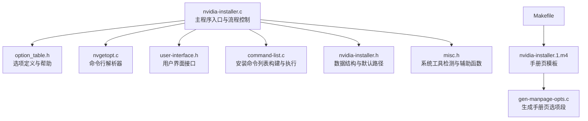
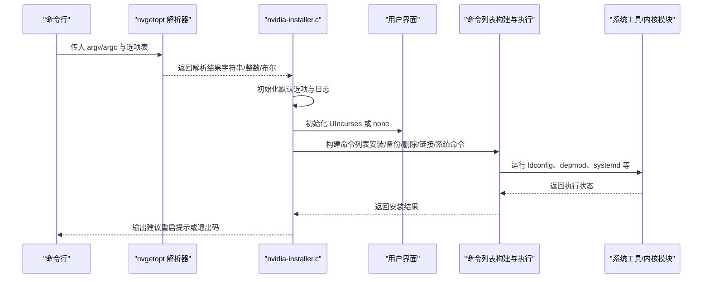
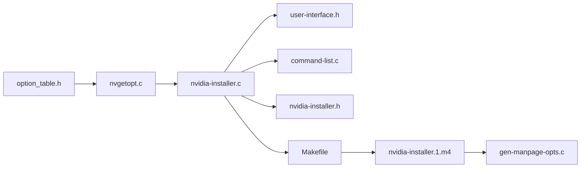

# 命令行接口参考

<cite>
**本文引用的文件**
- [nvidia-installer.c](file://nvidia-installer.c)
- [option_table.h](file://option_table.h)
- [nvgetopt.c](file://common-utils/nvgetopt.c)
- [nvgetopt.h](file://common-utils/nvgetopt.h)
- [nvidia-installer.h](file://nvidia-installer.h)
- [user-interface.h](file://user-interface.h)
- [command-list.c](file://command-list.c)
- [misc.h](file://misc.h)
- [Makefile](file://Makefile)
- [README](file://README)
- [nvidia-installer.1.m4](file://nvidia-installer.1.m4)
- [gen-manpage-opts.c](file://gen-manpage-opts.c)
</cite>

## 目录
1. [简介](#简介)
2. [项目结构](#项目结构)
3. [核心组件](#核心组件)
4. [架构总览](#架构总览)
5. [详细组件分析](#详细组件分析)
6. [依赖分析](#依赖分析)
7. [性能考虑](#性能考虑)
8. [故障排查指南](#故障排查指南)
9. [结论](#结论)
10. [附录](#附录)

## 简介
本文件为 NVIDIA 安装程序命令行接口的完整参考文档，覆盖所有可用命令行选项与标志，包括基础选项、高级配置选项与调试选项；说明每个选项的参数格式、取值范围与默认行为；提供丰富的使用示例与场景；解释选项之间的相互关系与优先级规则；阐述交互式安装与非交互式安装的区别及静默模式配置；并给出最佳实践与常见错误规避建议。

## 项目结构
该仓库采用“功能模块化 + 通用工具库”的组织方式：
- 核心入口与解析：nvidia-installer.c 负责命令行解析、默认值初始化、流程调度
- 选项表与帮助：option_table.h 定义所有命令行选项及其描述
- 通用解析器：common-utils/nvgetopt.c 提供跨平台的 getopt_long 替代实现
- 用户界面：user-interface.h 定义 UI 接口；ncurses-ui.c 为默认 UI 实现
- 安装流程：command-list.c 构建命令列表并执行安装/卸载/校验等操作
- 工具与宏：Makefile、README、nvidia-installer.1.m4 等用于构建与生成手册页

图表来源
- [nvidia-installer.c:648-762](file://nvidia-installer.c#L648-L762)
- [option_table.h:126-789](file://option_table.h#L126-L789)
- [nvgetopt.c:37-200](file://common-utils/nvgetopt.c#L37-L200)
- [user-interface.h:29-61](file://user-interface.h#L29-L61)
- [command-list.c:255-519](file://command-list.c#L255-L519)
- [nvidia-installer.h:185-342](file://nvidia-installer.h#L185-L342)
- [misc.h:69-119](file://misc.h#L69-L119)
- [Makefile:158-325](file://Makefile#L158-L325)
- [nvidia-installer.1.m4:1-141](file://nvidia-installer.1.m4#L1-L141)
- [gen-manpage-opts.c:11-16](file://gen-manpage-opts.c#L11-L16)

章节来源
- [nvidia-installer.c:648-762](file://nvidia-installer.c#L648-L762)
- [option_table.h:126-789](file://option_table.h#L126-L789)
- [Makefile:158-325](file://Makefile#L158-L325)

## 核心组件
- 命令行解析器（nvgetopt）
  - 支持短选项与长选项，支持布尔型与可禁用型选项（--no-前缀）
  - 返回解析结果到字符串/整数/布尔变量，便于后续处理
- 选项表（option_table.h）
  - 定义所有命令行选项、参数类型、描述与适用场景
  - 包含基础选项与高级选项两类，通过掩码控制帮助输出
- 主程序（nvidia-installer.c）
  - 初始化默认选项、解析命令行、加载日志、选择 UI、执行安装/卸载/校验
  - 处理交互与非交互模式、静默模式、专家模式等
- 安装流程（command-list.c）
  - 构建命令列表（安装、备份、删除、符号链接、运行系统命令等）
  - 执行命令列表并记录日志，处理 SELinux、ldconfig、depmod、systemd 等

章节来源
- [nvgetopt.c:37-200](file://common-utils/nvgetopt.c#L37-L200)
- [nvgetopt.h:135-205](file://common-utils/nvgetopt.h#L135-L205)
- [option_table.h:126-789](file://option_table.h#L126-L789)
- [nvidia-installer.c:225-640](file://nvidia-installer.c#L225-L640)
- [command-list.c:255-519](file://command-list.c#L255-L519)

## 架构总览
下图展示了从命令行到安装执行的关键调用链与数据流。

图表来源
- [nvidia-installer.c:225-640](file://nvidia-installer.c#L225-L640)
- [nvgetopt.c:37-200](file://common-utils/nvgetopt.c#L37-L200)
- [command-list.c:255-519](file://command-list.c#L255-L519)

## 详细组件分析

### 命令行选项分类与说明
以下选项按“基础”“高级配置”“调试/诊断”三类组织，并给出参数格式、取值范围、默认行为与典型用法。

- 基础选项（默认帮助中显示）
  - 版本与帮助
    - --version, -v：打印版本信息后退出
    - --help, -h：打印基础帮助并退出
    - --advanced-options, -A：打印基础与高级帮助并退出
  - 安装模式与卸载
    - --uninstall, -u：卸载当前已安装驱动
    - --sanity, -S：对现有驱动进行基础健康检查
    - --expert, -e：专家模式，更详细问题与更冗长输出
    - --no-questions, -q：不询问任何问题，使用默认值
    - --silent, -s：静默模式，不输出除错误外的信息；隐含 --ui=none --no-questions
  - 路径与前缀
    - --x-prefix, --xfree86-prefix：X 组件安装前缀（兼容旧名）
    - --x-module-path：X 模块安装路径
    - --x-library-path：X 库安装路径
    - --x-sysconfig-path：X 系统配置目录
    - --opengl-prefix, --opengl-libdir：OpenGL 组件前缀与库目录
    - --wine-prefix, --wine-libdir：Wine 组件前缀与库目录
    - --utility-prefix, --utility-libdir：工具二进制与库安装前缀与库目录
    - --xdg-data-dir：XDG 数据文件安装前缀
    - --documentation-prefix：文档安装前缀
    - --application-profile-path：应用配置文件安装目录
    - --installer-prefix：安装器二进制安装前缀（建议使用 --utility-prefix）
  - 内核模块与源码
    - --kernel-name, -k：为目标非运行内核构建并安装内核模块（隐含 --no-precompiled-interface）
    - --kernel-source-path：内核源码目录
    - --kernel-output-path：内核输出目录（KBUILD_OUTPUT/O）
    - --kernel-install-path：内核模块安装目录
    - --kernel-module-source-prefix/--kernel-module-source-dir：内核模块源码安装位置
    - --no-kernel-module-source：跳过安装内核模块源码
    - --kernel-modules-only, -K：仅安装内核模块，不卸载现有驱动
    - --no-kernel-modules：不安装内核模块，保留现有内核模块
    - --no-precompiled-interface, -n：禁用预编译内核接口
    - --precompiled-kernel-interfaces-path：预编译接口搜索目录
  - 日志与临时目录
    - --log-file-name：日志文件名（默认位于 /var/log）
    - --tmpdir：临时目录（若未指定则按环境变量与默认路径搜索）
  - 用户界面与颜色
    - --ui：选择 UI 类型（ncurses 或 none）
    - --no-ncurses-color：禁用 ncurses 彩色输出
  - 其他基础选项
    - --no-nvidia-modprobe：跳过安装 nvidia-modprobe
    - --proc-mount-point：proc 文件系统挂载点（默认 /proc）
    - --no-backup, -b：冲突文件直接删除而非备份
    - --no-recursion, -r：递归搜索冲突文件时仅顶层目录
    - --no-x-check：不因检测到 X 服务器运行而中止安装
    - --run-nvidia-xconfig, -X：默认在安装后询问是否运行 nvidia-xconfig
    - --no-nouveau-check, -z：禁用 nouveau 驱动检测
    - --disable-nouveau, -Z：默认尝试禁用 nouveau（布尔）

- 高级配置选项
  - SELinux 与安全
    - --force-selinux：强制设置 SELinux 安全类型（yes/no/default）
    - --selinux-chcon-type：覆盖 chcon 类型检测
  - 分发脚本与系统集成
    - --no-distro-scripts：禁用分发钩子脚本
    - --systemd/--no-systemd：启用/禁用 systemd 单元文件安装
    - --systemd-unit-prefix：systemd 单元文件安装路径
    - --systemd-sleep-prefix：systemd sleep 脚本安装路径
    - --systemd-sysconf-prefix：systemd 启用链接安装路径
  - 模块签名
    - --module-signing-secret-key/--module-signing-public-key：签名密钥路径
    - --module-signing-script：签名脚本路径
    - --module-signing-key-path：签名密钥安装路径
    - --module-signing-hash/--module-signing-x509-hash：签名哈希算法
  - 可选模块与库
    - --no-unified-memory, --no-drm, --no-peermem：禁用特定内核模块
    - --install-compat32-libs/--no-install-compat32-libs：32 位兼容库安装控制（x86_64）
    - --force-libglx-indirect/--no-libglx-indirect：强制安装 libGLX_indirect 符号链接
    - --install-libglvnd/--no-install-libglvnd：安装或排除 libglvnd 库
    - --glvnd-egl-config-path：egl vendor 配置文件安装路径
    - --egl-external-platform-config-path：外部 EGL 平台配置文件安装路径
  - 文件类型目标覆盖
    - --override-file-type-destination：<FILE_TYPE>:<destination>：覆盖某文件类型的安装目标
  - 内核模块类型与构建
    - --kernel-module-type, -M："open" 或 "proprietary"
    - --kernel-module-build-directory, -m：内核模块构建目录（已弃用，推荐使用 -M）
    - --print-recommended-kernel-module-type：打印推荐模块类型
  - 并发与性能
    - --concurrency-level, -j：并行度（CPU 数或自定义）
  - 其他
    - --no-abi-note：移除 OpenGL 库中的 ABI 注记
    - --no-rpms：跳过 RPM 冲突检测与移除
    - --skip-module-load：跳过测试加载与最终加载
    - --skip-depmod：不运行 depmod
    - --allow-installation-with-running-driver：允许在驱动已运行时继续安装
    - --rebuild-initramfs/--no-rebuild-initramfs：强制重建或跳过 initramfs

- 调试/诊断选项
  - --debug, -d：开启调试输出
  - --help-args-only, --advanced-options-args-only：仅打印帮助文本（用于 makeself）

章节来源
- [option_table.h:126-789](file://option_table.h#L126-L789)
- [nvidia-installer.c:225-640](file://nvidia-installer.c#L225-L640)
- [nvgetopt.h:135-205](file://nvgetopt.h#L135-L205)

### 选项解析与优先级
- 解析顺序
  - 短选项与长选项均可使用；布尔型支持 --no- 前缀禁用
  - 字符串/整数参数可通过等号或空格传递
  - 多个短选项可合并（如 -abc），但带参数的短选项不可合并
- 默认值与覆盖
  - 默认值在主程序初始化阶段设定，随后由命令行选项覆盖
  - 部分选项存在互斥或冲突（例如 -K 与 --no-kernel-modules 互斥）
- 交互与非交互
  - --no-questions 与 --silent 隐含默认回答，适合自动化
  - --expert 增加详细问题与输出
- 专家模式与静默模式
  - --expert：增加详细问题与输出
  - --silent：不输出除错误外的信息；隐含 --ui=none --no-questions

章节来源
- [nvgetopt.c:105-200](file://common-utils/nvgetopt.c#L105-L200)
- [nvidia-installer.c:225-640](file://nvidia-installer.c#L225-L640)

### 使用示例与场景
- 交互式安装（默认）
  - nvidia-installer
- 专家模式
  - nvidia-installer --expert
- 静默安装（无输出，适合 CI）
  - nvidia-installer --silent
- 仅安装内核模块（多内核场景）
  - nvidia-installer --kernel-modules-only
- 指定内核源码与输出目录
  - nvidia-installer --kernel-source-path=/lib/modules/$(uname -r)/build --kernel-output-path=/lib/modules/$(uname -r)/build
- 禁用预编译接口并指定目标内核
  - nvidia-installer --kernel-name=5.15.0-101-generic --no-precompiled-interface
- 强制安装 libglvnd
  - nvidia-installer --install-libglvnd
- 禁用特定内核模块
  - nvidia-installer --no-drm --no-unified-memory
- 覆盖文件类型目标
  - nvidia-installer --override-file-type-destination=FILE_TYPE_OPENGL_LIB:/usr/local/lib
- 静默卸载
  - nvidia-installer --uninstall --silent

章节来源
- [option_table.h:126-789](file://option_table.h#L126-L789)
- [nvidia-installer.c:225-640](file://nvidia-installer.c#L225-L640)

### 选项关系与冲突
- 互斥/冲突
  - --kernel-modules-only 与 --no-kernel-modules 互斥
  - --no-kernel-modules 隐含 --no-kernel-module-source
  - --kernel-name 隐含 --no-precompiled-interface
- 依赖
  - --systemd 与 systemd 工具检测相关
  - --install-libglvnd 与 libglvnd 库可用性相关
- 默认行为
  - --no-nvidia-modprobe 默认安装 nvidia-modprobe
  - --disable-nouveau 默认尝试禁用 nouveau

章节来源
- [nvidia-installer.c:225-640](file://nvidia-installer.c#L225-L640)
- [option_table.h:126-789](file://option_table.h#L126-L789)

### 交互式 vs 非交互式 vs 静默模式
- 交互式
  - 默认行为，会询问用户并显示进度
- 专家模式
  - 更详细的提示与输出，适合排障
- 非交互式
  - --no-questions：所有问题使用默认值
- 静默模式
  - --silent：不输出任何信息，仅错误到 stderr；隐含 --ui=none --no-questions

章节来源
- [nvidia-installer.c:225-640](file://nvidia-installer.c#L225-L640)
- [option_table.h:126-789](file://option_table.h#L126-L789)

### 最佳实践与常见错误
- 最佳实践
  - 在多内核环境中使用 --kernel-modules-only 安装额外内核模块
  - 使用 --no-questions 或 --silent 进行自动化部署
  - 需要 systemd 集成时显式使用 --systemd
  - 需要 libglvnd 时使用 --install-libglvnd
  - 遇到冲突文件时使用 --no-backup 以简化清理，但需谨慎
- 常见错误
  - 忘记以 root 权限运行导致失败
  - 未满足开发工具或系统工具依赖导致构建失败
  - 未正确设置 --kernel-source-path 导致内核模块无法编译
  - 未禁用 nouveau 导致安装中断
  - 未正确配置 SELinux 导致库权限问题

章节来源
- [nvidia-installer.c:648-762](file://nvidia-installer.c#L648-L762)
- [misc.h:69-119](file://misc.h#L69-L119)
- [README:20-45](file://README#L20-L45)

## 依赖分析
- 选项表与解析器
  - option_table.h 定义选项，nvgetopt.c 提供解析与帮助输出
- 主程序与 UI
  - nvidia-installer.c 调用 UI 初始化与命令列表构建
- 安装流程
  - command-list.c 依据 Options 构建命令列表并执行系统命令
- 构建与文档
  - Makefile 生成手册页，nvidia-installer.1.m4 作为模板，gen-manpage-opts.c 生成选项段

图表来源
- [option_table.h:126-789](file://option_table.h#L126-L789)
- [nvgetopt.c:37-200](file://common-utils/nvgetopt.c#L37-L200)
- [nvidia-installer.c:648-762](file://nvidia-installer.c#L648-L762)
- [user-interface.h:29-61](file://user-interface.h#L29-L61)
- [command-list.c:255-519](file://command-list.c#L255-L519)
- [nvidia-installer.h:185-342](file://nvidia-installer.h#L185-L342)
- [Makefile:158-325](file://Makefile#L158-L325)
- [nvidia-installer.1.m4:1-141](file://nvidia-installer.1.m4#L1-L141)
- [gen-manpage-opts.c:11-16](file://gen-manpage-opts.c#L11-L16)

章节来源
- [Makefile:158-325](file://Makefile#L158-L325)
- [nvidia-installer.1.m4:1-141](file://nvidia-installer.1.m4#L1-L141)

## 性能考虑
- 并发度
  - --concurrency-level 可提升内核模块构建等并行任务效率，默认根据 CPU 数自动设置
- I/O 与磁盘
  - --tmpdir 指向高性能磁盘可减少临时文件写入时间
- 依赖检测
  - 提前安装必要工具（如 binutils、systemd、ncurses）可避免中途失败重试

## 故障排查指南
- 常见问题定位
  - 检查系统工具是否存在：ldconfig、depmod、systemctl、pkg-config 等
  - 检查 SELinux 状态与 chcon 类型设置
  - 检查内核源码与输出目录是否正确
- 错误处理
  - --debug 输出详细日志
  - --expert 显示更多提示
  - --silent 仅输出错误，便于自动化日志收集

章节来源
- [misc.h:69-119](file://misc.h#L69-L119)
- [nvidia-installer.c:648-762](file://nvidia-installer.c#L648-L762)

## 结论
本文档系统梳理了 NVIDIA 安装程序的命令行接口，涵盖选项分类、参数格式、默认行为、使用示例与最佳实践。通过合理组合基础与高级选项，可在交互式与非交互式场景中高效完成驱动安装、升级与卸载，并结合调试选项快速定位问题。

## 附录
- 手册页生成
  - 通过 Makefile 规则生成 nvidia-installer.1.gz，其中选项段由 gen-manpage-opts.c 与 nvidia-installer.1.m4 生成
- 构建依赖
  - 需要 ncurses、pciutils 等依赖，详见 README

章节来源
- [Makefile:294-325](file://Makefile#L294-L325)
- [README:20-45](file://README#L20-L45)