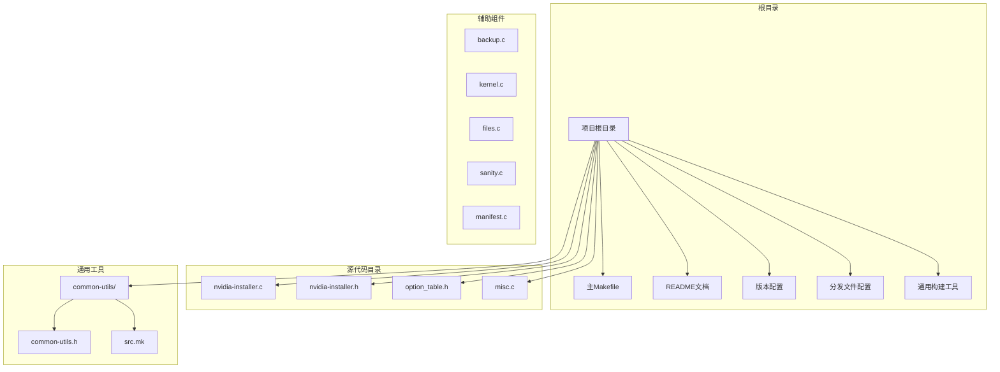
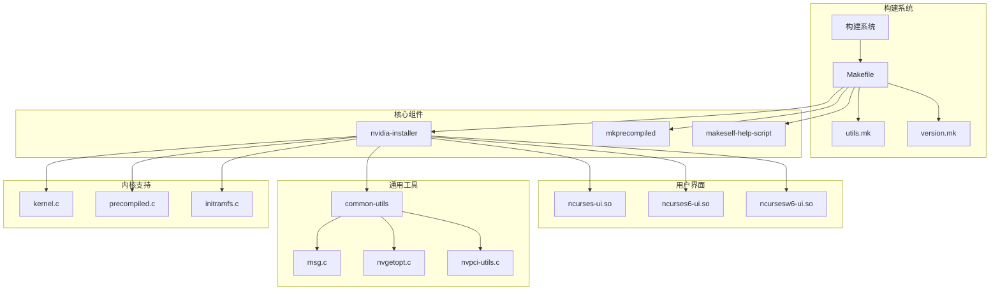
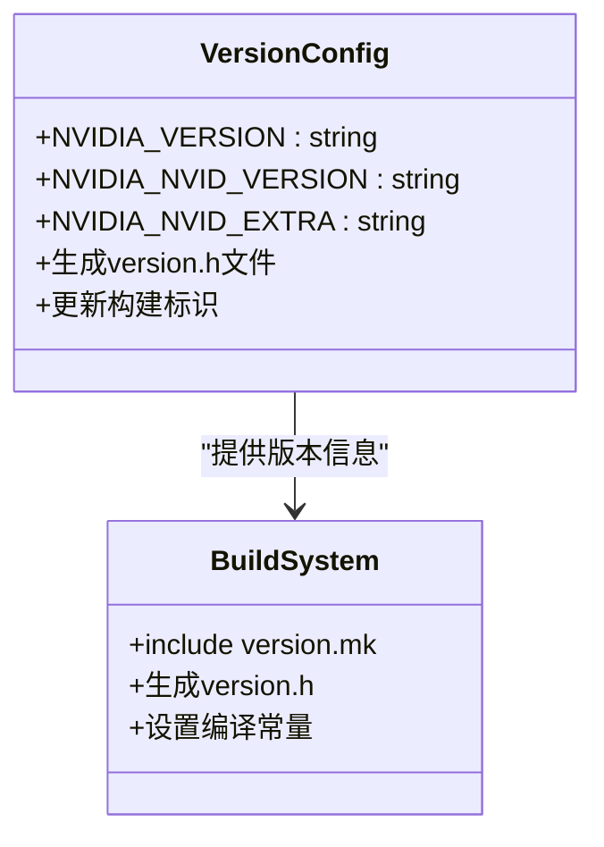
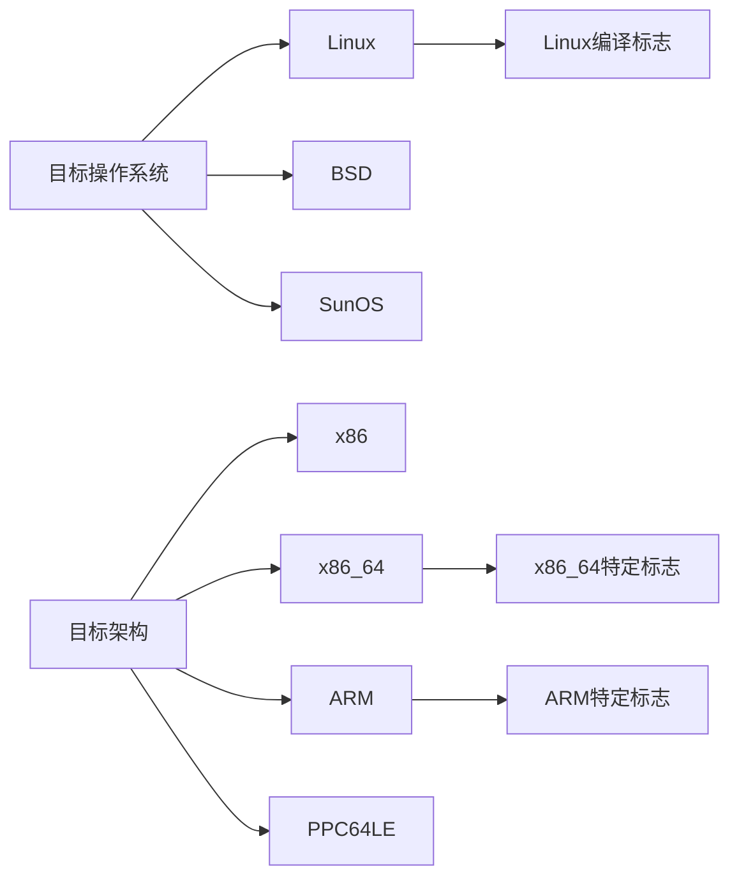
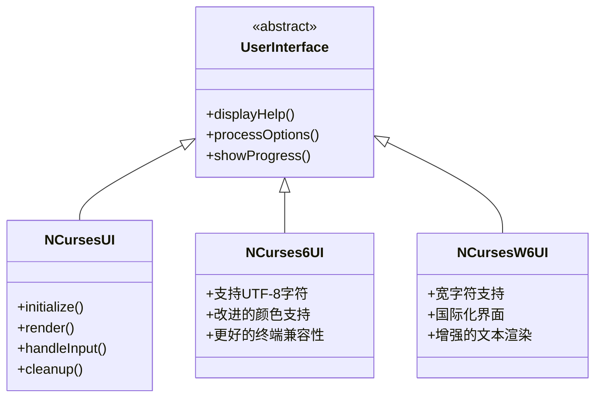
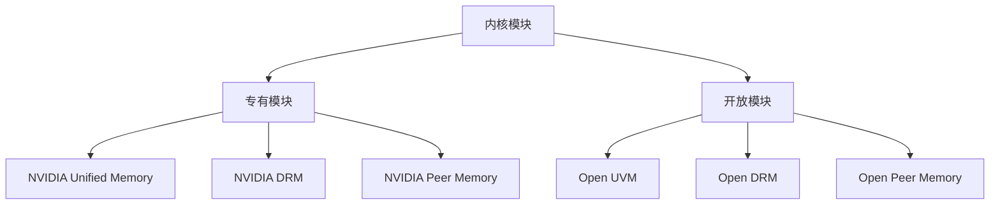
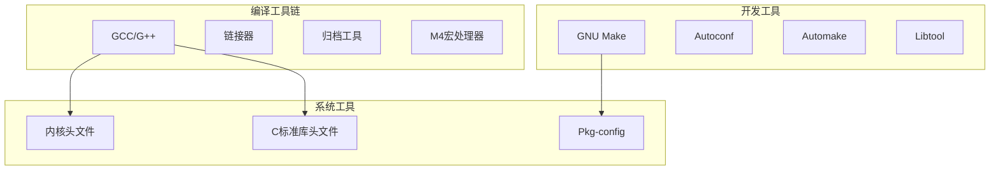

# 安装和配置指南

<cite>
**本文档引用的文件**
- [README](file://README)
- [Makefile](file://Makefile)
- [utils.mk](file://utils.mk)
- [version.mk](file://version.mk)
- [dist-files.mk](file://dist-files.mk)
- [common-utils/src.mk](file://common-utils/src.mk)
- [nvidia-installer.c](file://nvidia-installer.c)
- [option_table.h](file://option_table.h)
- [nvidia-installer.h](file://nvidia-installer.h)
- [misc.c](file://misc.c)
- [common-utils/common-utils.h](file://common-utils/common-utils.h)
</cite>

## 目录
1. [简介](#简介)
2. [项目结构](#项目结构)
3. [核心组件](#核心组件)
4. [架构概览](#架构概览)
5. [详细组件分析](#详细组件分析)
6. [依赖关系分析](#依赖关系分析)
7. [性能考虑](#性能考虑)
8. [故障排除指南](#故障排除指南)
9. [结论](#结论)
10. [附录](#附录)

## 简介

NVIDIA安装器是一个用于在Unix和Linux系统上安装NVIDIA软件包的工具。该项目提供了完整的驱动程序安装、升级和卸载功能，支持多种用户界面和预编译内核接口。

本指南将详细介绍系统的安装和配置过程，包括系统要求、依赖项、编译构建流程、Makefile工作原理、版本管理、分发文件配置、不同Linux发行版的特定注意事项、性能优化建议以及批量部署的最佳实践。

## 项目结构

该项目采用模块化设计，主要包含以下核心目录和文件：



**图表来源**
- [Makefile:1-325](file://Makefile#L1-L325)
- [dist-files.mk:1-76](file://dist-files.mk#L1-L76)
- [utils.mk:1-619](file://utils.mk#L1-L619)

**章节来源**
- [Makefile:1-325](file://Makefile#L1-L325)
- [dist-files.mk:1-76](file://dist-files.mk#L1-L76)
- [utils.mk:1-619](file://utils.mk#L1-L619)

## 核心组件

### 主要可执行文件

项目包含三个核心可执行文件：

1. **nvidia-installer** - 主安装程序，负责驱动程序的安装、升级和卸载
2. **mkprecompiled** - 预编译内核接口生成工具
3. **makeself-help-script** - Makeself帮助脚本

### 用户界面系统

项目支持多种用户界面：
- ncurses界面（默认）
- ncurses6界面
- ncursesw6界面
- 无界面模式

### 内核模块支持

支持两种内核模块类型：
- 专有内核模块（proprietary）
- 开放内核模块（open）

**章节来源**
- [Makefile:52-80](file://Makefile#L52-L80)
- [option_table.h:728-732](file://option_table.h#L728-L732)

## 架构概览



**图表来源**
- [Makefile:109-151](file://Makefile#L109-L151)
- [common-utils/src.mk:1-41](file://common-utils/src.mk#L1-L41)

## 详细组件分析

### Makefile构建系统

Makefile是整个项目的构建核心，提供了完整的构建、安装和清理功能。

#### 关键构建变量


**图表来源**
- [Makefile:28-135](file://Makefile#L28-L135)

#### 构建目标

主要构建目标包括：
- `all`: 构建所有可执行文件和文档
- `install`: 安装到系统目录
- `clean`: 清理构建输出
- `doc`: 生成手册页

**章节来源**
- [Makefile:158-256](file://Makefile#L158-L256)

### 版本管理系统

版本信息通过version.mk文件集中管理：



**图表来源**
- [version.mk:1-12](file://version.mk#L1-L12)

**章节来源**
- [version.mk:1-12](file://version.mk#L1-L12)

### 通用构建工具

utils.mk提供了跨平台的构建支持，包括：

#### 平台检测和编译标志



**图表来源**
- [utils.mk:129-195](file://utils.mk#L129-L195)

#### 调试和开发支持

- 调试构建：`DEBUG=1`
- 开发构建：`DEVELOP=1`
- 剥离符号：`DO_STRIP=1`
- 分离调试信息：`NV_SEPARATE_DEBUG_INFO=1`

**章节来源**
- [utils.mk:77-90](file://utils.mk#L77-L90)
- [utils.mk:511-526](file://utils.mk#L511-L526)

### 用户界面系统

项目支持多种用户界面实现：



**图表来源**
- [Makefile:61-77](file://Makefile#L61-L77)

**章节来源**
- [Makefile:61-77](file://Makefile#L61-L77)

### 内核模块管理

系统支持动态内核模块的构建和管理：

#### 内核模块类型



**图表来源**
- [option_table.h:728-732](file://option_table.h#L728-L732)

**章节来源**
- [option_table.h:728-732](file://option_table.h#L728-L732)

## 依赖关系分析

### 系统依赖项

根据README文档，构建依赖项包括：

#### 必需依赖
- **ncurses**: 终端用户界面支持
- **pciutils**: PCI设备访问支持

#### 可选依赖
- **libdrm**: Direct Rendering Manager支持
- **libglvnd**: OpenGL供应商抽象层
- **systemd**: 系统服务管理
- **dkms**: 动态内核模块支持

### 工具链要求



**图表来源**
- [misc.c:539-544](file://misc.c#L539-L544)

**章节来源**
- [README:20-26](file://README#L20-L26)
- [misc.c:539-544](file://misc.c#L539-L544)

### 运行时依赖

系统运行时需要以下依赖：

#### 必需系统工具
- **modprobe**: 内核模块加载工具
- **depmod**: 模块依赖关系管理
- **ldconfig**: 动态链接库缓存管理
- **dmesg**: 内核消息查看工具

#### 可选系统工具
- **systemctl**: systemd服务管理
- **openssl**: 加密功能支持
- **chcon**: SELinux上下文管理
- **execstack**: 可执行栈标记管理

**章节来源**
- [nvidia-installer.h:37-95](file://nvidia-installer.h#L37-L95)

## 性能考虑

### 编译性能优化

#### 并行构建
- 默认并发级别基于CPU核心数自动检测
- 支持通过`-j`参数手动设置并发级别
- 最大并发级别限制为32

#### 编译优化选项
- 发布构建：`-O2`优化级别
- 调试构建：`-O0 -g`便于调试
- 开发构建：启用额外的调试信息

### 运行时性能

#### 内存管理
- 使用内存池减少分配开销
- 智能缓存机制避免重复计算
- 延迟初始化策略

#### I/O优化
- 批量文件操作减少系统调用
- 异步处理长耗时任务
- 缓存常用查询结果

**章节来源**
- [misc.c:3075-3100](file://misc.c#L3075-L3100)
- [utils.mk:82-84](file://utils.mk#L82-L84)

## 故障排除指南

### 常见构建问题

#### 编译器错误
```bash
# 检查GCC版本
gcc --version

# 设置编译器
export CC=gcc-11
make clean && make
```

#### 头文件缺失
```bash
# Ubuntu/Debian
sudo apt-get install libc6-dev

# CentOS/RHEL/Fedora
sudo yum install glibc-devel

# Arch Linux
sudo pacman -S glibc
```

#### 依赖库问题
```bash
# 检查ncurses库
pkg-config --cflags ncurses
pkg-config --libs ncurses

# 安装ncurses开发包
# Ubuntu/Debian: sudo apt-get install libncurses-dev
# CentOS/RHEL: sudo yum install ncurses-devel
```

### 运行时问题

#### 权限问题
```bash
# 检查当前用户权限
id

# 以root身份运行安装器
sudo ./nvidia-installer

# 或使用sudo权限
sudo ./nvidia-installer --no-nvidia-modprobe
```

#### 内核模块冲突
```bash
# 检查现有内核模块
lsmod | grep nvidia

# 卸载冲突模块
sudo modprobe -r nvidia_uvm nvidia_drm nvidia

# 禁用nouveau驱动
echo 'blacklist nouveau' | sudo tee -a /etc/modprobe.d/blacklist.conf
```

### 调试模式

启用调试模式进行问题诊断：

```bash
# 启用详细日志
./nvidia-installer --expert --log-file-name=nvidia-installer.log

# 启用调试输出
export NVIDIA_INSTALLER_DEBUG=1
./nvidia-installer --expert

# 查看系统信息
./nvidia-installer --driver-info
```

**章节来源**
- [misc.c:758-827](file://misc.c#L758-L827)
- [nvidia-installer.c:56-70](file://nvidia-installer.c#L56-L70)

## 结论

NVIDIA安装器项目提供了完整的驱动程序安装解决方案，具有以下特点：

### 技术优势
- **模块化设计**：清晰的组件分离和职责划分
- **跨平台支持**：支持多种Linux发行版和架构
- **灵活的构建系统**：基于Makefile的现代化构建流程
- **丰富的用户界面**：支持多种交互方式

### 实用特性
- **预编译支持**：加速内核模块构建过程
- **智能依赖管理**：自动检测和安装所需依赖
- **安全机制**：完整的备份和回滚能力
- **性能优化**：多线程构建和运行时优化

### 部署建议
对于系统管理员，建议：
1. 在测试环境中验证安装流程
2. 准备完整的备份策略
3. 制定标准化的部署脚本
4. 建立监控和故障恢复机制

## 附录

### 安装步骤详解

#### 步骤1：准备环境
```bash
# 检查系统要求
uname -a
gcc --version

# 安装必需依赖
sudo apt-get update
sudo apt-get install build-essential libncurses-dev pciutils
```

#### 步骤2：获取源码
```bash
# 克隆仓库
git clone https://github.com/NVIDIA/nvidia-installer.git
cd nvidia-installer

# 或下载发布包
wget https://github.com/NVIDIA/nvidia-installer/archive/refs/tags/v580.105.08.tar.gz
tar -xzf v580.105.08.tar.gz
cd nvidia-installer-580.105.08
```

#### 步骤3：配置构建
```bash
# 基本构建
make clean && make

# 自定义构建选项
make DEBUG=1 DEVELOP=1
make DO_STRIP=1 NV_SEPARATE_DEBUG_INFO=1
```

#### 步骤4：安装
```bash
# 安装到系统
sudo make install

# 或安装到自定义目录
make PREFIX=/opt/nvidia-installer install
```

#### 步骤5：验证安装
```bash
# 检查安装结果
which nvidia-installer
nvidia-installer --version

# 查看帮助
nvidia-installer --help
```

### 高级配置选项

#### 自定义编译器
```bash
# 指定编译器
export CC=gcc-11
export CXX=g++-11
make clean && make

# 指定链接器
export LD=gold
make clean && make
```

#### 调试构建
```bash
# 启用调试信息
make DEBUG=1

# 保留未剥离的二进制文件
make NV_KEEP_UNSTRIPPED_BINARIES=1

# 生成分离的调试信息
make NV_SEPARATE_DEBUG_INFO=1
```

#### 性能构建
```bash
# 优化构建性能
make -j$(nproc)

# 指定并发级别
make -j32

# 启用并行编译
make NV_AUTO_DEPEND=1
```

### 批量部署最佳实践

#### 自动化脚本示例
```bash
#!/bin/bash
# nvidia-installer-deploy.sh

set -e

# 检查系统兼容性
check_system() {
    if [[ $(uname -s) != "Linux" ]]; then
        echo "错误: 仅支持Linux系统"
        exit 1
    fi
    
    if [[ $(id -u) != 0 ]]; then
        echo "错误: 需要root权限"
        exit 1
    fi
}

# 安装依赖
install_dependencies() {
    if command -v apt-get &> /dev/null; then
        apt-get update
        apt-get install -y build-essential libncurses-dev pciutils
    elif command -v yum &> /dev/null; then
        yum install -y gcc make ncurses-devel
    elif command -v pacman &> /dev/null; then
        pacman -Syu --noconfirm gcc make ncurses
    fi
}

# 构建安装器
build_installer() {
    make clean
    make -j$(nproc)
    
    if [ $? -ne 0 ]; then
        echo "构建失败"
        exit 1
    fi
}

# 执行安装
execute_installation() {
    echo "开始安装NVIDIA驱动..."
    
    ./nvidia-installer --expert --no-questions \
        --kernel-source-path=/lib/modules/$(uname -r)/build \
        --kernel-output-path=/lib/modules/$(uname -r)/build \
        --no-nvidia-modprobe
    
    if [ $? -eq 0 ]; then
        echo "安装成功"
    else
        echo "安装失败"
        exit 1
    fi
}

# 主流程
check_system
install_dependencies
build_installer
execute_installation

echo "部署完成"
```

#### 配置文件管理
```bash
# 创建配置模板
cat > /etc/nvidia-installer.conf << EOF
{
    "expert": true,
    "no_questions": true,
    "kernel_source_path": "/lib/modules/$(uname -r)/build",
    "kernel_output_path": "/lib/modules/$(uname -r)/build",
    "no_nvidia_modprobe": false,
    "rebuild_initramfs": true
}
EOF

# 使用配置文件
./nvidia-installer --config-file=/etc/nvidia-installer.conf
```

#### 监控和日志
```bash
# 启用详细日志
./nvidia-installer --expert --log-file-name=/var/log/nvidia-installer.log

# 实时监控
tail -f /var/log/nvidia-installer.log

# 检查安装状态
nvidia-installer --driver-info
```

**章节来源**
- [README:20-26](file://README#L20-L26)
- [Makefile:162-184](file://Makefile#L162-L184)
- [utils.mk:253-258](file://utils.mk#L253-L258)