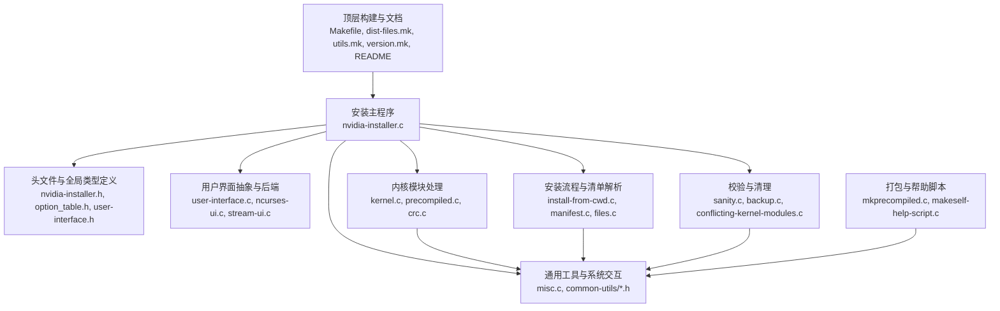
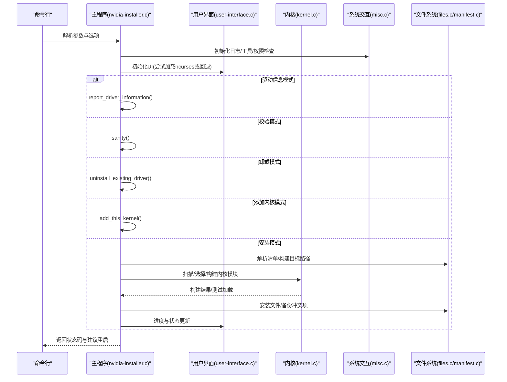
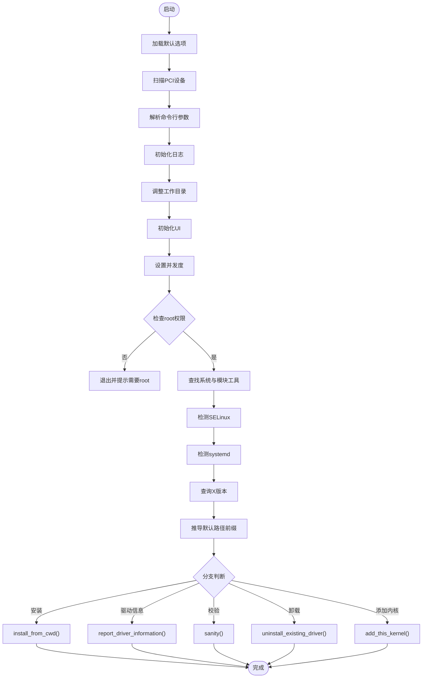
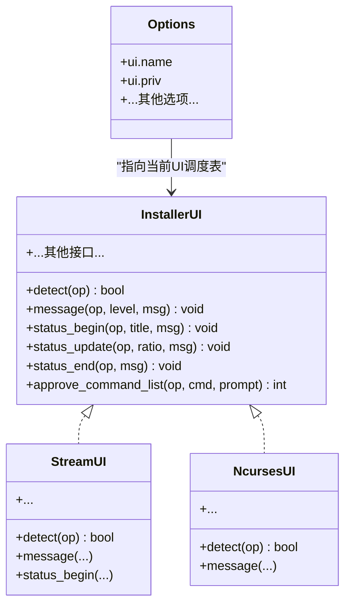
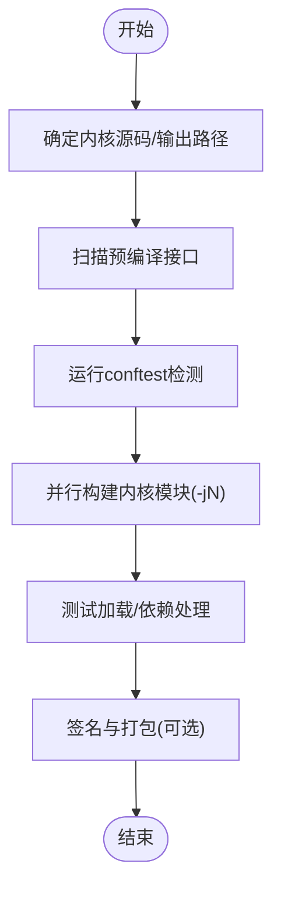
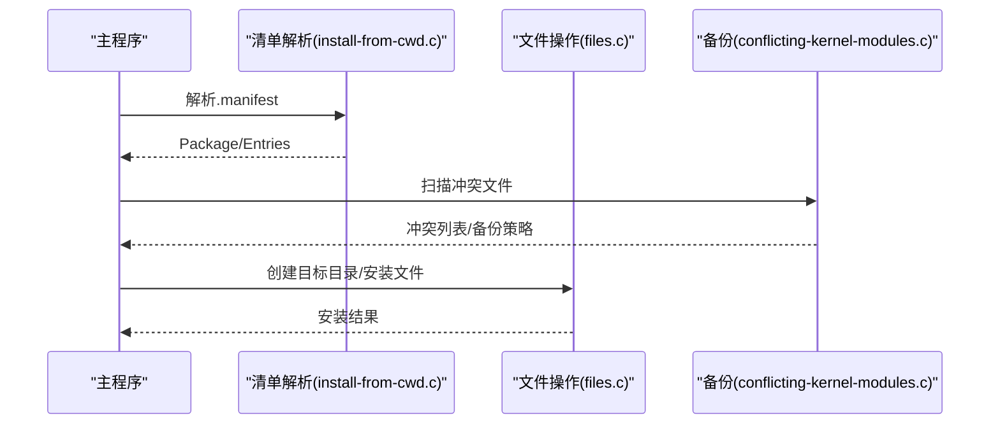
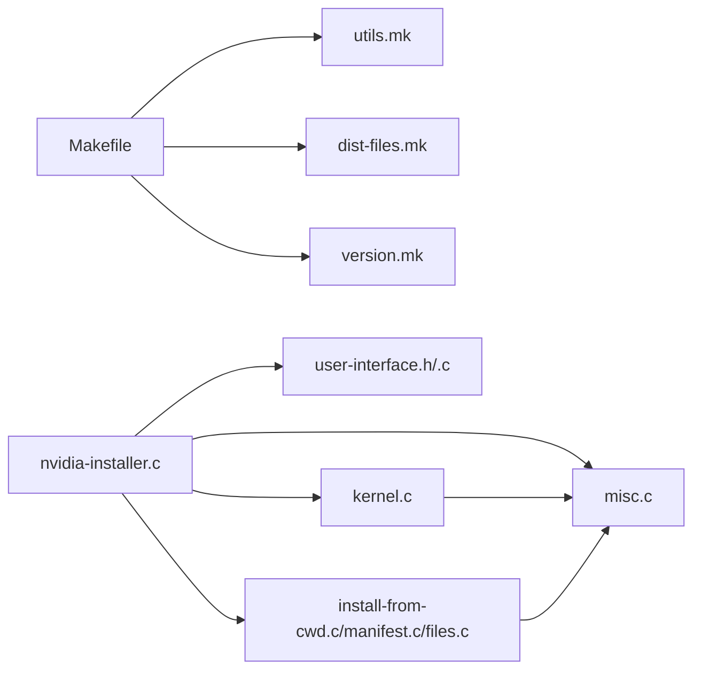

# 开发者指南

<cite>
**本文引用的文件**
- [README](file://README)
- [Makefile](file://Makefile)
- [dist-files.mk](file://dist-files.mk)
- [utils.mk](file://utils.mk)
- [version.mk](file://version.mk)
- [nvidia-installer.c](file://nvidia-installer.c)
- [nvidia-installer.h](file://nvidia-installer.h)
- [option_table.h](file://option_table.h)
- [user-interface.h](file://user-interface.h)
- [user-interface.c](file://user-interface.c)
- [kernel.c](file://kernel.c)
- [misc.c](file://misc.c)
- [sanity.c](file://sanity.c)
- [install-from-cwd.c](file://install-from-cwd.c)
- [common-utils/common-utils.h](file://common-utils/common-utils.h)
</cite>

## 目录
1. [简介](#简介)
2. [项目结构](#项目结构)
3. [核心组件](#核心组件)
4. [架构总览](#架构总览)
5. [详细组件分析](#详细组件分析)
6. [依赖分析](#依赖分析)
7. [性能考虑](#性能考虑)
8. [故障排查指南](#故障排查指南)
9. [结论](#结论)
10. [附录](#附录)

## 简介
本指南面向希望参与 nvidia-installer 项目的开发者，提供从环境搭建、构建与运行、到代码结构与模块依赖、调试与测试、扩展开发、代码审查与质量保障、常见问题与性能优化的全流程说明。项目采用纯 C 实现，通过 Makefile 组织构建，支持多用户界面后端（ncurses），并内置“流式”界面作为回退方案；同时具备内核模块构建、预编译接口匹配、系统工具检测、日志与备份等能力。

## 项目结构
项目采用“按功能域分层”的组织方式：顶层为构建入口与文档，核心源码按职责拆分为安装主流程、内核模块处理、用户界面抽象、通用工具、以及若干辅助模块。公共工具与通用函数集中于 common-utils 子目录，便于复用。

图示来源
- [Makefile:158-161](file://Makefile#L158-L161)
- [dist-files.mk:29-76](file://dist-files.mk#L29-L76)
- [nvidia-installer.c:648-762](file://nvidia-installer.c#L648-L762)

章节来源
- [Makefile:158-161](file://Makefile#L158-L161)
- [dist-files.mk:29-76](file://dist-files.mk#L29-L76)
- [README:1-134](file://README#L1-L134)

## 核心组件
- 安装主程序与命令行解析
  - 入口函数负责加载默认选项、解析命令行、初始化日志与用户界面、执行安装或卸载流程，并在完成后进行建议重启提示。
  - 命令行选项表集中定义了所有可用参数及其语义，覆盖路径前缀、内核模块构建、UI、SELinux、systemd、initramfs、并发度、兼容库安装等。
- 用户界面抽象
  - 提供统一的消息接口与进度反馈接口，支持动态加载 ncurses UI 或回退到内置“流式”UI。
- 内核模块处理
  - 负责确定内核源码与输出目录、扫描预编译接口、运行 conftest 检测、并行构建内核模块、测试加载、签名与打包等。
- 通用工具与系统交互
  - 包含系统工具检测、权限检查、路径确认、临时文件管理、设备枚举、PCI 设备扫描、SELinux 与 systemd 检测等。
- 安装流程与清单解析
  - 解析包内清单，构建目标路径映射，处理冲突文件与备份策略，执行文件安装与权限设置。
- 校验与清理
  - 提供对已安装驱动的完整性校验、冲突检测、卸载流程与清理逻辑。

章节来源
- [nvidia-installer.c:648-762](file://nvidia-installer.c#L648-L762)
- [option_table.h:126-792](file://option_table.h#L126-L792)
- [user-interface.h:36-61](file://user-interface.h#L36-L61)
- [user-interface.c:116-200](file://user-interface.c#L116-L200)
- [kernel.c:99-146](file://kernel.c#L99-L146)
- [misc.c:100-113](file://misc.c#L100-L113)
- [sanity.c:33-86](file://sanity.c#L33-L86)

## 架构总览
下图展示了 nvidia-installer 的高层控制流与模块交互：

图示来源
- [nvidia-installer.c:648-762](file://nvidia-installer.c#L648-L762)
- [user-interface.c:116-200](file://user-interface.c#L116-L200)
- [kernel.c:1006-1040](file://kernel.c#L1006-L1040)
- [install-from-cwd.c:1011-1069](file://install-from-cwd.c#L1011-L1069)

## 详细组件分析

### 主程序与命令行解析
- 控制流要点
  - 默认选项初始化、PCI 设备扫描、命令行解析、日志初始化、工作目录调整、UI 初始化、并发度设定、权限检查、系统工具与模块工具检测、X 版本查询、默认路径推导、分支执行（驱动信息/校验/卸载/添加内核/安装）。
- 关键数据结构
  - Options 结构体集中承载所有可配置项与运行时状态，涵盖路径前缀、内核模块选项、UI 选择、SELinux、systemd、initramfs、并发度、是否跳过模块加载/卸载等。
- 选项表
  - 选项表集中定义了所有命令行选项，包括高级选项与弃用选项，确保帮助文本与行为一致。

图示来源
- [nvidia-installer.c:648-762](file://nvidia-installer.c#L648-L762)
- [nvidia-installer.h:185-342](file://nvidia-installer.h#L185-L342)
- [option_table.h:126-792](file://option_table.h#L126-L792)

章节来源
- [nvidia-installer.c:648-762](file://nvidia-installer.c#L648-L762)
- [nvidia-installer.h:185-342](file://nvidia-installer.h#L185-L342)
- [option_table.h:126-792](file://option_table.h#L126-L792)

### 用户界面抽象与后端
- 抽象层
  - 通过 InstallerUI 调度表抽象 UI 行为，统一消息、进度、确认与命令审批接口。
- 后端选择
  - 支持 ncurses v5/v6 与宽字符变体，若无法加载则回退到内置“流式”UI。
- 动态加载机制
  - 将 UI 共享库以二进制数组嵌入，运行时解包并 dlopen/dlsym 获取调度表。

图示来源
- [user-interface.h:36-61](file://user-interface.h#L36-L61)
- [user-interface.c:116-200](file://user-interface.c#L116-L200)

章节来源
- [user-interface.h:36-61](file://user-interface.h#L36-L61)
- [user-interface.c:116-200](file://user-interface.c#L116-L200)

### 内核模块处理
- 关键流程
  - 确定内核源码与输出目录、扫描预编译接口、运行 conftest 检测、并行构建模块、测试加载、签名与打包。
- 并发与进度
  - 使用并发度参数控制 make -j，基于输出行数估算进度。
- 失败处理
  - 对可选模块与特定错误进行降级处理，避免阻断整体流程。

图示来源
- [kernel.c:99-146](file://kernel.c#L99-L146)
- [kernel.c:155-193](file://kernel.c#L155-L193)
- [kernel.c:1006-1040](file://kernel.c#L1006-L1040)
- [kernel.c:2422-2428](file://kernel.c#L2422-L2428)

章节来源
- [kernel.c:99-146](file://kernel.c#L99-L146)
- [kernel.c:155-193](file://kernel.c#L155-L193)
- [kernel.c:1006-1040](file://kernel.c#L1006-L1040)
- [kernel.c:2422-2428](file://kernel.c#L2422-L2428)

### 安装流程与清单解析
- 清单解析
  - 解析 .manifest 文件，构建包条目列表，处理文件类型、兼容架构、目标路径与权限。
- 冲突检测与备份
  - 在安装前扫描潜在冲突文件，按策略决定备份或直接替换。
- 文件安装
  - 创建目标目录、复制/链接文件、设置权限与符号链接。

图示来源
- [install-from-cwd.c:1011-1069](file://install-from-cwd.c#L1011-L1069)

章节来源
- [install-from-cwd.c:1011-1069](file://install-from-cwd.c#L1011-L1069)

### 校验与清理
- 校验
  - 检查已安装驱动描述与版本，验证已安装文件是否存在且未被篡改。
- 卸载
  - 卸载现有驱动，处理模块卸载、系统脚本与配置清理。

章节来源
- [sanity.c:33-86](file://sanity.c#L33-L86)

## 依赖分析
- 构建系统
  - Makefile 通过 utils.mk 提供通用编译与链接规则，dist-files.mk 维护源文件清单，version.mk 注入版本信息。
- 运行时依赖
  - ncurses（可选）、系统工具（ldconfig、grep、dmseg、objcopy、openssl、systemctl、tar 等）、内核头文件与构建工具链、SELinux 与 systemd 工具。
- 模块耦合
  - 主程序依赖 UI 抽象、内核模块处理、文件系统与通用工具；内核模块处理依赖通用工具与系统工具；安装流程依赖清单解析与文件操作。

图示来源
- [Makefile:158-161](file://Makefile#L158-L161)
- [utils.mk:406-411](file://utils.mk#L406-L411)
- [dist-files.mk:29-76](file://dist-files.mk#L29-L76)
- [version.mk:7-11](file://version.mk#L7-L11)

章节来源
- [Makefile:158-161](file://Makefile#L158-L161)
- [utils.mk:406-411](file://utils.mk#L406-L411)
- [dist-files.mk:29-76](file://dist-files.mk#L29-L76)
- [version.mk:7-11](file://version.mk#L7-L11)

## 性能考虑
- 并发构建
  - 通过并发度参数控制内核模块构建的并行度，合理设置可显著缩短构建时间；过大可能导致资源争用。
- I/O 与磁盘
  - 安装过程涉及大量文件写入与权限变更，建议在有足够磁盘空间与权限的前提下进行；必要时使用独立分区。
- UI 与日志
  - 在非交互模式下关闭 UI 可减少开销；日志级别应按需调整，避免过多冗余输出。
- 预编译接口
  - 优先使用预编译接口可避免内核模块编译，提高安装效率；若失败再回退到源码编译。

## 故障排查指南
- 权限不足
  - 确保以 root 身份运行；主程序会检查有效 UID。
- 缺少系统工具
  - 系统工具与模块工具检测失败会导致安装中断；请安装缺失的工具或通过选项指定路径。
- 内核源码/头文件缺失
  - 构建内核模块需要正确的内核源码与头文件；可通过选项指定源码与输出路径。
- X 服务器运行
  - 默认情况下若检测到 X 服务器运行会中止安装；可通过选项禁用该检查。
- SELinux 与 systemd
  - 若启用 SELinux 或 systemd，需确保相关工具可用；必要时手动设置上下文或单元文件路径。
- 日志定位
  - 默认日志文件位于系统日志目录；可通过选项指定日志文件名。

章节来源
- [misc.c:100-113](file://misc.c#L100-L113)
- [misc.c:796-827](file://misc.c#L796-L827)
- [kernel.c:198-203](file://kernel.c#L198-L203)
- [nvidia-installer.c:710-712](file://nvidia-installer.c#L710-L712)

## 结论
nvidia-installer 以清晰的模块化设计实现了驱动安装、内核模块构建、UI 抽象与系统工具检测等功能。通过统一的命令行选项表与 Options 结构体，项目在可扩展性与一致性方面表现良好。建议在开发过程中遵循既有构建与编码约定，充分利用 UI 抽象与通用工具模块，确保新增功能与现有流程无缝衔接。

## 附录

### 开发环境设置与构建
- 必需依赖
  - ncurses、pciutils、make、gcc、内核头文件与构建工具链、objcopy、openssl、systemctl、tar 等。
- 获取与构建
  - 使用顶层 Makefile 进行构建，默认输出至 _out/OS_ARCH 目录；可设置 PREFIX/BINDIR/LIBDIR/MANDIR 等安装路径。
- 调试与开发模式
  - 可通过 DEBUG/DEVELOP 变量开启调试或开发构建；DEBUG 构建包含调试符号，DEVELOP 构建包含额外诊断信息。

章节来源
- [README:20-26](file://README#L20-L26)
- [Makefile:158-161](file://Makefile#L158-L161)
- [utils.mk:77-90](file://utils.mk#L77-L90)

### 代码贡献规范与提交流程
- 分支与提交
  - 建议基于主干创建特性分支，提交信息清晰描述变更目的与影响范围。
- 代码风格
  - 遵循现有缩进与注释风格；保持函数短小、职责单一；为复杂逻辑添加注释说明。
- 测试与验证
  - 在本地验证安装/卸载/校验流程；如涉及内核模块，确保在受控环境中进行测试。
- 文档更新
  - 新增选项或行为变更时，同步更新帮助文本与 README 中的相关说明。

### 扩展开发指南
- 新增用户界面后端
  - 实现 InstallerUI 调度表接口，注册到 UI 列表中；确保 detect() 能正确识别运行环境。
- 新增命令行选项
  - 在选项表中添加新选项定义与帮助文本；在主程序中处理新选项并更新 Options 结构体。
- 新增内核模块类型或构建逻辑
  - 在内核模块处理模块中扩展类型识别与构建流程；确保与现有并发与进度机制兼容。
- 修改现有模块
  - 保持对外接口稳定；对内部重构应尽量最小化影响面；充分测试回归。

### 代码审查与质量保证
- 审查要点
  - 代码可读性、边界条件处理、错误路径与日志记录、并发安全、资源释放与权限检查。
- 质量工具
  - 使用静态分析与格式化工具；在 CI 中加入构建与基本测试步骤（如 sanity 检查）。

### 常见问题与性能优化技巧
- 常见问题
  - “找不到内核源码”：通过 --kernel-source-path 指定；或安装对应发行版的 kernel-devel 包。
  - “X 服务器运行导致中止”：使用 --no-x-check 或先停止 X 服务。
  - “SELinux 上下文异常”：使用 --force-selinux 或 --selinux-chcon-type 指定策略。
- 性能优化
  - 合理设置并发度；优先使用预编译接口；避免不必要的文件扫描与权限变更；在批量安装场景中合并操作。