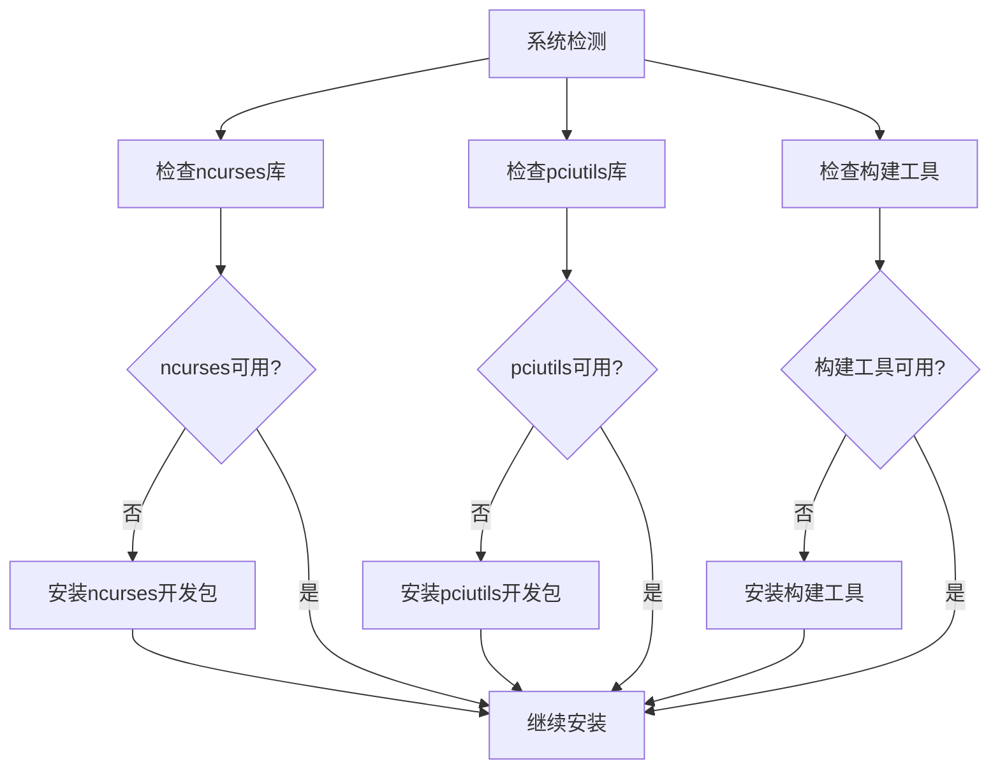
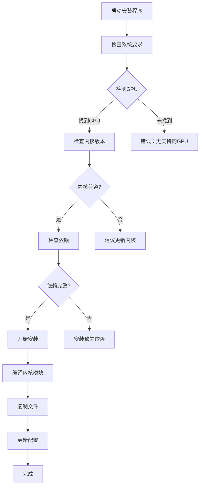
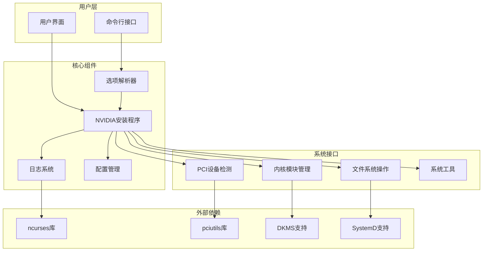
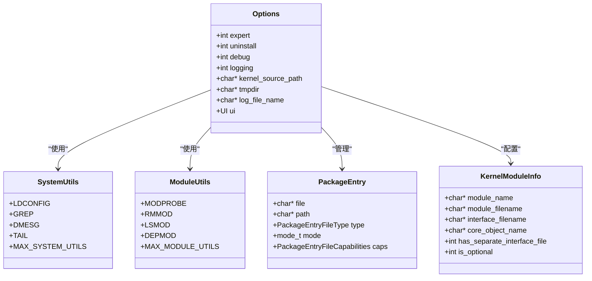

# 快速开始

<cite>
**本文档引用的文件**
- [README](file://README)
- [Makefile](file://Makefile)
- [nvidia-installer.c](file://nvidia-installer.c)
- [option_table.h](file://option_table.h)
- [nvidia-installer.h](file://nvidia-installer.h)
- [common-utils/common-utils.h](file://common-utils/common-utils.h)
- [common-utils/nvgetopt.h](file://common-utils/nvgetopt.h)
- [common-utils/nvpci-utils.h](file://common-utils/nvpci-utils.h)
- [dist-files.mk](file://dist-files.mk)
- [utils.mk](file://utils.mk)
- [version.mk](file://version.mk)
</cite>

## 目录
1. [简介](#简介)
2. [系统要求与依赖项](#系统要求与依赖项)
3. [编译与安装步骤](#编译与安装步骤)
4. [基本使用示例](#基本使用示例)
5. [常见安装场景](#常见安装场景)
6. [验证安装](#验证安装)
7. [故障排除](#故障排除)
8. [架构概览](#架构概览)
9. [性能考虑](#性能考虑)
10. [结论](#结论)

## 简介

NVIDIA安装程序是一个用于在Unix和Linux系统上安装NVIDIA软件包的工具。它提供了图形界面和命令行界面两种安装方式，支持多种Linux发行版和内核版本。该工具能够自动检测系统环境、处理依赖关系，并提供灵活的配置选项以适应不同的安装需求。

## 系统要求与依赖项

### 硬件要求
- 支持的NVIDIA GPU设备
- 兼容的Linux内核版本（通常为较新的内核版本）
- 足够的磁盘空间用于驱动程序安装

### 软件依赖项

根据项目文档，NVIDIA安装程序的主要构建依赖包括：

#### 核心依赖
- **ncurses**: 用于提供文本用户界面支持
- **pciutils**: 用于PCI设备检测和管理

#### 构建工具
- GCC编译器套件
- Make构建系统
- GNU m4宏处理器
- pkg-config工具

#### 可选依赖
- DKMS (Dynamic Kernel Module Support): 用于动态内核模块支持
- systemd: 现代Linux系统的初始化系统
- SELinux: 安全增强Linux支持

### 发行版特定要求

不同Linux发行版可能需要额外的开发包：



**图表来源**
- [README:20-25](file://README#L20-L25)
- [Makefile:38-46](file://Makefile#L38-L46)

**章节来源**
- [README:20-25](file://README#L20-L25)
- [Makefile:38-46](file://Makefile#L38-L46)

## 编译与安装步骤

### 步骤1：准备构建环境

1. **安装必要的开发工具**
   ```bash
   # Ubuntu/Debian
   sudo apt-get update
   sudo apt-get install build-essential make gcc g++ m4 pkg-config
   
   # CentOS/RHEL/Fedora
   sudo yum groupinstall "Development Tools"
   sudo yum install make gcc gcc-c++ m4 pkg-config
   
   # Arch Linux
   sudo pacman -S base-devel make gcc m4 pkg-config
   ```

2. **安装ncurses和pciutils开发包**
   ```bash
   # Ubuntu/Debian
   sudo apt-get install libncurses-dev pciutils-dev
   
   # CentOS/RHEL/Fedora
   sudo yum install ncurses-devel pciutils-devel
   
   # Arch Linux
   sudo pacman -S ncurses pciutils
   ```

### 步骤2：获取源码

```bash
# 克隆源码仓库
git clone https://github.com/NVIDIA/nvidia-installer.git
cd nvidia-installer

# 或者下载源码包
wget https://github.com/NVIDIA/nvidia-installer/archive/master.zip
unzip master.zip
cd nvidia-installer-master
```

### 步骤3：配置构建选项

查看可用的构建选项：
```bash
make help
```

配置ncurses支持（如果需要特定版本）：
```bash
# 指定ncurses6支持
export NCURSES6_CFLAGS="-I/usr/include/ncursesw6"
export NCURSES6_LDFLAGS="-L/usr/lib64 -lncursesw6"

# 或指定ncursesw6支持
export NCURSESW6_CFLAGS="-I/usr/include/ncursesw6"
export NCURSESW6_LDFLAGS="-L/usr/lib64 -lncursesw6"
```

### 步骤4：编译安装程序

```bash
# 基本编译
make

# 清理并重新编译
make clean
make

# 安装到系统
sudo make install

# 自定义安装路径
make PREFIX=/usr/local install
```

### 步骤5：验证编译结果

```bash
# 检查生成的可执行文件
ls -la _out/*/nvidia-installer
ls -la _out/*/mkprecompiled

# 查看帮助信息
./_out/*/nvidia-installer --help
```

**章节来源**
- [Makefile:158-160](file://Makefile#L158-L160)
- [Makefile:162-164](file://Makefile#L162-L164)
- [dist-files.mk:29-46](file://dist-files.mk#L29-L46)

## 基本使用示例

### 基本安装命令

```bash
# 显示版本信息
sudo ./nvidia-installer --version

# 显示基本帮助
sudo ./nvidia-installer --help

# 显示高级选项
sudo ./nvidia-installer --advanced-options

# 静默安装（无交互）
sudo ./nvidia-installer --silent

# 专家模式安装
sudo ./nvidia-installer --expert
```

### 常用选项组合

```bash
# 安装时跳过X服务器检查
sudo ./nvidia-installer --no-x-check

# 安装时禁用nouveau驱动检查
sudo ./nvidia-installer --no-nouveau-check

# 指定内核源码路径
sudo ./nvidia-installer --kernel-source-path /lib/modules/$(uname -r)/build

# 指定安装前缀
sudo ./nvidia-installer --utility-prefix /usr/local

# 指定日志文件
sudo ./nvidia-installer --log-file-name /var/log/nvidia-install.log
```

### 高级安装场景

```bash
# 安装内核模块仅（不卸载现有驱动）
sudo ./nvidia-installer --kernel-modules-only

# 添加当前内核支持
sudo ./nvidia-installer --add-this-kernel

# 执行完整性检查
sudo ./nvidia-installer --sanity

# 卸载现有驱动
sudo ./nvidia-installer --uninstall
```

**章节来源**
- [nvidia-installer.c:225-640](file://nvidia-installer.c#L225-L640)
- [option_table.h:126-789](file://option_table.h#L126-L789)

## 常见安装场景

### 场景1：标准驱动安装



**图表来源**
- [nvidia-installer.c:648-761](file://nvidia-installer.c#L648-L761)

### 场景2：静默安装

```bash
# 创建静默安装脚本
#!/bin/bash
echo "开始静默安装NVIDIA驱动..."
sudo ./nvidia-installer --silent --no-questions --ui=none
echo "安装完成，请重启系统"
```

### 场景3：内核模块单独安装

```bash
# 为特定内核版本安装模块
sudo ./nvidia-installer --kernel-modules-only --kernel-name 5.15.0-7620-generic

# 为多个内核安装模块
for kernel in $(ls /lib/modules/); do
    sudo ./nvidia-installer --kernel-modules-only --kernel-name $kernel
done
```

### 场景4：开发环境安装

```bash
# 安装内核模块源码
sudo ./nvidia-installer --kernel-module-source-dir nvidia-$(cat version.mk | cut -d= -f2)

# 启用DKMS支持
sudo ./nvidia-installer --dkms

# 指定自定义安装路径
sudo ./nvidia-installer --utility-prefix /opt/nvidia --kernel-install-path /usr/lib/modules/$(uname -r)/custom
```

**章节来源**
- [nvidia-installer.c:724-747](file://nvidia-installer.c#L724-L747)

## 验证安装

### 验证步骤

1. **检查内核模块加载**
   ```bash
   # 检查NVIDIA模块是否加载
   lsmod | grep nvidia
   
   # 检查模块详情
   modinfo nvidia
   
   # 检查内核消息
   dmesg | grep -i nvidia
   ```

2. **检查驱动版本**
   ```bash
   # 使用nvidia-smi（如果已安装）
   nvidia-smi
   
   # 检查驱动版本文件
   cat /proc/driver/nvidia/version
   
   # 检查模块版本
   cat /sys/module/nvidia/version
   ```

3. **图形功能测试**
   ```bash
   # 运行OpenGL测试
   glxinfo | grep "OpenGL renderer string"
   
   # 检查CUDA（如果适用）
   nvidia-smi -q | grep "Compute Capability"
   ```

4. **系统日志检查**
   ```bash
   # 检查安装日志
   cat /var/log/nvidia-installer.log
   
   # 检查系统日志
   journalctl | grep -i nvidia
   ```

### 验证脚本

```bash
#!/bin/bash
# NVIDIA安装验证脚本

echo "=== NVIDIA安装验证 ==="

# 检查内核模块
echo "1. 检查内核模块..."
if lsmod | grep -q nvidia; then
    echo "✓ NVIDIA模块已加载"
else
    echo "✗ NVIDIA模块未加载"
fi

# 检查驱动版本
echo "2. 检查驱动版本..."
if [ -f /proc/driver/nvidia/version ]; then
    echo "✓ 驱动版本: $(head -n 1 /proc/driver/nvidia/version)"
else
    echo "✗ 无法获取驱动版本"
fi

# 检查OpenGL支持
echo "3. 检查OpenGL支持..."
if glxinfo > /dev/null 2>&1; then
    echo "✓ OpenGL功能正常"
    glxinfo | grep "OpenGL renderer string" | head -1
else
    echo "✗ OpenGL功能异常"
fi

echo "=== 验证完成 ==="
```

**章节来源**
- [nvidia-installer.c:720-722](file://nvidia-installer.c#L720-L722)

## 故障排除

### 常见问题及解决方案

#### 问题1：ncurses库缺失
**症状**: 编译时报错找不到ncurses头文件
**解决方案**:
```bash
# Ubuntu/Debian
sudo apt-get install libncurses-dev

# CentOS/RHEL/Fedora  
sudo yum install ncurses-devel

# Arch Linux
sudo pacman -S ncurses
```

#### 问题2：pciutils库缺失
**症状**: 运行时提示无法找到PCI设备
**解决方案**:
```bash
# Ubuntu/Debian
sudo apt-get install pciutils-dev

# CentOS/RHEL/Fedora
sudo yum install pciutils-devel

# Arch Linux
sudo pacman -S pciutils
```

#### 问题3：内核头文件不匹配
**症状**: 内核模块编译失败
**解决方案**:
```bash
# 安装正确的内核头文件
sudo apt-get install linux-headers-$(uname -r)

# 或指定内核源码路径
sudo ./nvidia-installer --kernel-source-path /lib/modules/$(uname -r)/build
```

#### 问题4：权限不足
**症状**: 安装过程中出现权限错误
**解决方案**:
```bash
# 确保以root权限运行
sudo ./nvidia-installer

# 或使用sudo权限
sudo su -
./nvidia-installer
```

#### 问题5：X服务器冲突
**症状**: 安装过程中X服务器阻止操作
**解决方案**:
```bash
# 跳过X服务器检查
sudo ./nvidia-installer --no-x-check

# 或停止X服务器
sudo service lightdm stop
# 或
sudo systemctl stop display-manager
```

### 调试模式

启用调试输出：
```bash
# 启用详细日志
sudo ./nvidia-installer --debug

# 输出到指定文件
sudo ./nvidia-installer --log-file-name /tmp/nvidia-install.log

# 显示所有选项
sudo ./nvidia-installer --advanced-options
```

### 日志分析

```bash
# 查看安装日志
tail -f /var/log/nvidia-installer.log

# 分析错误信息
grep -i "error\|fail\|exception" /var/log/nvidia-installer.log

# 检查系统日志
journalctl -u nvidia-installer -f
```

### 回滚安装

```bash
# 卸载驱动
sudo ./nvidia-installer --uninstall

# 或使用卸载程序
sudo nvidia-uninstall

# 清理残留文件
sudo rm -rf /usr/lib/nvidia*
sudo rm -rf /usr/bin/nvidia*
```

**章节来源**
- [nvidia-installer.c:694-696](file://nvidia-installer.c#L694-L696)
- [nvidia-installer.c:732-735](file://nvidia-installer.c#L732-L735)

## 架构概览

### 系统架构图



**图表来源**
- [nvidia-installer.c:24-47](file://nvidia-installer.c#L24-L47)
- [nvidia-installer.h:37-95](file://nvidia-installer.h#L37-L95)

### 组件关系图



**图表来源**
- [nvidia-installer.h:185-342](file://nvidia-installer.h#L185-L342)
- [nvidia-installer.h:444-454](file://nvidia-installer.h#L444-L454)

**章节来源**
- [nvidia-installer.c:648-761](file://nvidia-installer.c#L648-L761)
- [nvidia-installer.h:185-342](file://nvidia-installer.h#L185-L342)

## 性能考虑

### 编译优化

1. **并行编译**
   ```bash
   # 使用多核编译
   make -j$(nproc)
   
   # 限制并发数
   make -j8
   ```

2. **优化标志**
   ```bash
   # 启用调试信息
   make DEBUG=1
   
   # 开发模式
   make DEVELOP=1
   
   # 优化编译
   make CFLAGS="-O3 -DNDEBUG"
   ```

### 运行时性能

1. **内核模块编译优化**
   - 使用适当的并发级别 (`--concurrency-level`)
   - 确保足够的内存用于编译
   - 避免同时运行其他大型编译任务

2. **文件系统性能**
   - 在SSD上进行安装
   - 确保有足够的磁盘空间
   - 避免在安装过程中进行大量磁盘I/O操作

### 内存使用

```bash
# 检查内存使用情况
free -h

# 监控安装过程中的内存使用
watch -n 1 free -h
```

## 结论

NVIDIA安装程序提供了一个强大而灵活的工具来管理NVIDIA驱动程序的安装和维护。通过遵循本文档的步骤，用户可以成功地在各种Linux发行版上安装和配置NVIDIA驱动程序。

关键要点：
- 确保满足所有系统要求和依赖项
- 使用适当的选项组合以适应特定的安装需求
- 始终验证安装结果并监控系统状态
- 准备好故障排除方案以应对常见问题

对于新用户，建议从标准安装开始，逐步探索高级选项。对于有经验的用户，可以利用静默安装和自动化脚本来简化部署流程。