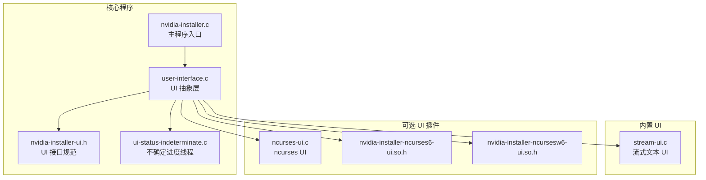
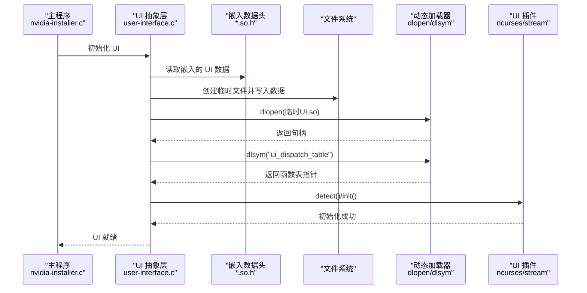
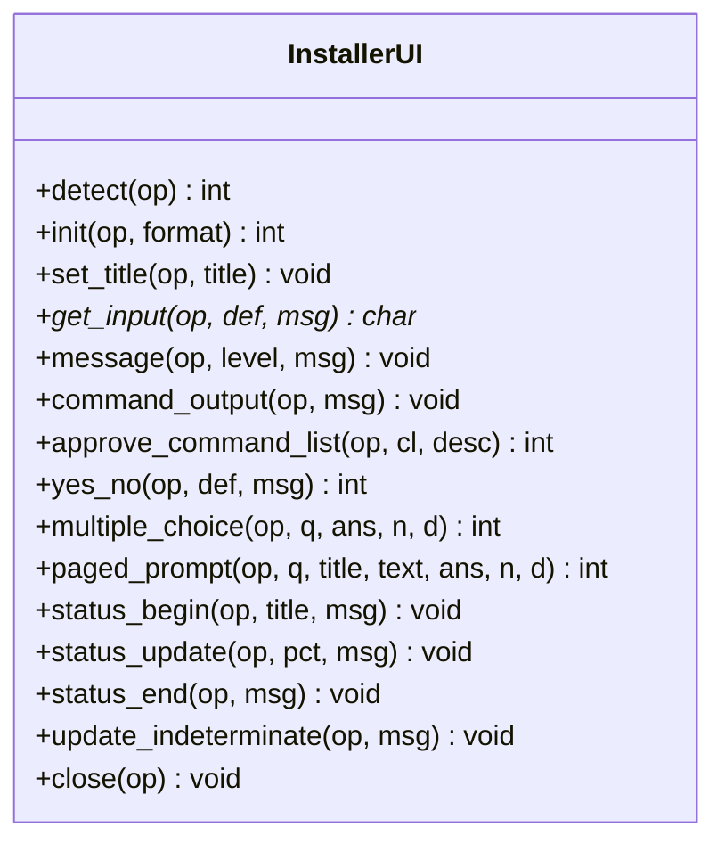
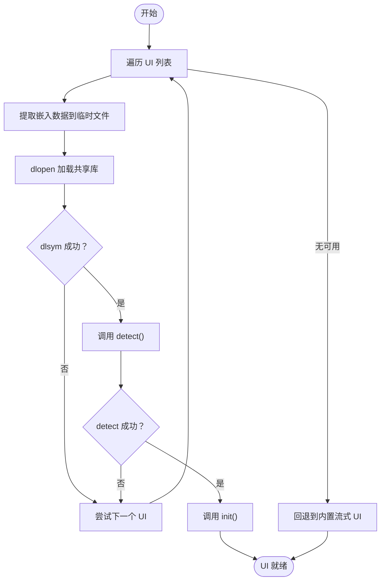
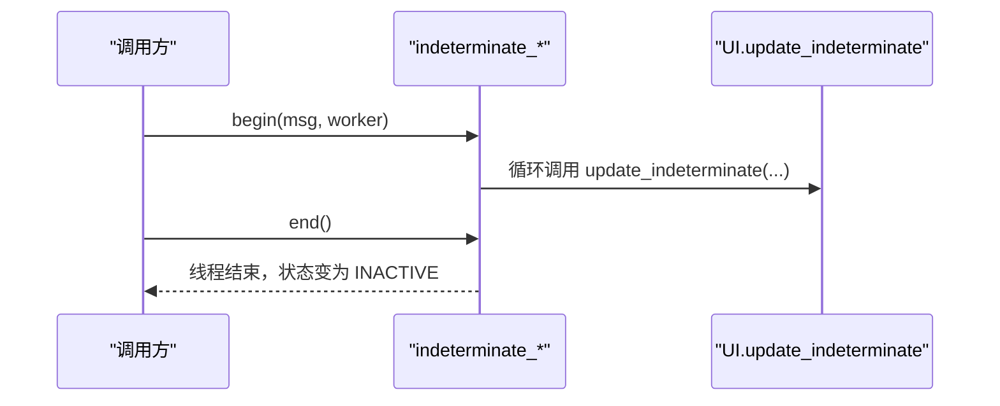
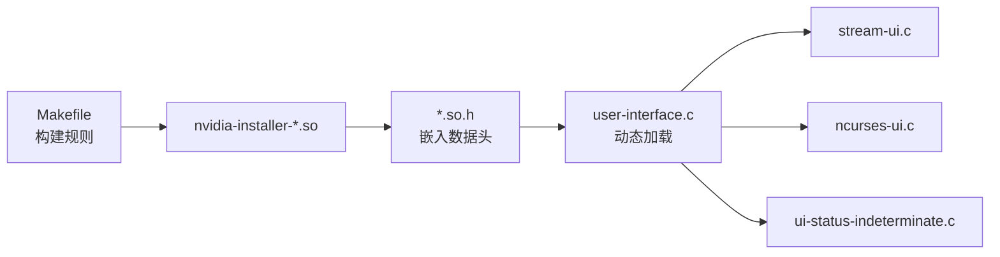

# 扩展和插件开发

<cite>
**本文档引用的文件**
- [nvidia-installer.h](file://nvidia-installer.h)
- [nvidia-installer-ui.h](file://nvidia-installer-ui.h)
- [user-interface.h](file://user-interface.h)
- [user-interface.c](file://user-interface.c)
- [nvidia-installer-ui.so.h](file://nvidia-installer-ui.so.h)
- [nvidia-installer-ncurses-ui.so.h](file://nvidia-installer-ncurses-ui.so.h)
- [nvidia-installer-ncurses6-ui.so.h](file://nvidia-installer-ncurses6-ui.so.h)
- [nvidia-installer-ncursesw6-ui.so.h](file://nvidia-installer-ncursesw6-ui.so.h)
- [ncurses-ui.c](file://ncurses-ui.c)
- [stream-ui.c](file://stream-ui.c)
- [ui-status-indeterminate.c](file://ui-status-indeterminate.c)
- [ui-status-indeterminate.h](file://ui-status-indeterminate.h)
- [Makefile](file://Makefile)
- [nvidia-installer.c](file://nvidia-installer.c)
</cite>

## 目录
1. [简介](#简介)
2. [项目结构](#项目结构)
3. [核心组件](#核心组件)
4. [架构总览](#架构总览)
5. [详细组件分析](#详细组件分析)
6. [依赖关系分析](#依赖关系分析)
7. [性能考量](#性能考量)
8. [故障排除指南](#故障排除指南)
9. [结论](#结论)
10. [附录](#附录)

## 简介
本指南面向希望为 NVIDIA 安装器开发扩展与插件的开发者，重点围绕“用户界面插件”（UI 插件）的开发机制与接口规范展开。文档解释了插件架构的设计原理、实现细节与最佳实践，并提供从简单功能扩展到复杂模块集成的完整开发步骤。同时涵盖插件的打包、分发与版本管理方法，以及第三方集成的安全注意事项与社区贡献流程。

## 项目结构
该项目采用“核心程序 + 可插拔 UI 模块”的架构设计。核心程序负责安装逻辑与系统交互，UI 插件通过共享库形式提供不同风格的用户界面（如 ncurses、流式文本等），并在运行时动态加载与初始化。

**图表来源**
- [nvidia-installer.c:1-200](file://nvidia-installer.c#L1-L200)
- [user-interface.c:109-239](file://user-interface.c#L109-L239)
- [nvidia-installer-ui.h:39-176](file://nvidia-installer-ui.h#L39-L176)
- [stream-ui.c:59-75](file://stream-ui.c#L59-L75)
- [ncurses-ui.c:244-261](file://ncurses-ui.c#L244-L261)
- [ui-status-indeterminate.c:22-126](file://ui-status-indeterminate.c#L22-L126)

**章节来源**
- [nvidia-installer.c:1-200](file://nvidia-installer.c#L1-L200)
- [user-interface.c:109-239](file://user-interface.c#L109-L239)
- [Makefile:61-77](file://Makefile#L61-L77)

## 核心组件
- UI 接口规范：定义统一的 UI 调用接口（检测、初始化、消息、命令输出、确认、状态显示等），确保不同 UI 实现的一致行为。
- UI 抽象层：负责在运行时选择并加载合适的 UI 插件，回退到内置 UI，处理信号与资源清理。
- 内置 UI：始终可用的流式文本 UI，保证在任何环境下都能正常工作。
- 可选 UI 插件：以共享库形式提供的 UI 实现，支持 ncurses 及其变体，通过二进制嵌入与动态加载机制提供。
- 不确定进度线程：用于在 UI 中显示“未知进度”的动画指示，使用独立线程与互斥锁控制状态。

**章节来源**
- [nvidia-installer-ui.h:39-176](file://nvidia-installer-ui.h#L39-L176)
- [user-interface.c:109-239](file://user-interface.c#L109-L239)
- [stream-ui.c:59-75](file://stream-ui.c#L59-L75)
- [ncurses-ui.c:244-261](file://ncurses-ui.c#L244-L261)
- [ui-status-indeterminate.c:22-126](file://ui-status-indeterminate.c#L22-L126)

## 架构总览
下图展示了 UI 插件的加载与调用流程，包括二进制内嵌 UI 数据、临时提取、动态加载、函数表绑定与初始化过程。

**图表来源**
- [user-interface.c:109-239](file://user-interface.c#L109-L239)
- [user-interface.c:683-754](file://user-interface.c#L683-L754)
- [nvidia-installer-ncurses-ui.so.h](file://nvidia-installer-ncurses-ui.so.h)
- [nvidia-installer-ncurses6-ui.so.h](file://nvidia-installer-ncurses6-ui.so.h)
- [nvidia-installer-ncursesw6-ui.so.h](file://nvidia-installer-ncursesw6-ui.so.h)

## 详细组件分析

### UI 接口规范（InstallerUI）
UI 插件必须实现一个统一的函数表（InstallerUI），包含以下能力：
- 检测环境是否可用（detect）
- 初始化与标题设置（init/set_title）
- 用户输入与消息展示（get_input/message）
- 命令输出展示（command_output）
- 专家模式命令列表确认（approve_command_list）
- 问答与多选（yes_no/multiple_choice/paged_prompt）
- 进度条与不确定进度（status_begin/status_update/status_end/update_indeterminate）
- 关闭与清理（close）

**图表来源**
- [nvidia-installer-ui.h:39-176](file://nvidia-installer-ui.h#L39-L176)

**章节来源**
- [nvidia-installer-ui.h:39-176](file://nvidia-installer-ui.h#L39-L176)

### UI 抽象层（动态加载与回退）
UI 抽象层负责：
- 遍历可选 UI 列表（ncurses 变体）
- 从嵌入数据中提取 UI 共享库到临时文件
- 使用 dlopen/dlsym 绑定函数表
- 调用 detect/init 并进行错误处理
- 回退到内置流式 UI
- 处理信号与资源清理

**图表来源**
- [user-interface.c:109-239](file://user-interface.c#L109-L239)
- [user-interface.c:683-754](file://user-interface.c#L683-L754)

**章节来源**
- [user-interface.c:109-239](file://user-interface.c#L109-L239)
- [user-interface.c:683-754](file://user-interface.c#L683-L754)

### 流式 UI（内置）
流式 UI 是始终可用的默认实现，提供基本的消息、输入、进度与命令输出展示。它不依赖外部图形库，适合无终端或受限环境。

- 特性：始终可用、最小依赖、兼容性好
- 适用场景：服务器环境、容器、无人值守安装

**章节来源**
- [stream-ui.c:59-75](file://stream-ui.c#L59-L75)
- [stream-ui.c:162-194](file://stream-ui.c#L162-L194)
- [stream-ui.c:243-272](file://stream-ui.c#L243-L272)

### ncurses UI（可选插件）
ncurses UI 提供更友好的交互体验，支持颜色、窗口区域、滚动页等特性。作为共享库实现，可通过条件编译与嵌入头文件参与构建。

- 特性：图形化界面、颜色支持、分页提示
- 适用场景：桌面环境、交互式安装

**章节来源**
- [ncurses-ui.c:244-261](file://ncurses-ui.c#L244-L261)
- [ncurses-ui.c:281-301](file://ncurses-ui.c#L281-L301)
- [ncurses-ui.c:310-374](file://ncurses-ui.c#L310-L374)

### 不确定进度线程
不确定进度用于无法预知完成百分比的任务，UI 侧通过独立线程循环调用 update_indeterminate 显示动画。

**图表来源**
- [ui-status-indeterminate.c:93-125](file://ui-status-indeterminate.c#L93-L125)
- [user-interface.c:580-593](file://user-interface.c#L580-L593)

**章节来源**
- [ui-status-indeterminate.c:22-126](file://ui-status-indeterminate.c#L22-L126)
- [ui-status-indeterminate.h:31-48](file://ui-status-indeterminate.h#L31-L48)
- [user-interface.c:580-626](file://user-interface.c#L580-L626)

## 依赖关系分析
- 构建期依赖：Makefile 定义了 ncurses UI 的目标产物与生成头文件，支持 ncurses6 与宽字符变体。
- 运行期依赖：UI 抽象层通过 dlopen 动态加载 UI 共享库；若失败则回退到内置流式 UI。
- 线程与同步：不确定进度使用互斥锁保护状态，避免竞态。

**图表来源**
- [Makefile:61-77](file://Makefile#L61-L77)
- [user-interface.c:109-239](file://user-interface.c#L109-L239)
- [ui-status-indeterminate.c:22-126](file://ui-status-indeterminate.c#L22-L126)

**章节来源**
- [Makefile:61-77](file://Makefile#L61-L77)
- [user-interface.c:109-239](file://user-interface.c#L109-L239)

## 性能考量
- UI 插件以共享库形式存在，避免与核心程序耦合，减少核心程序体积与潜在依赖风险。
- 通过二进制内嵌 UI 数据，避免外部文件依赖，提升部署可靠性。
- 不确定进度使用独立线程与互斥锁，避免阻塞主线程；注意在 UI 层合理调用 update_indeterminate，避免过度频繁的刷新。
- 流式 UI 在无终端或受限环境中表现稳定，但交互能力有限；ncurses UI 在桌面环境提供更好的用户体验。

[本节为通用性能建议，无需特定文件引用]

## 故障排除指南
- UI 无法加载或初始化失败
  - 检查嵌入数据是否正确生成与链接
  - 确认 dlopen/dlsym 是否返回有效指针
  - 查看日志输出，定位具体失败阶段
- 终端尺寸过小导致 ncurses UI 无法启用
  - ncurses UI 会在尺寸不足时自动回退到流式 UI
- 信号中断导致 UI 异常退出
  - UI 抽象层已注册信号处理器，调用 ui_close 清理资源
- 不确定进度不更新
  - 确认在 ui_indeterminate_begin/end 之间正确调用 update_indeterminate

**章节来源**
- [user-interface.c:109-239](file://user-interface.c#L109-L239)
- [user-interface.c:763-821](file://user-interface.c#L763-L821)
- [ncurses-ui.c:281-301](file://ncurses-ui.c#L281-L301)

## 结论
该插件架构通过“统一接口 + 动态加载 + 内置回退”的设计，在保证核心程序稳定性的同时，提供了高度可扩展的 UI 能力。开发者可以基于 InstallerUI 接口快速实现新的 UI 插件，并通过二进制内嵌与动态加载机制实现便捷的打包与分发。对于复杂模块集成，建议遵循现有接口规范与线程模型，确保与核心程序的兼容性与安全性。

[本节为总结性内容，无需特定文件引用]

## 附录

### 开发步骤与最佳实践
- 设计阶段
  - 明确 UI 功能边界，对照 InstallerUI 接口逐项实现
  - 规划 UI 初始化与关闭流程，确保资源释放
- 实现阶段
  - 编写 UI 函数表（InstallerUI），确保所有函数均实现
  - 在 UI 初始化中检测环境（detect），必要时优雅降级
  - 使用不确定进度线程处理长时间任务，避免阻塞
- 集成阶段
  - 将 UI 编译为共享库，并生成嵌入数据头文件
  - 在 Makefile 中加入构建规则与产物依赖
  - 在 UI 抽象层中注册 UI 列表，确保加载顺序与回退策略
- 测试与验证
  - 在不同终端与权限环境下测试 UI 行为
  - 验证信号处理与异常路径下的资源清理
  - 对比内置流式 UI 与新 UI 的一致性

**章节来源**
- [nvidia-installer-ui.h:39-176](file://nvidia-installer-ui.h#L39-L176)
- [ncurses-ui.c:244-261](file://ncurses-ui.c#L244-L261)
- [stream-ui.c:59-75](file://stream-ui.c#L59-L75)
- [Makefile:61-77](file://Makefile#L61-L77)

### 打包、分发与版本管理
- 打包
  - 将 UI 共享库与嵌入数据头文件一并编译进安装器二进制
  - 使用 Makefile 的构建规则生成目标产物
- 分发
  - 单文件安装器包含所需 UI 插件，无需额外安装
  - 支持多变体（ncurses6、ncursesw6）按需构建
- 版本管理
  - 通过 CFLAGS 宏控制编译开关（如 NV_INSTALLER_NCURSES6）
  - 保持 UI 接口向后兼容，避免破坏性变更

**章节来源**
- [Makefile:117-118](file://Makefile#L117-L118)
- [Makefile:61-77](file://Makefile#L61-L77)

### 第三方集成与安全考虑
- 第三方 UI 集成
  - 严格遵循 InstallerUI 接口，避免直接依赖核心内部结构
  - 使用 dlopen/dlsym 动态绑定，降低耦合度
- 安全性
  - 仅加载可信来源的 UI 共享库
  - 注意临时文件权限与清理，防止信息泄露
  - 在信号处理中确保 UI 正确关闭，避免僵尸进程

**章节来源**
- [user-interface.c:109-239](file://user-interface.c#L109-L239)
- [user-interface.c:683-754](file://user-interface.c#L683-L754)

### 社区贡献流程与代码规范
- 提交流程
  - Fork 仓库并创建功能分支
  - 遵循现有代码风格与命名约定
  - 提供最小可复现的测试用例
- 代码规范
  - 保持 UI 接口一致，避免破坏性变更
  - 注释清晰，文档齐全
  - 通过构建与测试检查

[本节为通用流程与规范说明，无需特定文件引用]