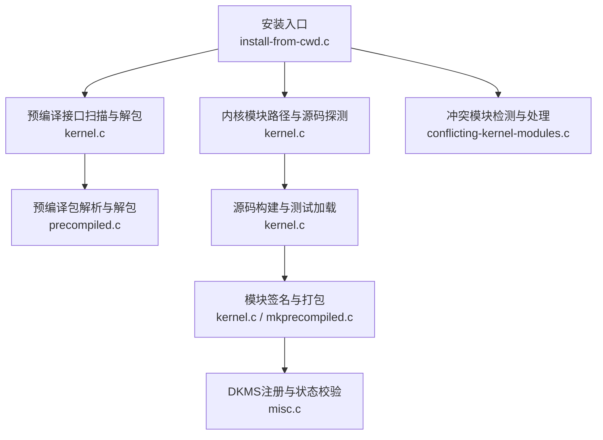
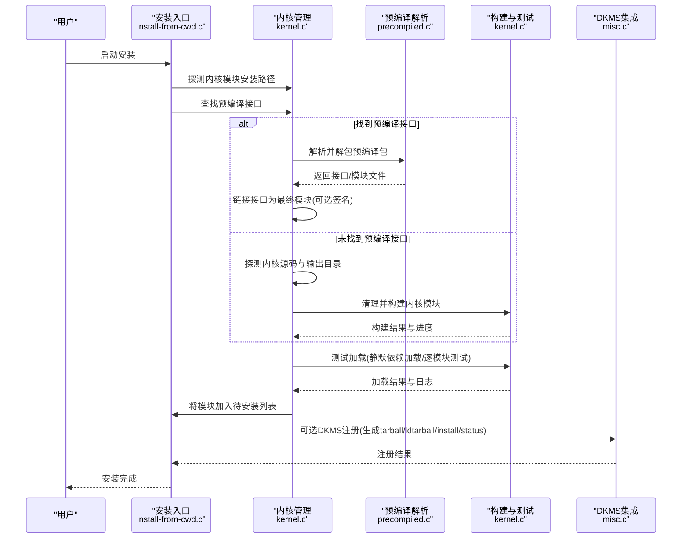
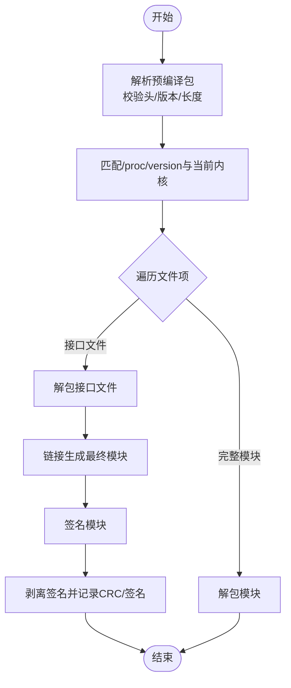
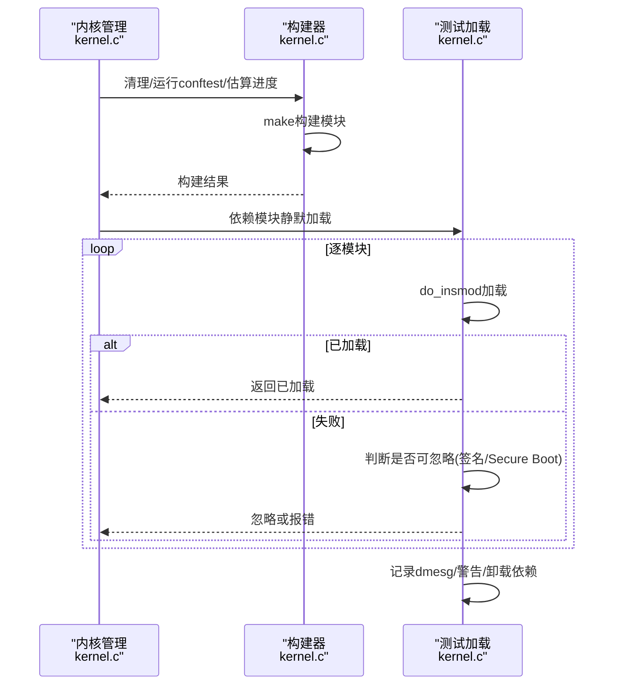
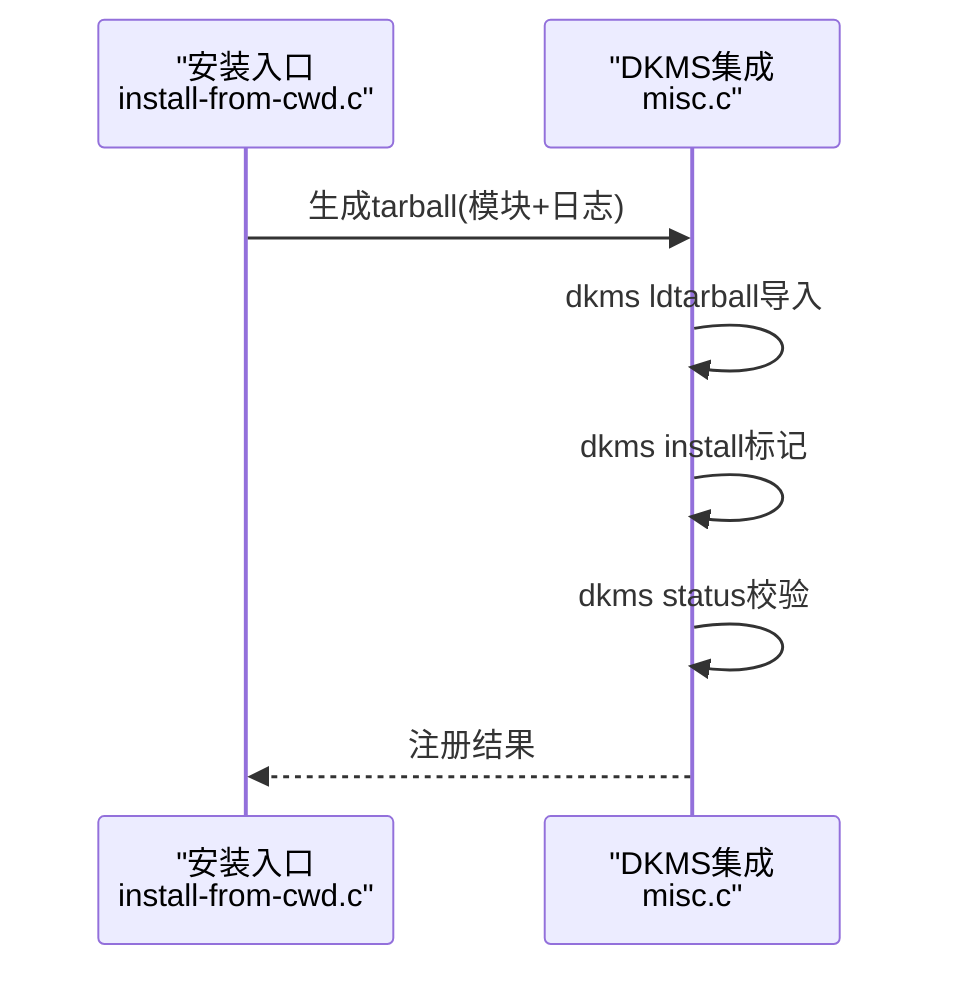
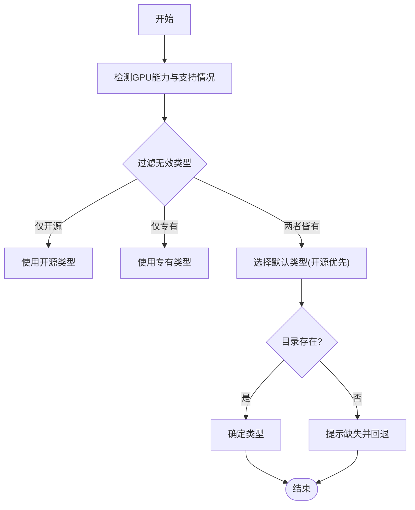
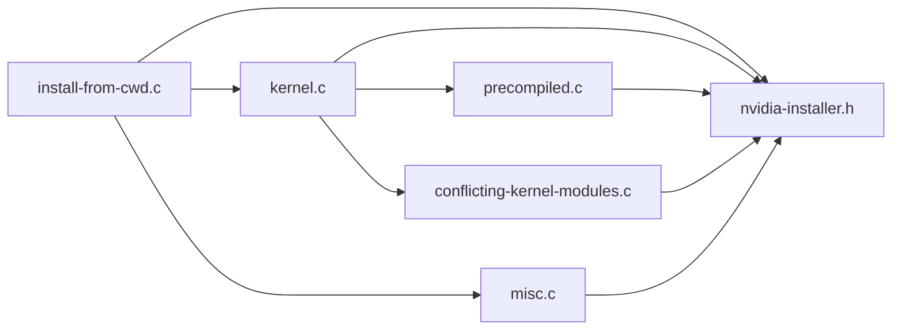
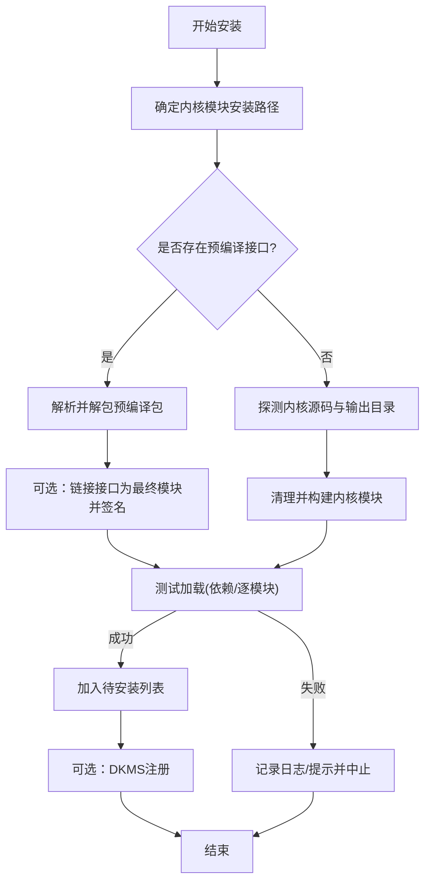

# 内核管理架构

<cite>
**本文引用的文件**
- [kernel.c](file://kernel.c)
- [kernel.h](file://kernel.h)
- [precompiled.c](file://precompiled.c)
- [precompiled.h](file://precompiled.h)
- [conflicting-kernel-modules.c](file://conflicting-kernel-modules.c)
- [conflicting-kernel-modules.h](file://conflicting-kernel-modules.h)
- [misc.c](file://misc.c)
- [install-from-cwd.c](file://install-from-cwd.c)
- [nvidia-installer.h](file://nvidia-installer.h)
- [mkprecompiled.c](file://mkprecompiled.c)
</cite>

## 目录
1. [简介](#简介)
2. [项目结构](#项目结构)
3. [核心组件](#核心组件)
4. [架构总览](#架构总览)
5. [详细组件分析](#详细组件分析)
6. [依赖关系分析](#依赖关系分析)
7. [性能考量](#性能考量)
8. [故障排查指南](#故障排查指南)
9. [结论](#结论)
10. [附录](#附录)

## 简介
本文件面向NVIDIA安装程序的内核管理架构，系统化阐述内核模块编译与安装体系：包括预编译接口与签名机制、内核版本兼容性匹配、DKMS集成、内核模块生命周期（构建、链接、签名、加载、卸载、清理）、以及内核模块类型检测与选择策略（专有驱动与开源驱动）。文档以代码级分析为基础，辅以流程图与序列图，帮助开发者与运维人员快速理解并定位问题。

## 项目结构
围绕内核管理的核心源文件与职责如下：
- kernel.c / kernel.h：内核模块路径探测、源码与输出目录解析、预编译接口扫描与解包、构建与测试加载、签名与模块类型选择等。
- precompiled.c / precompiled.h：预编译包格式解析、打包/解包、接口文件CRC与签名元数据管理。
- conflicting-kernel-modules.c / conflicting-kernel-modules.h：冲突模块清单与检测逻辑。
- misc.c：DKMS集成（生成tarball、ldtarball导入、install标记、状态校验）。
- install-from-cwd.c：安装主流程（预编译优先、否则源码构建；测试加载；加入待安装列表）。
- nvidia-installer.h：全局选项、工具枚举、包与内核模块信息结构体定义。
- mkprecompiled.c：预编译包打包工具，支持接口与模块文件打包、签名分离与属性设置。

图表来源
- [install-from-cwd.c:469-551](file://install-from-cwd.c#L469-L551)
- [kernel.c:1762-1864](file://kernel.c#L1762-L1864)
- [precompiled.c:152-440](file://precompiled.c#L152-L440)
- [misc.c:2857-2935](file://misc.c#L2857-L2935)
- [conflicting-kernel-modules.c:29-46](file://conflicting-kernel-modules.c#L29-L46)

章节来源
- [kernel.c:85-146](file://kernel.c#L85-L146)
- [kernel.c:1960-2000](file://kernel.c#L1960-L2000)
- [precompiled.h:100-126](file://precompiled.h#L100-L126)
- [nvidia-installer.h:46-95](file://nvidia-installer.h#L46-L95)

## 核心组件
- 预编译接口与签名
  - 预编译包格式版本、头部、文件项常量与属性位定义，支持接口文件与完整模块两种类型，以及“已分离签名”“已链接模块CRC”等属性。
  - 解析与校验：通过mmap读取包头、版本号、描述、/proc/version字符串、文件数量与各文件元数据，进行完整性与目标内核匹配检查。
  - 打包与解包：支持将接口文件与核心对象文件链接成最终模块，或直接解包完整模块；可选嵌入/分离签名及CRC记录。
- 内核模块构建与测试
  - 路径探测：默认安装路径、内核源码与输出目录推断，支持专家模式交互确认。
  - 构建流程：执行清理、运行conftest集合、统计输出行数估算进度、调用make构建模块并逐模块校验产物存在性。
  - 测试加载：静默加载依赖模块、逐一尝试加载目标模块、处理已加载冲突、记录dmesg与警告消息、自动卸载并恢复环境。
- DKMS集成
  - 生成tarball（含已构建模块与日志），使用dkms ldtarball导入，再dkms install标记为已安装，最后校验dkms status。
- 冲突模块检测
  - 维护冲突模块清单，按逆向依赖顺序检测与卸载，必要时提示用户忽略或中止。
- 模块类型选择
  - 支持专有驱动与开源驱动两类目录，依据GPU能力与命令行/系统条件筛选有效类型，提供默认选择与错误提示。

章节来源
- [precompiled.h:100-199](file://precompiled.h#L100-L199)
- [precompiled.c:152-440](file://precompiled.c#L152-L440)
- [kernel.c:938-1078](file://kernel.c#L938-L1078)
- [kernel.c:1559-1578](file://kernel.c#L1559-L1578)
- [misc.c:2857-2935](file://misc.c#L2857-L2935)
- [conflicting-kernel-modules.c:29-46](file://conflicting-kernel-modules.c#L29-L46)
- [kernel.c:2685-2753](file://kernel.c#L2685-L2753)

## 架构总览
下图展示从安装入口到内核模块安装完成的关键步骤与组件交互：

图表来源
- [install-from-cwd.c:469-551](file://install-from-cwd.c#L469-L551)
- [kernel.c:1762-1864](file://kernel.c#L1762-L1864)
- [precompiled.c:368-440](file://precompiled.c#L368-L440)
- [kernel.c:938-1078](file://kernel.c#L938-L1078)
- [misc.c:2857-2935](file://misc.c#L2857-L2935)

## 详细组件分析

### 预编译接口与签名机制
- 包格式与属性
  - 包头固定标识与版本号；描述、/proc/version字符串、文件数量；每个文件包含类型、属性掩码、名称、链接模块名、核心对象名、CRC、大小、数据、冗余CRC、链接模块CRC、分离签名长度与签名、序列号与包尾。
  - 属性位：已分离签名、已链接模块CRC、已嵌入签名。
- 包解析与校验
  - 使用mmap读取并校验包头与版本；读取版本、描述、/proc/version字符串；与当前运行内核匹配；遍历文件项，校验长度与边界；可选要求文件列表必须存在于包中。
- 打包与解包
  - 解包：将文件写入目标目录对应子树。
  - 打包：按固定布局写入头部、版本、描述、/proc/version字符串、文件数量与各文件项。
- 分离签名与CRC
  - 对接口文件，可链接生成模块后计算CRC，签名后从模块末尾剥离签名，记录CRC与签名，便于目标系统二次验证与签名注入。

图表来源
- [precompiled.c:152-440](file://precompiled.c#L152-L440)
- [precompiled.c:368-440](file://precompiled.c#L368-L440)
- [kernel.c:502-549](file://kernel.c#L502-L549)
- [kernel.c:800-839](file://kernel.c#L800-L839)

章节来源
- [precompiled.h:100-199](file://precompiled.h#L100-L199)
- [precompiled.c:152-440](file://precompiled.c#L152-L440)
- [kernel.c:502-549](file://kernel.c#L502-L549)
- [kernel.c:800-839](file://kernel.c#L800-L839)

### 内核模块构建与测试加载
- 路径与源码探测
  - 默认安装路径根据内核版本与目录结构推断；专家模式可交互输入。
  - 内核源码与输出目录：支持--kernel-source-path、--kernel-output-path、SYSOUT环境变量、/lib/modules/$(uname -r)/{source,build}等多来源解析。
- 构建流程
  - 清理构建目录、运行多项conftest、估算输出行数用于进度显示、调用make构建模块、逐模块检查产物存在性。
- 测试加载
  - 先静默加载若干依赖模块，再逐一加载目标模块；若模块已加载则返回特定错误码；失败时根据CONFIG_MODULE_SIG_FORCE、Secure Boot等场景提示用户是否忽略；记录dmesg与警告消息；自动卸载并恢复环境。

图表来源
- [kernel.c:998-1029](file://kernel.c#L998-L1029)
- [kernel.c:1406-1550](file://kernel.c#L1406-L1550)
- [kernel.c:1162-1212](file://kernel.c#L1162-L1212)

章节来源
- [kernel.c:938-1078](file://kernel.c#L938-L1078)
- [kernel.c:1406-1550](file://kernel.c#L1406-L1550)
- [kernel.c:1162-1212](file://kernel.c#L1162-L1212)

### DKMS集成与注册
- 生成tarball：复制已构建模块与日志到临时目录，打包为tarball。
- 导入与安装：使用dkms ldtarball导入tarball，随后dkms install标记模块为已安装。
- 状态校验：通过dkms status确认注册成功。

图表来源
- [misc.c:2857-2935](file://misc.c#L2857-L2935)

章节来源
- [misc.c:2857-2935](file://misc.c#L2857-L2935)

### 内核模块类型检测与选择策略
- 类型枚举与默认目录：专有驱动(kernel)与开源驱动(kernel-open)，并维护许可证信息。
- 有效性判定：根据GPU能力与系统条件过滤无效类型；若目录缺失，给出错误或警告提示；在多种有效类型时提供默认选择并回退保护。
- 命令行覆盖：允许通过参数强制指定构建目录。

图表来源
- [kernel.c:2685-2753](file://kernel.c#L2685-L2753)

章节来源
- [kernel.c:2685-2753](file://kernel.c#L2685-L2753)

### 关键函数与实现要点
- kernel_module_build()
  - 实际实现：build_kernel_modules()与build_kernel_interfaces()，前者委托后者并传空指针以仅构建模块不打包接口；后者负责清理、conftest、make、逐模块校验与打包。
  - 参考路径：[kernel.c:672-675](file://kernel.c#L672-L675)、[kernel.c:938-1078](file://kernel.c#L938-L1078)
- kernel_module_load()
  - 实际实现：load_kernel_module()通过modprobe_helper()调用modprobe加载；测试加载由test_kernel_modules()封装，内部使用do_insmod与静默依赖加载。
  - 参考路径：[kernel.c:1629-1632](file://kernel.c#L1629-L1632)、[kernel.c:1559-1578](file://kernel.c#L1559-L1578)、[kernel.c:1162-1212](file://kernel.c#L1162-L1212)
- 预编译接口扫描与解包
  - 实际实现：find_precompiled_kernel_interface()按优先级搜索多个目录，匹配/proc/version后调用scan_dir()与get_precompiled_info()解析包；unpack_kernel_modules()解包并链接接口。
  - 参考路径：[kernel.c:1762-1864](file://kernel.c#L1762-L1864)、[precompiled.c:152-440](file://precompiled.c#L152-L440)、[kernel.c:502-549](file://kernel.c#L502-L549)
- DKMS注册
  - 实际实现：dkms_register_module()生成tarball、ldtarball导入、install标记、status校验。
  - 参考路径：[misc.c:2857-2935](file://misc.c#L2857-L2935)

章节来源
- [kernel.c:672-675](file://kernel.c#L672-L675)
- [kernel.c:938-1078](file://kernel.c#L938-L1078)
- [kernel.c:1629-1632](file://kernel.c#L1629-L1632)
- [kernel.c:1559-1578](file://kernel.c#L1559-L1578)
- [kernel.c:1162-1212](file://kernel.c#L1162-L1212)
- [kernel.c:1762-1864](file://kernel.c#L1762-L1864)
- [precompiled.c:152-440](file://precompiled.c#L152-L440)
- [kernel.c:502-549](file://kernel.c#L502-L549)
- [misc.c:2857-2935](file://misc.c#L2857-L2935)

## 依赖关系分析
- 组件耦合
  - install-from-cwd.c作为安装入口，协调kernel.c与precompiled.c；kernel.c依赖conflicting-kernel-modules.c进行冲突检测；misc.c提供DKMS集成能力；nvidia-installer.h定义全局结构体与工具枚举。
- 外部依赖
  - 构建链路依赖make、gcc、ld等开发工具；加载链路依赖modprobe/rmmod/lsmod等模块工具；签名依赖sign-file与内核配置项；DKMS依赖dkms与tar。
- 潜在循环依赖
  - 未发现直接循环依赖；各模块职责清晰，通过头文件暴露接口。

图表来源
- [install-from-cwd.c:469-551](file://install-from-cwd.c#L469-L551)
- [kernel.c:1762-1864](file://kernel.c#L1762-L1864)
- [precompiled.c:152-440](file://precompiled.c#L152-L440)
- [conflicting-kernel-modules.c:29-46](file://conflicting-kernel-modules.c#L29-L46)
- [misc.c:2857-2935](file://misc.c#L2857-L2935)
- [nvidia-installer.h:46-95](file://nvidia-installer.h#L46-L95)

章节来源
- [nvidia-installer.h:46-95](file://nvidia-installer.h#L46-L95)

## 性能考量
- 构建阶段
  - 通过count_lines()估算输出行数以优化UI进度反馈；清理与conftest减少重复工作量；make并行度受系统与内核配置影响。
- 预编译优先
  - 避免重复编译，显著缩短安装时间；接口链接与签名在目标系统执行，减少交叉编译复杂度。
- 测试加载
  - 仅在必要时启用udev事件队列暂停，降低对系统事件的影响；失败后快速回滚并记录日志。

## 故障排查指南
- 无法找到内核源码或输出目录
  - 现象：提示缺少内核源文件或未配置。
  - 处理：安装对应发行版内核源码包，或使用--kernel-source-path/--kernel-output-path指定路径。
  - 参考路径：[kernel.c:205-325](file://kernel.c#L205-L325)
- 模块加载失败
  - 现象：加载返回ENOKEY、CONFIG_MODULE_SIG_FORCE或Secure Boot导致拒绝加载。
  - 处理：启用交互签名或提供密钥；在专家模式下可选择忽略但需自备信任链。
  - 参考路径：[kernel.c:1222-1328](file://kernel.c#L1222-L1328)
- 冲突模块已加载
  - 现象：nvidia相关模块已在运行。
  - 处理：关闭占用GPU的进程后重试；或选择跳过部分检查继续安装。
  - 参考路径：[kernel.c:1652-1744](file://kernel.c#L1652-L1744)、[conflicting-kernel-modules.c:29-46](file://conflicting-kernel-modules.c#L29-L46)
- DKMS注册失败
  - 现象：dkms ldtarball或install失败。
  - 处理：检查dkms与tar可用性；确认模块与源码已安装；查看状态并重试。
  - 参考路径：[misc.c:2857-2935](file://misc.c#L2857-L2935)

章节来源
- [kernel.c:205-325](file://kernel.c#L205-L325)
- [kernel.c:1222-1328](file://kernel.c#L1222-L1328)
- [kernel.c:1652-1744](file://kernel.c#L1652-L1744)
- [conflicting-kernel-modules.c:29-46](file://conflicting-kernel-modules.c#L29-L46)
- [misc.c:2857-2935](file://misc.c#L2857-L2935)

## 结论
该内核管理架构以“预编译优先、源码兜底”的策略兼顾效率与兼容性；通过严格的包格式与签名机制保障模块完整性与可移植性；借助DKMS实现内核升级后的自动重建；结合冲突检测与测试加载确保安装安全性与稳定性。开发者可基于现有接口扩展新内核版本支持与签名算法，同时保持安装流程的可控与可观测。

## 附录
- 关键流程图（安装主流程）

图表来源
- [install-from-cwd.c:469-551](file://install-from-cwd.c#L469-L551)
- [kernel.c:1762-1864](file://kernel.c#L1762-L1864)
- [kernel.c:938-1078](file://kernel.c#L938-L1078)
- [kernel.c:1559-1578](file://kernel.c#L1559-L1578)
- [misc.c:2857-2935](file://misc.c#L2857-L2935)