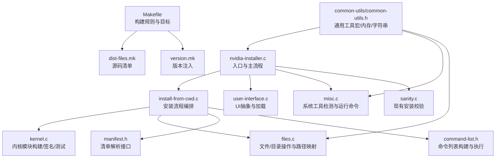
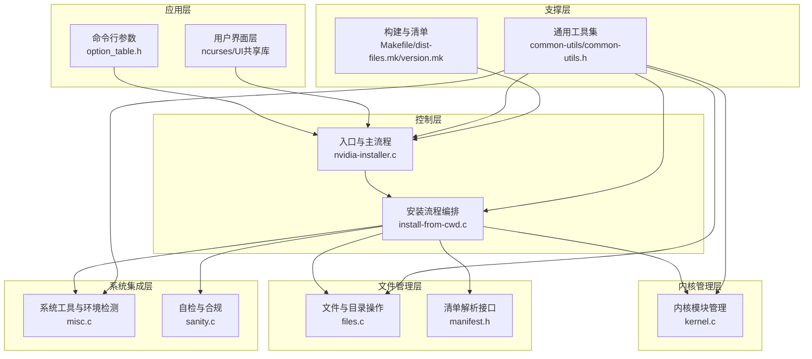
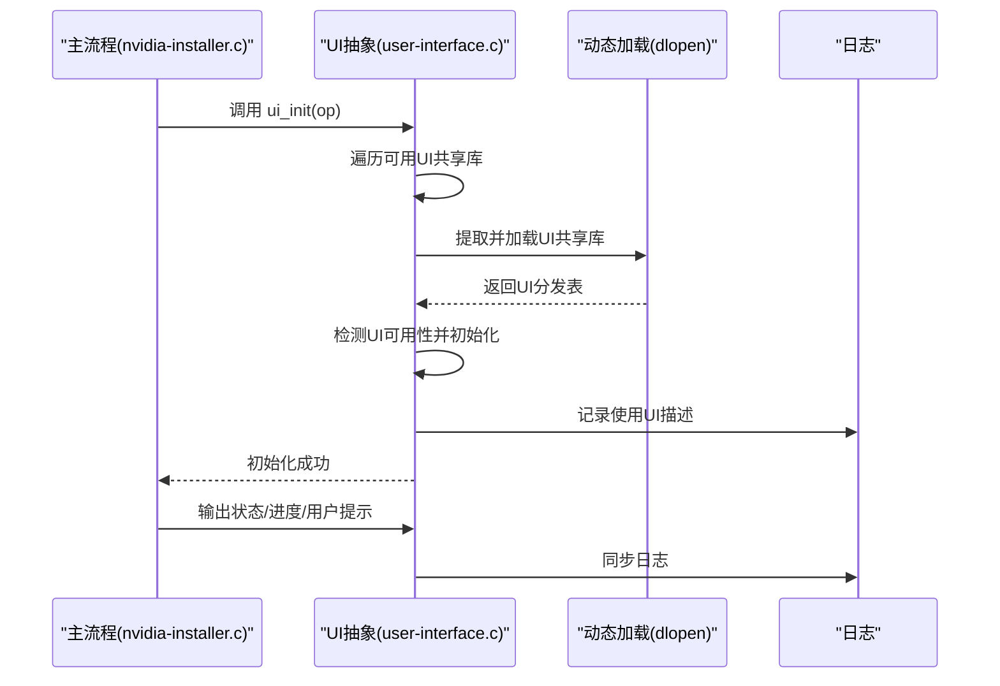
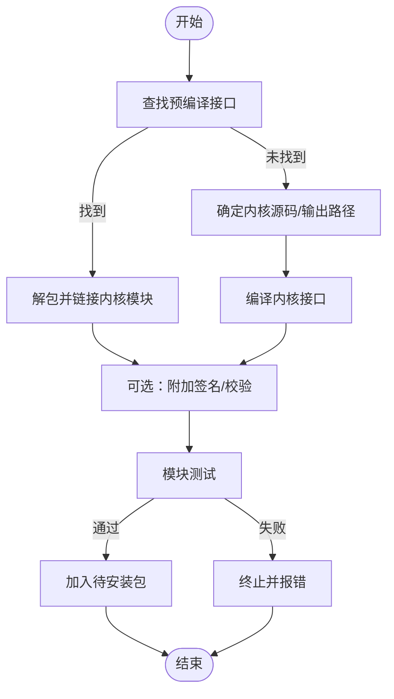
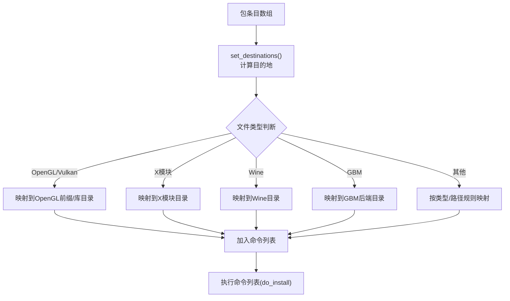
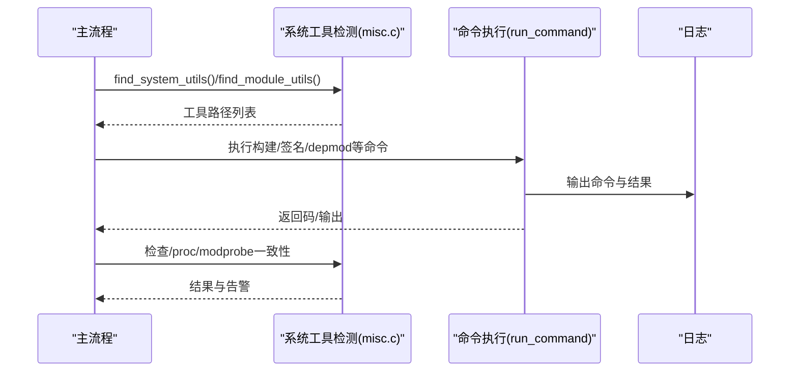
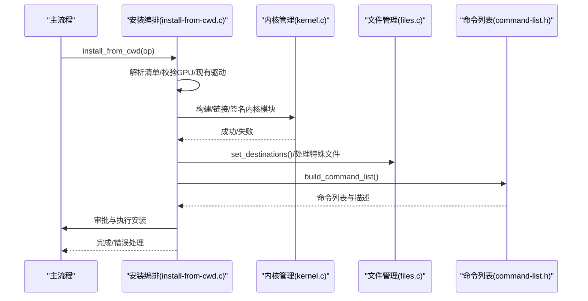
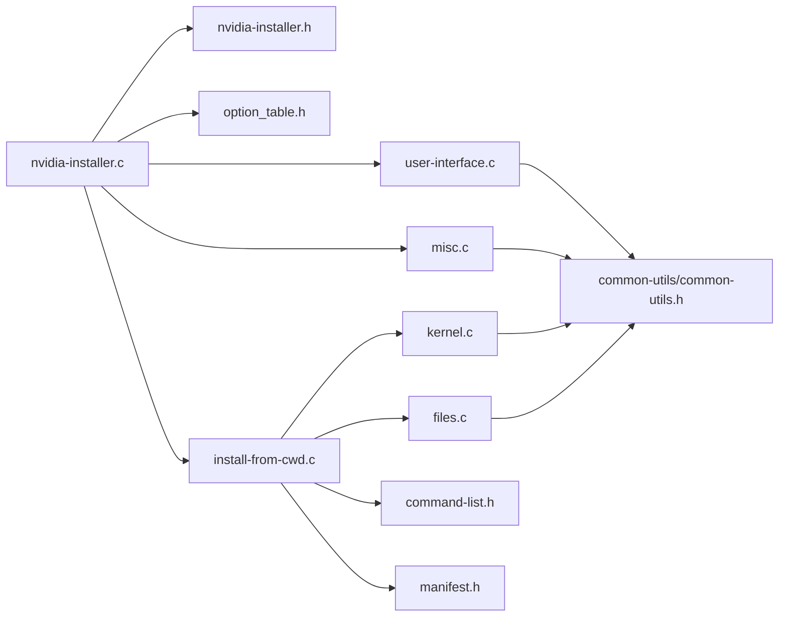
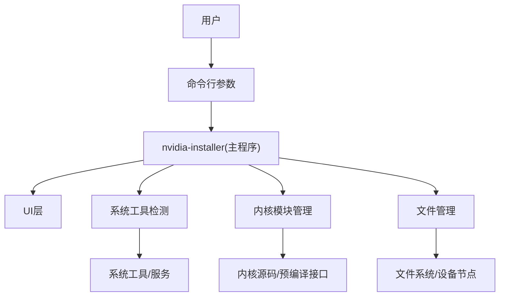

# 技术架构

<cite>
**本文引用的文件**
- [nvidia-installer.c](file://nvidia-installer.c)
- [nvidia-installer.h](file://nvidia-installer.h)
- [Makefile](file://Makefile)
- [README](file://README)
- [kernel.c](file://kernel.c)
- [user-interface.c](file://user-interface.c)
- [files.c](file://files.c)
- [misc.c](file://misc.c)
- [sanity.c](file://sanity.c)
- [install-from-cwd.c](file://install-from-cwd.c)
- [common-utils/common-utils.h](file://common-utils/common-utils.h)
- [dist-files.mk](file://dist-files.mk)
- [version.mk](file://version.mk)
- [option_table.h](file://option_table.h)
- [manifest.h](file://manifest.h)
- [command-list.h](file://command-list.h)
</cite>

## 目录
1. [引言](#引言)
2. [项目结构](#项目结构)
3. [核心组件](#核心组件)
4. [架构总览](#架构总览)
5. [详细组件分析](#详细组件分析)
6. [依赖关系分析](#依赖关系分析)
7. [性能考量](#性能考量)
8. [故障排查指南](#故障排查指南)
9. [结论](#结论)
10. [附录](#附录)

## 引言
本技术架构文档面向NVIDIA安装程序（nvidia-installer），聚焦于其高层设计、模块化架构与系统边界，系统性阐述用户界面层、内核管理层、文件管理层与系统集成层的职责分工与交互关系，解释数据流与集成模式，并给出安全性、监控与灾难恢复等横切关注点的建议。同时，文档记录技术栈、第三方依赖与版本兼容性，提供系统上下文图与组件分解图，帮助开发者与运维人员高效理解与维护该安装器。

## 项目结构
仓库采用按功能域划分的模块化组织方式：入口程序负责命令行解析与流程编排；核心子系统分别处理内核模块构建与签名、文件安装与备份、用户界面抽象、通用工具与构建脚手架等。顶层Makefile统一管理构建目标与依赖，dist-files.mk定义分发源码清单，version.mk注入版本信息。

图表来源
- [nvidia-installer.c:648-762](file://nvidia-installer.c#L648-L762)
- [install-from-cwd.c:96-454](file://install-from-cwd.c#L96-L454)
- [Makefile:158-161](file://Makefile#L158-L161)
- [dist-files.mk:29-46](file://dist-files.mk#L29-L46)
- [version.mk:1-12](file://version.mk#L1-L12)
- [common-utils/common-utils.h:54-82](file://common-utils/common-utils.h#L54-L82)

章节来源
- [Makefile:158-161](file://Makefile#L158-L161)
- [dist-files.mk:29-46](file://dist-files.mk#L29-L46)
- [version.mk:1-12](file://version.mk#L1-L12)
- [README:20-26](file://README#L20-L26)

## 核心组件
- 入口与主流程（nvidia-installer.c）
  - 负责默认选项初始化、PCI设备扫描、命令行解析、日志初始化、工作目录调整、UI初始化、系统工具与模块工具检测、X服务器版本查询、前缀与路径推导、驱动信息/自检/卸载/添加内核等分支流程调度。
- 安装流程编排（install-from-cwd.c）
  - 解析清单、校验GPU/现有驱动/替代安装、预卸载钩子、内核模块构建或预编译链接、可选模块询问、OpenGL/Vulkan/Wine/GBM等组件处理、备份初始化、命令列表构建与审批、执行安装、后置钩子与最终校验。
- 内核管理（kernel.c）
  - 预编译接口查找与解包、内核源码/输出路径探测、内核模块链接与签名、模块测试与加载、DKMS注册、initramfs重建提示等。
- 文件管理（files.c）
  - 目录递归删除/触摸、文件拷贝（mmap+memcpy）、临时文件写入、符号链接目标检查与处理、包条目目的地计算与类型映射、libglvnd/Vulkan等特殊路径处理。
- 用户界面（user-interface.c）
  - UI动态加载（ncurses系列UI共享库打包进二进制，运行时提取并dlopen），消息/输入/状态/不确定进度指示，信号处理，延迟消息记录。
- 系统工具与运行（misc.c）
  - 权限检查（root）、工作目录调整、命令执行（带输出匹配估算进度）、系统工具/模块工具/开发工具检测、/proc/modprobe路径一致性检查、SELinux/systemd检测等。
- 自检（sanity.c）
  - 对已安装驱动进行存在性与完整性校验，后续可扩展冲突检测与权限检查。
- 通用工具（common-utils/common-utils.h）
  - 内存分配/重分配/释放、字符串拼接/格式化、路径工具、版本编码、可选布尔枚举等基础能力。
- 构建与清单（Makefile、dist-files.mk、version.mk）
  - 统一构建目标（主程序、辅助工具、帮助脚本、手册页）、UI共享库打包、版本注入、安装规则。

章节来源
- [nvidia-installer.c:648-762](file://nvidia-installer.c#L648-L762)
- [install-from-cwd.c:96-454](file://install-from-cwd.c#L96-L454)
- [kernel.c:99-146](file://kernel.c#L99-L146)
- [files.c:218-312](file://files.c#L218-L312)
- [user-interface.c:116-239](file://user-interface.c#L116-L239)
- [misc.c:100-113](file://misc.c#L100-L113)
- [sanity.c:33-85](file://sanity.c#L33-L85)
- [common-utils/common-utils.h:54-82](file://common-utils/common-utils.h#L54-L82)
- [Makefile:158-161](file://Makefile#L158-L161)
- [dist-files.mk:29-46](file://dist-files.mk#L29-L46)
- [version.mk:1-12](file://version.mk#L1-L12)

## 架构总览
系统采用“入口编排 + 子系统解耦”的模块化设计，通过统一的Options结构体贯穿各模块，实现高内聚、低耦合。UI层以插件化共享库形式嵌入主程序，避免外部依赖漂移；内核模块构建支持预编译接口与源码编译双路径；文件管理提供幂等的安装/回滚能力；系统集成层负责工具链检测、服务管理与安全策略。

图表来源
- [nvidia-installer.c:648-762](file://nvidia-installer.c#L648-L762)
- [install-from-cwd.c:96-454](file://install-from-cwd.c#L96-L454)
- [kernel.c:472-551](file://kernel.c#L472-L551)
- [files.c:528-800](file://files.c#L528-L800)
- [manifest.h:25-41](file://manifest.h#L25-L41)
- [misc.c:498-625](file://misc.c#L498-L625)
- [sanity.c:33-85](file://sanity.c#L33-L85)
- [common-utils/common-utils.h:54-82](file://common-utils/common-utils.h#L54-L82)
- [Makefile:158-161](file://Makefile#L158-L161)
- [dist-files.mk:29-46](file://dist-files.mk#L29-L46)
- [version.mk:1-12](file://version.mk#L1-L12)

## 详细组件分析

### 用户界面层（UI）
- 设计要点
  - UI以共享库形式打包进主程序，运行时提取到临时文件并dlopen，避免系统上缺失或版本不匹配的UI库影响安装器启动。
  - 支持多套UI（ncurses系列变体），自动探测可用UI并初始化；若无可用UI则回退到内置流式UI。
  - 提供消息、输入、命令输出、状态与不确定进度指示，以及信号处理与延迟消息记录。
- 数据流
  - 主流程调用ui_init完成UI选择与初始化；随后在安装过程中通过统一接口输出状态、进度与用户交互请求。
- 关键实现路径
  - UI初始化与加载：[user-interface.c:116-239](file://user-interface.c#L116-L239)
  - UI接口调用（消息/输入/状态）：[user-interface.c:335-661](file://user-interface.c#L335-L661)
  - UI共享库打包与提取：[user-interface.c:683-754](file://user-interface.c#L683-L754)

图表来源
- [nvidia-installer.c:679-682](file://nvidia-installer.c#L679-L682)
- [user-interface.c:116-239](file://user-interface.c#L116-L239)
- [user-interface.c:683-754](file://user-interface.c#L683-L754)

章节来源
- [user-interface.c:116-239](file://user-interface.c#L116-L239)
- [user-interface.c:335-661](file://user-interface.c#L335-L661)
- [user-interface.c:683-754](file://user-interface.c#L683-L754)

### 内核管理层（Kernel）
- 设计要点
  - 支持两种内核模块构建路径：预编译接口直接链接生成模块；或通过源码编译生成接口再链接。
  - 提供模块签名（detached签名/内联CRC校验/自动签名脚本检测）、模块测试与加载、DKMS注册、initramfs重建提示。
  - 路径与工具检测：内核源码/输出路径、/proc/modprobe一致性、开发工具链可用性。
- 数据流
  - 安装流程触发内核模块构建/链接；成功后进行模块测试；通过后加入待安装文件列表。
- 关键实现路径
  - 预编译接口解包与链接：[kernel.c:502-549](file://kernel.c#L502-L549)
  - 源码编译与链接：[kernel.c:672-675](file://kernel.c#L672-L675)
  - 模块签名与CRC校验：[kernel.c:414-488](file://kernel.c#L414-L488)
  - 开发工具检测与路径推断：[kernel.c:205-325](file://kernel.c#L205-L325), [kernel.c:334-407](file://kernel.c#L334-L407)

图表来源
- [install-from-cwd.c:469-551](file://install-from-cwd.c#L469-L551)
- [kernel.c:502-549](file://kernel.c#L502-L549)
- [kernel.c:414-488](file://kernel.c#L414-L488)
- [kernel.c:205-325](file://kernel.c#L205-L325)

章节来源
- [install-from-cwd.c:469-551](file://install-from-cwd.c#L469-L551)
- [kernel.c:502-549](file://kernel.c#L502-L549)
- [kernel.c:414-488](file://kernel.c#L414-L488)
- [kernel.c:205-325](file://kernel.c#L205-L325)

### 文件管理层（Files）
- 设计要点
  - 提供目录递归删除、目录递归触摸、文件拷贝（mmap+memcpy）、临时文件写入等基础能力。
  - 基于清单的包条目目的地计算，支持多种文件类型与兼容架构（如32位兼容库）。
  - 特殊处理：libGLX间接库、libglvnd/EGL/Vulkan路径、GBM后端库、Wine组件等。
- 数据流
  - 安装前设置目的地；安装中执行命令列表；卸载/回滚时进行备份与清理。
- 关键实现路径
  - 目录与文件操作：[files.c:56-116](file://files.c#L56-L116), [files.c:218-312](file://files.c#L218-L312)
  - 目的地计算与类型映射：[files.c:528-800](file://files.c#L528-L800)
  - libGLX间接库处理：[files.c:418-486](file://files.c#L418-L486)

图表来源
- [files.c:528-800](file://files.c#L528-L800)
- [install-from-cwd.c:335-347](file://install-from-cwd.c#L335-L347)

章节来源
- [files.c:56-116](file://files.c#L56-L116)
- [files.c:218-312](file://files.c#L218-L312)
- [files.c:528-800](file://files.c#L528-L800)
- [files.c:418-486](file://files.c#L418-L486)

### 系统集成层（System Integration）
- 设计要点
  - 系统工具检测：ldconfig/grep/dmesg/tail/objcopy/chcon/SELinux工具、X/openssl/dkms/systemd/tar等。
  - 模块工具检测：modprobe/rmmod/lsmod/depmod。
  - 运行命令：统一的命令执行封装，支持输出收集、进度估算、SIGWINCH处理、语言环境清理。
  - 环境检测：/proc/modprobe一致性、SELinux策略、systemd可用性。
- 数据流
  - 在安装前完成工具链与环境检测；在安装过程中按需调用系统命令。
- 关键实现路径
  - 工具检测与路径解析：[misc.c:498-625](file://misc.c#L498-L625)
  - 命令执行与进度估算：[misc.c:252-438](file://misc.c#L252-L438)
  - /proc/modprobe一致性检查：[misc.c:637-752](file://misc.c#L637-L752)

图表来源
- [nvidia-installer.c:704-708](file://nvidia-installer.c#L704-L708)
- [misc.c:498-625](file://misc.c#L498-L625)
- [misc.c:252-438](file://misc.c#L252-L438)
- [misc.c:637-752](file://misc.c#L637-L752)

章节来源
- [misc.c:498-625](file://misc.c#L498-L625)
- [misc.c:252-438](file://misc.c#L252-L438)
- [misc.c:637-752](file://misc.c#L637-L752)

### 安装流程编排（Install-from-cwd）
- 设计要点
  - 清单解析、GPU/现有驱动/替代安装检查、预卸载钩子、内核模块构建/链接/签名/测试、可选模块询问、OpenGL/Vulkan/Wine/GBM处理、备份初始化、命令列表构建与审批、执行安装、后置钩子与最终校验。
- 数据流
  - 从当前目录解析清单，构建Package对象；根据选项与环境决定是否安装内核模块；计算文件目的地；构建命令列表并获得用户批准；执行安装并进行后置检查。
- 关键实现路径
  - 安装主流程：[install-from-cwd.c:96-454](file://install-from-cwd.c#L96-L454)
  - 内核模块安装与签名：[install-from-cwd.c:469-551](file://install-from-cwd.c#L469-L551)
  - 命令列表构建与执行：[install-from-cwd.c:335-347](file://install-from-cwd.c#L335-L347), [command-list.h:46-49](file://command-list.h#L46-L49)

图表来源
- [nvidia-installer.c:744-747](file://nvidia-installer.c#L744-L747)
- [install-from-cwd.c:96-454](file://install-from-cwd.c#L96-L454)
- [command-list.h:46-49](file://command-list.h#L46-L49)

章节来源
- [install-from-cwd.c:96-454](file://install-from-cwd.c#L96-L454)
- [command-list.h:46-49](file://command-list.h#L46-L49)

## 依赖关系分析
- 组件耦合与内聚
  - 入口与安装流程耦合度高，但通过Options结构体与接口解耦具体子系统；UI通过分发表与动态加载进一步降低耦合。
  - 内核管理与文件管理均依赖清单解析接口与通用工具集，形成清晰的依赖方向。
- 外部依赖
  - ncurses系列UI共享库、系统工具（ldconfig/grep/dmesg/tail/objcopy/chcon/openssl/dkms/systemd/tar）、X服务器、内核源码与头文件、SELinux工具、systemd工具等。
- 可能的循环依赖
  - 未发现直接循环依赖；UI动态加载避免了静态循环依赖风险。
- 接口契约
  - Options结构体作为全局配置中心；命令列表接口提供统一的执行契约；清单解析接口提供文件类型与能力查询。

图表来源
- [nvidia-installer.c:37-47](file://nvidia-installer.c#L37-L47)
- [nvidia-installer.h:185-342](file://nvidia-installer.h#L185-L342)
- [option_table.h:126-789](file://option_table.h#L126-L789)
- [user-interface.c:36-49](file://user-interface.c#L36-L49)
- [misc.c:42-53](file://misc.c#L42-L53)
- [install-from-cwd.c:41-49](file://install-from-cwd.c#L41-L49)
- [kernel.c:36-43](file://kernel.c#L36-L43)
- [files.c:40-47](file://files.c#L40-L47)
- [command-list.h:29-49](file://command-list.h#L29-L49)
- [manifest.h:25-41](file://manifest.h#L25-L41)
- [common-utils/common-utils.h:54-82](file://common-utils/common-utils.h#L54-L82)

章节来源
- [nvidia-installer.h:185-342](file://nvidia-installer.h#L185-L342)
- [option_table.h:126-789](file://option_table.h#L126-L789)
- [command-list.h:29-49](file://command-list.h#L29-L49)
- [manifest.h:25-41](file://manifest.h#L25-L41)
- [common-utils/common-utils.h:54-82](file://common-utils/common-utils.h#L54-L82)

## 性能考量
- 并行化
  - 并发级别可通过命令行设置，默认自动探测CPU数量；适用于可并行的任务（如构建内核模块）。
- I/O优化
  - 文件拷贝采用mmap+memcpy减少系统调用开销；临时文件写入使用内存映射与权限一次性设置。
- 命令执行与进度估算
  - 通过输出匹配估算进度，避免全量缓冲；忽略SIGWINCH干扰，提升长任务稳定性。
- UI与日志
  - 流式UI与日志分离，避免阻塞；不确定进度通过独立线程更新，保证用户体验。

章节来源
- [nvidia-installer.c:690-690](file://nvidia-installer.c#L690-L690)
- [files.c:218-312](file://files.c#L218-L312)
- [misc.c:252-438](file://misc.c#L252-L438)
- [user-interface.c:580-626](file://user-interface.c#L580-L626)

## 故障排查指南
- 常见问题定位
  - 权限不足：确保以root身份运行；入口会检查有效UID。
  - 缺失系统工具：工具检测阶段会列出缺失工具及对应软件包；请安装并确保在PATH中。
  - 内核源码/头文件缺失：内核源码路径探测失败时会提示安装相应内核源/头文件包。
  - /proc不可用或modprobe路径不一致：检查/proc挂载与/proc/sys/kernel/modprobe内容。
  - SELinux策略：根据检测结果设置chcon类型或execstack策略。
- 日志与诊断
  - 默认日志文件位置在安装/卸载时指定；失败时建议查看日志并参考README中的修复建议。
- 回滚与自检
  - 卸载流程可移除冲突文件或回滚备份；自检流程验证已安装驱动的完整性。

章节来源
- [nvidia-installer.c:694-696](file://nvidia-installer.c#L694-L696)
- [misc.c:548-625](file://misc.c#L548-L625)
- [kernel.c:205-325](file://kernel.c#L205-L325)
- [misc.c:637-752](file://misc.c#L637-L752)
- [sanity.c:33-85](file://sanity.c#L33-L85)
- [README:46-134](file://README#L46-L134)

## 结论
该安装器通过清晰的模块化设计与严格的职责分离，实现了对Linux环境下NVIDIA驱动安装的稳健支持。入口编排、UI抽象、内核管理、文件管理与系统集成五大层面协同工作，既保证了可维护性，也为扩展（如新增UI、更多文件类型、更多系统集成点）提供了良好基础。结合并发优化、I/O优化与完善的日志/自检机制，能够在复杂环境中稳定交付。

## 附录

### 系统上下文图

图表来源
- [nvidia-installer.c:648-762](file://nvidia-installer.c#L648-L762)
- [user-interface.c:116-239](file://user-interface.c#L116-L239)
- [misc.c:498-625](file://misc.c#L498-L625)
- [kernel.c:472-551](file://kernel.c#L472-L551)
- [files.c:528-800](file://files.c#L528-L800)

### 技术栈与依赖
- 构建与打包
  - Makefile、dist-files.mk、version.mk
- 语言与标准库
  - C语言、POSIX系统调用、标准C库
- 第三方依赖
  - ncurses系列UI库、系统工具（ldconfig/grep/dmesg/tail/objcopy/chcon/openssl/dkms/systemd/tar）、X服务器、内核源码与头文件、SELinux工具
- 版本与兼容性
  - 版本号由version.mk注入；支持多架构（x86/x86_64等）；通过选项表控制行为（如DKMS、systemd、libglvnd等）

章节来源
- [Makefile:158-161](file://Makefile#L158-L161)
- [dist-files.mk:29-46](file://dist-files.mk#L29-L46)
- [version.mk:1-12](file://version.mk#L1-L12)
- [README:20-26](file://README#L20-L26)
- [option_table.h:564-789](file://option_table.h#L564-L789)