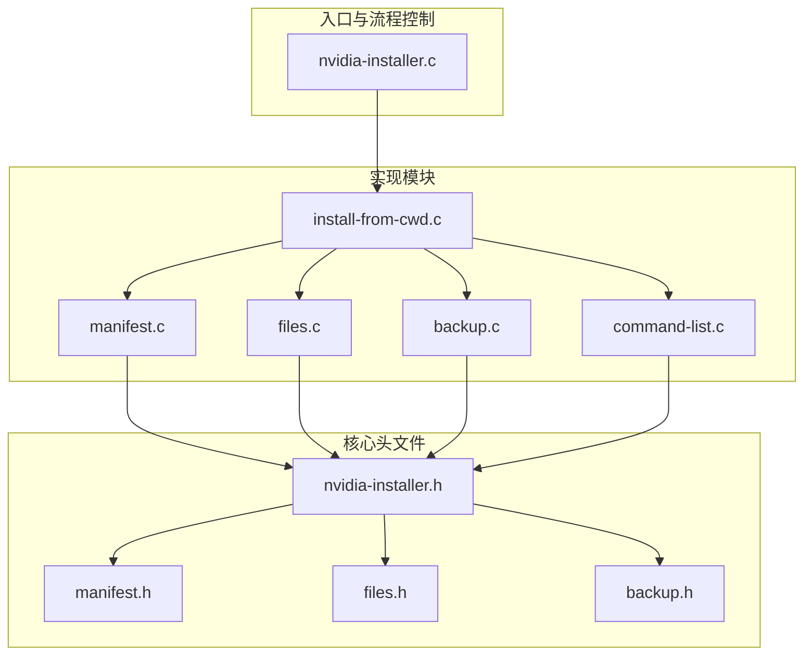
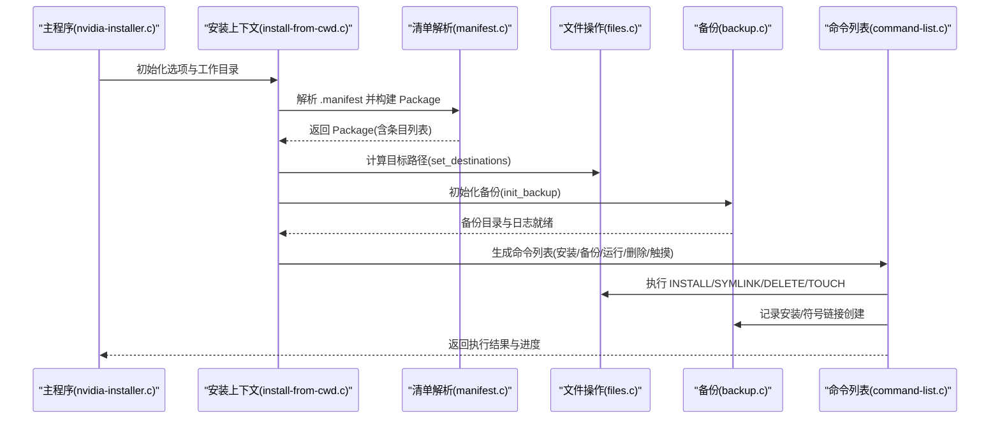
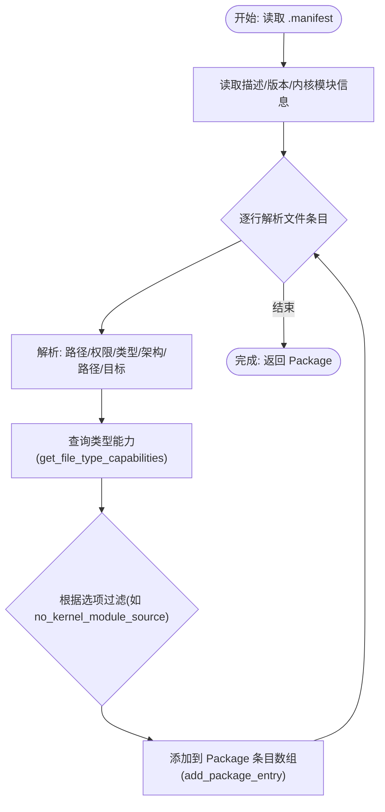
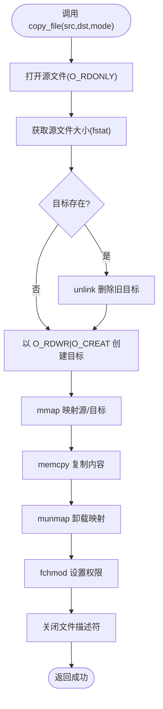
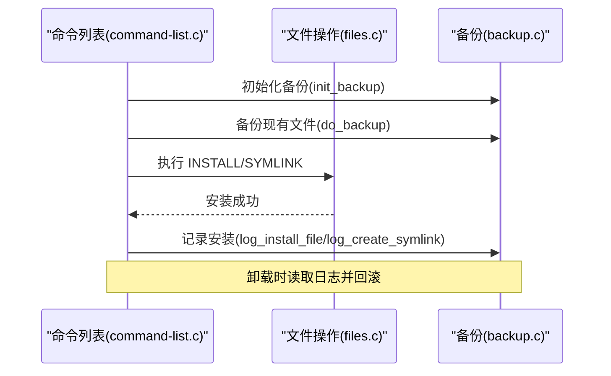
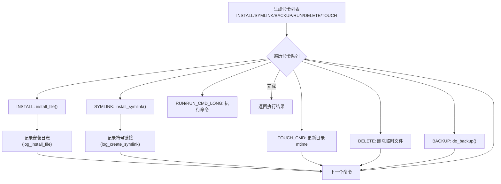
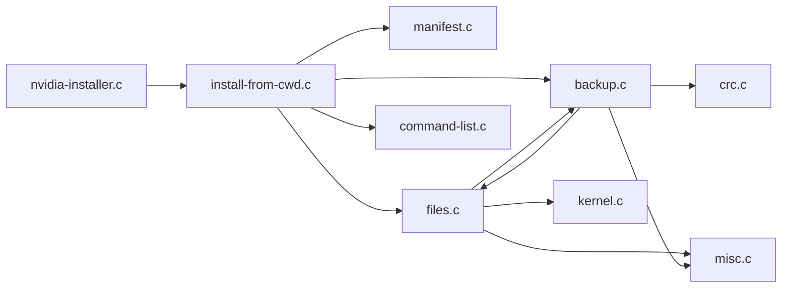

# 文件系统管理架构

<cite>
**本文引用的文件**
- [manifest.c](file://manifest.c)
- [manifest.h](file://manifest.h)
- [files.c](file://files.c)
- [files.h](file://files.h)
- [backup.c](file://backup.c)
- [backup.h](file://backup.h)
- [nvidia-installer.h](file://nvidia-installer.h)
- [nvidia-installer.c](file://nvidia-installer.c)
- [install-from-cwd.c](file://install-from-cwd.c)
- [command-list.c](file://command-list.c)
</cite>

## 目录
1. [引言](#引言)
2. [项目结构](#项目结构)
3. [核心组件](#核心组件)
4. [架构总览](#架构总览)
5. [详细组件分析](#详细组件分析)
6. [依赖分析](#依赖分析)
7. [性能考虑](#性能考虑)
8. [故障排查指南](#故障排查指南)
9. [结论](#结论)
10. [附录](#附录)

## 引言
本文件系统管理架构文档聚焦于 NVIDIA 安装程序在类 Unix 系统上的文件操作与权限管理，围绕以下目标展开：
- 清晰解释软件包清单（Manifest）解析、文件复制与权限管理机制；
- 深入阐述 Manifest 系统的设计原理（清单文件格式、文件条目解析、依赖关系管理）；
- 阐明文件操作的原子性与一致性保障（备份策略与回滚处理）；
- 详述文件权限设置、符号链接创建与目录结构维护的实现细节；
- 提供关键函数的代码路径示例（如 parse_manifest()、copy_file()、set_permissions() 等），并给出安装流程图。

## 项目结构
该仓库采用“按职责分层”的组织方式：核心数据结构定义位于头文件中，功能实现分布在对应源文件；安装流程由主程序驱动，通过命令列表统一编排具体文件操作。

图表来源
- [nvidia-installer.c:1-200](file://nvidia-installer.c#L1-L200)
- [install-from-cwd.c:688-1069](file://install-from-cwd.c#L688-L1069)
- [manifest.c:1-252](file://manifest.c#L1-L252)
- [files.c:1-800](file://files.c#L1-L800)
- [backup.c:1-800](file://backup.c#L1-L800)
- [command-list.c:1-200](file://command-list.c#L1-L200)

章节来源
- [nvidia-installer.c:1-200](file://nvidia-installer.c#L1-L200)
- [nvidia-installer.h:1-603](file://nvidia-installer.h#L1-L603)

## 核心组件
- Manifest 解析器：负责读取并解析 .manifest 清单，生成 Package 结构体及其中的 PackageEntry 列表，同时解析文件类型、权限、路径与符号链接目标等元信息。
- 文件操作引擎：封装文件复制、目录创建、符号链接安装、权限设置、临时文件写入等底层操作。
- 备份与回滚：在安装前初始化备份目录与日志，记录已存在文件与符号链接状态；卸载时根据日志进行恢复。
- 命令列表执行器：将安装计划转换为可执行命令队列（INSTALL、SYMLINK、BACKUP、RUN 等），统一调度与进度反馈。

章节来源
- [manifest.c:165-180](file://manifest.c#L165-L180)
- [files.c:218-312](file://files.c#L218-L312)
- [backup.c:137-198](file://backup.c#L137-L198)
- [command-list.c:609-680](file://command-list.c#L609-L680)

## 架构总览
下图展示了从清单解析到命令执行的整体流程，以及各模块之间的交互关系。

图表来源
- [nvidia-installer.c:1-200](file://nvidia-installer.c#L1-L200)
- [install-from-cwd.c:688-1069](file://install-from-cwd.c#L688-L1069)
- [manifest.c:165-180](file://manifest.c#L165-L180)
- [files.c:528-800](file://files.c#L528-L800)
- [backup.c:137-198](file://backup.c#L137-L198)
- [command-list.c:609-680](file://command-list.c#L609-L680)

## 详细组件分析

### 组件一：Manifest 系统与清单解析
- 设计要点
  - 清单文件首几行为描述、版本、内核模块名、接口文件名、模块名列表、需卸载的模块、预编译接口目录等；其余为文件条目。
  - 文件条目字段包括：相对包内路径、权限（八进制字符串）、文件类型、兼容架构、路径（部分类型）、继承路径深度（部分类型）、符号链接目标（若为符号链接）。
  - 文件类型枚举与能力位（是否可安装、是否共享库、是否符号链接、是否 OpenGL、是否临时、是否冲突、是否继承路径等）集中定义于 manifest.c 的表格中，便于统一查询与过滤。
- 关键函数与路径
  - 解析清单入口：[parse_manifest():696-1047](file://install-from-cwd.c#L696-L1047)
  - 文件类型解析：[parse_manifest_file_type():165-180](file://manifest.c#L165-L180)
  - 获取文件类型能力：[get_file_type_capabilities():144-158](file://manifest.c#L144-L158)
  - 可安装文件类型列表：[get_installable_file_type_list():185-225](file://manifest.c#L185-L225)
  - 符号链接类型加入列表：[add_symlinks_to_file_type_list():231-245](file://manifest.c#L231-L245)
- 依赖关系管理
  - 通过文件类型能力位与选项（如 no_kernel_module_source、dkms_registered、nvidia_modprobe 等）动态决定哪些条目应被安装或跳过。
  - 对于继承路径的条目，解析其相对路径与深度，自动推导最终安装路径。

图表来源
- [install-from-cwd.c:696-1047](file://install-from-cwd.c#L696-L1047)
- [manifest.c:144-180](file://manifest.c#L144-L180)

章节来源
- [install-from-cwd.c:696-1047](file://install-from-cwd.c#L696-L1047)
- [manifest.c:55-180](file://manifest.c#L55-L180)
- [manifest.h:25-41](file://manifest.h#L25-L41)

### 组件二：文件复制与权限管理
- 文件复制
  - 使用内存映射（mmap/munmap）与 memcpy 进行高效复制，先以 O_RDWR|O_CREAT 创建目标文件，再设置权限，确保覆盖旧文件且避免与其他进程共享打开句柄导致的并发问题。
  - 关键函数与路径：[copy_file():218-312](file://files.c#L218-L312)
- 权限设置
  - 权限字符串解析为八进制模式：[mode_string_to_mode():1247-1264](file://files.c#L1247-L1264)
  - 将模式转换为人类可读的权限字符串：[mode_to_permission_string():1273-1293](file://files.c#L1273-L1293)
- 目录与符号链接
  - 安装文件前确保父目录存在并记录到备份日志：[mkdir_with_log():1372-1375](file://files.c#L1372-L1375)、[mkdir_recursive():40-70](file://files.c#L40-L70)
  - 安装符号链接：[install_symlink():1495-1515](file://files.c#L1495-L1515)
  - 获取/解析符号链接目标：[get_symlink_target():1386-1425](file://files.c#L1386-L1425)、[get_resolved_symlink_target():1433-1457](file://files.c#L1433-L1457)
- 临时文件与安全删除
  - 写入临时文件并设置权限：[write_temp_file():323-406](file://files.c#L323-L406)
  - 安全删除敏感文件（如签名私钥）：[secure_delete():136-140](file://files.c#L136-L140)

图表来源
- [files.c:218-312](file://files.c#L218-L312)

章节来源
- [files.c:218-312](file://files.c#L218-L312)
- [files.c:1247-1293](file://files.c#L1247-L1293)
- [files.c:1386-1457](file://files.c#L1386-L1457)
- [files.c:323-406](file://files.c#L323-L406)

### 组件三：备份策略与回滚机制
- 备份初始化
  - 清理旧备份目录，创建新目录并以固定权限写入版本与描述信息，随后关闭日志文件。
  - 关键函数与路径：[init_backup():137-198](file://backup.c#L137-L198)
- 备份执行
  - 对常规文件：计算 CRC，移动至备份目录并记录文件大小、权限、UID/GID。
  - 对符号链接：读取目标，删除原链接，记录目标与权限、UID/GID。
  - 不支持目录递归备份（保留扩展点）。
  - 关键函数与路径：[do_backup():208-298](file://backup.c#L208-L298)
- 安装记录
  - 记录新安装的普通文件与符号链接，包含 CRC 或目标信息。
  - 关键函数与路径：[log_install_file():302-332](file://backup.c#L302-L332)、[log_create_symlink():336-362](file://backup.c#L336-L362)
- 回滚与卸载
  - 读取备份日志，校验条目完整性；先删除已安装文件，再恢复备份的文件与符号链接，必要时还原 UID/GID 与权限。
  - 关键函数与路径：[do_uninstall():631-800](file://backup.c#L631-L800)
- 目录创建追踪
  - 通过“目录创建日志”记录安装过程中新增的目录，卸载时按逆序删除，避免孤儿目录残留。
  - 关键函数与路径：[log_mkdir():501-535](file://backup.c#L501-L535)、[rmdir_recursive():558-622](file://backup.c#L558-L622)

图表来源
- [command-list.c:609-680](file://command-list.c#L609-L680)
- [files.c:1467-1515](file://files.c#L1467-L1515)
- [backup.c:137-198](file://backup.c#L137-L198)
- [backup.c:208-298](file://backup.c#L208-L298)
- [backup.c:302-362](file://backup.c#L302-L362)
- [backup.c:631-800](file://backup.c#L631-L800)

章节来源
- [backup.c:137-198](file://backup.c#L137-L198)
- [backup.c:208-298](file://backup.c#L208-L298)
- [backup.c:302-362](file://backup.c#L302-L362)
- [backup.c:501-622](file://backup.c#L501-L622)
- [backup.c:631-800](file://backup.c#L631-L800)

### 组件四：命令列表与安装流程
- 命令类型
  - INSTALL：安装文件（含权限设置与后置命令）
  - SYMLINK：创建符号链接
  - BACKUP：备份现有文件
  - RUN/RUN_CMD_LONG：执行外部命令
  - DELETE：删除临时生成文件
  - TOUCH_CMD：更新目录 mtime 触发桌面环境缓存失效
- 流程控制
  - 依据可安装文件类型列表与文件条目能力位生成命令队列，统一调度执行并记录进度。
  - 关键函数与路径：[execute_command_list():614-680](file://command-list.c#L614-L680)、[add_command():1188-1209](file://command-list.c#L1188-L1209)

图表来源
- [command-list.c:609-680](file://command-list.c#L609-L680)
- [command-list.c:1188-1209](file://command-list.c#L1188-L1209)
- [files.c:1467-1515](file://files.c#L1467-L1515)
- [backup.c:302-362](file://backup.c#L302-L362)

章节来源
- [command-list.c:51-1209](file://command-list.c#L51-L1209)
- [command-list.c:609-680](file://command-list.c#L609-L680)

## 依赖分析
- 数据结构与类型
  - Options：全局安装选项与默认路径集合，贯穿所有模块。
  - Package/PackageEntry：描述待安装文件的元信息（类型、路径、权限、目标、兼容架构等）。
  - PackageEntryFileTypeList：布尔位掩码，指示可安装的文件类型集合。
- 模块耦合
  - install-from-cwd.c 依赖 manifest.c（解析清单）、files.c（文件操作）、backup.c（备份）、command-list.c（命令执行）。
  - files.c 依赖 backup.c（目录创建日志）、misc.c（工具函数）、kernel.c（内核相关）。
  - backup.c 依赖 files.c（目录创建与重命名）、crc.c（CRC 校验）、misc.c（通用工具）。
- 外部依赖
  - 系统工具（ldconfig、grep、openssl、systemctl 等）通过 Options 中的 utils 数组检测与调用。

图表来源
- [install-from-cwd.c:688-1069](file://install-from-cwd.c#L688-L1069)
- [manifest.c:1-252](file://manifest.c#L1-L252)
- [files.c:1-800](file://files.c#L1-L800)
- [backup.c:1-800](file://backup.c#L1-L800)
- [command-list.c:1-200](file://command-list.c#L1-L200)
- [nvidia-installer.c:1-200](file://nvidia-installer.c#L1-L200)

章节来源
- [nvidia-installer.h:185-471](file://nvidia-installer.h#L185-L471)

## 性能考虑
- 内存映射复制：使用 mmap/munmap 与 memcpy 替代传统 read/write，减少系统调用次数与拷贝开销，适合大文件场景。
- 权限设置时机：先创建文件再显式 fchmod，避免 umask 影响；对临时文件与签名密钥采用最小权限掩码。
- 目录创建与日志：mkdir_with_log 在创建目录的同时写入“目录创建日志”，便于卸载时精确回收，避免多次 IO。
- 命令队列批处理：将安装、备份、运行、删除等操作合并为命令队列统一调度，减少 UI 与日志切换成本。

## 故障排查指南
- 清单解析失败
  - 现象：提示无效 .manifest 文件或错误行号。
  - 排查：确认条目字段顺序与格式（路径/权限/类型/架构/路径/目标），检查类型名称是否匹配 manifest 表项。
  - 参考路径：[parse_manifest():696-1047](file://install-from-cwd.c#L696-L1047)
- 文件复制失败
  - 现象：无法打开源/目标文件、设置权限失败、映射失败。
  - 排查：检查权限、磁盘空间、umask、目标路径是否存在且可写。
  - 参考路径：[copy_file():218-312](file://files.c#L218-L312)
- 符号链接异常
  - 现象：链接目标不正确或解析失败。
  - 排查：使用 [get_symlink_target():1386-1425](file://files.c#L1386-L1425) 与 [get_resolved_symlink_target():1433-1457](file://files.c#L1433-L1457) 检查目标是否绝对路径、是否存在循环链接。
- 备份/回滚失败
  - 现象：无法备份目录、恢复权限/UID/GID 失败、卸载中断。
  - 排查：检查备份目录权限、日志文件可写性、目标文件是否被占用；必要时手动清理残留文件。
  - 参考路径：[do_backup():208-298](file://backup.c#L208-L298)、[do_uninstall():631-800](file://backup.c#L631-L800)

章节来源
- [install-from-cwd.c:696-1047](file://install-from-cwd.c#L696-L1047)
- [files.c:218-312](file://files.c#L218-L312)
- [files.c:1386-1457](file://files.c#L1386-L1457)
- [backup.c:208-298](file://backup.c#L208-L298)
- [backup.c:631-800](file://backup.c#L631-L800)

## 结论
该文件系统管理架构通过“清单驱动 + 命令列表 + 备份日志”的组合，实现了对复杂文件安装任务的高可靠与可回滚管理。Manifest 系统提供了清晰的元数据模型与灵活的类型能力过滤；文件操作引擎以内存映射与权限显式设置保障了性能与安全性；备份与回滚机制则确保了系统状态的一致性与可恢复性。建议在生产环境中结合 SELinux、Secure Boot 等安全特性进一步强化安装流程的安全边界。

## 附录
- 关键函数路径速览
  - 清单解析：[parse_manifest():696-1047](file://install-from-cwd.c#L696-L1047)
  - 文件复制：[copy_file():218-312](file://files.c#L218-L312)
  - 权限解析与转换：[mode_string_to_mode():1247-1264](file://files.c#L1247-L1264)、[mode_to_permission_string():1273-1293](file://files.c#L1273-L1293)
  - 安装文件与符号链接：[install_file():1467-1486](file://files.c#L1467-L1486)、[install_symlink():1495-1515](file://files.c#L1495-L1515)
  - 备份与回滚：[init_backup():137-198](file://backup.c#L137-L198)、[do_backup():208-298](file://backup.c#L208-L298)、[do_uninstall():631-800](file://backup.c#L631-L800)
  - 命令执行：[execute_command_list():614-680](file://command-list.c#L614-L680)