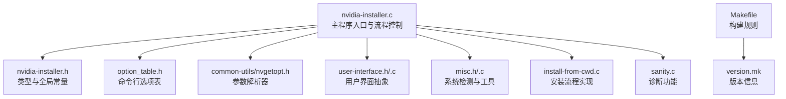
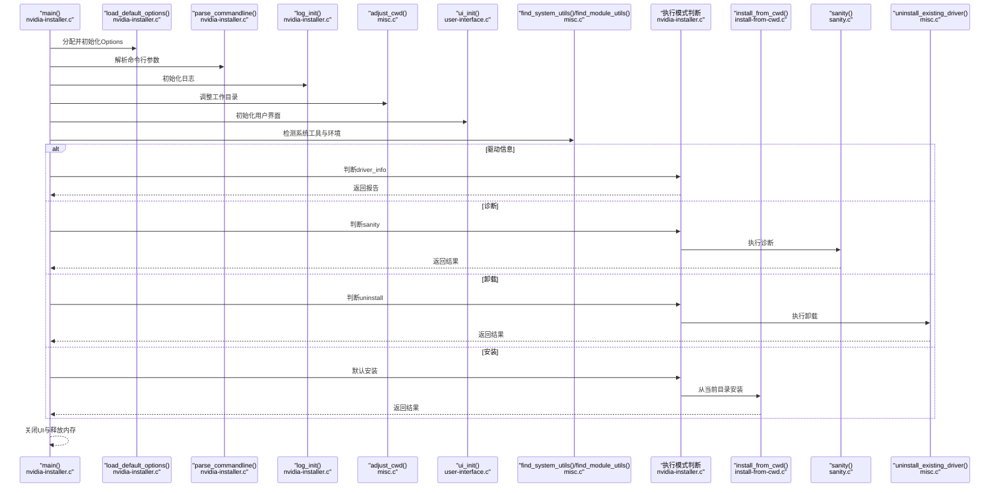
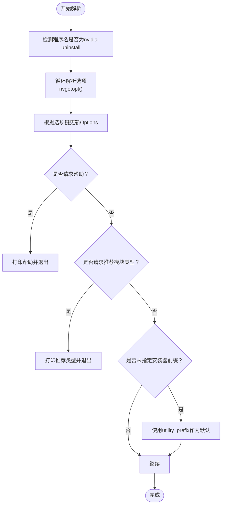
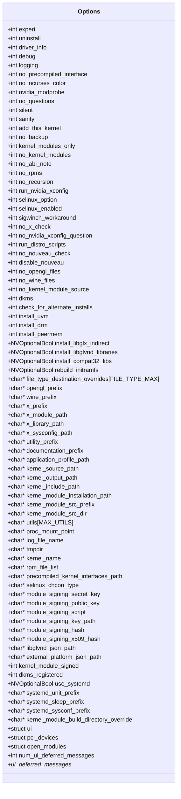
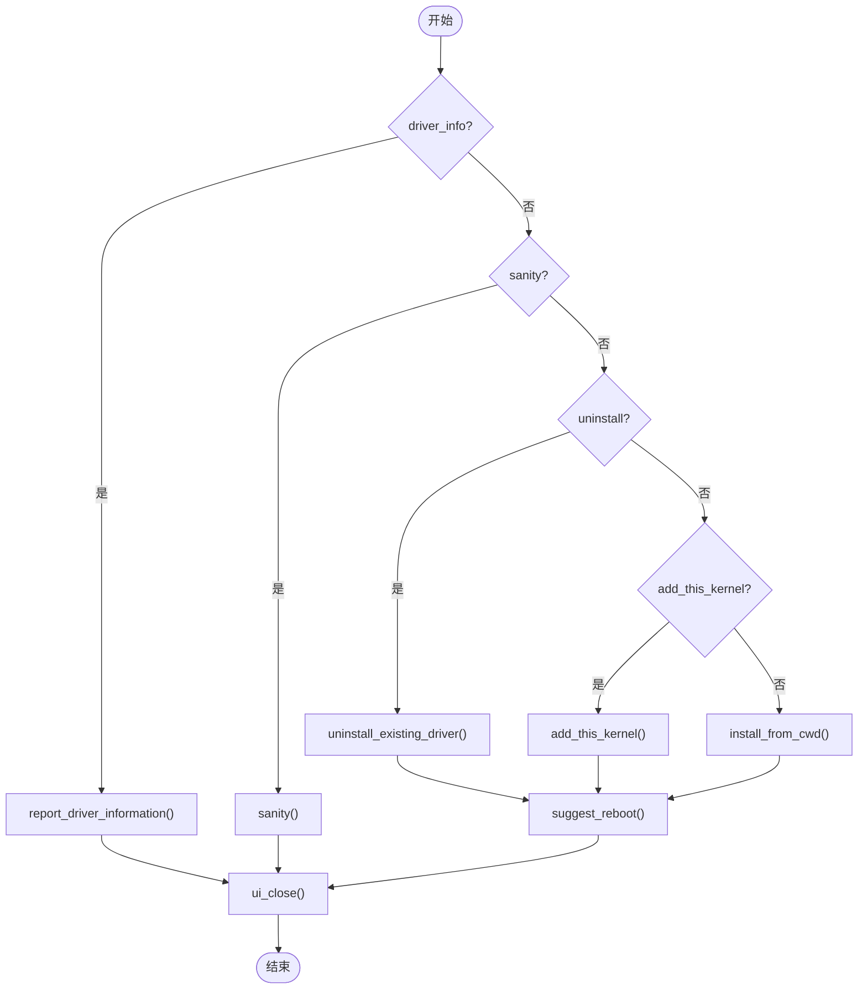
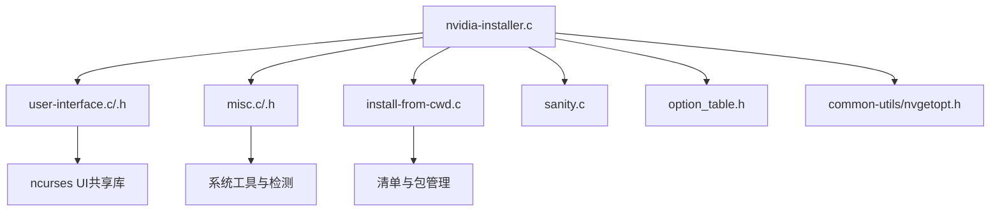

# 核心程序架构

<cite>
**本文档引用的文件**
- [nvidia-installer.c](file://nvidia-installer.c)
- [nvidia-installer.h](file://nvidia-installer.h)
- [option_table.h](file://option_table.h)
- [nvgetopt.h](file://common-utils/nvgetopt.h)
- [common-utils.h](file://common-utils/common-utils.h)
- [user-interface.h](file://user-interface.h)
- [user-interface.c](file://user-interface.c)
- [misc.h](file://misc.h)
- [misc.c](file://misc.c)
- [install-from-cwd.c](file://install-from-cwd.c)
- [sanity.c](file://sanity.c)
- [Makefile](file://Makefile)
- [version.mk](file://version.mk)
</cite>

## 目录
1. [简介](#简介)
2. [项目结构](#项目结构)
3. [核心组件](#核心组件)
4. [架构总览](#架构总览)
5. [详细组件分析](#详细组件分析)
6. [依赖关系分析](#依赖关系分析)
7. [性能考量](#性能考量)
8. [故障排除指南](#故障排除指南)
9. [结论](#结论)

## 简介
本文件面向NVIDIA安装程序的核心程序架构，聚焦于主程序入口点设计、命令行参数解析流程、选项配置管理、程序执行流程控制与错误处理策略。文档从代码级视角剖析Options结构体的设计模式、参数验证与错误处理、初始化序列（默认值加载、系统环境检测、依赖项验证）、以及三种执行模式（安装、卸载、诊断）的分支逻辑与流程控制，并通过架构图与序列图展示组件间的调用关系与数据流。

## 项目结构
该项目采用分层模块化组织：
- 核心入口与主流程：nvidia-installer.c
- 类型与全局常量定义：nvidia-installer.h
- 命令行选项表与解析器：option_table.h + common-utils/nvgetopt.h
- 用户界面抽象：user-interface.h + user-interface.c
- 杂项工具与系统检测：misc.h + misc.c
- 安装流程实现：install-from-cwd.c
- 诊断功能：sanity.c
- 构建系统：Makefile + version.mk

**图表来源**
- [nvidia-installer.c:648-761](file://nvidia-installer.c#L648-L761)
- [nvidia-installer.h:185-342](file://nvidia-installer.h#L185-L342)
- [option_table.h:126-789](file://option_table.h#L126-L789)
- [nvgetopt.h:135-205](file://common-utils/nvgetopt.h#L135-L205)
- [user-interface.h:36-56](file://user-interface.h#L36-L56)
- [misc.h:69-119](file://misc.h#L69-L119)
- [install-from-cwd.c:96-199](file://install-from-cwd.c#L96-L199)
- [sanity.c:33-85](file://sanity.c#L33-L85)
- [Makefile:52-251](file://Makefile#L52-L251)
- [version.mk:1-12](file://version.mk#L1-L12)

**章节来源**
- [nvidia-installer.c:648-761](file://nvidia-installer.c#L648-L761)
- [Makefile:52-251](file://Makefile#L52-L251)

## 核心组件
- Options结构体：集中存储所有运行时配置与状态，贯穿整个安装生命周期。字段覆盖UI选择、路径前缀、内核模块构建参数、SELinux与systemd支持、并发度等。
- 命令行解析器：基于nvgetopt的选项表驱动解析，支持布尔开关、字符串与整数参数，以及“--no-”禁用语义。
- 用户界面抽象：支持动态加载ncurses UI或回退到内置流式UI，统一消息输出与交互。
- 系统检测与工具：负责权限检查、系统工具发现、SELinux与systemd检测、X服务器查询、PCI设备扫描等。
- 安装流程：从当前目录解析清单、校验前置条件、执行预/后钩子、构建与安装内核模块及用户态组件。
- 诊断功能：对现有安装进行完整性检查。

**章节来源**
- [nvidia-installer.h:185-342](file://nvidia-installer.h#L185-L342)
- [nvgetopt.h:135-205](file://common-utils/nvgetopt.h#L135-L205)
- [user-interface.h:36-56](file://user-interface.h#L36-L56)
- [misc.h:69-119](file://misc.h#L69-L119)
- [install-from-cwd.c:96-199](file://install-from-cwd.c#L96-L199)
- [sanity.c:33-85](file://sanity.c#L33-L85)

## 架构总览
下图展示了主程序入口的高层调用关系与数据流。

**图表来源**
- [nvidia-installer.c:648-761](file://nvidia-installer.c#L648-L761)
- [nvidia-installer.c:119-157](file://nvidia-installer.c#L119-L157)
- [nvidia-installer.c:225-640](file://nvidia-installer.c#L225-L640)
- [misc.c:100-156](file://misc.c#L100-L156)
- [user-interface.c:116-200](file://user-interface.c#L116-L200)
- [install-from-cwd.c:96-199](file://install-from-cwd.c#L96-L199)
- [sanity.c:33-85](file://sanity.c#L33-L85)

## 详细组件分析

### 主程序入口与执行流程控制
- 入口函数main()负责：
  - 设置umask以确保文件权限一致
  - 加载默认选项
  - 扫描PCI设备
  - 解析命令行参数
  - 初始化日志
  - 调整工作目录
  - 初始化用户界面
  - 并发度设置
  - 权限检查（非add-this-kernel）
  - 系统工具与模块工具发现、SELinux与systemd检测
  - 查询X服务器版本
  - 获取默认安装前缀与路径
  - 根据Options标志选择执行模式并返回结果
  - 收尾：建议重启、关闭UI、释放内存

关键实现位置：
- [main()函数:648-761](file://nvidia-installer.c#L648-L761)
- [load_default_options():119-157](file://nvidia-installer.c#L119-L157)
- [parse_commandline():225-640](file://nvidia-installer.c#L225-L640)

**章节来源**
- [nvidia-installer.c:648-761](file://nvidia-installer.c#L648-L761)
- [nvidia-installer.c:119-157](file://nvidia-installer.c#L119-L157)
- [nvidia-installer.c:225-640](file://nvidia-installer.c#L225-L640)

### 命令行参数解析与选项配置管理
- 基于nvgetopt的选项表驱动解析，支持：
  - 字符与长选项
  - 布尔开关（含“--no-”禁用）
  - 字符串与整数参数
  - 帮助打印（基础/高级）
  - 仅卸载模式可用的选项掩码
- parse_commandline()完成：
  - 识别“nvidia-uninstall”别名
  - 解析各选项到Options结构体
  - 参数合法性检查与错误处理
  - 默认日志文件名设置
  - 特殊选项处理（如文件类型目标覆盖）

关键实现位置：
- [nvgetopt接口定义:135-205](file://common-utils/nvgetopt.h#L135-L205)
- [选项表定义:126-789](file://option_table.h#L126-789)
- [parse_commandline():225-640](file://nvidia-installer.c#L225-L640)

**图表来源**
- [nvidia-installer.c:225-640](file://nvidia-installer.c#L225-L640)
- [nvgetopt.h:135-205](file://common-utils/nvgetopt.h#L135-L205)
- [option_table.h:126-789](file://option_table.h#L126-L789)

**章节来源**
- [nvgetopt.h:135-205](file://common-utils/nvgetopt.h#L135-L205)
- [option_table.h:126-789](file://option_table.h#L126-L789)
- [nvidia-installer.c:225-640](file://nvidia-installer.c#L225-L640)

### Options结构体设计模式与数据流
- 设计要点：
  - 统一的配置中心，贯穿安装全生命周期
  - 使用位域标记关键状态（如是否已检测到运行中的内核模块）
  - 可选布尔类型NVOptionalBool用于“默认/真/假”的三态语义
  - 大量路径与前缀字段，便于跨发行版适配
- 数据流：
  - parse_commandline()填充Options
  - 后续各模块读取Options决定行为
  - 结果通过返回值与UI反馈传达给用户

关键实现位置：
- [Options结构体定义:185-342](file://nvidia-installer.h#L185-342)
- [NVOptionalBool枚举:135-139](file://common-utils/common-utils.h#L135-139)

**图表来源**
- [nvidia-installer.h:185-342](file://nvidia-installer.h#L185-L342)
- [common-utils/common-utils.h:135-139](file://common-utils/common-utils.h#L135-L139)

**章节来源**
- [nvidia-installer.h:185-342](file://nvidia-installer.h#L185-L342)
- [common-utils/common-utils.h:135-139](file://common-utils/common-utils.h#L135-L139)

### 程序初始化序列与系统环境检测
- 初始化步骤：
  - 加载默认选项（load_default_options）
  - 扫描PCI设备（pci_device_scan）
  - 解析命令行（parse_commandline）
  - 初始化日志（log_init）
  - 调整工作目录（adjust_cwd）
  - 初始化UI（ui_init）
  - 并发度设置（set_concurrency_level）
  - 权限检查（check_euid）
  - 系统工具与模块工具发现（find_system_utils/find_module_utils）
  - SELinux与systemd检测（check_selinux/check_systemd）
  - 查询X服务器版本（query_xorg_version）
  - 获取默认安装前缀与路径（get_default_prefixes_and_paths）

关键实现位置：
- [load_default_options():119-157](file://nvidia-installer.c#L119-L157)
- [misc.c中相关函数原型:69-119](file://misc.h#L69-L119)
- [misc.c中具体实现:100-156](file://misc.c#L100-L156)

**章节来源**
- [nvidia-installer.c:119-157](file://nvidia-installer.c#L119-L157)
- [misc.h:69-119](file://misc.h#L69-L119)
- [misc.c:100-156](file://misc.c#L100-L156)

### 执行模式分支逻辑与流程控制
- 模式判定顺序：
  - driver_info：直接报告驱动信息
  - sanity：执行诊断测试
  - uninstall：卸载现有驱动
  - add_this_kernel：为目标内核添加模块
  - 默认：从当前目录安装
- 每个模式对应独立流程，最终统一收尾并可建议重启

关键实现位置：
- [main()中的模式分支:720-747](file://nvidia-installer.c#L720-L747)
- [sanity():33-85](file://sanity.c#L33-L85)
- [install_from_cwd():96-199](file://install-from-cwd.c#L96-L199)

**图表来源**
- [nvidia-installer.c:720-747](file://nvidia-installer.c#L720-L747)
- [sanity.c:33-85](file://sanity.c#L33-L85)
- [install-from-cwd.c:96-199](file://install-from-cwd.c#L96-L199)

**章节来源**
- [nvidia-installer.c:720-747](file://nvidia-installer.c#L720-L747)
- [sanity.c:33-85](file://sanity.c#L33-L85)
- [install-from-cwd.c:96-199](file://install-from-cwd.c#L96-L199)

### 错误处理策略与参数验证
- 参数验证：
  - parse_commandline()对非法参数直接报错并退出
  - 对特定选项（如强制TLS、网络相关选项）发出弃用警告
  - 对布尔选项的“--no-”形式进行正确解析
- 运行时错误：
  - 权限不足时提示需以root运行
  - UI初始化失败回退到内置流式UI
  - 钩子脚本失败时询问用户是否继续
- 内存管理：
  - 失败路径释放Options内存并退出

关键实现位置：
- [parse_commandline()错误路径:635-639](file://nvidia-installer.c#L635-L639)
- [check_euid():100-113](file://misc.c#L100-L113)
- [ui_init()回退逻辑:189-192](file://user-interface.c#L189-L192)

**章节来源**
- [nvidia-installer.c:635-639](file://nvidia-installer.c#L635-L639)
- [misc.c:100-113](file://misc.c#L100-L113)
- [user-interface.c:189-192](file://user-interface.c#L189-L192)

## 依赖关系分析
- 模块耦合：
  - nvidia-installer.c依赖所有子模块（UI、系统检测、安装流程、诊断）
  - UI模块通过动态加载共享库实现插件化
  - 选项表与解析器解耦于具体业务逻辑
- 外部依赖：
  - ncurses系列UI库（可选）
  - 系统工具（ldconfig、grep、dmseg、modprobe等）
  - SELinux与systemd工具
  - PCI访问库用于设备检测

**图表来源**
- [nvidia-installer.c:648-761](file://nvidia-installer.c#L648-L761)
- [user-interface.c:116-200](file://user-interface.c#L116-L200)
- [misc.h:69-119](file://misc.h#L69-L119)
- [install-from-cwd.c:96-199](file://install-from-cwd.c#L96-L199)
- [sanity.c:33-85](file://sanity.c#L33-L85)
- [option_table.h:126-789](file://option_table.h#L126-L789)
- [nvgetopt.h:135-205](file://common-utils/nvgetopt.h#L135-L205)

**章节来源**
- [nvidia-installer.c:648-761](file://nvidia-installer.c#L648-L761)
- [user-interface.c:116-200](file://user-interface.c#L116-L200)
- [misc.h:69-119](file://misc.h#L69-L119)
- [install-from-cwd.c:96-199](file://install-from-cwd.c#L96-L199)
- [sanity.c:33-85](file://sanity.c#L33-L85)
- [option_table.h:126-789](file://option_table.h#L126-L789)
- [nvgetopt.h:135-205](file://common-utils/nvgetopt.h#L135-L205)

## 性能考量
- 并发度控制：通过并发级别设置提升内核模块构建等可并行任务的吞吐
- I/O优化：临时目录优先级与日志文件路径在早期确定，减少后续重定位
- UI选择：优先尝试ncurses UI，失败回退内置流式UI，避免阻塞安装流程
- 依赖检测：按需查找系统工具，避免不必要的探测开销

[本节为通用指导，不直接分析具体文件]

## 故障排除指南
- 权限问题：确认以root身份运行
  - 参考：[check_euid():100-113](file://misc.c#L100-L113)
- UI初始化失败：检查ncurses库版本与可用性，系统会自动回退
  - 参考：[ui_init():116-200](file://user-interface.c#L116-L200)
- 命令行参数错误：使用帮助选项查看可用参数
  - 参考：[parse_commandline()错误路径:635-639](file://nvidia-installer.c#L635-L639)
- SELinux与systemd：根据提示调整安全上下文或禁用相关功能
  - 参考：[misc.c中的相关检测函数:80-112](file://misc.h#L80-L112)
- 诊断模式：用于验证现有安装完整性
  - 参考：[sanity():33-85](file://sanity.c#L33-L85)

**章节来源**
- [misc.c:100-113](file://misc.c#L100-L113)
- [user-interface.c:116-200](file://user-interface.c#L116-L200)
- [nvidia-installer.c:635-639](file://nvidia-installer.c#L635-L639)
- [sanity.c:33-85](file://sanity.c#L33-L85)

## 结论
该核心程序架构以Options为中心，结合nvgetopt选项表驱动的命令行解析、可插拔的用户界面与完善的系统环境检测，实现了安装、卸载、诊断三大模式的清晰分离与稳健执行。通过严格的错误处理与回退策略，保证了在复杂异构Linux环境下的可靠性与可维护性。建议在扩展新功能时遵循现有模式，保持Options为中心的配置管理与UI抽象的一致性。