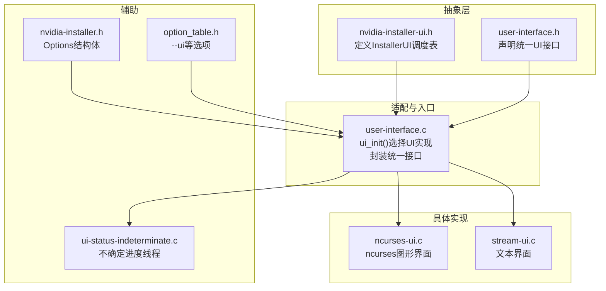
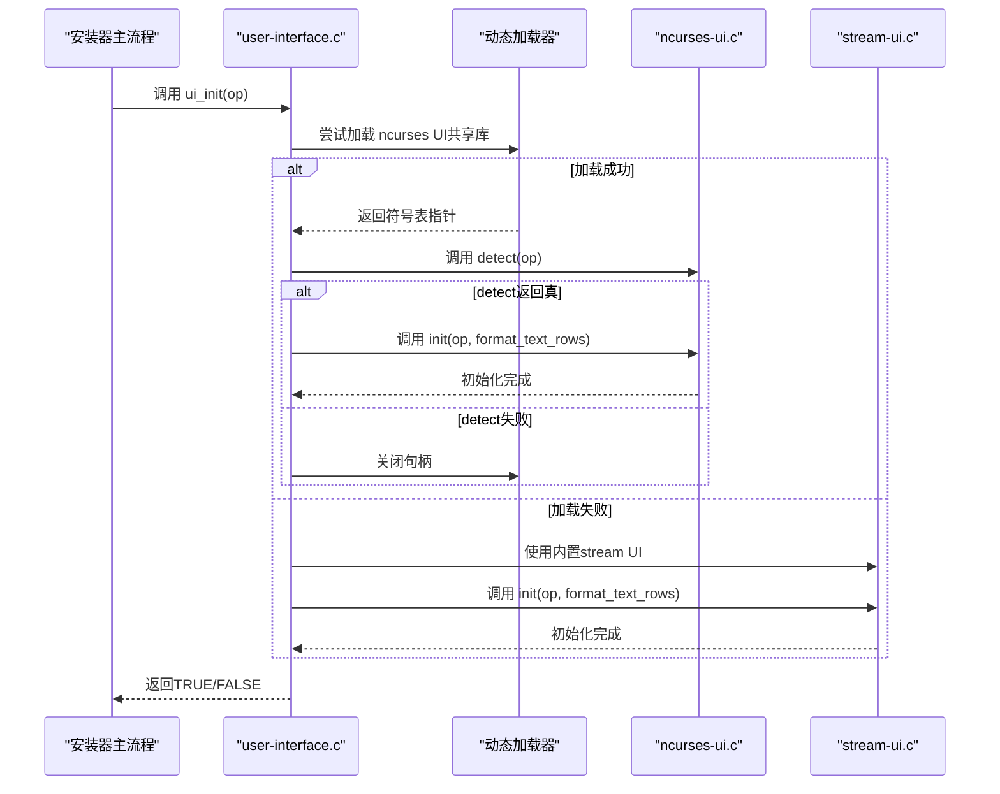
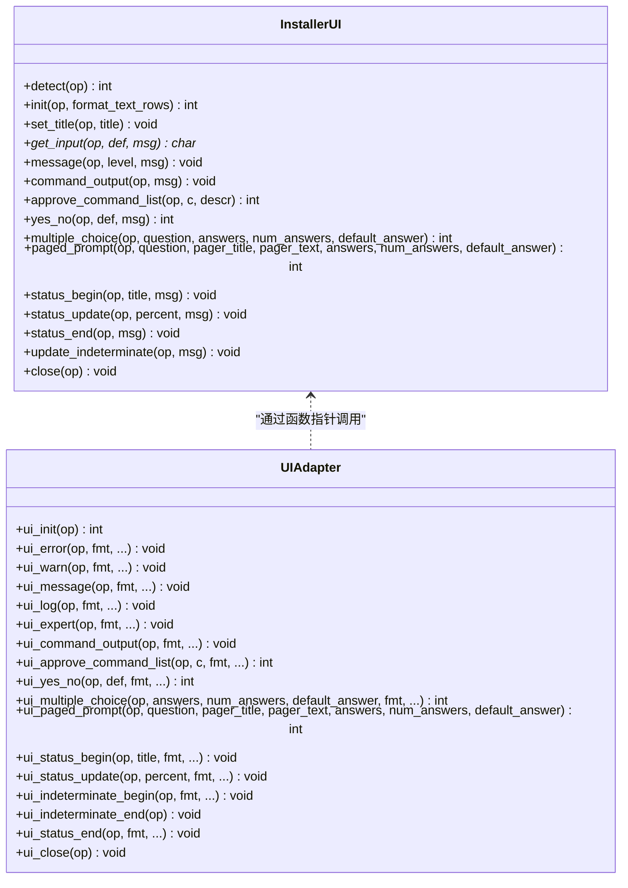
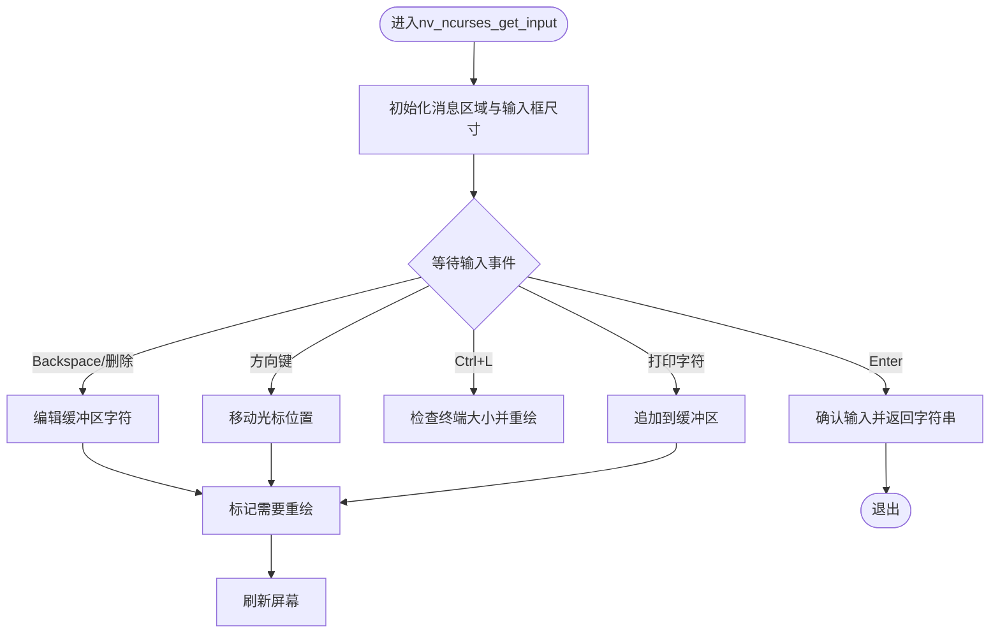
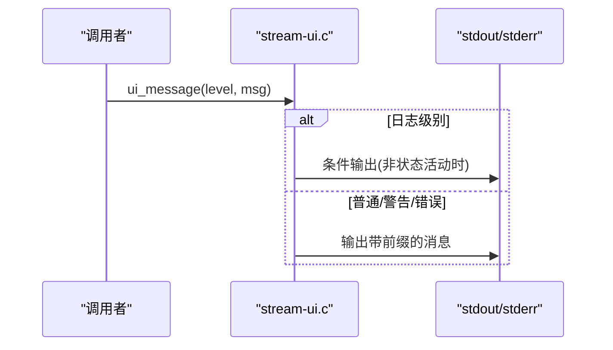
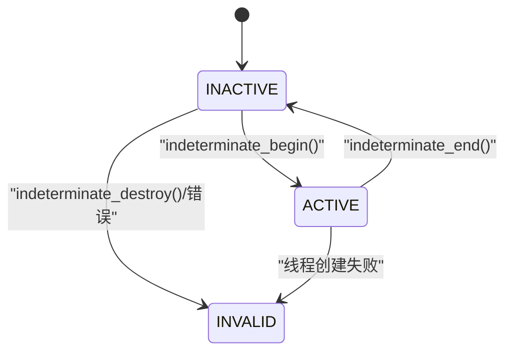
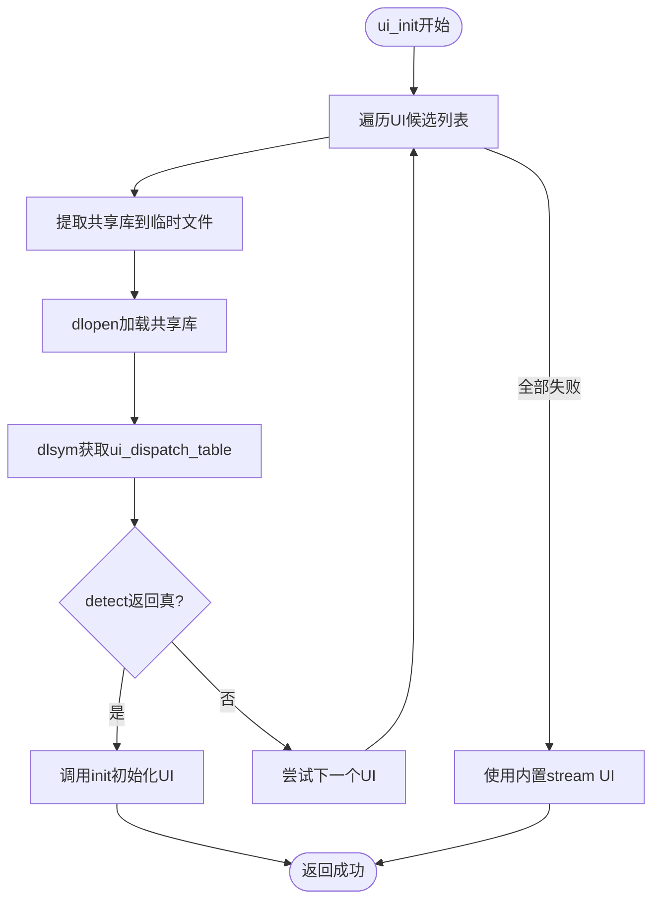
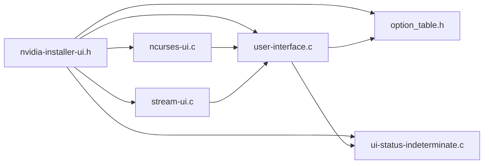

# 用户界面架构

<cite>
**本文档引用的文件**
- [nvidia-installer-ui.h](file://nvidia-installer-ui.h)
- [user-interface.h](file://user-interface.h)
- [user-interface.c](file://user-interface.c)
- [ncurses-ui.c](file://ncurses-ui.c)
- [stream-ui.c](file://stream-ui.c)
- [nvidia-installer.h](file://nvidia-installer.h)
- [ui-status-indeterminate.c](file://ui-status-indeterminate.c)
- [ui-status-indeterminate.h](file://ui-status-indeterminate.h)
- [option_table.h](file://option_table.h)
</cite>

## 目录
1. [简介](#简介)
2. [项目结构](#项目结构)
3. [核心组件](#核心组件)
4. [架构总览](#架构总览)
5. [详细组件分析](#详细组件分析)
6. [依赖关系分析](#依赖关系分析)
7. [性能考虑](#性能考虑)
8. [故障排除指南](#故障排除指南)
9. [结论](#结论)

## 简介
本文件系统性地解析NVIDIA安装程序的用户界面（UI）架构，重点阐述UI抽象层的设计原理、策略模式的应用以及多界面实现支持。文档覆盖以下关键点：
- 抽象层InstallerUI的设计与策略模式应用
- NCurses界面与文本界面（stream UI）的实现差异：初始化、事件处理、渲染机制
- UI接口的统一抽象：消息传递、进度报告、用户交互的标准化接口
- 不同界面模式的切换机制与适配策略
- 具体代码示例路径：ui_init()、ui_info()、ui_error()等核心函数
- 界面架构图：抽象层与具体实现的关系

## 项目结构
该仓库采用“抽象层 + 多实现”的模块化组织方式：
- 抽象层定义：nvidia-installer-ui.h中定义InstallerUI调度表
- 统一入口与适配：user-interface.c负责选择并初始化具体UI实现
- 具体实现：
  - ncurses-ui.c：基于ncurses的图形化界面
  - stream-ui.c：基于标准输出/输入的文本界面
- 进度指示器线程：ui-status-indeterminate.c提供不确定进度的并发更新
- 配置与选项：option_table.h定义--ui等命令行选项

图表来源
- [nvidia-installer-ui.h:39-176](file://nvidia-installer-ui.h#L39-L176)
- [user-interface.h:36-61](file://user-interface.h#L36-L61)
- [user-interface.c:116-238](file://user-interface.c#L116-L238)
- [ncurses-ui.c:245-261](file://ncurses-ui.c#L245-L261)
- [stream-ui.c:59-75](file://stream-ui.c#L59-L75)
- [ui-status-indeterminate.c:30-125](file://ui-status-indeterminate.c#L30-L125)
- [nvidia-installer.h:316-321](file://nvidia-installer.h#L316-L321)
- [option_table.h:393-399](file://option_table.h#L393-L399)

章节来源
- [nvidia-installer-ui.h:39-176](file://nvidia-installer-ui.h#L39-L176)
- [user-interface.h:36-61](file://user-interface.h#L36-L61)
- [user-interface.c:116-238](file://user-interface.c#L116-L238)
- [ncurses-ui.c:245-261](file://ncurses-ui.c#L245-L261)
- [stream-ui.c:59-75](file://stream-ui.c#L59-L75)
- [ui-status-indeterminate.c:30-125](file://ui-status-indeterminate.c#L30-L125)
- [nvidia-installer.h:316-321](file://nvidia-installer.h#L316-L321)
- [option_table.h:393-399](file://option_table.h#L393-L399)

## 核心组件
- InstallerUI调度表：定义了UI必须提供的函数指针集合，包括detect/init/set_title/get_input/message/command_output/approve_command_list/yes_no/multiple_choice/paged_prompt/status_begin/status_update/status_end/update_indeterminate/close等。
- 统一UI接口：user-interface.c提供对上层业务逻辑的统一调用接口，如ui_init/ui_set_title/ui_get_input/ui_error/ui_warn/ui_message/ui_log/ui_expert/ui_command_output/ui_approve_command_list/ui_yes_no/ui_multiple_choice/ui_paged_prompt/ui_status_begin/ui_status_update/ui_indeterminate_begin/ui_indeterminate_end/ui_status_end/ui_close等。
- 具体UI实现：
  - ncurses-ui.c：实现InstallerUI调度表，提供基于ncurses的窗口、区域、按钮、分页器等渲染与事件处理。
  - stream-ui.c：实现InstallerUI调度表，提供基于printf/fgets的纯文本交互与状态条显示。
- 不确定进度线程：ui-status-indeterminate.c提供跨线程安全的状态管理与工作线程启动/结束。
- Options结构体：nvidia-installer.h中的Options包含ui字段，保存当前UI实例的私有数据、状态标志与不确定进度数据。

章节来源
- [nvidia-installer-ui.h:39-176](file://nvidia-installer-ui.h#L39-L176)
- [user-interface.h:36-61](file://user-interface.h#L36-L61)
- [user-interface.c:116-238](file://user-interface.c#L116-L238)
- [ncurses-ui.c:245-261](file://ncurses-ui.c#L245-L261)
- [stream-ui.c:59-75](file://stream-ui.c#L59-L75)
- [ui-status-indeterminate.c:30-125](file://ui-status-indeterminate.c#L30-L125)
- [nvidia-installer.h:316-321](file://nvidia-installer.h#L316-L321)

## 架构总览
UI架构采用策略模式：抽象层InstallerUI定义统一接口，具体UI实现作为策略被动态选择与初始化。user-interface.c在运行时通过dlopen/dlsym加载共享库或回退到内置stream UI，随后调用具体UI的detect/init完成初始化。

图表来源
- [user-interface.c:116-238](file://user-interface.c#L116-L238)
- [ncurses-ui.c:281-301](file://ncurses-ui.c#L281-L301)
- [stream-ui.c:174-194](file://stream-ui.c#L174-L194)

章节来源
- [user-interface.c:116-238](file://user-interface.c#L116-L238)
- [ncurses-ui.c:281-301](file://ncurses-ui.c#L281-L301)
- [stream-ui.c:174-194](file://stream-ui.c#L174-L194)

## 详细组件分析

### 抽象层：InstallerUI与统一接口
- InstallerUI调度表：包含detect/init/set_title/get_input/message/command_output/approve_command_list/yes_no/multiple_choice/paged_prompt/status_begin/status_update/status_end/update_indeterminate/close等函数指针，确保所有UI实现提供一致的行为契约。
- 统一UI接口：user-interface.c封装了对上层的调用，如ui_error/ui_warn/ui_message/ui_log/ui_expert/ui_command_output/ui_approve_command_list/ui_yes_no/ui_multiple_choice/ui_paged_prompt/ui_status_begin/ui_status_update/ui_indeterminate_begin/ui_indeterminate_end/ui_status_end/ui_close等，内部转发到当前__ui->对应函数指针。
- 消息级别：NV_MSG_LEVEL_LOG/NV_MSG_LEVEL_MESSAGE/NV_MSG_LEVEL_WARNING/NV_MSG_LEVEL_ERROR，用于区分日志、普通消息、警告与错误。
- 进度模型：status_begin/status_update/status_end配合update_indeterminate实现确定/不确定两种进度指示；ui_indeterminate_begin通过线程循环调用update_indeterminate刷新。

图表来源
- [nvidia-installer-ui.h:39-176](file://nvidia-installer-ui.h#L39-L176)
- [user-interface.h:36-61](file://user-interface.h#L36-L61)
- [user-interface.c:116-238](file://user-interface.c#L116-L238)

章节来源
- [nvidia-installer-ui.h:39-176](file://nvidia-installer-ui.h#L39-L176)
- [user-interface.h:36-61](file://user-interface.h#L36-L61)
- [user-interface.c:116-238](file://user-interface.c#L116-L238)

### NCurses界面实现
- 初始化与检测：nv_ncurses_detect检查终端尺寸与ncurses初始化；nv_ncurses_init设置颜色、无回显、按键处理、创建头部/底部/消息区域等。
- 输入处理：nv_ncurses_get_input实现输入框绘制、光标移动、退格/删除键、左右导航、打印调试信息、回车确认等。
- 消息与按钮：nv_ncurses_message绘制消息区域、按钮动画、等待回车确认。
- 命令列表审批：nv_ncurses_approve_command_list生成命令列表文本并通过分页提示器展示。
- 分页器：nv_ncurses_paged_prompt实现可滚动的分页显示与按钮选择。
- 进度条：nv_ncurses_status_begin/status_update/status_end实现带百分比的进度条与消息更新。
- 不确定进度：nv_ncurses_update_indeterminate在不确定状态下循环刷新。
- 文本格式化：依赖nv_format_text_rows与TextRows结构进行自动换行与缩进。

图表来源
- [ncurses-ui.c:405-634](file://ncurses-ui.c#L405-L634)

章节来源
- [ncurses-ui.c:281-374](file://ncurses-ui.c#L281-L374)
- [ncurses-ui.c:405-634](file://ncurses-ui.c#L405-L634)
- [ncurses-ui.c:642-739](file://ncurses-ui.c#L642-L739)
- [ncurses-ui.c:766-790](file://ncurses-ui.c#L766-L790)
- [ncurses-ui.c:210-217](file://ncurses-ui.c#L210-L217)
- [ncurses-ui.c:256-258](file://ncurses-ui.c#L256-L258)

### 文本界面（Stream UI）实现
- 初始化：stream_init打印欢迎信息并注册SIGWINCH信号处理器。
- 输入：stream_get_input打印提示与默认值，从stdin读取一行并处理空输入。
- 消息：stream_message根据消息级别输出到stdout/stderr，并控制是否换行。
- 命令输出：stream_command_output仅在专家模式且非状态活动时输出。
- 审批：stream_approve_command_list列出命令并询问确认。
- 选择：stream_multiple_choice与stream_paged_prompt分别处理数字索引与名称选择。
- 进度：print_status_bar实现状态条与百分比显示，支持不确定模式滚动指示。
- 关闭：stream_close释放私有数据。

图表来源
- [stream-ui.c:243-272](file://stream-ui.c#L243-L272)

章节来源
- [stream-ui.c:174-194](file://stream-ui.c#L174-L194)
- [stream-ui.c:216-234](file://stream-ui.c#L216-L234)
- [stream-ui.c:243-272](file://stream-ui.c#L243-L272)
- [stream-ui.c:298-323](file://stream-ui.c#L298-L323)
- [stream-ui.c:404-435](file://stream-ui.c#L404-L435)
- [stream-ui.c:446-462](file://stream-ui.c#L446-L462)
- [stream-ui.c:471-517](file://stream-ui.c#L471-L517)
- [stream-ui.c:525-531](file://stream-ui.c#L525-L531)

### 不确定进度线程与状态管理
- 数据结构：IndeterminateData封装互斥锁、工作线程与状态枚举。
- 生命周期：
  - indeterminate_init：分配并初始化互斥锁，初始状态为INDETERMINATE_INACTIVE。
  - indeterminate_begin：若已有线程则先结束，再创建新线程执行worker(args)，状态置为INDETERMINATE_ACTIVE。
  - indeterminate_end：设置状态为INDETERMINATE_INACTIVE并等待线程结束。
  - indeterminate_get：原子获取状态，失败返回INDETERMINATE_INVALID。
- UI集成：ui_indeterminate_begin在独立线程中循环调用update_indeterminate，直到ui_indeterminate_end触发结束。

图表来源
- [ui-status-indeterminate.h:31-47](file://ui-status-indeterminate.h#L31-L47)
- [ui-status-indeterminate.c:30-125](file://ui-status-indeterminate.c#L30-L125)
- [user-interface.c:580-626](file://user-interface.c#L580-L626)

章节来源
- [ui-status-indeterminate.h:31-47](file://ui-status-indeterminate.h#L31-L47)
- [ui-status-indeterminate.c:30-125](file://ui-status-indeterminate.c#L30-L125)
- [user-interface.c:580-626](file://user-interface.c#L580-L626)

### UI切换机制与适配策略
- 选择顺序：优先尝试ncurses6/ncurses/ncursesw6共享库，若均失败则回退到内置stream UI。
- 动态加载：使用dlopen/dlsym加载共享库并查找ui_dispatch_table符号，再调用detect以验证环境。
- 回退策略：若detect失败或加载失败，记录日志并继续尝试下一个UI；最终必定使用内置stream UI。
- 选项控制：--ui=ncurses/--ui=none/--ui=none等选项可强制指定UI类型或禁用UI。
- 临时文件：UI共享库以嵌入二进制形式存在，运行时提取到临时文件后加载，避免外部依赖。

图表来源
- [user-interface.c:116-238](file://user-interface.c#L116-L238)
- [user-interface.c:683-754](file://user-interface.c#L683-L754)

章节来源
- [user-interface.c:116-238](file://user-interface.c#L116-L238)
- [user-interface.c:683-754](file://user-interface.c#L683-L754)
- [option_table.h:393-399](file://option_table.h#L393-L399)

## 依赖关系分析
- 抽象层依赖：nvidia-installer-ui.h定义InstallerUI；user-interface.h声明统一接口；nvidia-installer.h提供Options结构体与FormatTextRows类型。
- 实现依赖：
  - ncurses-ui.c依赖ncurses库与TextRows格式化工具。
  - stream-ui.c依赖标准I/O与信号处理。
- 运行时依赖：user-interface.c通过dlopen/dlsym动态加载UI共享库；ui-status-indeterminate.c依赖pthread实现不确定进度线程。
- 选项依赖：--ui选项影响UI选择；--silent/--no-questions/--no-ncurses-color等影响UI行为。

图表来源
- [nvidia-installer-ui.h:39-176](file://nvidia-installer-ui.h#L39-L176)
- [user-interface.c:116-238](file://user-interface.c#L116-L238)
- [ncurses-ui.c:245-261](file://ncurses-ui.c#L245-L261)
- [stream-ui.c:59-75](file://stream-ui.c#L59-L75)
- [ui-status-indeterminate.c:30-125](file://ui-status-indeterminate.c#L30-L125)
- [option_table.h:393-399](file://option_table.h#L393-L399)

章节来源
- [nvidia-installer-ui.h:39-176](file://nvidia-installer-ui.h#L39-L176)
- [user-interface.c:116-238](file://user-interface.c#L116-L238)
- [ncurses-ui.c:245-261](file://ncurses-ui.c#L245-L261)
- [stream-ui.c:59-75](file://stream-ui.c#L59-L75)
- [ui-status-indeterminate.c:30-125](file://ui-status-indeterminate.c#L30-L125)
- [option_table.h:393-399](file://option_table.h#L393-L399)

## 性能考虑
- UI初始化成本：ncurses UI在检测阶段会进行终端尺寸检查与颜色初始化，可能受终端能力限制；stream UI初始化开销较小。
- 文本格式化：ncurses UI大量使用TextRows格式化与区域绘制，建议在长文本场景下避免频繁重绘。
- 不确定进度线程：通过独立线程轮询update_indeterminate，避免阻塞主线程；注意pthread创建/销毁的开销。
- I/O吞吐：stream UI直接使用标准I/O，适合无终端环境；ncurses UI在复杂渲染时可能增加CPU占用。
- 选项优化：--silent可减少UI输出；--no-questions减少交互次数；--no-ncurses-color降低颜色初始化成本。

## 故障排除指南
- UI无法初始化：
  - 检查终端尺寸是否小于最小要求（ncurses UI）。
  - 确认ncurses库可用且颜色支持正常。
  - 使用--ui=none或--silent回退到内置文本UI。
- 交互卡死：
  - 在ncurses UI中按Ctrl+L可强制重新计算布局。
  - 检查SIGWINCH信号处理是否被其他进程覆盖。
- 进度不更新：
  - 确认ui_indeterminate_begin已调用且未提前结束。
  - 检查update_indeterminate回调是否被正确实现。
- 日志与消息：
  - NV_MSG_LEVEL_LOG仅在非状态活动时输出，避免与进度条冲突。
  - 使用ui_log/ui_expert分别输出日志与专家模式消息。

章节来源
- [ncurses-ui.c:281-301](file://ncurses-ui.c#L281-L301)
- [ncurses-ui.c:592-596](file://ncurses-ui.c#L592-L596)
- [user-interface.c:580-626](file://user-interface.c#L580-L626)
- [stream-ui.c:258-271](file://stream-ui.c#L258-L271)

## 结论
该UI架构通过抽象层与策略模式实现了高度解耦的多界面支持。抽象层InstallerUI定义统一契约，具体UI实现（ncurses与stream）分别面向图形化与纯文本场景。user-interface.c承担适配职责，动态选择并初始化UI，同时提供统一的高层接口。不确定进度通过线程模型实现，保证UI流畅性。整体设计兼顾可扩展性与兼容性，既能在现代终端中提供丰富的交互体验，也能在受限环境中稳定运行。