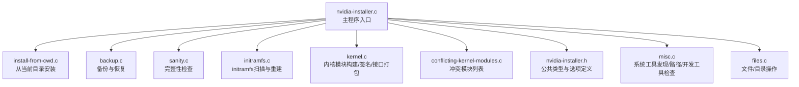
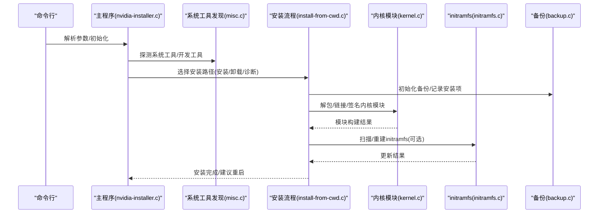
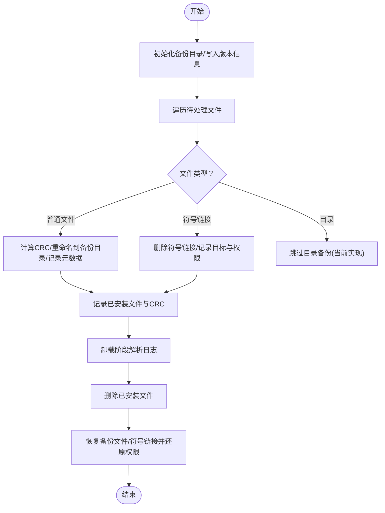
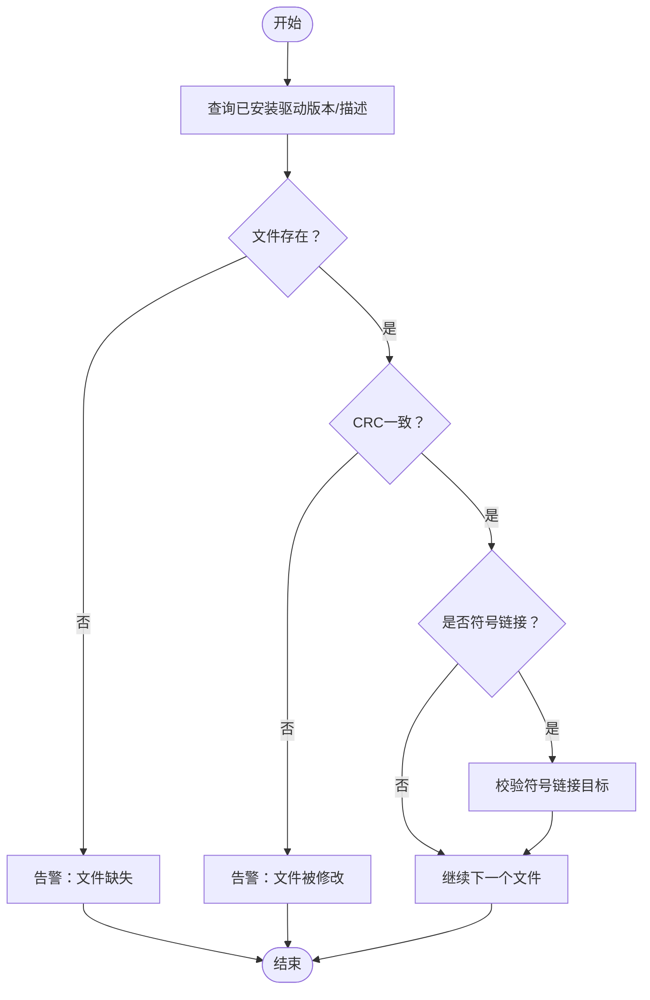
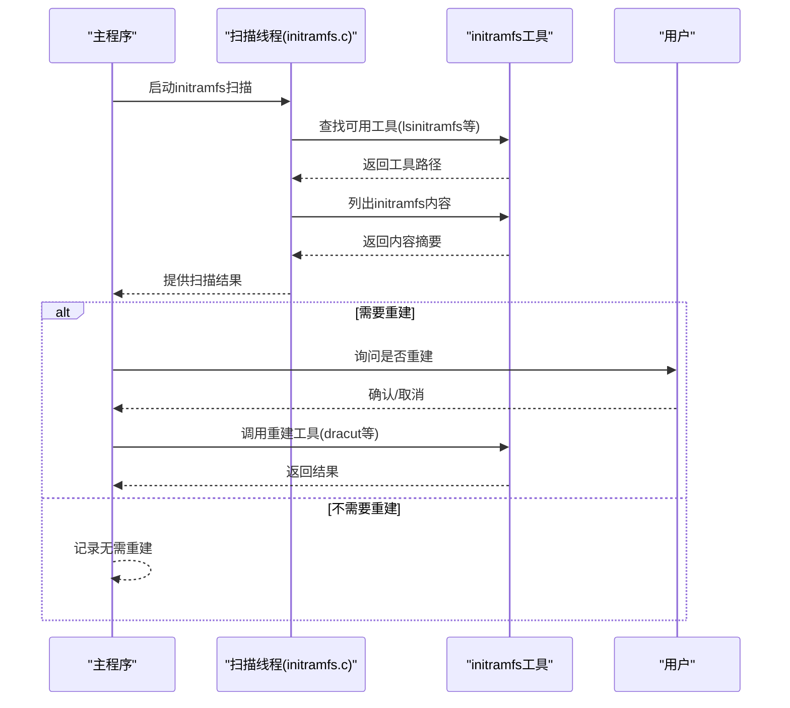
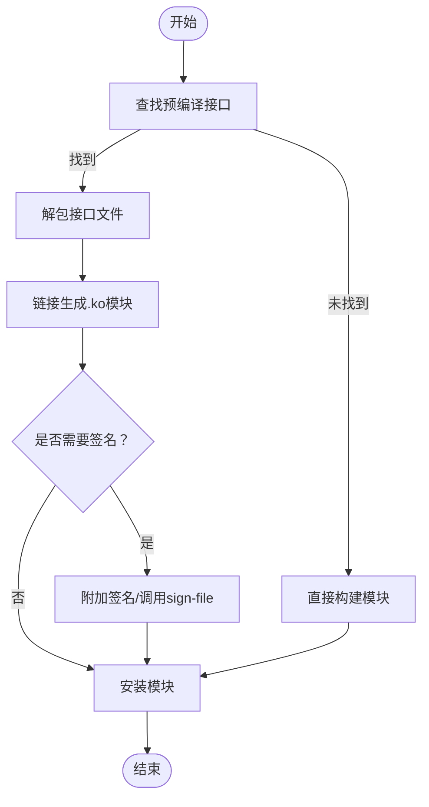
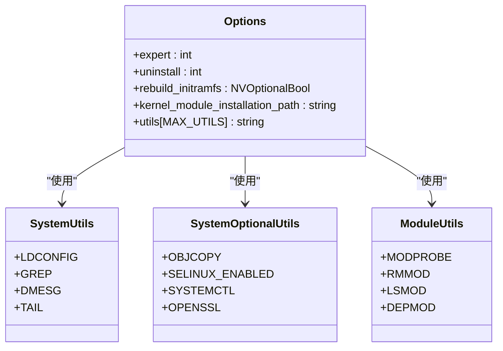
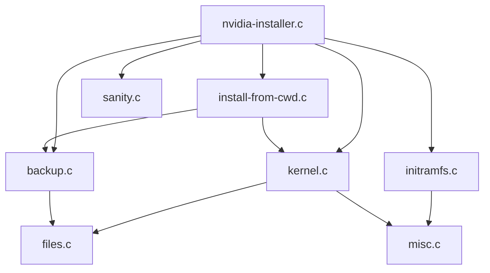

# 系统集成架构

<cite>
**本文档引用的文件**
- [nvidia-installer.c](file://nvidia-installer.c)
- [backup.c](file://backup.c)
- [sanity.c](file://sanity.c)
- [initramfs.c](file://initramfs.c)
- [initramfs.h](file://initramfs.h)
- [kernel.c](file://kernel.c)
- [conflicting-kernel-modules.c](file://conflicting-kernel-modules.c)
- [conflicting-kernel-modules.h](file://conflicting-kernel-modules.h)
- [nvidia-installer.h](file://nvidia-installer.h)
- [install-from-cwd.c](file://install-from-cwd.c)
- [files.c](file://files.c)
- [misc.c](file://misc.c)
- [README](file://README)
</cite>

## 目录
1. [引言](#引言)
2. [项目结构](#项目结构)
3. [核心组件](#核心组件)
4. [架构总览](#架构总览)
5. [详细组件分析](#详细组件分析)
6. [依赖分析](#依赖分析)
7. [性能考虑](#性能考虑)
8. [故障排查指南](#故障排查指南)
9. [结论](#结论)
10. [附录](#附录)

## 引言
本文件面向NVIDIA驱动安装器在Linux系统中的系统级集成架构，围绕备份恢复机制、完整性检查、系统工具集成以及initramfs集成进行深入解析。文档旨在帮助开发者与运维人员理解安装流程、关键控制点与错误处理策略，并提供可操作的优化建议与排障指引。

## 项目结构
该项目采用按功能域划分的文件组织方式，核心入口位于主程序文件，围绕“安装/卸载/校验/备份/内核模块构建/初始化镜像”等职责拆分模块化源文件，便于维护与扩展。

图表来源
- [nvidia-installer.c:648-762](file://nvidia-installer.c#L648-L762)
- [install-from-cwd.c:96-200](file://install-from-cwd.c#L96-L200)
- [backup.c:137-198](file://backup.c#L137-L198)
- [sanity.c:33-86](file://sanity.c#L33-L86)
- [initramfs.c:591-704](file://initramfs.c#L591-L704)
- [kernel.c:499-549](file://kernel.c#L499-L549)
- [conflicting-kernel-modules.c:29-47](file://conflicting-kernel-modules.c#L29-L47)
- [nvidia-installer.h:185-342](file://nvidia-installer.h#L185-L342)
- [misc.c:853-894](file://misc.c#L853-L894)
- [files.c:56-116](file://files.c#L56-L116)

章节来源
- [nvidia-installer.c:648-762](file://nvidia-installer.c#L648-L762)
- [README:1-134](file://README#L1-L134)

## 核心组件
- 主程序与命令行解析：负责初始化日志、用户界面、系统工具探测、并发度设置、权限检查、安装/卸载/诊断分支选择。
- 备份与恢复引擎：创建备份目录、记录备份日志、写入已安装文件清单、支持卸载回滚。
- 完整性检查：校验已安装文件存在性与一致性，辅助诊断安装后异常。
- 内核模块构建与签名：解包预编译接口、链接生成内核模块、可选附加签名。
- initramfs集成：自动扫描initramfs内容，识别冲突模块，引导用户或自动重建。
- 系统工具集成：统一发现与调用系统工具（如lsinitramfs/update-initramfs/dracut等），并进行能力检查。

章节来源
- [nvidia-installer.c:119-157](file://nvidia-installer.c#L119-L157)
- [nvidia-installer.c:648-762](file://nvidia-installer.c#L648-L762)
- [nvidia-installer.h:185-342](file://nvidia-installer.h#L185-L342)

## 架构总览
下图展示了安装器在系统中的关键交互与数据流：从命令行到系统工具、内核模块构建、initramfs更新与备份恢复，最终完成驱动安装与重启提示。

图表来源
- [nvidia-installer.c:648-762](file://nvidia-installer.c#L648-L762)
- [install-from-cwd.c:96-200](file://install-from-cwd.c#L96-L200)
- [kernel.c:499-549](file://kernel.c#L499-L549)
- [initramfs.c:591-704](file://initramfs.c#L591-L704)
- [backup.c:137-198](file://backup.c#L137-L198)

## 详细组件分析

### 备份与恢复机制
- 设计目标：在安装前对可能被覆盖的文件进行安全备份；在卸载时根据日志精确回退。
- 关键流程：
  - 初始化备份：创建/var/lib/nvidia目录，写入版本与描述。
  - 文件备份：常规文件重命名至备份目录，记录CRC、权限、属主；符号链接删除并记录目标与属性。
  - 安装记录：安装完成后记录已安装文件及其CRC，便于后续完整性检查。
  - 卸载回滚：解析备份日志，先删除已安装文件，再恢复备份文件与符号链接，还原权限与属主。
- 数据结构与复杂度：
  - 备份日志条目包含文件名、类型、CRC、权限、UID/GID等字段，线性扫描与排序用于目录递归删除。
  - 时间复杂度主要受待安装/卸载文件数量影响，空间复杂度与日志条目数线性相关。

图表来源
- [backup.c:137-198](file://backup.c#L137-L198)
- [backup.c:208-298](file://backup.c#L208-L298)
- [backup.c:302-362](file://backup.c#L302-L362)
- [backup.c:631-800](file://backup.c#L631-L800)

章节来源
- [backup.c:137-198](file://backup.c#L137-L198)
- [backup.c:208-298](file://backup.c#L208-L298)
- [backup.c:302-362](file://backup.c#L302-L362)
- [backup.c:631-800](file://backup.c#L631-L800)

### 完整性检查系统
- 功能概述：在已有驱动安装的前提下，检查所有已安装文件是否存在且未被篡改。
- 实现要点：
  - 获取当前已安装驱动版本与描述。
  - 遍历安装清单，逐项检查文件存在性与CRC一致性。
  - 对符号链接进行目标校验，避免误删或错配。
- 可扩展方向：可增加SELinux上下文、设备节点权限、内核配置项等检查。

图表来源
- [sanity.c:33-86](file://sanity.c#L33-L86)
- [misc.c:1243-1329](file://misc.c#L1243-L1329)

章节来源
- [sanity.c:33-86](file://sanity.c#L33-L86)
- [misc.c:1243-1329](file://misc.c#L1243-L1329)

### initramfs集成设计
- 扫描与识别：自动定位常见initramfs镜像文件名模式，使用lsinitramfs/lsinitrd/lsinitcpio等工具列出内容，检测Nouveau与NVIDIA内核模块。
- 重建决策：若检测到冲突模块或需要重建，则提示用户或自动执行dracut/update-initramfs/mkinitcpio等工具。
- 并发与交互：扫描过程在后台线程执行，避免阻塞主流程；必要时在交互模式下引导用户选择工具与镜像。

图表来源
- [initramfs.c:569-586](file://initramfs.c#L569-L586)
- [initramfs.c:507-555](file://initramfs.c#L507-L555)
- [initramfs.c:591-704](file://initramfs.c#L591-L704)

章节来源
- [initramfs.c:569-586](file://initramfs.c#L569-L586)
- [initramfs.c:507-555](file://initramfs.c#L507-L555)
- [initramfs.c:591-704](file://initramfs.c#L591-L704)

### 内核模块构建与签名
- 接口解包与链接：当存在预编译接口时，解包并使用链接器将接口与核心对象合并生成.ko模块。
- 签名流程：可选附加签名，或通过sign-file脚本对模块进行签名，支持哈希算法自动推断。
- 错误处理：在链接失败、签名不匹配或工具缺失时，提供明确的错误提示与回退选项。

图表来源
- [kernel.c:502-549](file://kernel.c#L502-L549)
- [kernel.c:672-675](file://kernel.c#L672-L675)
- [kernel.c:703-762](file://kernel.c#L703-L762)

章节来源
- [kernel.c:502-549](file://kernel.c#L502-L549)
- [kernel.c:672-675](file://kernel.c#L672-L675)
- [kernel.c:703-762](file://kernel.c#L703-L762)

### 系统工具集成与冲突检测
- 工具发现：统一在PATH中搜索系统工具与开发工具，确保安装流程可跨发行版运行。
- 冲突检测：维护冲突模块列表，按逆向依赖顺序提示卸载，降低安装冲突风险。
- 兼容性检查：对ldconfig、grep、openssl、systemd等工具进行存在性与能力检查。

图表来源
- [nvidia-installer.h:37-75](file://nvidia-installer.h#L37-L75)
- [nvidia-installer.h:185-342](file://nvidia-installer.h#L185-L342)
- [misc.c:853-894](file://misc.c#L853-L894)

章节来源
- [nvidia-installer.h:37-75](file://nvidia-installer.h#L37-L75)
- [nvidia-installer.h:185-342](file://nvidia-installer.h#L185-L342)
- [misc.c:853-894](file://misc.c#L853-L894)
- [conflicting-kernel-modules.c:29-47](file://conflicting-kernel-modules.c#L29-L47)

## 依赖分析
- 组件耦合：
  - 主程序与安装流程强耦合，但通过Options结构体传递状态，降低直接依赖。
  - 备份/恢复与安装流程紧密耦合，日志格式与解析逻辑需保持稳定。
  - initramfs扫描与系统工具发现存在间接依赖，工具缺失时降级处理。
- 外部依赖：
  - initramfs工具链（lsinitramfs/update-initramfs/dracut/mkinitcpio）。
  - 内核构建工具链（make/ld/cc）与头文件。
  - 系统服务（systemd）与SELinux工具。

图表来源
- [nvidia-installer.c:648-762](file://nvidia-installer.c#L648-L762)
- [install-from-cwd.c:96-200](file://install-from-cwd.c#L96-L200)
- [backup.c:137-198](file://backup.c#L137-L198)
- [sanity.c:33-86](file://sanity.c#L33-L86)
- [initramfs.c:591-704](file://initramfs.c#L591-L704)
- [kernel.c:499-549](file://kernel.c#L499-L549)
- [misc.c:853-894](file://misc.c#L853-L894)
- [files.c:56-116](file://files.c#L56-L116)

章节来源
- [nvidia-installer.c:648-762](file://nvidia-installer.c#L648-L762)
- [install-from-cwd.c:96-200](file://install-from-cwd.c#L96-L200)
- [backup.c:137-198](file://backup.c#L137-L198)
- [sanity.c:33-86](file://sanity.c#L33-L86)
- [initramfs.c:591-704](file://initramfs.c#L591-L704)
- [kernel.c:499-549](file://kernel.c#L499-L549)
- [misc.c:853-894](file://misc.c#L853-L894)
- [files.c:56-116](file://files.c#L56-L116)

## 性能考虑
- 并发与I/O：
  - 通过并发度设置减少长耗时任务等待时间；文件系统操作（复制/重命名/删除）应尽量批量处理以降低系统调用开销。
- 日志与磁盘：
  - 备份日志与安装日志写入磁盘，建议在高并发场景下避免频繁小文件写入，可考虑缓冲或合并写。
- initramfs重建：
  - 重建过程耗时较长，应在检测到冲突后再触发；非交互场景下可提供静默选项或默认策略。

## 故障排查指南
- 常见问题与定位：
  - 权限不足：确认以root身份运行，检查euid校验。
  - 工具缺失：使用工具发现函数输出的工具路径，确认PATH与EXTRA_PATH配置正确。
  - 内核接口不匹配：预编译接口与运行内核版本不一致导致链接失败，需重新构建或更换接口。
  - initramfs冲突：扫描发现Nouveau或NVIDIA模块存在于initramfs，需重建或禁用。
- 关键函数参考路径：
  - 备份初始化与记录：[backup.c:137-198](file://backup.c#L137-L198)、[backup.c:302-362](file://backup.c#L302-L362)
  - 卸载回滚流程：[backup.c:631-800](file://backup.c#L631-L800)
  - 完整性检查：[sanity.c:33-86](file://sanity.c#L33-L86)、[misc.c:1243-1329](file://misc.c#L1243-L1329)
  - initramfs扫描与重建：[initramfs.c:507-555](file://initramfs.c#L507-L555)、[initramfs.c:591-704](file://initramfs.c#L591-L704)
  - 内核模块构建与签名：[kernel.c:502-549](file://kernel.c#L502-L549)、[kernel.c:703-762](file://kernel.c#L703-L762)

章节来源
- [nvidia-installer.c:100-113](file://nvidia-installer.c#L100-L113)
- [misc.c:853-894](file://misc.c#L853-L894)
- [kernel.c:502-549](file://kernel.c#L502-L549)
- [initramfs.c:591-704](file://initramfs.c#L591-L704)
- [backup.c:631-800](file://backup.c#L631-L800)
- [sanity.c:33-86](file://sanity.c#L33-L86)

## 结论
该安装器通过清晰的模块化设计实现了系统级集成：以备份恢复保障可回滚性，以完整性检查提升可靠性，以initramfs集成降低启动阶段冲突风险，并通过系统工具集成实现跨发行版兼容。建议在生产环境中结合自动化测试与监控，持续优化并发与I/O性能，并完善更多系统兼容性检查项。

## 附录
- 代码示例路径（仅路径，不含具体代码内容）
  - 备份初始化与记录：[backup.c:137-198](file://backup.c#L137-L198)、[backup.c:302-362](file://backup.c#L302-L362)
  - 卸载回滚流程：[backup.c:631-800](file://backup.c#L631-L800)
  - 完整性检查：[sanity.c:33-86](file://sanity.c#L33-L86)、[misc.c:1243-1329](file://misc.c#L1243-L1329)
  - initramfs扫描与重建：[initramfs.c:507-555](file://initramfs.c#L507-L555)、[initramfs.c:591-704](file://initramfs.c#L591-L704)
  - 内核模块构建与签名：[kernel.c:502-549](file://kernel.c#L502-L549)、[kernel.c:703-762](file://kernel.c#L703-L762)