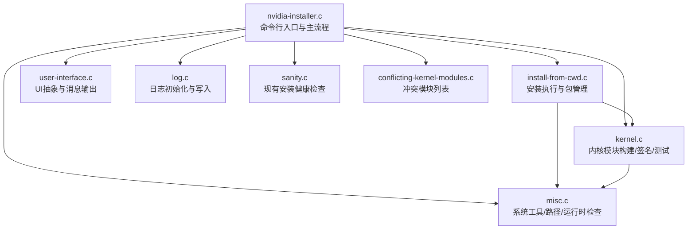
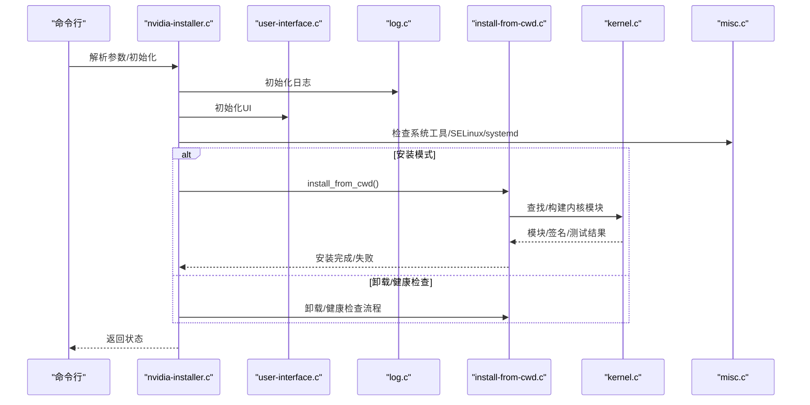
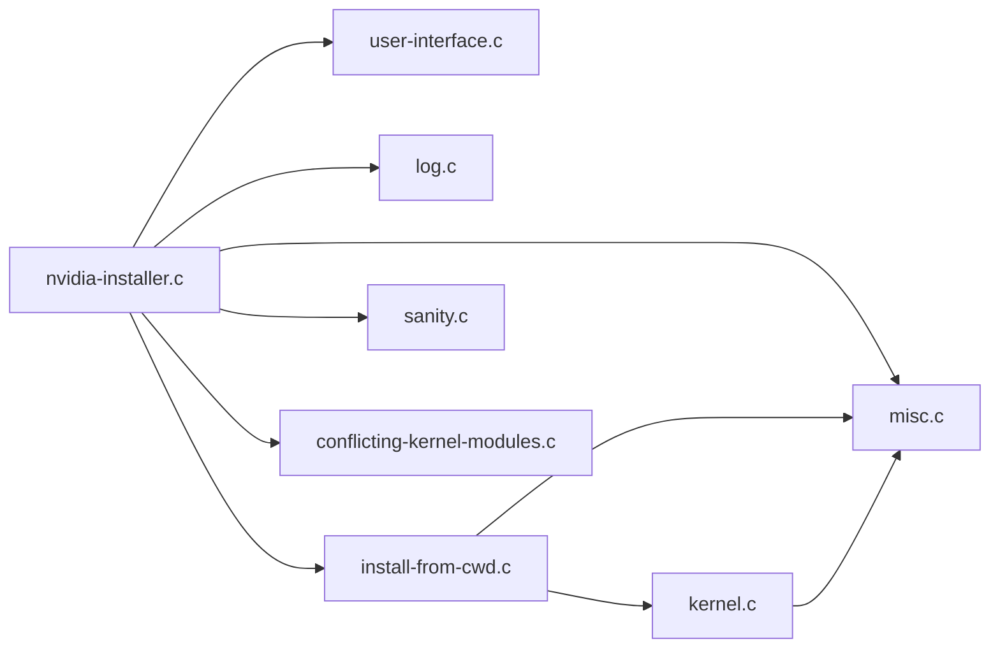

# 故障排除和FAQ

<cite>
**本文引用的文件**
- [nvidia-installer.c](file://nvidia-installer.c)
- [kernel.c](file://kernel.c)
- [install-from-cwd.c](file://install-from-cwd.c)
- [conflicting-kernel-modules.c](file://conflicting-kernel-modules.c)
- [sanity.c](file://sanity.c)
- [log.c](file://log.c)
- [user-interface.c](file://user-interface.c)
- [misc.c](file://misc.c)
- [nvidia-installer.h](file://nvidia-installer.h)
- [option_table.h](file://option_table.h)
- [Makefile](file://Makefile)
- [README](file://README)
</cite>

## 目录
1. [简介](#简介)
2. [项目结构](#项目结构)
3. [核心组件](#核心组件)
4. [架构总览](#架构总览)
5. [详细组件分析](#详细组件分析)
6. [依赖关系分析](#依赖关系分析)
7. [性能考虑](#性能考虑)
8. [故障排除指南](#故障排除指南)
9. [结论](#结论)
10. [附录](#附录)

## 简介
本文件面向技术支持与终端用户，提供NVIDIA驱动安装器的系统化故障排除与常见问题解答（FAQ）。内容覆盖安装失败、内核模块冲突、驱动不兼容、性能问题、系统健康检查、日志分析与工具使用等主题，并提供标准化的问题定位流程与可操作的修复建议。

## 项目结构
该仓库是一个独立的安装器工具，主要由以下模块组成：
- 命令行解析与主流程：nvidia-installer.c
- 内核模块构建与签名：kernel.c
- 安装执行与包管理：install-from-cwd.c
- 冲突检测与处理：conflicting-kernel-modules.c
- 健康检查：sanity.c
- 日志记录：log.c
- 用户界面抽象：user-interface.c
- 工具函数与系统检查：misc.c
- 头文件与选项表：nvidia-installer.h、option_table.h
- 构建系统：Makefile
- 文档与使用说明：README

图表来源
- [nvidia-installer.c:648-762](file://nvidia-installer.c#L648-L762)
- [install-from-cwd.c:96-454](file://install-from-cwd.c#L96-L454)
- [kernel.c:496-551](file://kernel.c#L496-L551)
- [user-interface.c:116-239](file://user-interface.c#L116-L239)
- [log.c:65-157](file://log.c#L65-L157)
- [misc.c:498-625](file://misc.c#L498-L625)
- [sanity.c:33-86](file://sanity.c#L33-L86)
- [conflicting-kernel-modules.c:29-47](file://conflicting-kernel-modules.c#L29-L47)

章节来源
- [nvidia-installer.c:648-762](file://nvidia-installer.c#L648-L762)
- [Makefile:158-325](file://Makefile#L158-L325)
- [README:1-134](file://README#L1-L134)

## 核心组件
- 命令行与主流程：负责解析参数、初始化日志、选择安装/卸载/健康检查路径，并调用相应子流程。
- 安装执行：解析清单、校验前置条件、构建或链接内核模块、生成命令列表、执行安装。
- 内核模块：支持预编译接口匹配与源码编译；可选签名与模块类型选择；提供测试加载与安装。
- 冲突检测：维护冲突模块清单，按逆向依赖顺序提示卸载。
- 健康检查：验证已安装驱动版本与文件完整性。
- 日志：统一格式记录命令行、环境变量、关键步骤与结果。
- UI：多UI后端（ncurses/无UI），统一消息输出与交互。
- 工具函数：系统工具查找、路径解析、运行时检查（如SELinux、systemd、modprobe）。

章节来源
- [nvidia-installer.c:119-157](file://nvidia-installer.c#L119-L157)
- [install-from-cwd.c:96-454](file://install-from-cwd.c#L96-L454)
- [kernel.c:496-551](file://kernel.c#L496-L551)
- [conflicting-kernel-modules.c:29-47](file://conflicting-kernel-modules.c#L29-L47)
- [sanity.c:33-86](file://sanity.c#L33-L86)
- [log.c:65-157](file://log.c#L65-L157)
- [user-interface.c:116-239](file://user-interface.c#L116-L239)
- [misc.c:498-625](file://misc.c#L498-L625)

## 架构总览
安装器采用“主流程调度 + 子模块职责分离”的架构：
- 主流程负责参数解析、环境准备、UI初始化、日志初始化与路径选择。
- 安装流程负责包解析、前置检查、内核模块构建/签名/测试、命令列表生成与执行。
- 冲突检测与健康检查作为辅助能力贯穿安装前后。

图表来源
- [nvidia-installer.c:648-762](file://nvidia-installer.c#L648-L762)
- [install-from-cwd.c:96-454](file://install-from-cwd.c#L96-L454)
- [kernel.c:496-551](file://kernel.c#L496-L551)
- [misc.c:498-625](file://misc.c#L498-L625)
- [log.c:65-157](file://log.c#L65-L157)

## 详细组件分析

### 命令行与主流程
- 默认启用日志、默认UI、默认禁用备份等行为可通过选项控制。
- 支持“仅内核模块”“跳过模块加载/卸载”“静默/专家模式”等高级选项。
- 主流程根据参数决定执行安装、卸载、健康检查或添加当前内核的预编译接口。

章节来源
- [nvidia-installer.c:119-157](file://nvidia-installer.c#L119-L157)
- [nvidia-installer.c:225-640](file://nvidia-installer.c#L225-L640)
- [option_table.h:126-792](file://option_table.h#L126-L792)

### 安装执行与包管理
- 解析清单、校验GPU与X服务器状态、检测替代安装方式。
- 可选OpenGL/Vulkan/Wine/GBM等组件安装开关。
- 生成命令列表并请求确认后执行，最后进行安装后检查。

章节来源
- [install-from-cwd.c:96-454](file://install-from-cwd.c#L96-L454)
- [nvidia-installer.h:457-472](file://nvidia-installer.h#L457-L472)

### 内核模块构建/签名/测试
- 预编译接口优先：若匹配则解包并链接成完整模块；否则进入源码编译。
- 支持模块签名与哈希算法自动推断；可选DKMS注册。
- 提供模块测试加载与安装，失败时回退并提示。

章节来源
- [kernel.c:496-551](file://kernel.c#L496-L551)
- [kernel.c:510-548](file://kernel.c#L510-L548)
- [kernel.c:672-675](file://kernel.c#L672-L675)

### 冲突检测与处理
- 维护冲突模块清单，按逆向依赖顺序提示卸载，避免同时存在多个驱动导致的加载冲突。

章节来源
- [conflicting-kernel-modules.c:29-47](file://conflicting-kernel-modules.c#L29-L47)

### 健康检查
- 对现有安装进行基本健康检查：识别已安装驱动版本与描述，验证文件存在性与完整性。

章节来源
- [sanity.c:33-86](file://sanity.c#L33-L86)

### 日志记录
- 初始化日志文件、记录命令行、PATH、时间戳等信息；所有UI消息与命令输出均被记录，便于排障。

章节来源
- [log.c:65-157](file://log.c#L65-L157)

### 用户界面
- 多UI后端（ncurses/无UI），统一消息输出；支持进度条、命令输出展示与交互确认。

章节来源
- [user-interface.c:116-239](file://user-interface.c#L116-L239)

### 工具函数与系统检查
- 系统工具查找（ldconfig/grep/dmesg/tail/objcopy/chcon/…）、模块工具（modprobe/rmmod/lsmod/depmod）、开发工具（cc/make/ld/sed/tr）。
- 检查SELinux、systemd、modprobe路径一致性等。

章节来源
- [misc.c:498-625](file://misc.c#L498-L625)
- [misc.c:628-752](file://misc.c#L628-L752)

## 依赖关系分析
- 主流程依赖UI、日志、系统工具与安装执行模块。
- 安装执行依赖内核模块构建与系统工具。
- 内核模块构建依赖内核源码/输出目录、开发工具链与可选签名脚本。
- 冲突检测与健康检查作为横切关注点在安装前后使用。

图表来源
- [nvidia-installer.c:648-762](file://nvidia-installer.c#L648-L762)
- [install-from-cwd.c:96-454](file://install-from-cwd.c#L96-L454)
- [kernel.c:496-551](file://kernel.c#L496-L551)
- [misc.c:498-625](file://misc.c#L498-L625)
- [sanity.c:33-86](file://sanity.c#L33-L86)
- [conflicting-kernel-modules.c:29-47](file://conflicting-kernel-modules.c#L29-L47)

## 性能考虑
- 并发度：通过并发级别参数控制并行构建与进度估算，提升大核模块编译效率。
- 输出统计：基于构建计数估算输出行数，用于进度显示与用户体验。
- 跳过不必要的步骤：如跳过depmod、systemd钩子、OpenGL/Vulkan/Wine等组件以缩短安装时间。

章节来源
- [nvidia-installer.c:290-297](file://nvidia-installer.c#L290-L297)
- [kernel.c:556-627](file://kernel.c#L556-L627)
- [install-from-cwd.c:272-288](file://install-from-cwd.c#L272-L288)

## 故障排除指南

### 通用诊断步骤
- 以root权限运行安装器，确保具备必要系统工具与内核头文件。
- 启用调试模式与日志，查看安装器输出与日志文件。
- 使用健康检查功能验证现有安装状态。
- 关闭X服务器或使用“允许运行中驱动安装”选项（谨慎使用）。

章节来源
- [nvidia-installer.c:694-709](file://nvidia-installer.c#L694-L709)
- [sanity.c:33-86](file://sanity.c#L33-L86)
- [log.c:65-157](file://log.c#L65-L157)

### 安装失败
- 缺少内核源码/输出目录：根据提示安装对应内核开发包或指定路径。
- 开发工具缺失：安装gcc/make/binutils等工具。
- 权限不足：确保以root运行且/tmp等临时目录可写。
- 依赖工具缺失：安装ldconfig/grep/dmesg/tail等系统工具。
- 未满足前置条件：关闭X服务器、禁用nouveau、确保SELinux/systemd配置正确。

章节来源
- [kernel.c:205-325](file://kernel.c#L205-L325)
- [misc.c:498-625](file://misc.c#L498-L625)
- [install-from-cwd.c:132-162](file://install-from-cwd.c#L132-L162)

### 内核模块冲突
- 症状：无法加载/重复加载/启动后黑屏。
- 处理：按冲突模块清单逆序卸载nvidia相关模块，再重试安装。
- 验证：使用lsmod确认目标模块未加载。

章节来源
- [conflicting-kernel-modules.c:29-47](file://conflicting-kernel-modules.c#L29-L47)
- [kernel.c:637-752](file://kernel.c#L637-L752)

### 驱动不兼容
- 症状：预编译接口不匹配、内核版本过旧/过新。
- 处理：使用“添加当前内核”功能生成预编译接口；或手动指定内核源码/输出路径。
- 验证：确认/proc/version字符串与内核版本一致。

章节来源
- [kernel.c:496-551](file://kernel.c#L496-L551)
- [README:91-119](file://README#L91-L119)

### 性能问题
- 编译缓慢：调整并发级别、确保有足够内存与磁盘空间。
- 进度卡顿：检查系统工具是否可用、网络代理是否影响依赖下载。
- 加载慢：禁用不必要的模块（如UVM/DRM/PeerMem）以减少内核负担。

章节来源
- [nvidia-installer.c:290-297](file://nvidia-installer.c#L290-L297)
- [install-from-cwd.c:646-692](file://install-from-cwd.c#L646-L692)

### 系统健康检查
- 使用健康检查功能验证已安装驱动版本与文件完整性。
- 检查/dev节点权限、/proc/version、内核配置（IPC/MTRR等）。

章节来源
- [sanity.c:33-86](file://sanity.c#L33-L86)

### 日志分析技巧
- 关注日志中的命令行、PATH、内核版本字符串、工具查找结果与错误信息。
- 将日志与错误消息结合，定位具体失败步骤（如链接/签名/加载）。

章节来源
- [log.c:65-157](file://log.c#L65-L157)

### 不同Linux发行版特定问题
- Debian/Ubuntu：注意32位兼容库安装前缀与chroot路径；确保安装了正确的内核开发包。
- RHEL/CentOS/Fedora：关注SELinux上下文设置与systemd单元文件安装位置。
- Arch/Manjaro：留意GBM后端库安装路径与X.Org模块路径差异。

章节来源
- [nvidia-installer.h:549-551](file://nvidia-installer.h#L549-L551)
- [misc.c:599-625](file://misc.c#L599-L625)

### 冲突检测机制与策略
- 冲突模块清单按逆向依赖顺序排列，确保可逐个安全卸载。
- 安装前检测并提示卸载；安装后可选择保留nvidia-drm以支持某些X/OCS场景。

章节来源
- [conflicting-kernel-modules.c:29-47](file://conflicting-kernel-modules.c#L29-L47)
- [install-from-cwd.c:354-366](file://install-from-cwd.c#L354-L366)

### 标准化问题解决流程（技术支持）
- 步骤1：确认环境与权限（root、系统工具、内核头文件）
- 步骤2：启用调试与日志，复现问题
- 步骤3：执行健康检查，定位文件完整性问题
- 步骤4：处理冲突模块与nouveau
- 步骤5：选择预编译接口或源码编译路径
- 步骤6：执行安装并验证
- 步骤7：记录日志与建议，归档问题

章节来源
- [nvidia-installer.c:694-709](file://nvidia-installer.c#L694-L709)
- [install-from-cwd.c:132-162](file://install-from-cwd.c#L132-L162)
- [kernel.c:496-551](file://kernel.c#L496-L551)
- [sanity.c:33-86](file://sanity.c#L33-L86)

## 结论
本指南提供了从安装到排障的全链路方法论：以日志与健康检查为依据，以冲突检测与内核模块构建为核心，结合发行版特性与性能优化建议，形成可复用的标准化流程。建议在生产环境中始终启用日志、先做健康检查、再进行安装，并在失败时结合日志与错误消息定位根因。

## 附录

### 常见问题解答（FAQ）
- 问：为什么安装失败？
  - 答：检查内核源码/输出目录、开发工具、系统工具与SELinux配置；查看日志定位具体步骤。
- 问：如何处理nouveau冲突？
  - 答：安装前禁用nouveau或使用安装器提供的禁用选项；按冲突清单卸载nvidia相关模块。
- 问：如何生成预编译内核接口？
  - 答：使用“添加当前内核”功能或mkprecompiled工具，参考README中的示例。
- 问：如何优化安装性能？
  - 答：合理设置并发级别、跳过不需要的组件、确保充足内存与磁盘空间。
- 问：如何验证安装是否成功？
  - 答：使用健康检查功能；确认模块加载、设备节点权限与X/OCS配置。

章节来源
- [README:91-119](file://README#L91-L119)
- [sanity.c:33-86](file://sanity.c#L33-L86)
- [nvidia-installer.c:290-297](file://nvidia-installer.c#L290-L297)