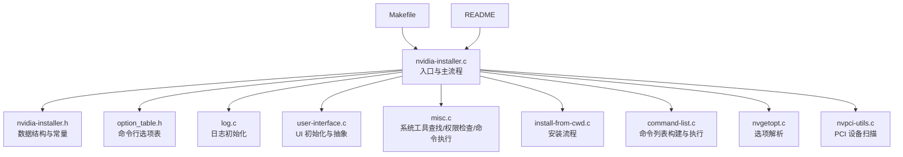
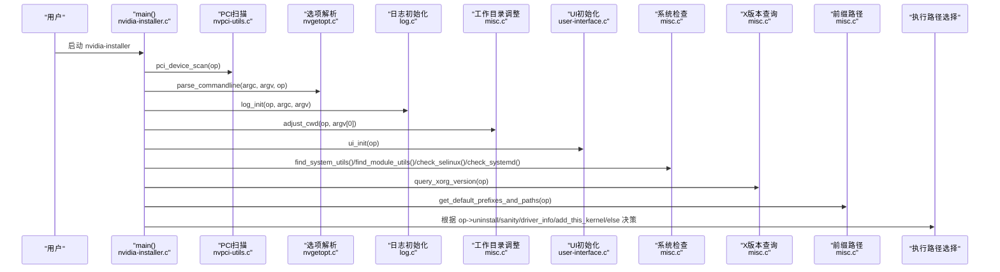
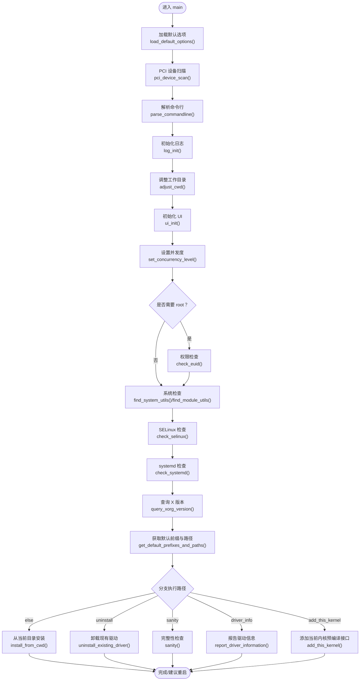
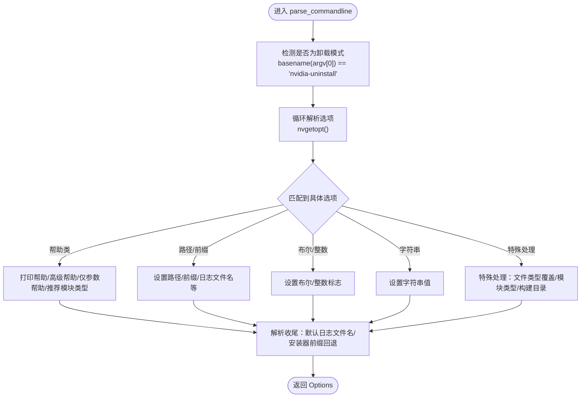
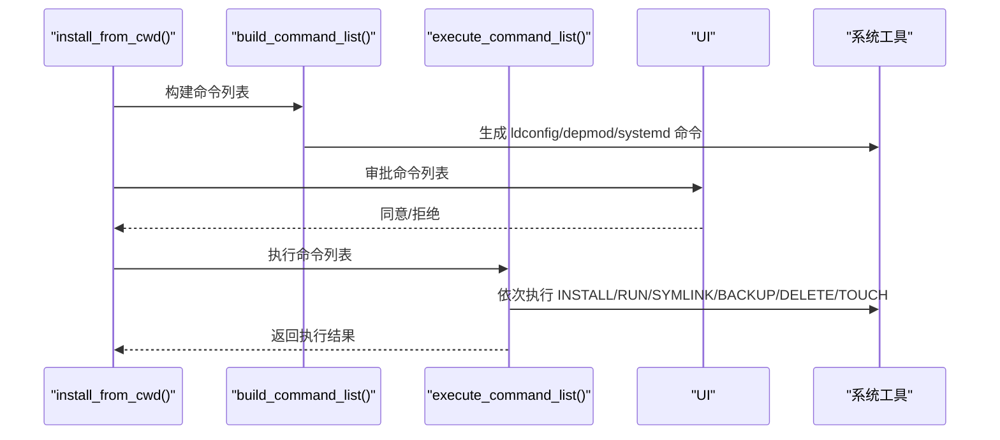
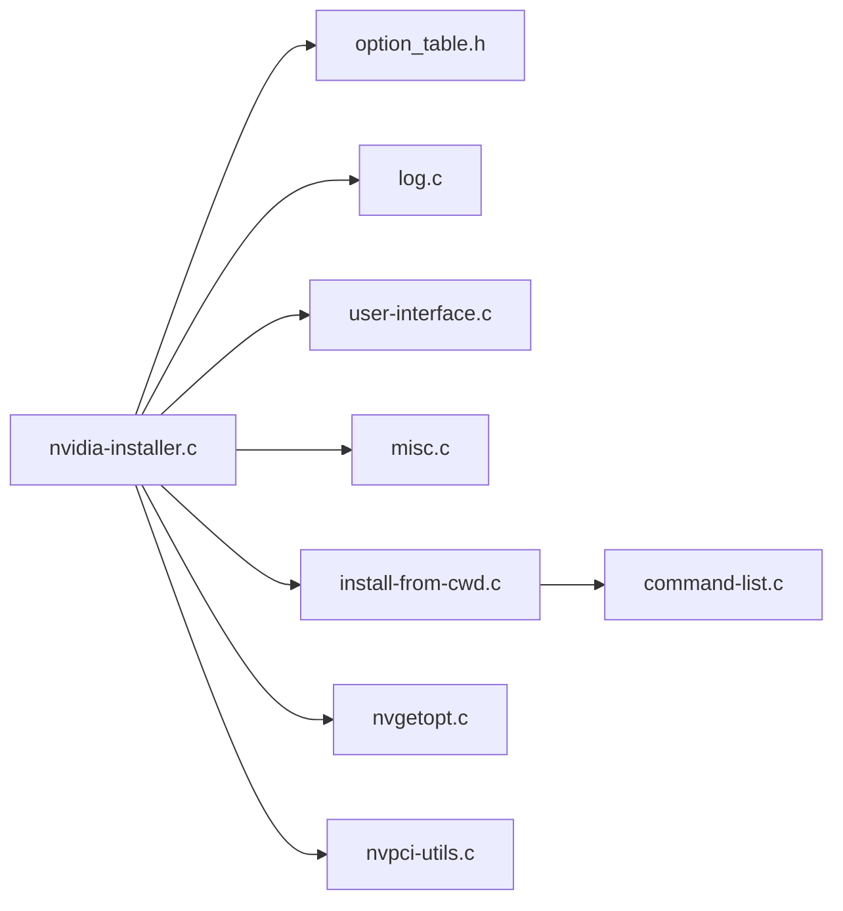

# 主程序模块

<cite>
**本文档引用的文件**
- [nvidia-installer.c](file://nvidia-installer.c)
- [nvidia-installer.h](file://nvidia-installer.h)
- [option_table.h](file://option_table.h)
- [log.c](file://log.c)
- [user-interface.c](file://user-interface.c)
- [misc.c](file://misc.c)
- [install-from-cwd.c](file://install-from-cwd.c)
- [command-list.c](file://command-list.c)
- [nvgetopt.c](file://common-utils/nvgetopt.c)
- [nvpci-utils.c](file://common-utils/nvpci-utils.c)
- [Makefile](file://Makefile)
- [README](file://README)
</cite>

## 目录
1. [简介](#简介)
2. [项目结构](#项目结构)
3. [核心组件](#核心组件)
4. [架构总览](#架构总览)
5. [详细组件分析](#详细组件分析)
6. [依赖关系分析](#依赖关系分析)
7. [性能考虑](#性能考虑)
8. [故障排除指南](#故障排除指南)
9. [结论](#结论)

## 简介
本文件面向开发者，系统性地解析主程序模块的实现与设计，重点覆盖以下方面：
- 程序入口点 main() 的完整初始化流程：默认选项加载、PCI 设备扫描、命令行解析、日志系统初始化、工作目录调整、用户界面初始化、并发度设置、权限检查、系统工具与模块工具检测、X 服务器版本查询、前缀路径获取、驱动信息查询、完整性检查、卸载或安装执行路径选择。
- parse_commandline() 函数的选项解析逻辑，涵盖安装、卸载、调试、静默模式、内核模块类型与构建目录、SELinux、systemd、initramfs、OpenGL/GLVND/Vulkan 等选项的处理与错误处理。
- 流程控制机制：根据 Options 标志位在“驱动信息查询”“完整性检查”“卸载”“添加当前内核预编译接口”“从当前目录安装”之间进行分支。
- 关键步骤：系统工具查找、权限检查、用户界面初始化、并发度设置、X 服务器检测、前缀路径推断、命令列表构建与执行、日志记录与建议重启提示。

## 项目结构
主程序模块位于根目录，核心文件包括：
- 入口与主流程：nvidia-installer.c
- 数据结构与全局常量：nvidia-installer.h
- 命令行选项表：option_table.h
- 日志系统：log.c
- 用户界面抽象与实现：user-interface.c
- 杂项工具与系统调用：misc.c
- 安装流程与命令列表：install-from-cwd.c、command-list.c
- 选项解析库：common-utils/nvgetopt.c
- PCI 设备扫描工具：common-utils/nvpci-utils.c
- 构建系统：Makefile
- 项目说明：README

图表来源
- [nvidia-installer.c:648-762](file://nvidia-installer.c#L648-L762)
- [nvidia-installer.h:185-342](file://nvidia-installer.h#L185-L342)
- [option_table.h:126-789](file://option_table.h#L126-L789)
- [log.c:65-117](file://log.c#L65-L117)
- [user-interface.c:116-239](file://user-interface.c#L116-L239)
- [misc.c:498-625](file://misc.c#L498-L625)
- [install-from-cwd.c:96-454](file://install-from-cwd.c#L96-L454)
- [command-list.c:255-519](file://command-list.c#L255-L519)
- [nvgetopt.c:37-367](file://common-utils/nvgetopt.c#L37-L367)
- [nvpci-utils.c:39-66](file://common-utils/nvpci-utils.c#L39-L66)

章节来源
- [nvidia-installer.c:648-762](file://nvidia-installer.c#L648-L762)
- [Makefile:158-256](file://Makefile#L158-L256)
- [README:1-134](file://README#L1-L134)

## 核心组件
- Options 结构体：集中存储所有命令行选项、路径、前缀、布尔标志、并发度、UI 配置、PCI 设备信息、SELinux/systemd/initramfs 等状态。
- 命令行选项表：统一定义所有支持的长/短选项、参数类型、帮助文本、适用场景掩码。
- 日志系统：按需初始化日志文件，记录命令行、环境变量、时间戳等。
- 用户界面：动态加载 ncurses UI 或回退到内置流式 UI，支持消息、进度、确认、分页等交互。
- 杂项工具：系统工具与模块工具查找、权限检查、命令执行、开发工具检查、/proc/modprobe 路径校验等。
- 安装流程：从当前目录解析清单、构建命令列表、执行安装、后处理（ldconfig、depmod、systemd reload、nvidia-xconfig）。
- 选项解析：基于 nvgetopt 的可移植选项解析器，支持短选项组合、带=的参数、布尔选项否定形式等。

章节来源
- [nvidia-installer.h:185-342](file://nvidia-installer.h#L185-L342)
- [option_table.h:126-789](file://option_table.h#L126-L789)
- [log.c:65-117](file://log.c#L65-L117)
- [user-interface.c:116-239](file://user-interface.c#L116-L239)
- [misc.c:498-625](file://misc.c#L498-L625)
- [install-from-cwd.c:96-454](file://install-from-cwd.c#L96-L454)
- [nvgetopt.c:37-367](file://common-utils/nvgetopt.c#L37-L367)

## 架构总览
主程序采用“自顶向下”的初始化顺序：默认选项 → PCI 扫描 → 命令行解析 → 日志初始化 → 工作目录调整 → UI 初始化 → 并发度设置 → 权限检查 → 系统/模块/SELinux/systemd 检查 → X 版本查询 → 默认前缀路径 → 分支执行。

图表来源
- [nvidia-installer.c:648-762](file://nvidia-installer.c#L648-L762)
- [nvpci-utils.c:39-66](file://common-utils/nvpci-utils.c#L39-L66)
- [nvgetopt.c:37-367](file://common-utils/nvgetopt.c#L37-L367)
- [log.c:65-117](file://log.c#L65-L117)
- [misc.c:127-156](file://misc.c#L127-L156)
- [user-interface.c:116-239](file://user-interface.c#L116-L239)
- [misc.c:498-625](file://misc.c#L498-L625)

## 详细组件分析

### 主入口与初始化流程（main）
- 初始化步骤
  - 设置 umask(022)，分配并初始化 Options，默认值来自 load_default_options()。
  - 执行 PCI 设备扫描，填充 op->pci_devices。
  - 解析命令行，生成 Options。
  - 初始化日志文件，记录启动信息。
  - 调整工作目录至二进制所在目录。
  - 初始化用户界面（尝试 ncurses UI，失败则回退内置流式 UI）。
  - 并发度设置（set_concurrency_level）。
  - 权限检查（非 --add-this-kernel 时要求 root）。
  - 查找系统工具、模块工具、SELinux、systemd。
  - 查询 X 服务器版本。
  - 获取默认前缀与路径。
  - 根据 Options 标志选择执行路径：驱动信息、完整性检查、卸载、添加当前内核、安装。
  - 成功后建议重启，关闭 UI 并释放内存。

图表来源
- [nvidia-installer.c:648-762](file://nvidia-installer.c#L648-L762)
- [misc.c:100-113](file://misc.c#L100-L113)
- [misc.c:498-625](file://misc.c#L498-L625)
- [user-interface.c:116-239](file://user-interface.c#L116-L239)
- [install-from-cwd.c:96-454](file://install-from-cwd.c#L96-L454)

章节来源
- [nvidia-installer.c:648-762](file://nvidia-installer.c#L648-L762)

### 命令行解析（parse_commandline）
- 功能概述
  - 使用 nvgetopt 解析 argv，填充 Options。
  - 支持帮助打印、高级帮助、推荐内核模块类型输出。
  - 处理安装/卸载/调试/静默/无备份/仅内核模块/OpenGL/Vulkan/GLVND/SELinux/systemd/initramfs 等选项。
  - 对无效参数抛出错误并退出。
- 关键行为
  - 识别“nvidia-uninstall”作为卸载模式触发。
  - 将未识别选项映射到 Options 字段，布尔型通过 boolval，整数型通过 intval，字符串型通过 strval。
  - 针对特定选项执行辅助处理（如 override_kernel_module_build_directory、override_kernel_module_type、assign_file_type_override）。
  - 在解析完成后设置默认日志文件名与安装器前缀回退策略。

图表来源
- [nvidia-installer.c:225-640](file://nvidia-installer.c#L225-L640)
- [nvgetopt.c:37-367](file://common-utils/nvgetopt.c#L37-L367)
- [option_table.h:126-789](file://option_table.h#L126-L789)

章节来源
- [nvidia-installer.c:225-640](file://nvidia-installer.c#L225-L640)
- [nvgetopt.c:37-367](file://common-utils/nvgetopt.c#L37-L367)
- [option_table.h:126-789](file://option_table.h#L126-L789)

### 选项解析库（nvgetopt）
- 支持特性
  - 长选项与短选项组合、布尔选项否定（--no-xxx）、带=的参数、短选项拼接（如 -j8）。
  - 参数类型：字符串、整数、双精度、可选参数。
  - 帮助文本生成与过滤（include_mask 控制显示范围）。
- 错误处理
  - 未识别选项、缺少参数、参数类型不匹配等均输出错误并终止。

章节来源
- [nvgetopt.c:37-367](file://common-utils/nvgetopt.c#L37-L367)
- [nvgetopt.c:405-491](file://common-utils/nvgetopt.c#L405-L491)

### 日志系统（log_init）
- 行为
  - 若启用日志且不是 --add-this-kernel 或当前用户为 root，则打开日志文件。
  - 记录创建时间、版本、PATH、命令行参数等。
  - 失败时禁用日志并输出错误。
- 注意
  - --add-this-kernel 且非 root 时，自动切换到 tmpdir 下的日志文件以避免权限问题。

章节来源
- [log.c:65-117](file://log.c#L65-L117)

### 用户界面初始化（ui_init）
- 行为
  - 优先尝试 ncurses UI（含多版本），失败则回退内置流式 UI。
  - 支持信号处理、延迟消息记录、标题/输入/确认/分页等交互。
- 静默与专家模式
  - silent 模式下减少输出；expert 模式下显示更详细日志。

章节来源
- [user-interface.c:116-239](file://user-interface.c#L116-L239)
- [user-interface.c:335-361](file://user-interface.c#L335-L361)

### 系统工具与权限检查（misc）
- 系统工具查找
  - 统一枚举 SystemUtils/SystemOptionalUtils/ModuleUtils/DevelopUtils，逐个在 PATH 中定位。
  - 对缺失工具给出明确包名与路径提示。
- 模块工具检查
  - 检查 modprobe/rmmod/lsmod/depmod 及其可用性。
- /proc/modprobe 路径校验
  - 对比 /proc/sys/kernel/modprobe 与实际找到的 modprobe 路径，必要时警告或报错。
- 权限检查
  - 非 --add-this-kernel 时要求 root，否则直接报错。
- 命令执行
  - 运行外部命令，收集输出，更新进度，处理 SIGWINCH 信号。

章节来源
- [misc.c:498-625](file://misc.c#L498-L625)
- [misc.c:637-752](file://misc.c#L637-L752)
- [misc.c:100-113](file://misc.c#L100-L113)
- [misc.c:252-438](file://misc.c#L252-L438)

### 安装流程与命令列表（install_from_cwd + command-list）
- 安装流程
  - 解析 .manifest，校验文件与校验和。
  - 检测 GPU、X 服务器、可选模块、nouveau 状态。
  - 选择预编译接口或源码构建内核模块，可选模块签名。
  - 生成命令列表（备份/删除/安装/符号链接/ldconfig/depmod/systemd reload 等）。
  - UI 审批后执行命令列表，最后运行 nvidia-xconfig（可选）。
- 命令列表
  - 统一封装 INSTALL/RUN/SYMLINK/BACKUP/DELETE/TOUCH/FUNCTION 等操作。
  - 支持不确定进度条与进度更新，错误时询问是否继续。

图表来源
- [install-from-cwd.c:96-454](file://install-from-cwd.c#L96-L454)
- [command-list.c:255-519](file://command-list.c#L255-L519)
- [command-list.c:614-731](file://command-list.c#L614-L731)

章节来源
- [install-from-cwd.c:96-454](file://install-from-cwd.c#L96-L454)
- [command-list.c:255-519](file://command-list.c#L255-L519)
- [command-list.c:614-731](file://command-list.c#L614-L731)

### PCI 设备扫描（nvpci-utils）
- 行为
  - 使用 libpciaccess 匹配显示控制器（VGA/3D），支持忽略子类差异。
  - 提供迭代器与 VGA 判定工具，供主程序判断 GPU 类型与数量。

章节来源
- [nvpci-utils.c:39-66](file://common-utils/nvpci-utils.c#L39-L66)

## 依赖关系分析
- 模块耦合
  - nvidia-installer.c 作为中枢，依赖各子模块：日志、UI、杂项、安装流程、命令列表、选项解析、PCI 工具。
  - Options 结构体贯穿所有模块，是主要的数据载体。
- 外部依赖
  - ncurses（UI）、pciutils（PCI 扫描）、系统工具（ldconfig/depmod/modprobe/...）、SELinux 工具链、systemd 工具链。
- 可能的循环依赖
  - 未发现直接循环依赖；UI 与日志通过回调/指针解耦。
- 接口契约
  - nvgetopt 与 option_table.h 约定选项定义与帮助文本；UI 抽象通过 dispatch 表解耦具体实现。

图表来源
- [nvidia-installer.c:648-762](file://nvidia-installer.c#L648-L762)
- [option_table.h:126-789](file://option_table.h#L126-L789)
- [log.c:65-117](file://log.c#L65-L117)
- [user-interface.c:116-239](file://user-interface.c#L116-L239)
- [misc.c:498-625](file://misc.c#L498-L625)
- [install-from-cwd.c:96-454](file://install-from-cwd.c#L96-L454)
- [command-list.c:255-519](file://command-list.c#L255-L519)
- [nvgetopt.c:37-367](file://common-utils/nvgetopt.c#L37-L367)
- [nvpci-utils.c:39-66](file://common-utils/nvpci-utils.c#L39-L66)

章节来源
- [nvidia-installer.c:648-762](file://nvidia-installer.c#L648-L762)
- [option_table.h:126-789](file://option_table.h#L126-L789)

## 性能考虑
- 并发度设置：通过 set_concurrency_level(op) 基于 CPU 数量或显式 -j 参数决定并行度，提升内核模块构建与 I/O 密集任务效率。
- I/O 优化：命令执行使用 popen/pclose 流式读取输出，避免大缓冲区占用；日志写入及时刷新。
- 早期失败：在安装前尽早检查工具、权限、X 服务器、nouveau 状态，避免浪费资源。
- UI 进度：不确定进度条与进度更新减少用户等待焦虑，同时避免过度刷新导致性能损耗。

## 故障排除指南
- 常见错误与处理
  - 未找到系统工具：检查 PATH 与对应包是否安装；UI 会提示具体工具与包名。
  - 权限不足：确保以 root 运行（--add-this-kernel 除外）。
  - /proc/modprobe 路径不一致：按警告提示修正或手动创建符号链接。
  - 未识别选项：使用 --help/--advanced-options 查看可用选项。
  - 安装失败：查看日志文件（默认 /var/log/nvidia-installer.log），按错误提示修复后重试。
- 建议
  - 使用 --debug 与 --expert 获取更详细输出。
  - 使用 --no-questions/--silent 进行无人值守安装时，提前准备默认前缀与路径。
  - 遇到 X 服务器冲突时，先停止 X 或使用 --no-x-check（谨慎）。

章节来源
- [misc.c:498-625](file://misc.c#L498-L625)
- [misc.c:637-752](file://misc.c#L637-L752)
- [log.c:65-117](file://log.c#L65-L117)
- [nvidia-installer.c:225-640](file://nvidia-installer.c#L225-L640)

## 结论
主程序模块通过清晰的初始化流程、完善的选项解析、健壮的系统检查与灵活的执行路径选择，实现了对 NVIDIA 驱动安装/卸载/查询/完整性检查的统一入口。开发者可基于 Options 结构体与命令行选项表快速扩展新功能，同时利用 UI 抽象与日志系统保证良好的用户体验与可观测性。建议在新增选项时同步完善帮助文本与错误提示，并在 CI 中加入工具链与权限检查的回归测试。