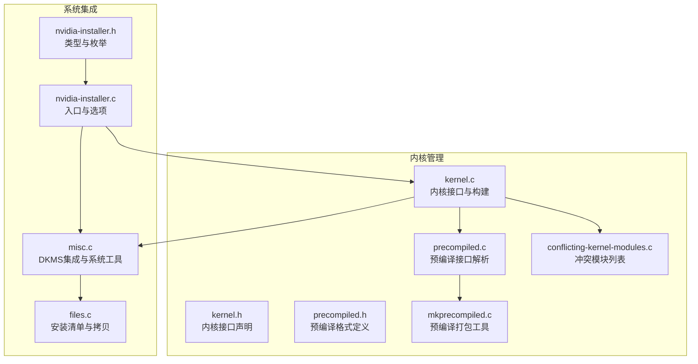
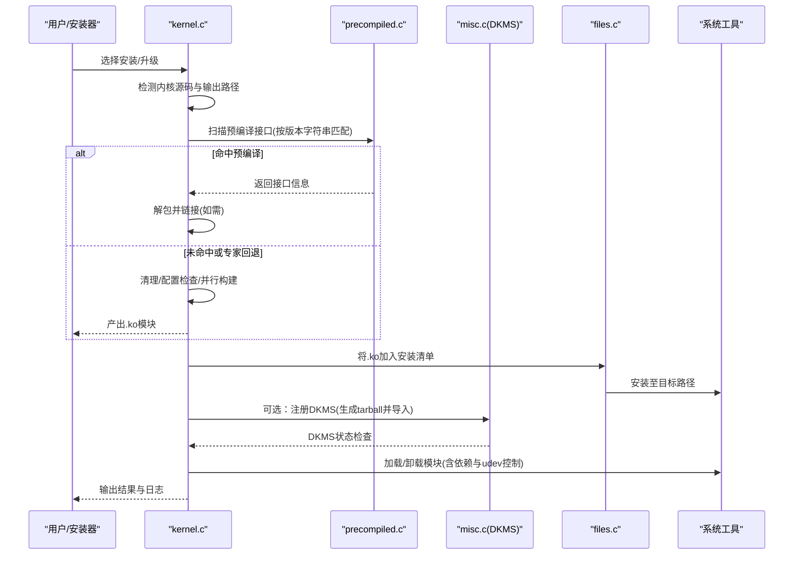
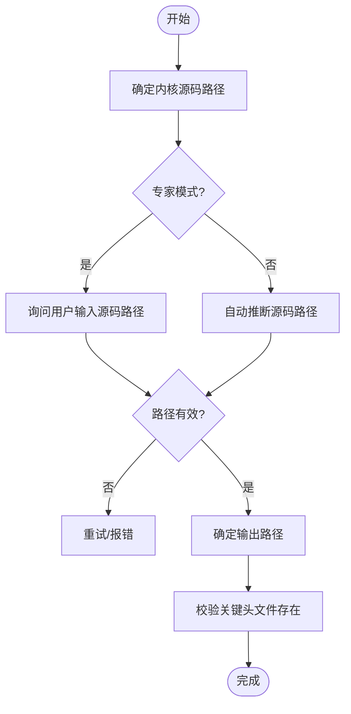
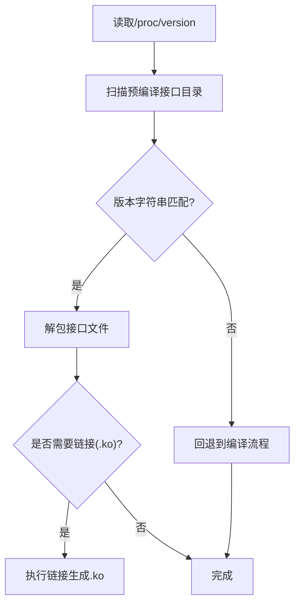
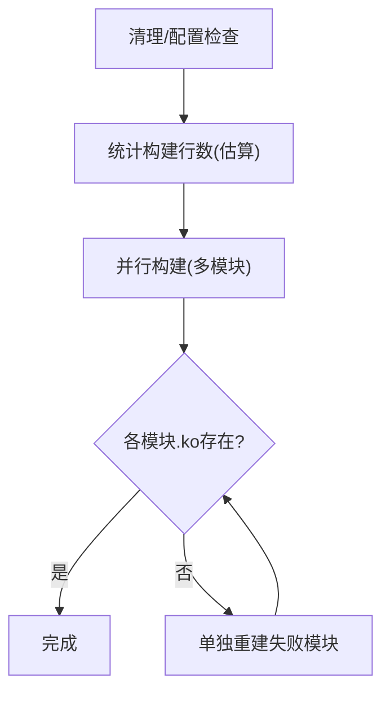
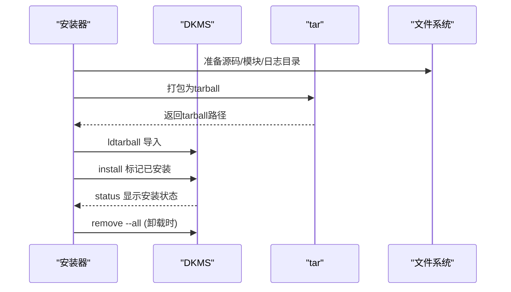
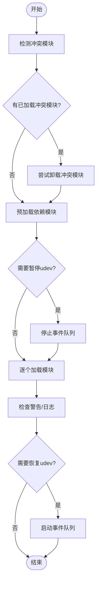
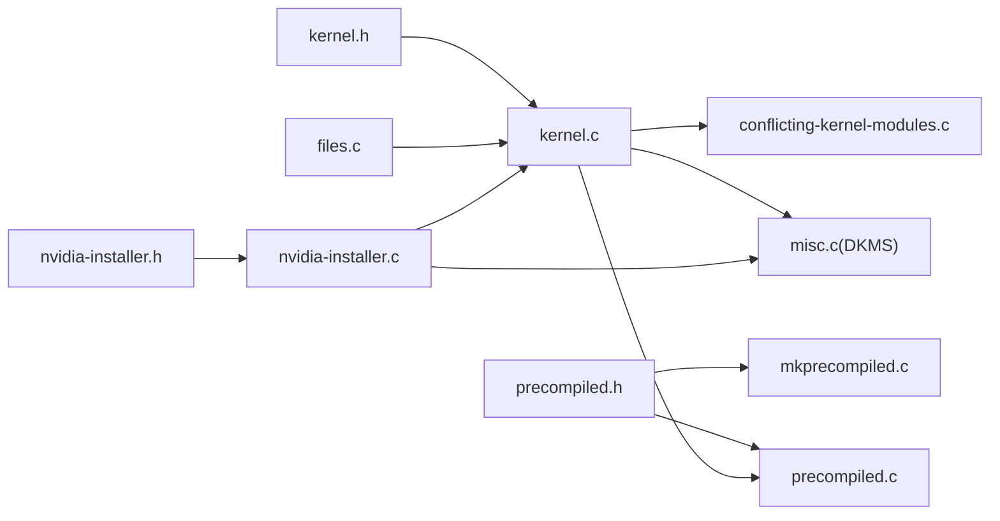

# 内核管理模块

<cite>
**本文引用的文件列表**
- [kernel.c](file://kernel.c)
- [kernel.h](file://kernel.h)
- [precompiled.c](file://precompiled.c)
- [precompiled.h](file://precompiled.h)
- [mkprecompiled.c](file://mkprecompiled.c)
- [conflicting-kernel-modules.c](file://conflicting-kernel-modules.c)
- [misc.c](file://misc.c)
- [files.c](file://files.c)
- [nvidia-installer.c](file://nvidia-installer.c)
- [nvidia-installer.h](file://nvidia-installer.h)
</cite>

## 目录
1. [简介](#简介)
2. [项目结构](#项目结构)
3. [核心组件](#核心组件)
4. [架构总览](#架构总览)
5. [详细组件分析](#详细组件分析)
6. [依赖关系分析](#依赖关系分析)
7. [性能考量](#性能考量)
8. [故障排查指南](#故障排查指南)
9. [结论](#结论)
10. [附录](#附录)

## 简介
本技术文档聚焦于内核管理模块，系统阐述以下能力与机制：
- 内核源码检测与路径推断
- 编译参数配置与并行编译优化
- DKMS（动态内核模块支持）集成：模块注册、自动重编译与版本管理
- 预编译内核接口：接口版本检测、兼容性校验与回退机制
- 内核模块加载/卸载流程：依赖处理、符号解析与系统集成
- 内核版本兼容性检查、ABI 匹配与错误处理策略
- 提供可操作的代码示例路径与故障排除方法，帮助开发者进行内核集成与扩展

## 项目结构
内核管理相关代码主要分布在以下文件中：
- 内核接口与构建：kernel.c、kernel.h
- 预编译接口打包与解析：precompiled.c、precompiled.h、mkprecompiled.c
- DKMS 集成：misc.c
- 文件清单与安装：files.c
- 入口与选项：nvidia-installer.c、nvidia-installer.h
- 冲突模块检测：conflicting-kernel-modules.c

图表来源
- [kernel.c](file://kernel.c)
- [kernel.h](file://kernel.h)
- [precompiled.c](file://precompiled.c)
- [precompiled.h](file://precompiled.h)
- [mkprecompiled.c](file://mkprecompiled.c)
- [conflicting-kernel-modules.c](file://conflicting-kernel-modules.c)
- [misc.c](file://misc.c)
- [files.c](file://files.c)
- [nvidia-installer.c](file://nvidia-installer.c)
- [nvidia-installer.h](file://nvidia-installer.h)

章节来源
- [kernel.c](file://kernel.c)
- [kernel.h](file://kernel.h)
- [precompiled.c](file://precompiled.c)
- [precompiled.h](file://precompiled.h)
- [mkprecompiled.c](file://mkprecompiled.c)
- [conflicting-kernel-modules.c](file://conflicting-kernel-modules.c)
- [misc.c](file://misc.c)
- [files.c](file://files.c)
- [nvidia-installer.c](file://nvidia-installer.c)
- [nvidia-installer.h](file://nvidia-installer.h)

## 核心组件
- 内核源码检测与输出路径推断：确定内核源码树与输出目录，校验头文件与配置存在性
- 预编译接口扫描与解包：基于运行内核版本字符串匹配预编译接口，支持专家模式回退到编译
- 内核模块构建：执行清理、配置检查、并行构建与产物校验
- DKMS 集成：生成 tarball、导入 DKMS、标记已安装状态、移除注册
- 模块加载/卸载与依赖处理：冲突模块检测、依赖模块预加载、udev 队列控制、dmesg 日志采集
- 版本兼容性与签名：接口版本匹配、签名生成与附加、模块签名哈希猜测

章节来源
- [kernel.c](file://kernel.c)
- [kernel.h](file://kernel.h)
- [precompiled.c](file://precompiled.c)
- [precompiled.h](file://precompiled.h)
- [mkprecompiled.c](file://mkprecompiled.c)
- [misc.c](file://misc.c)
- [files.c](file://files.c)
- [nvidia-installer.c](file://nvidia-installer.c)
- [nvidia-installer.h](file://nvidia-installer.h)

## 架构总览
内核管理模块围绕“内核源码检测—预编译接口匹配—构建/链接—安装—DKMS注册—加载测试”这一主干流程展开，同时在冲突检测、签名、日志与系统工具调用层面提供支撑。

图表来源
- [kernel.c](file://kernel.c)
- [precompiled.c](file://precompiled.c)
- [misc.c](file://misc.c)
- [files.c](file://files.c)

## 详细组件分析

### 内核源码检测与路径推断
- 默认安装路径推断：根据内核版本号定位标准安装目录
- 内核源码路径确定：优先使用命令行指定，其次尝试环境变量与系统默认位置
- 输出路径推断：若源码位于特定目录，自动推断输出目录；否则与源码相同
- 关键校验：确保 include/linux/kernel.h 存在；输出目录包含 version.h 或 uapi version.h

图表来源
- [kernel.c](file://kernel.c)

章节来源
- [kernel.c](file://kernel.c)

### 预编译内核接口实现
- 接口版本检测：从 /proc/version 读取运行内核版本字符串，与包内记录比对
- 包格式与字段：头部、版本、描述、版本字符串、文件数量、文件元数据与数据段
- 解包与链接：解包后对“接口文件”执行链接，生成完整 .ko；支持附加签名与CRC校验
- 回退机制：专家模式下可强制回退到编译流程

图表来源
- [precompiled.c](file://precompiled.c)
- [precompiled.h](file://precompiled.h)
- [kernel.c](file://kernel.c)

章节来源
- [precompiled.c](file://precompiled.c)
- [precompiled.h](file://precompiled.h)
- [kernel.c](file://kernel.c)

### 内核模块构建与并行编译优化
- 构建前准备：清理、配置检查、统计预期输出行数用于进度估算
- 并行构建：通过计数脚本估算编译阶段行数，结合 make 的并行输出进行进度显示
- 产物校验：逐模块检查 .ko 是否生成，失败时单独重建该模块以隔离问题
- 错误处理：构建失败或产物缺失时，触发回退或终止流程

图表来源
- [kernel.c](file://kernel.c)

章节来源
- [kernel.c](file://kernel.c)

### DKMS 集成：注册、自动重编译与版本管理
- 工具链：依赖 dkms 与 tar；根据可用性决定是否启用
- tarball 生成：按 DKMS 导出格式组织源码、模块与构建日志
- 导入与标记：ldtarball 导入，install 标记为已安装，status 校验
- 移除：remove --all 清理所有内核版本
- 用户交互：在具备条件时提示是否注册 DKMS

图表来源
- [misc.c](file://misc.c)

章节来源
- [misc.c](file://misc.c)

### 内核模块加载与卸载流程
- 冲突检测：遍历冲突模块列表，检测已加载模块
- 依赖处理：对依赖模块进行预加载，避免加载顺序导致的失败
- 加载/卸载：使用 modprobe/rmmod，静默/非静默两种模式；必要时暂停 udev 事件队列
- 警告与日志：收集 dmesg，输出警告信息，支持专家模式详细诊断

图表来源
- [kernel.c](file://kernel.c)
- [conflicting-kernel-modules.c](file://conflicting-kernel-modules.c)

章节来源
- [kernel.c](file://kernel.c)
- [conflicting-kernel-modules.c](file://conflicting-kernel-modules.c)

### 内核版本兼容性检查、ABI 匹配与错误处理
- 版本匹配：通过 /proc/version 字符串与预编译包记录比对，确保 ABI 一致性
- 配置项检测：借助 conftest 运行时检测内核配置项是否存在
- 错误处理：针对不同场景（无源码、配置不全、签名不一致、加载失败）给出明确提示与回退策略

章节来源
- [kernel.c](file://kernel.c)
- [precompiled.c](file://precompiled.c)

## 依赖关系分析

图表来源
- [kernel.h](file://kernel.h)
- [kernel.c](file://kernel.c)
- [precompiled.h](file://precompiled.h)
- [precompiled.c](file://precompiled.c)
- [mkprecompiled.c](file://mkprecompiled.c)
- [misc.c](file://misc.c)
- [conflicting-kernel-modules.c](file://conflicting-kernel-modules.c)
- [files.c](file://files.c)
- [nvidia-installer.c](file://nvidia-installer.c)
- [nvidia-installer.h](file://nvidia-installer.h)

章节来源
- [kernel.h](file://kernel.h)
- [kernel.c](file://kernel.c)
- [precompiled.h](file://precompiled.h)
- [precompiled.c](file://precompiled.c)
- [mkprecompiled.c](file://mkprecompiled.c)
- [misc.c](file://misc.c)
- [conflicting-kernel-modules.c](file://conflicting-kernel-modules.c)
- [files.c](file://files.c)
- [nvidia-installer.c](file://nvidia-installer.c)
- [nvidia-installer.h](file://nvidia-installer.h)

## 性能考量
- 并行构建：通过统计阶段行数估算构建进度，提升用户体验
- 预编译优先：命中预编译接口可显著缩短构建时间
- 产物校验与局部重建：单模块失败时仅重建该模块，减少整体等待
- DKMS tarball 复用：已构建模块直接注册，避免重复编译

## 故障排查指南
- 无法找到内核源码或配置不全
  - 现象：提示缺少 kernel.h 或 version.h/uapi version.h
  - 处理：确认内核源码路径与输出路径正确；参考提示安装对应开发包
  - 参考路径：[kernel.c](file://kernel.c)
- 预编译接口不匹配
  - 现象：/proc/version 与包内记录不一致
  - 处理：回退到编译流程；或手动指定预编译接口路径
  - 参考路径：[kernel.c](file://kernel.c)、[precompiled.c](file://precompiled.c)
- DKMS 未找到或导入失败
  - 现象：找不到 dkms/tar 或 ldtarball/install 失败
  - 处理：安装 dkms 与 tar；检查权限；查看输出日志
  - 参考路径：[misc.c](file://misc.c)
- 模块加载失败或冲突
  - 现象：加载返回错误；存在冲突模块
  - 处理：卸载冲突模块；检查依赖；必要时暂停/恢复 udev；查看 dmesg
  - 参考路径：[kernel.c](file://kernel.c)、[conflicting-kernel-modules.c](file://conflicting-kernel-modules.c)
- 签名不一致或签名附加失败
  - 现象：CRC 不匹配；签名附加被拒绝
  - 处理：使用与目标系统相同的链接器与标志；确认签名文件完整性
  - 参考路径：[kernel.c](file://kernel.c)、[precompiled.c](file://precompiled.c)

章节来源
- [kernel.c](file://kernel.c)
- [precompiled.c](file://precompiled.c)
- [misc.c](file://misc.c)
- [conflicting-kernel-modules.c](file://conflicting-kernel-modules.c)

## 结论
内核管理模块通过“预编译优先 + 编译兜底”的策略，在保证兼容性的前提下最大化安装效率；DKMS 集成进一步增强了模块的生命周期管理能力。模块化的接口设计与完善的错误处理机制，使得在复杂内核环境下仍能稳定完成安装与加载任务。

## 附录
- 代码示例路径（不直接展示代码内容）
  - 内核源码检测与路径推断：[kernel.c](file://kernel.c)
  - 预编译接口扫描与解包：[kernel.c](file://kernel.c)、[precompiled.c](file://precompiled.c)、[precompiled.h](file://precompiled.h)
  - 内核模块构建与并行编译：[kernel.c](file://kernel.c)
  - DKMS 注册与移除：[misc.c](file://misc.c)
  - 冲突模块检测与处理：[kernel.c](file://kernel.c)、[conflicting-kernel-modules.c](file://conflicting-kernel-modules.c)
  - 安装清单与拷贝：[files.c](file://files.c)
  - 入口与选项：[nvidia-installer.c](file://nvidia-installer.c)、[nvidia-installer.h](file://nvidia-installer.h)