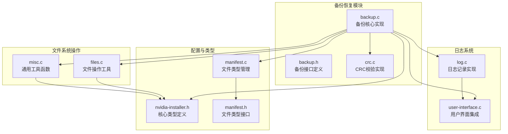
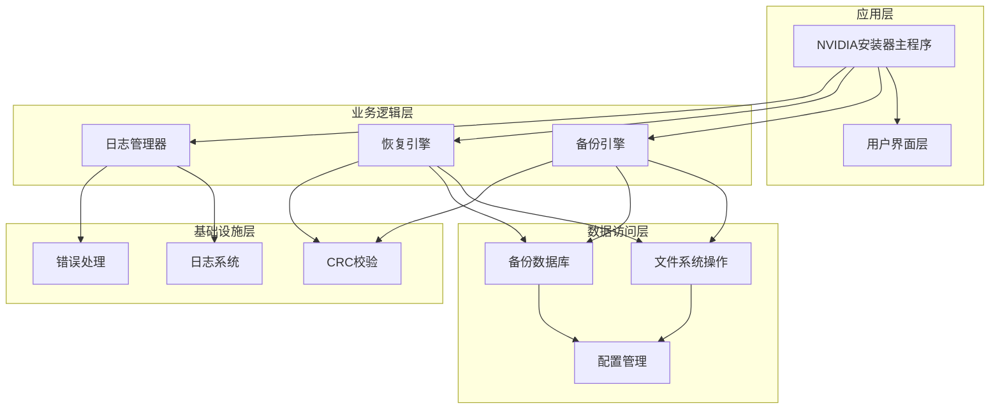
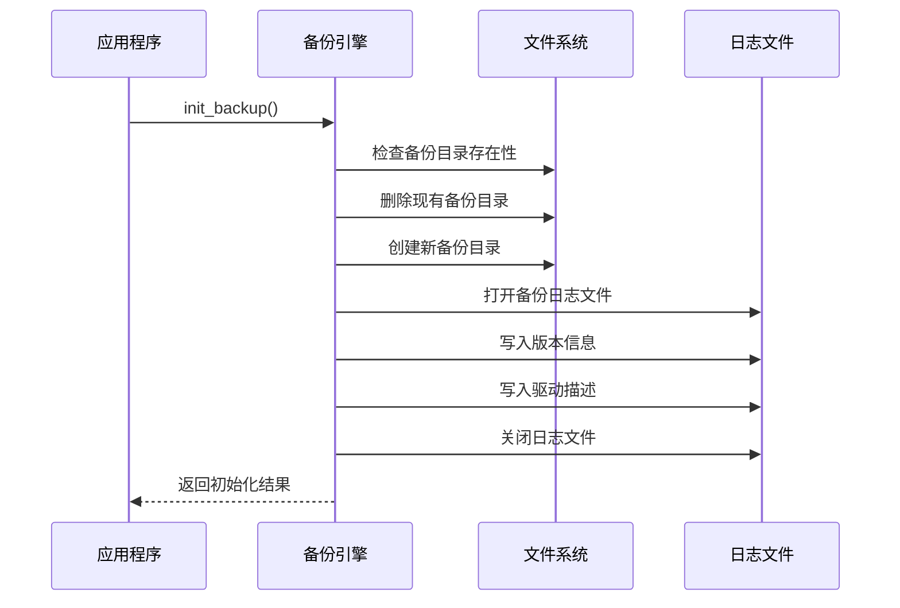
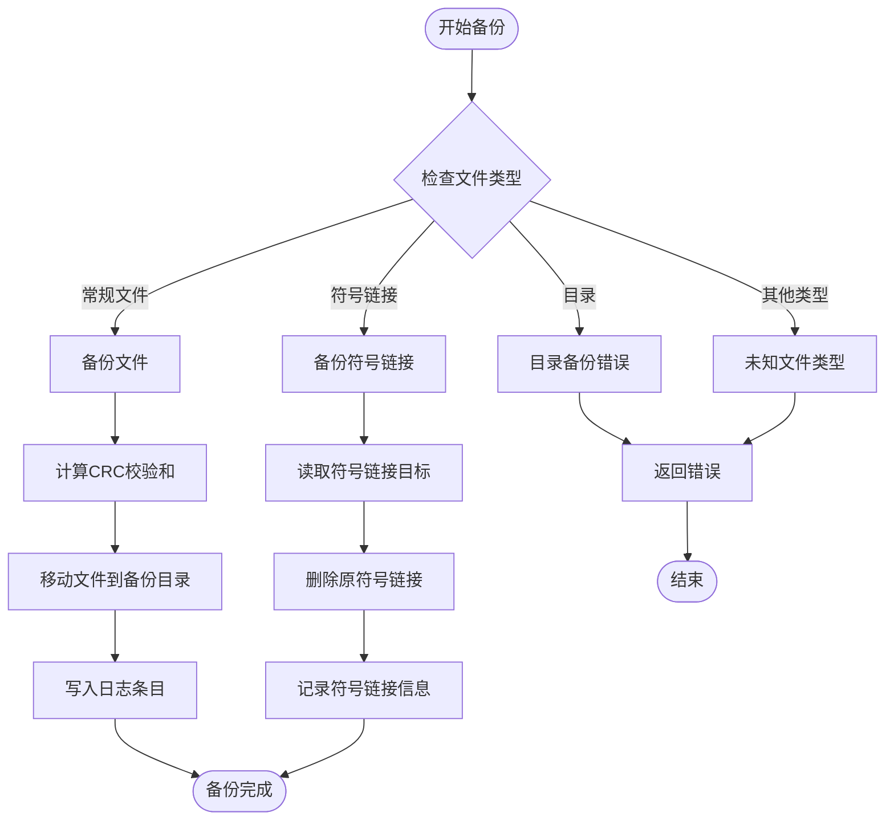
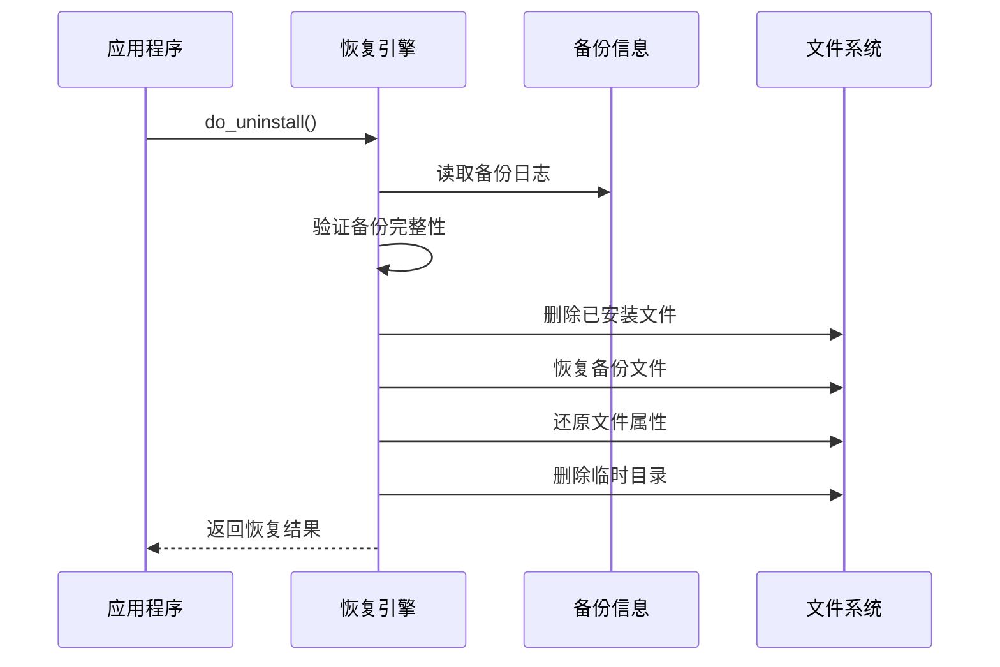
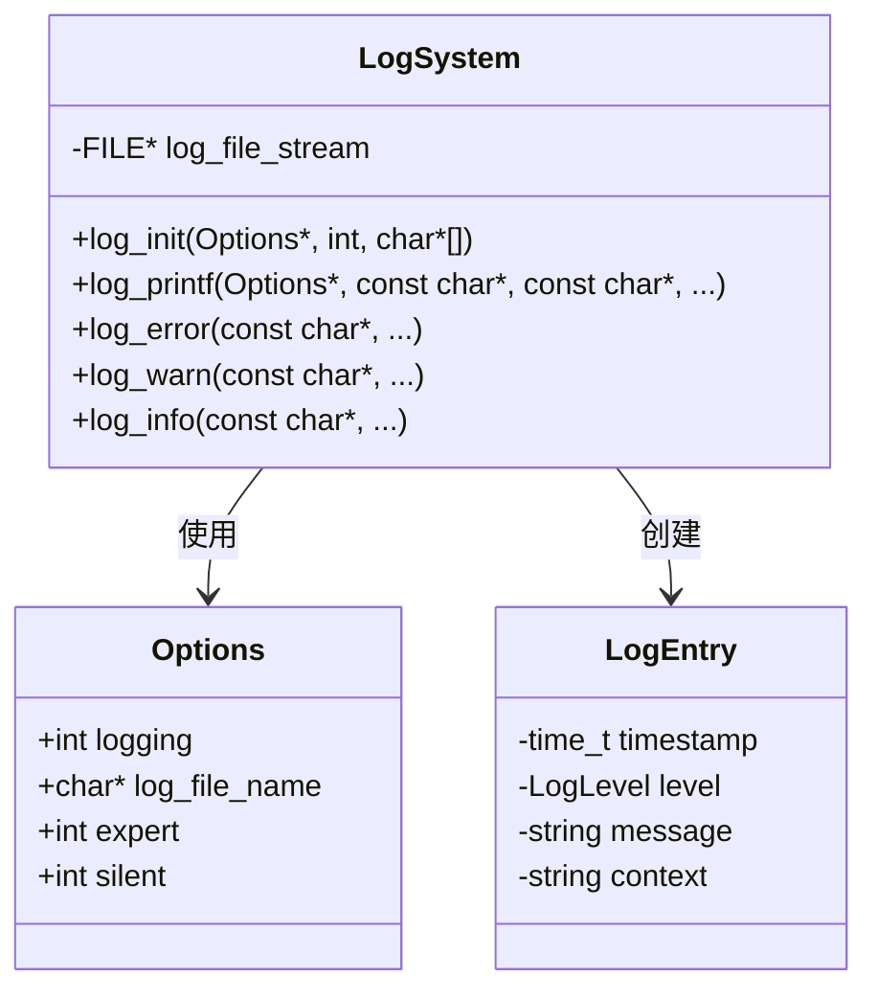
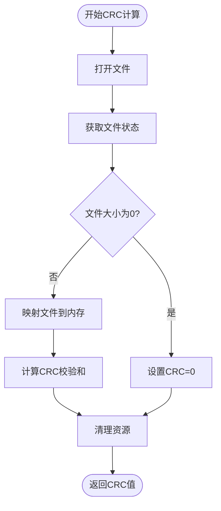
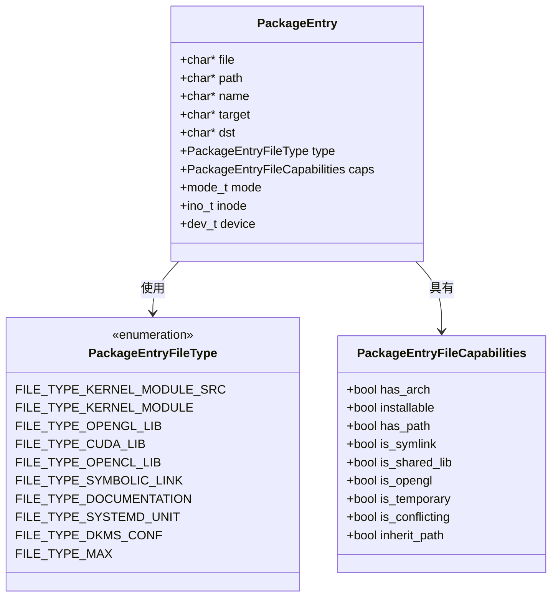
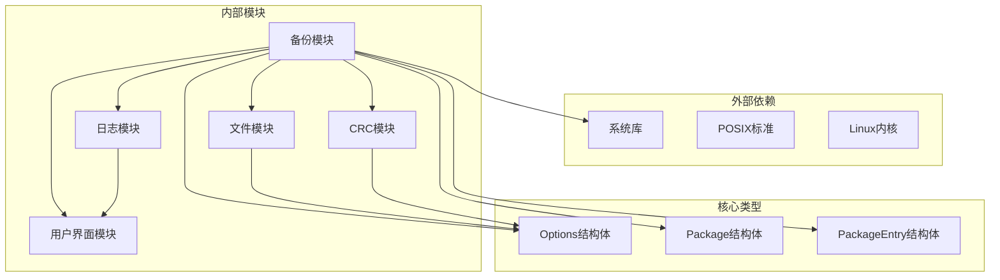

# 备份恢复模块

<cite>
**本文档引用的文件**
- [backup.c](file://backup.c)
- [backup.h](file://backup.h)
- [log.c](file://log.c)
- [nvidia-installer.h](file://nvidia-installer.h)
- [files.c](file://files.c)
- [misc.c](file://misc.c)
- [crc.c](file://crc.c)
- [user-interface.c](file://user-interface.c)
- [nvidia-installer.c](file://nvidia-installer.c)
- [manifest.c](file://manifest.c)
- [manifest.h](file://manifest.h)
</cite>

## 目录
1. [简介](#简介)
2. [项目结构](#项目结构)
3. [核心组件](#核心组件)
4. [架构概览](#架构概览)
5. [详细组件分析](#详细组件分析)
6. [依赖关系分析](#依赖关系分析)
7. [性能考虑](#性能考虑)
8. [故障排查指南](#故障排查指南)
9. [结论](#结论)
10. [附录](#附录)

## 简介

备份恢复模块是 NVIDIA 安装器中的关键组件，负责在驱动程序安装过程中进行文件备份、元数据记录和安全恢复。该模块实现了完整的备份策略设计，包括备份时机选择、备份内容确定、备份存储管理、恢复机制实现、日志记录系统和原子性保证。

本模块采用分层架构设计，通过严格的权限控制、完整性校验和状态管理确保系统在安装过程中的安全性。备份数据采用二进制格式存储，包含文件属性、权限信息和校验和，确保恢复时的精确还原。

## 项目结构

备份恢复模块位于 NVIDIA 安装器项目的核心目录中，主要文件包括：



**图表来源**
- [backup.c:1-50](file://backup.c#L1-L50)
- [log.c:1-50](file://log.c#L1-L50)
- [nvidia-installer.h:1-100](file://nvidia-installer.h#L1-L100)

**章节来源**
- [backup.c:1-100](file://backup.c#L1-L100)
- [nvidia-installer.h:1-200](file://nvidia-installer.h#L1-L200)

## 核心组件

备份恢复模块由以下核心组件构成：

### 备份引擎组件
- **初始化引擎**：创建备份目录结构，初始化备份日志文件
- **备份执行器**：处理文件移动、符号链接处理和目录备份
- **日志记录器**：维护备份元数据，支持多种文件类型记录
- **恢复执行器**：根据备份日志进行文件恢复和属性还原

### 数据管理组件
- **CRC 校验器**：提供文件完整性验证
- **权限管理器**：维护文件所有权和权限信息
- **版本兼容器**：支持向后兼容的版本字符串格式

### 日志与监控组件
- **日志系统**：统一的日志记录和输出管理
- **进度指示器**：实时显示备份和恢复进度
- **状态跟踪器**：监控操作状态和错误信息

**章节来源**
- [backup.h:20-46](file://backup.h#L20-L46)
- [nvidia-installer.h:180-342](file://nvidia-installer.h#L180-L342)

## 架构概览

备份恢复模块采用分层架构，各层职责明确，耦合度低：



**图表来源**
- [nvidia-installer.c:648-762](file://nvidia-installer.c#L648-L762)
- [backup.c:137-198](file://backup.c#L137-L198)

### 备份目录结构

备份模块使用 `/var/lib/nvidia` 作为默认备份根目录，包含以下子结构：

```
/var/lib/nvidia/
├── log          # 主备份日志文件
├── dirs         # 目录创建日志
└── [数字编号]   # 备份的文件副本
```

每个备份文件使用递增的数字编号命名，确保唯一性和有序性。

**章节来源**
- [backup.c:46-82](file://backup.c#L46-L82)
- [backup.c:208-298](file://backup.c#L208-L298)

## 详细组件分析

### 备份引擎实现

备份引擎是模块的核心，负责文件备份的具体实现：

#### 初始化流程


**图表来源**
- [backup.c:137-198](file://backup.c#L137-L198)

#### 备份执行流程


**图表来源**
- [backup.c:208-298](file://backup.c#L208-L298)
- [backup.c:266-270](file://backup.c#L266-L270)

**章节来源**
- [backup.c:137-298](file://backup.c#L137-L298)

### 恢复机制实现

恢复机制提供了完整的文件恢复能力，包括文件删除、属性还原和权限恢复：

#### 恢复执行流程


**图表来源**
- [backup.c:631-889](file://backup.c#L631-L889)

#### 恢复验证机制
恢复过程包含多重验证确保数据完整性：

1. **权限验证**：检查备份目录和日志文件的权限
2. **完整性检查**：验证备份文件的 CRC 校验和
3. **路径验证**：确认文件路径的有效性
4. **属性验证**：检查文件所有权和权限信息

**章节来源**
- [backup.c:631-889](file://backup.c#L631-L889)
- [backup.c:899-1072](file://backup.c#L899-L1072)

### 日志记录系统

日志系统提供了统一的日志管理机制，支持多种日志级别和格式化输出：

#### 日志架构设计


**图表来源**
- [log.c:34-156](file://log.c#L34-L156)
- [nvidia-installer.h:185-342](file://nvidia-installer.h#L185-L342)

#### 日志级别管理
日志系统支持以下级别：
- **错误级别**：系统级错误和异常情况
- **警告级别**：潜在问题但不影响操作继续
- **信息级别**：一般性操作信息
- **专家级别**：详细调试信息

**章节来源**
- [log.c:34-156](file://log.c#L34-L156)
- [user-interface.c:335-374](file://user-interface.c#L335-L374)

### CRC 校验机制

CRC 校验是备份完整性保障的核心机制：

#### 校验算法实现


**图表来源**
- [crc.c:94-135](file://crc.c#L94-L135)

#### 校验和生成
使用 32 位 CRC 校验和，基于特定多项式生成，确保文件完整性验证的准确性。

**章节来源**
- [crc.c:48-135](file://crc.c#L48-L135)

### 文件类型管理系统

文件类型管理系统负责识别和分类不同类型的文件，为备份策略提供依据：

#### 文件类型分类


**图表来源**
- [manifest.c:101-168](file://manifest.c#L101-L168)
- [nvidia-installer.h:101-169](file://nvidia-installer.h#L101-L169)

**章节来源**
- [manifest.c:55-138](file://manifest.c#L55-L138)
- [manifest.h:25-41](file://manifest.h#L25-L41)

## 依赖关系分析

备份恢复模块的依赖关系呈现清晰的层次结构：



**图表来源**
- [nvidia-installer.h:185-471](file://nvidia-installer.h#L185-L471)
- [backup.c:37-44](file://backup.c#L37-L44)

### 关键依赖关系

1. **系统调用依赖**：文件操作、进程管理、信号处理
2. **内存管理依赖**：动态内存分配和释放
3. **错误处理依赖**：统一的错误码和消息处理
4. **配置管理依赖**：运行时参数和环境变量

**章节来源**
- [backup.c:25-44](file://backup.c#L25-L44)
- [nvidia-installer.h:185-471](file://nvidia-installer.h#L185-L471)

## 性能考虑

备份恢复模块在设计时充分考虑了性能优化：

### 内存映射优化
- 使用 `mmap` 进行大文件的高效读取
- 避免不必要的内存复制操作
- 合理的内存缓冲区管理

### 并发处理
- 支持多线程并发操作
- 原子性操作保证
- 资源竞争避免机制

### I/O 优化
- 批量文件操作减少系统调用
- 异步日志写入
- 缓冲区预分配

## 故障排查指南

### 常见问题诊断

#### 备份失败
1. **权限不足**：检查 `/var/lib/nvidia` 目录权限
2. **磁盘空间不足**：确认有足够的磁盘空间
3. **文件锁定**：检查是否有进程占用目标文件

#### 恢复失败
1. **日志损坏**：检查备份日志文件完整性
2. **文件冲突**：确认目标路径无冲突文件
3. **权限问题**：验证恢复文件的权限设置

#### 日志分析方法
```bash
# 查看备份日志
cat /var/lib/nvidia/log

# 分析恢复过程
cat /var/log/nvidia-installer.log

# 检查备份完整性
ls -la /var/lib/nvidia/
```

**章节来源**
- [log.c:65-117](file://log.c#L65-L117)
- [backup.c:899-1072](file://backup.c#L899-L1072)

### 错误处理策略

模块采用多层次的错误处理机制：

1. **早期检测**：在操作前验证所有前置条件
2. **渐进式回滚**：部分失败时进行局部回滚
3. **完整回滚**：完全失败时恢复到初始状态
4. **错误报告**：详细的错误信息和建议

## 结论

备份恢复模块展现了优秀的软件工程实践，具有以下特点：

### 设计优势
- **模块化设计**：清晰的职责分离和接口定义
- **安全性保障**：严格的权限控制和完整性验证
- **可扩展性**：灵活的配置选项和插件机制
- **可靠性**：完善的错误处理和恢复机制

### 技术亮点
- **原子性保证**：通过事务式操作确保数据一致性
- **完整性校验**：CRC 校验确保备份数据的准确性
- **状态管理**：完整的状态跟踪和恢复能力
- **日志系统**：全面的操作记录和审计功能

### 应用价值
该模块为系统管理员提供了可靠的驱动程序管理工具，确保在复杂的系统环境中进行安全、可控的软件安装和卸载操作。

## 附录

### 备份配置示例

#### 基本备份配置
```c
// 初始化备份引擎
if (!init_backup(options, package)) {
    // 处理初始化失败
}

// 备份单个文件
if (!do_backup(options, "/etc/X11/xorg.conf")) {
    // 处理备份失败
}

// 记录安装文件
if (!log_install_file(options, "/usr/lib/libGL.so.1")) {
    // 处理记录失败
}
```

#### 恢复操作示例
```c
// 检查现有驱动
if (!check_for_existing_driver(options, package)) {
    // 用户取消操作
}

// 卸载现有驱动
if (!uninstall_existing_driver(options, TRUE, FALSE)) {
    // 处理卸载失败
}
```

### 日志分析方法

#### 日志级别对照表
| 级别 | 描述 | 使用场景 |
|------|------|----------|
| ERROR | 系统错误 | 严重故障、操作失败 |
| WARNING | 警告信息 | 可能的问题、不推荐操作 |
| MESSAGE | 普通信息 | 正常操作流程 |
| LOG | 详细日志 | 调试信息、状态变更 |

#### 常用日志命令
```bash
# 查看最近的安装日志
tail -n 100 /var/log/nvidia-installer.log

# 搜索特定错误
grep -i "error" /var/log/nvidia-installer.log

# 分析备份过程
grep -i "backup" /var/log/nvidia-installer.log
```