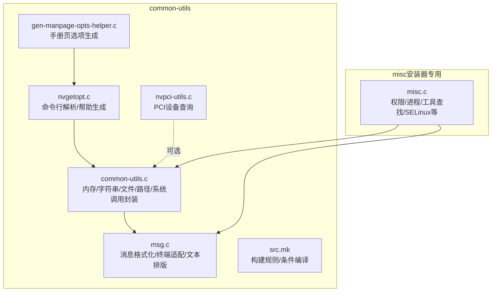
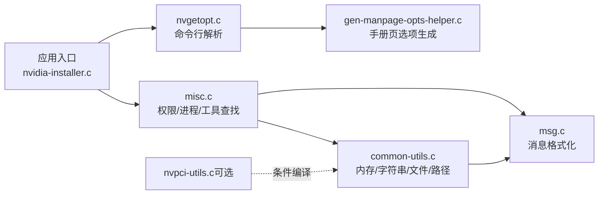
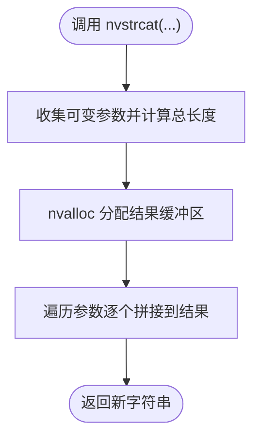
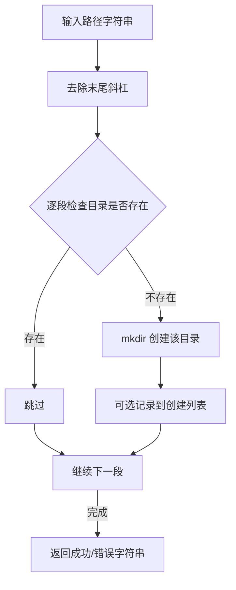
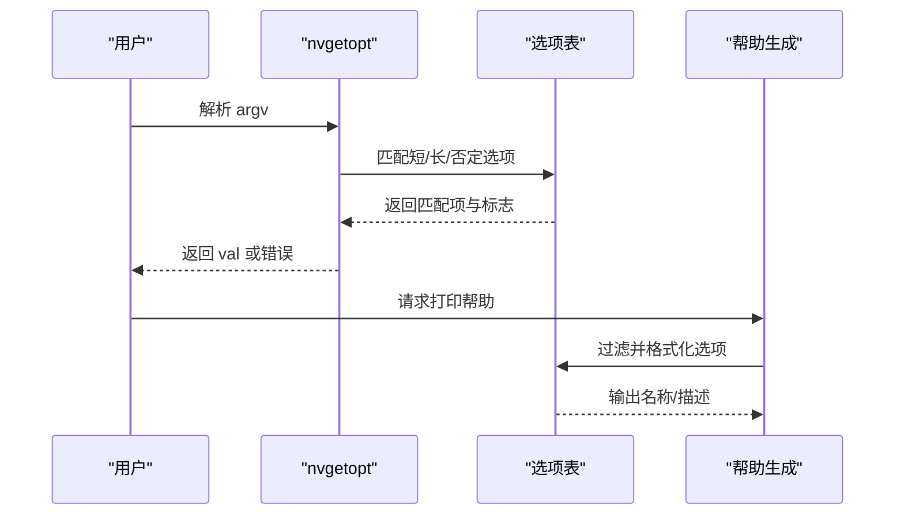
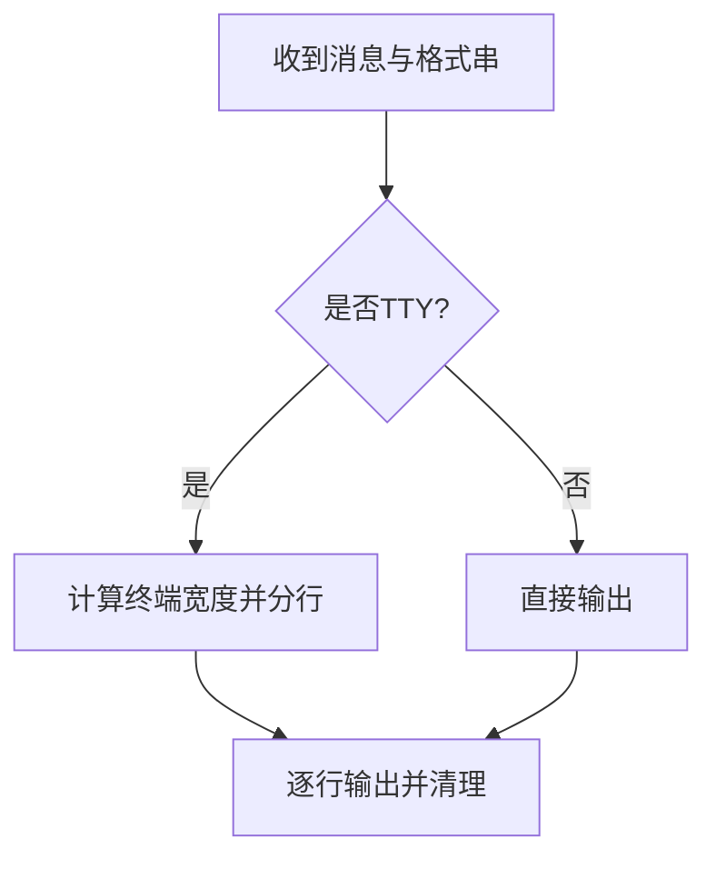
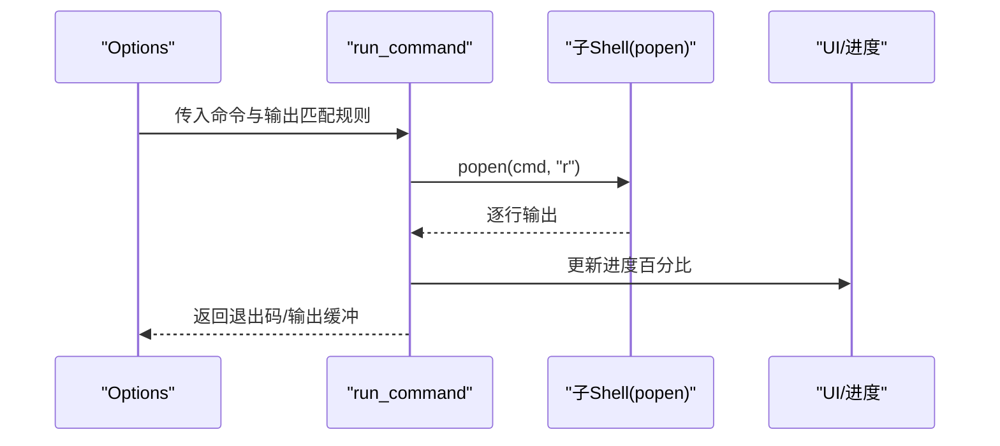
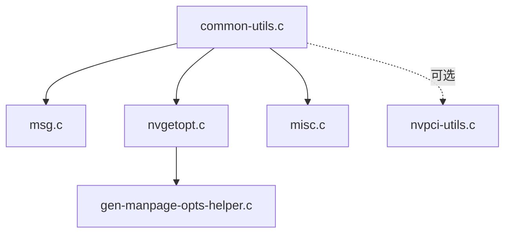

# 工具函数模块

<cite>
**本文引用的文件**
- [common-utils/common-utils.c](file://common-utils/common-utils.c)
- [common-utils/common-utils.h](file://common-utils/common-utils.h)
- [common-utils/msg.c](file://common-utils/msg.c)
- [common-utils/msg.h](file://common-utils/msg.h)
- [common-utils/nvgetopt.c](file://common-utils/nvgetopt.c)
- [common-utils/nvgetopt.h](file://common-utils/nvgetopt.h)
- [common-utils/nvpci-utils.c](file://common-utils/nvpci-utils.c)
- [common-utils/nvpci-utils.h](file://common-utils/nvpci-utils.h)
- [common-utils/gen-manpage-opts-helper.c](file://common-utils/gen-manpage-opts-helper.c)
- [common-utils/gen-manpage-opts-helper.h](file://common-utils/gen-manpage-opts-helper.h)
- [common-utils/src.mk](file://common-utils/src.mk)
- [misc.c](file://misc.c)
- [misc.h](file://misc.h)
</cite>

## 目录
1. [简介](#简介)
2. [项目结构](#项目结构)
3. [核心组件](#核心组件)
4. [架构总览](#架构总览)
5. [详细组件分析](#详细组件分析)
6. [依赖关系分析](#依赖关系分析)
7. [性能考量](#性能考量)
8. [故障排查指南](#故障排查指南)
9. [结论](#结论)
10. [附录](#附录)

## 简介
本文件系统化梳理工具函数模块，覆盖以下方面：
- 通用工具函数：字符串处理、内存管理、系统调用封装与错误处理
- 消息处理系统：消息分类、格式化输出、终端宽度自适应与国际化支持策略
- 杂项工具函数：路径处理、权限检查、进程管理、信号处理
- 模块化设计原则：接口标准化、依赖最小化、可重用性
- 错误处理与调试支持：错误码定义、调试信息输出、故障诊断
- 使用示例与最佳实践：通过源码路径指引具体用法

## 项目结构
工具函数模块位于 common-utils 子目录，提供跨组件复用的基础能力；misc.c 提供安装器专用的系统交互与运行时工具。

**图表来源**
- [common-utils/common-utils.c:1-839](file://common-utils/common-utils.c#L1-L839)
- [common-utils/msg.c:1-429](file://common-utils/msg.c#L1-L429)
- [common-utils/nvgetopt.c:1-491](file://common-utils/nvgetopt.c#L1-L491)
- [common-utils/nvpci-utils.c:1-66](file://common-utils/nvpci-utils.c#L1-L66)
- [common-utils/gen-manpage-opts-helper.c:1-225](file://common-utils/gen-manpage-opts-helper.c#L1-L225)
- [common-utils/src.mk:1-41](file://common-utils/src.mk#L1-L41)
- [misc.c:1-3349](file://misc.c#L1-L3349)

**章节来源**
- [common-utils/src.mk:1-41](file://common-utils/src.mk#L1-L41)

## 核心组件
- 内存与字符串工具：统一的分配/释放包装、变参拼接、安全复制、大小写转换、格式化输出缓冲区管理
- 文件与路径工具：打开/长度/映射、递归目录创建、路径拼接/去尾斜杠/折叠多斜杠、基础名/目录名提取、写入文件
- 命令行解析：兼容长/短/否定形式、参数类型解析、帮助打印、手册页选项生成
- 消息系统：错误/警告/信息/弃用消息分级输出，自动终端宽度检测与文本分行，保留/忽略空白控制
- 杂项工具：权限检查、工作目录调整、命令执行与进度估算、系统工具发现、SELinux/内核模块路径校验、开发工具链检查

**章节来源**
- [common-utils/common-utils.h:54-90](file://common-utils/common-utils.h#L54-L90)
- [common-utils/msg.h:94-141](file://common-utils/msg.h#L94-L141)
- [common-utils/nvgetopt.h:135-179](file://common-utils/nvgetopt.h#L135-L179)
- [misc.h:67-119](file://misc.h#L67-L119)

## 架构总览
工具函数模块采用“分层+组合”设计：
- 底层：common-utils.c 提供通用能力（内存/字符串/文件/路径/系统调用）
- 中层：msg.c 提供消息格式化与终端适配
- 上层：nvgetopt.c 提供命令行解析；misc.c 聚合系统交互
- 可选：nvpci-utils.c 提供PCI设备查询（按需编译）

**图表来源**
- [misc.c:1-3349](file://misc.c#L1-L3349)
- [common-utils/common-utils.c:1-839](file://common-utils/common-utils.c#L1-L839)
- [common-utils/msg.c:1-429](file://common-utils/msg.c#L1-L429)
- [common-utils/nvgetopt.c:1-491](file://common-utils/nvgetopt.c#L1-L491)
- [common-utils/gen-manpage-opts-helper.c:1-225](file://common-utils/gen-manpage-opts-helper.c#L1-L225)
- [common-utils/nvpci-utils.c:1-66](file://common-utils/nvpci-utils.c#L1-L66)

## 详细组件分析

### 内存与字符串工具
- 分配与释放
  - 统一失败即退出的分配器：nvalloc、nvrealloc、nvfree
  - 安全字符串复制：nvstrdup、nvstrndup
- 字符串拼接与格式化
  - 变参拼接：nvvstrcat、nvstrcat
  - 安全格式化：nvasprintf、nv_append_sprintf（追加式）
- 大小写与字符处理
  - nvstrtolower、nvstrtoupper
  - nvstrchrnul（类似strchrnul）
- 文本处理
  - nv_trim_space、nv_trim_char、nv_trim_char_strict
  - remove_trailing_slashes、collapse_multiple_slashes

**图表来源**
- [common-utils/common-utils.c:112-122](file://common-utils/common-utils.c#L112-L122)
- [common-utils/common-utils.c:72-104](file://common-utils/common-utils.c#L72-L104)

**章节来源**
- [common-utils/common-utils.c:52-198](file://common-utils/common-utils.c#L52-L198)
- [common-utils/common-utils.h:54-65](file://common-utils/common-utils.h#L54-L65)

### 文件与路径工具
- 文件操作封装
  - 打开/长度/设置长度/映射：nv_open、nv_get_file_length、nv_set_file_length、nv_mmap
- 路径与目录
  - 递归创建：nv_mkdir_recursive（可返回创建列表）
  - 路径拼接：nvdircat（自动折叠多余斜杠）
  - 基础名/目录名：nv_basename、nv_dirname
  - 写文件：nv_string_to_file（自动创建目录、补换行、设置权限）
- 行读取
  - fget_next_line：逐字符增长缓冲区读取一行

**图表来源**
- [common-utils/common-utils.c:553-607](file://common-utils/common-utils.c#L553-L607)
- [common-utils/common-utils.c:616-636](file://common-utils/common-utils.c#L616-L636)

**章节来源**
- [common-utils/common-utils.c:455-690](file://common-utils/common-utils.c#L455-L690)
- [common-utils/common-utils.h:72-82](file://common-utils/common-utils.h#L72-L82)

### 命令行解析与手册页生成
- nvgetopt
  - 支持短/长/否定（--no-）选项，多短选项串联、整数参数紧缩（如-j8）
  - 参数类型：布尔/字符串/整型/双精度，可选参数与禁用开关
  - 返回匹配选项的 val，或在失败时打印错误并返回 0
- 帮助与手册页
  - nvgetopt_print_help：按掩码过滤选项并回调输出
  - gen-manpage-opts-helper：将选项表转为groff格式的手册页条目

**图表来源**
- [common-utils/nvgetopt.c:37-367](file://common-utils/nvgetopt.c#L37-L367)
- [common-utils/nvgetopt.h:135-179](file://common-utils/nvgetopt.h#L135-L179)
- [common-utils/gen-manpage-opts-helper.c:182-225](file://common-utils/gen-manpage-opts-helper.c#L182-L225)

**章节来源**
- [common-utils/nvgetopt.c:37-367](file://common-utils/nvgetopt.c#L37-L367)
- [common-utils/nvgetopt.h:135-179](file://common-utils/nvgetopt.h#L135-L179)
- [common-utils/gen-manpage-opts-helper.c:32-225](file://common-utils/gen-manpage-opts-helper.c#L32-L225)

### 消息处理系统
- 语义与级别
  - 错误/弃用/警告/信息/普通消息；默认全部开启
  - 可设置全局 verbosity 控制输出
- 终端适配
  - 自动探测终端宽度（TIOCGWINSZ），按宽度折行
  - 文本分行算法：词边界优先，支持前缀缩进与后续行对齐
- 输出行为
  - nv_msg/nv_info_msg/nv_warning_msg/nv_error_msg/nv_deprecated_msg
  - 保留/忽略空白：nv_msg_preserve_whitespace
  - 文件流输出：nv_info_msg_to_file

**图表来源**
- [common-utils/msg.c:90-117](file://common-utils/msg.c#L90-L117)
- [common-utils/msg.c:252-366](file://common-utils/msg.c#L252-L366)

**章节来源**
- [common-utils/msg.c:47-223](file://common-utils/msg.c#L47-L223)
- [common-utils/msg.h:94-141](file://common-utils/msg.h#L94-L141)

### 杂项工具函数（安装器专用）
- 权限与环境
  - check_euid：检查有效 UID 是否为 root
  - adjust_cwd：根据 argv[0] 调整工作目录
- 命令执行与进度
  - run_command：执行外部命令，可重定向 stderr、统计输出行、更新进度
  - get_next_line/read_next_word：缓冲区/行扫描工具
- 系统工具与环境检查
  - find_system_utils/find_module_utils：在 PATH 与常见目录中查找工具
  - check_proc_modprobe_path：校验 /proc/sys/kernel/modprobe 与实际路径一致性
  - check_development_tools：检查编译工具链
  - check_selinux：SELinux 状态与相关工具可用性
- 文件与内容
  - read_text_file：读取文本文件至缓冲区
  - verify_crc：校验文件 CRC
- 其他
  - get_elf_architecture：识别 ELF 位数
  - get_pkg_config_variable：查询 pkg-config 变量
  - dkms_*：DKMS 模块注册/移除
  - pci_device_scan：PCI 设备扫描（依赖 nvpci-utils）

**图表来源**
- [misc.c:252-438](file://misc.c#L252-L438)

**章节来源**
- [misc.c:100-156](file://misc.c#L100-L156)
- [misc.c:252-438](file://misc.c#L252-L438)
- [misc.c:448-489](file://misc.c#L448-L489)
- [misc.c:548-590](file://misc.c#L548-L590)
- [misc.c:637-752](file://misc.c#L637-L752)
- [misc.c:778-830](file://misc.c#L778-L830)
- [misc.h:67-119](file://misc.h#L67-L119)

### PCI 设备工具（可选）
- nvpci_find_gpu_by_vendor：基于 libpciaccess 查找显示类设备
- nvpci_dev_is_vga：判断设备是否为 VGA 类

**章节来源**
- [common-utils/nvpci-utils.c:39-66](file://common-utils/nvpci-utils.c#L39-L66)
- [common-utils/nvpci-utils.h:28-32](file://common-utils/nvpci-utils.h#L28-L32)

## 依赖关系分析
- 接口耦合
  - common-utils.c 作为底层库被 msg.c、nvgetopt.c、misc.c 广泛依赖
  - nvgetopt.c 依赖 common-utils.h 的字符串/内存工具
  - msg.c 依赖 common-utils.h 的内存工具与版本宏
  - gen-manpage-opts-helper.c 依赖 nvgetopt.h 与 common-utils.h
  - nvpci-utils.c 可选依赖 libpciaccess，由 src.mk 条件编译
- 构建与集成
  - src.mk 统一纳入 nvgetopt.c、common-utils.c、msg.c
  - 可选 nvpci-utils.c 仅在启用 COMMON_UTILS_PCIACCESS 时编译
  - gen-manpage-opts-helper.c 不参与目标程序编译，仅用于手册页生成

**图表来源**
- [common-utils/src.mk:6-32](file://common-utils/src.mk#L6-L32)

**章节来源**
- [common-utils/src.mk:1-41](file://common-utils/src.mk#L1-L41)

## 性能考量
- 字符串与缓冲区
  - 变参拼接与格式化采用“先计长再分配”的策略，避免多次重分配
  - nv_append_sprintf 以追加方式减少中间拷贝
- 文件读取
  - fget_next_line 逐字符增长缓冲，适合不确定行长场景；若已知行长可改用更高效读取
- 命令执行
  - run_command 逐行读取并动态扩容，避免一次性加载大输出
  - 通过输出匹配估算进度，减少 UI 刷新频率
- 终端适配
  - 文本分行按宽度截断，避免超宽行导致滚动卡顿

[本节为通用建议，无需特定文件引用]

## 故障排查指南
- 内存分配失败
  - nvalloc/nvrealloc/nvstrdup 在失败时打印错误并退出；检查系统内存与权限
  - 建议：在关键路径前置资源检查，或捕获 errno 后降级处理
- 文件操作错误
  - nv_open/nv_get_file_length/nv_set_file_length/nv_mmap 失败会打印错误并退出
  - 建议：在调用前检查路径与权限，必要时回退到非 mmap 方案
- 命令执行异常
  - run_command 返回值为外部命令退出码；结合 UI 输出定位问题
  - 若出现 SIGWINCH 导致子进程中断，已内置临时忽略与手动触发处理
- 消息输出异常
  - 若终端宽度探测失败，默认宽度为常量；可通过 reset_current_terminal_width 强制设置
- 权限不足
  - check_euid 失败时 UI 报错；确保以 root 运行

**章节来源**
- [common-utils/common-utils.c:52-198](file://common-utils/common-utils.c#L52-L198)
- [common-utils/common-utils.c:455-528](file://common-utils/common-utils.c#L455-L528)
- [misc.c:252-438](file://misc.c#L252-L438)
- [common-utils/msg.c:73-87](file://common-utils/msg.c#L73-L87)
- [misc.c:100-113](file://misc.c#L100-L113)

## 结论
工具函数模块通过统一的内存/字符串/文件/路径/系统调用封装，以及完善的错误处理与消息格式化机制，为上层安装器提供了稳定、一致且可移植的基础能力。命令行解析与手册页生成工具进一步提升了用户体验与可维护性。通过条件编译与最小依赖原则，模块既可独立复用，又能在不同程序间灵活裁剪。

[本节为总结，无需特定文件引用]

## 附录

### 常用工具函数使用示例（路径指引）
- 字符串拼接与格式化
  - [nvstrcat 示例路径:112-122](file://common-utils/common-utils.c#L112-L122)
  - [nvasprintf 示例路径:249-257](file://common-utils/common-utils.c#L249-L257)
  - [nv_append_sprintf 示例路径:266-280](file://common-utils/common-utils.c#L266-L280)
- 内存管理
  - [nvalloc 示例路径:52-63](file://common-utils/common-utils.c#L52-L63)
  - [nvfree 示例路径:287-291](file://common-utils/common-utils.c#L287-L291)
- 文件与路径
  - [nv_mkdir_recursive 示例路径:553-607](file://common-utils/common-utils.c#L553-L607)
  - [nvdircat 示例路径:616-636](file://common-utils/common-utils.c#L616-L636)
  - [nv_string_to_file 示例路径:660-689](file://common-utils/common-utils.c#L660-L689)
- 命令行解析
  - [nvgetopt 主流程示例路径:37-367](file://common-utils/nvgetopt.c#L37-L367)
  - [nvgetopt_print_help 示例路径:405-491](file://common-utils/nvgetopt.c#L405-L491)
- 消息输出
  - [nv_error_msg 示例路径:126-133](file://common-utils/msg.c#L126-L133)
  - [nv_info_msg 示例路径:177-182](file://common-utils/msg.c#L177-L182)
  - [nv_format_text_rows 示例路径:252-366](file://common-utils/msg.c#L252-L366)
- 杂项工具
  - [run_command 示例路径:252-438](file://misc.c#L252-L438)
  - [find_system_utils 示例路径:548-590](file://misc.c#L548-L590)
  - [check_euid 示例路径:100-113](file://misc.c#L100-L113)

### 最佳实践
- 统一使用 nvalloc/nvrealloc/nvfree 管理内存，避免泄漏
- 对外输出统一经由消息系统，便于控制 verbosity 与终端适配
- 命令执行时明确 stderr 重定向与进度估算，提升可观测性
- 路径处理使用 nvdircat 与 nv_dirname/nv_basename，避免手工拼接
- 可选功能（如 PCI 查询）通过条件编译引入，降低无关依赖

[本节为通用建议，无需特定文件引用]