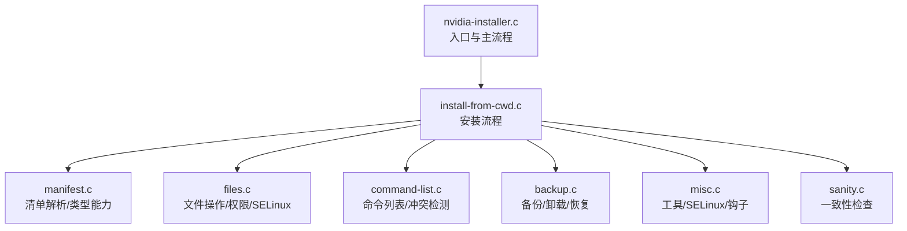
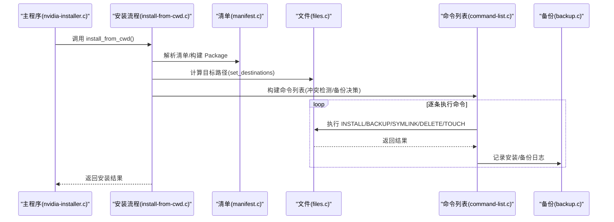
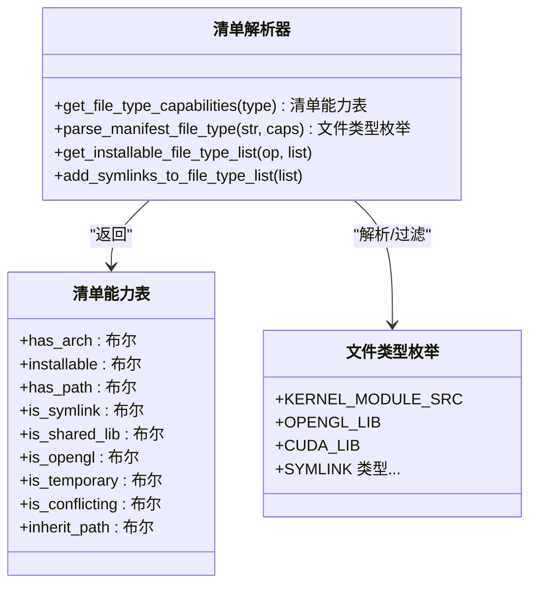
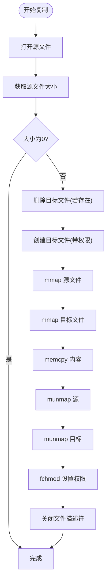
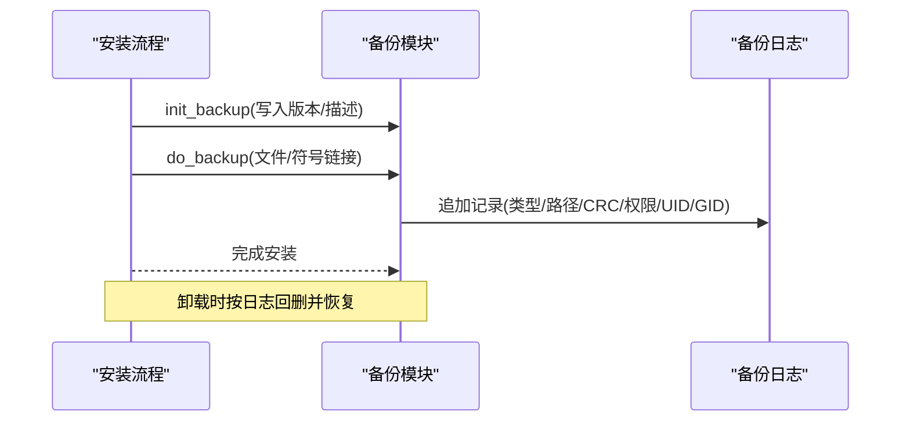
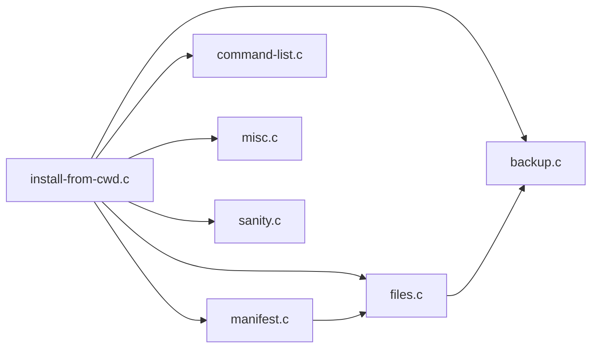

# 文件管理系统

<cite>
**本文引用的文件**
- [nvidia-installer.c](file://nvidia-installer.c)
- [manifest.c](file://manifest.c)
- [manifest.h](file://manifest.h)
- [files.c](file://files.c)
- [files.h](file://files.h)
- [backup.c](file://backup.c)
- [backup.h](file://backup.h)
- [install-from-cwd.c](file://install-from-cwd.c)
- [command-list.c](file://command-list.c)
- [misc.c](file://misc.c)
- [sanity.c](file://sanity.c)
- [sanity.h](file://sanity.h)
- [nvidia-installer.h](file://nvidia-installer.h)
</cite>

## 目录
1. [简介](#简介)
2. [项目结构](#项目结构)
3. [核心组件](#核心组件)
4. [架构总览](#架构总览)
5. [详细组件分析](#详细组件分析)
6. [依赖分析](#依赖分析)
7. [性能考量](#性能考量)
8. [故障排查指南](#故障排查指南)
9. [结论](#结论)
10. [附录：扩展与定制指南](#附录扩展与定制指南)

## 简介
本文件管理系统是 NVIDIA 驱动安装器的一部分，负责在类 Unix 系统上执行文件复制、权限设置、符号链接创建、目录结构管理以及软件包清单（manifest）的解析与处理。系统通过命令行选项控制安装行为，支持备份与恢复、SELinux 上下文设置、冲突检测与解决，并提供安全的文件操作流程（如原子重命名、临时文件写入等）。本文面向开发者与高级用户，既提供高层架构说明，也给出代码级的可视化图示与参考路径。

## 项目结构
该仓库采用按职责分层的组织方式：
- 入口与主流程：nvidia-installer.c 负责命令行解析、初始化、调用安装流程
- 清单解析：manifest.c 提供文件类型枚举、能力表、类型解析与可安装类型列表
- 文件操作：files.c 实现复制、目录遍历、符号链接、权限设置、安全上下文等
- 备份与卸载：backup.c 实现备份日志、安装记录、卸载回滚
- 安装流程编排：install-from-cwd.c 解析清单、构建命令列表、执行安装
- 命令列表与冲突检测：command-list.c 组织 INSTALL/BACKUP/RUN/SYMLINK 等命令，查找冲突文件
- 杂项工具与安全：misc.c 提供 SELinux 检测、工具查找、钩子脚本运行等；sanity.c 执行一致性检查

图表来源
- [nvidia-installer.c:648-762](file://nvidia-installer.c#L648-L762)
- [install-from-cwd.c:96-200](file://install-from-cwd.c#L96-L200)
- [manifest.c:144-252](file://manifest.c#L144-L252)
- [files.c:218-312](file://files.c#L218-L312)
- [command-list.c:77-125](file://command-list.c#L77-L125)
- [backup.c:137-198](file://backup.c#L137-L198)
- [misc.c:1978-2079](file://misc.c#L1978-L2079)
- [sanity.c:33-86](file://sanity.c#L33-L86)

章节来源
- [nvidia-installer.c:648-762](file://nvidia-installer.c#L648-L762)
- [install-from-cwd.c:96-200](file://install-from-cwd.c#L96-L200)

## 核心组件
- 清单与文件类型
  - 清单定义了文件类型枚举、能力位（是否可安装、是否符号链接、是否共享库、是否冲突等），并提供类型解析与可安装类型过滤
  - 参考路径：[清单能力查询:144-158](file://manifest.c#L144-L158)，[类型解析:165-180](file://manifest.c#L165-L180)，[可安装类型列表:185-225](file://manifest.c#L185-L225)
- 文件操作与权限
  - 复制文件使用内存映射提高性能；统一设置权限并处理 umask 影响
  - 创建临时文件、递归删除目录、递归 touch 目录、安全上下文设置（SELinux）
  - 参考路径：[复制文件:218-312](file://files.c#L218-L312)，[临时文件:323-406](file://files.c#L323-L406)，[删除目录:56-116](file://files.c#L56-L116)，[touch 目录:126-207](file://files.c#L126-L207)，[SELinux 上下文:2206-2218](file://files.c#L2206-L2218)
- 备份与卸载
  - 初始化备份目录与日志，记录已安装文件与被备份的符号链接/文件及其权限、UID/GID
  - 卸载时根据日志回删安装内容并恢复备份
  - 参考路径：[初始化备份:137-198](file://backup.c#L137-L198)，[备份文件:208-298](file://backup.c#L208-L298)，[卸载回滚:631-800](file://backup.c#L631-L800)
- 安装流程与命令列表
  - 从当前目录解析清单，构建命令列表（INSTALL/BACKUP/RUN/SYMLINK/DELETE/TOUCH/FUNCTION），执行前进行冲突检测与预处理
  - 参考路径：[安装入口:96-200](file://install-from-cwd.c#L96-L200)，[命令结构:99-106](file://command-list.c#L99-L106)，[冲突检测:136-141](file://command-list.c#L136-L141)
- 安全与一致性
  - SELinux 可用性检测、chcon 类型推断、强制启用/禁用模式提示；一致性检查确保已安装文件存在且未被篡改
  - 参考路径：[SELinux 检测:1978-2079](file://misc.c#L1978-L2079)，[一致性检查:33-86](file://sanity.c#L33-L86)

章节来源
- [manifest.c:144-225](file://manifest.c#L144-L225)
- [files.c:218-406](file://files.c#L218-L406)
- [backup.c:137-298](file://backup.c#L137-L298)
- [install-from-cwd.c:96-200](file://install-from-cwd.c#L96-L200)
- [command-list.c:99-141](file://command-list.c#L99-L141)
- [misc.c:1978-2079](file://misc.c#L1978-L2079)
- [sanity.c:33-86](file://sanity.c#L33-L86)

## 架构总览
系统以“清单驱动 + 命令列表”为核心，安装流程如下：
- 主程序初始化环境、解析命令行、加载默认选项
- 定位并解析当前目录下的清单，构建 Package 结构
- 计算目标路径、生成命令列表（含冲突检测、备份决策）
- 执行命令列表，期间维护备份日志
- 完成后可选择运行一致性检查或卸载

图表来源
- [nvidia-installer.c:648-762](file://nvidia-installer.c#L648-L762)
- [install-from-cwd.c:96-200](file://install-from-cwd.c#L96-L200)
- [manifest.c:144-225](file://manifest.c#L144-L225)
- [files.c:528-800](file://files.c#L528-L800)
- [command-list.c:77-125](file://command-list.c#L77-L125)
- [backup.c:137-198](file://backup.c#L137-L198)

## 详细组件分析

### 组件一：清单解析与文件类型管理
- 功能要点
  - 定义文件类型枚举与能力位，用于判断是否可安装、是否符号链接、是否共享库、是否冲突等
  - 提供字符串到类型的解析函数，以及可安装类型列表的动态过滤（结合 Options）
  - 支持为符号链接类型扩展文件类型列表，便于清理阶段识别
- 关键接口
  - 获取类型能力：[get_file_type_capabilities:144-158](file://manifest.c#L144-L158)
  - 字符串解析类型：[parse_manifest_file_type:165-180](file://manifest.c#L165-L180)
  - 可安装类型列表：[get_installable_file_type_list:185-225](file://manifest.c#L185-L225)
  - 符号链接类型扩展：[add_symlinks_to_file_type_list:231-245](file://manifest.c#L231-L245)

图表来源
- [manifest.c:55-138](file://manifest.c#L55-L138)
- [manifest.c:144-245](file://manifest.c#L144-L245)
- [nvidia-installer.h:101-169](file://nvidia-installer.h#L101-L169)

章节来源
- [manifest.c:144-245](file://manifest.c#L144-L245)
- [nvidia-installer.h:101-169](file://nvidia-installer.h#L101-L169)

### 组件二：文件复制与权限设置
- 功能要点
  - 使用 mmap/munmap 进行高效复制，先删除目标再创建新文件，避免覆盖正在使用的文件
  - 显式设置权限，修正 umask 对 fchmod 的影响
  - 支持递归删除目录、递归 touch 目录、创建临时文件并设置权限
- 关键流程

图表来源
- [files.c:218-312](file://files.c#L218-L312)

章节来源
- [files.c:218-312](file://files.c#L218-L312)

### 组件三：符号链接创建与解析
- 功能要点
  - 创建符号链接并记录日志
  - 解析符号链接目标，支持多级跟随，用于判断是否覆盖特定目标
  - 针对 libGLX_indirect 的特殊处理：仅在目标非专用间接库时才覆盖
- 关键接口
  - 创建符号链接：[install_symlink](file://files.c)
  - 解析符号链接：[get_symlink_target/get_resolved_symlink_target](file://files.c)
  - 特殊覆盖判定：[check_libGLX_indirect_target:418-486](file://files.c#L418-L486)

章节来源
- [files.c:418-518](file://files.c#L418-L518)

### 组件四：目录结构管理与安全上下文
- 功能要点
  - 递归删除目录、递归 touch 目录，保证时间戳同步
  - 递归创建目录并记录到日志，便于卸载时清理
  - SELinux 上下文设置：自动探测可用类型，必要时回退
- 关键接口
  - 删除目录：[remove_directory:56-116](file://files.c#L56-L116)
  - touch 目录：[touch_directory:126-207](file://files.c#L126-L207)
  - 创建目录并记录：[mkdir_with_log](file://files.c)
  - SELinux 上下文设置：[set_security_context:2206-2218](file://files.c#L2206-L2218)
  - SELinux 检测与类型推断：[check_selinux:1978-2079](file://misc.c#L1978-L2079)

章节来源
- [files.c:56-207](file://files.c#L56-L207)
- [files.c:2206-2218](file://files.c#L2206-L2218)
- [misc.c:1978-2079](file://misc.c#L1978-L2079)

### 组件五：备份与卸载回滚
- 功能要点
  - 初始化备份目录与日志，记录版本与描述
  - 备份文件：常规文件移动到备份目录并记录 CRC、权限、UID/GID；符号链接记录目标与权限
  - 卸载：先删除安装内容，再恢复备份；失败时记录日志
- 关键接口
  - 初始化备份：[init_backup:137-198](file://backup.c#L137-L198)
  - 备份文件：[do_backup:208-298](file://backup.c#L208-L298)
  - 记录安装/符号链接：[log_install_file/log_create_symlink:302-362](file://backup.c#L302-L362)
  - 卸载回滚：[do_uninstall:631-800](file://backup.c#L631-L800)

图表来源
- [backup.c:137-198](file://backup.c#L137-L198)
- [backup.c:208-298](file://backup.c#L208-L298)
- [backup.c:302-362](file://backup.c#L302-L362)
- [backup.c:631-800](file://backup.c#L631-L800)

章节来源
- [backup.c:137-362](file://backup.c#L137-L362)
- [backup.c:631-800](file://backup.c#L631-L800)

### 组件六：安装流程与命令列表
- 功能要点
  - 从当前目录解析清单，构建 Package
  - 计算目标路径、生成命令列表（INSTALL/BACKUP/RUN/SYMLINK/DELETE/TOUCH/FUNCTION）
  - 冲突检测：扫描现有文件，按规则决定是否备份/替换
- 关键接口
  - 安装入口：[install_from_cwd:96-200](file://install-from-cwd.c#L96-L200)
  - 目标路径计算：[set_destinations:528-800](file://files.c#L528-L800)
  - 命令结构与添加：[Command 结构/add_command:99-118](file://command-list.c#L99-L118)
  - 冲突检测：[find_conflicting_files:136-141](file://command-list.c#L136-L141)

章节来源
- [install-from-cwd.c:96-200](file://install-from-cwd.c#L96-L200)
- [files.c:528-800](file://files.c#L528-L800)
- [command-list.c:99-141](file://command-list.c#L99-L141)

### 组件七：安全性与一致性
- 安全性
  - 权限检查：要求 root 权限
  - SELinux：检测可用性、强制模式、自动推断 chcon 类型
  - 路径与权限：统一 umask、显式 fchmod、原子重命名
- 一致性
  - 一致性检查：确认已安装文件仍存在
- 关键接口
  - 权限检查：[check_euid:100-113](file://misc.c#L100-L113)
  - SELinux：[check_selinux:1978-2079](file://misc.c#L1978-L2079)
  - 一致性检查：[sanity:33-86](file://sanity.c#L33-L86)

章节来源
- [misc.c:100-113](file://misc.c#L100-L113)
- [misc.c:1978-2079](file://misc.c#L1978-L2079)
- [sanity.c:33-86](file://sanity.c#L33-L86)

## 依赖分析
- 模块耦合
  - install-from-cwd.c 依赖 manifest.c（类型解析）、files.c（文件操作）、command-list.c（命令列表）、backup.c（备份）、misc.c（工具/SELinux）、sanity.c（一致性）
  - files.c 与 backup.c 在备份/恢复阶段紧密协作
  - manifest.c 与 files.c 在目标路径计算与类型能力之间交互
- 外部依赖
  - 工具链：ldconfig、chcon、getenforce、selinux_enabled、nvidia-xconfig 等
  - SELinux：chcon 类型选择与上下文设置
- 循环依赖
  - 未发现直接循环依赖；各模块职责清晰，通过头文件接口交互

图表来源
- [install-from-cwd.c:96-200](file://install-from-cwd.c#L96-L200)
- [manifest.c:144-225](file://manifest.c#L144-L225)
- [files.c:528-800](file://files.c#L528-L800)
- [command-list.c:99-141](file://command-list.c#L99-L141)
- [backup.c:137-198](file://backup.c#L137-L198)
- [misc.c:1978-2079](file://misc.c#L1978-L2079)
- [sanity.c:33-86](file://sanity.c#L33-L86)

章节来源
- [install-from-cwd.c:96-200](file://install-from-cwd.c#L96-L200)
- [manifest.c:144-225](file://manifest.c#L144-L225)
- [files.c:528-800](file://files.c#L528-L800)
- [command-list.c:99-141](file://command-list.c#L99-L141)
- [backup.c:137-198](file://backup.c#L137-L198)
- [misc.c:1978-2079](file://misc.c#L1978-L2079)
- [sanity.c:33-86](file://sanity.c#L33-L86)

## 性能考量
- 复制性能
  - 使用 mmap/munmap 进行大文件复制，减少内核态与用户态拷贝次数
  - 预分配目标文件大小，避免多次扩展带来的碎片化
- 并发与并行
  - 主程序在解析命令行后设置并发级别，安装流程中可并行化部分操作（如多个文件复制）
- I/O 优化
  - 递归 touch 仅更新时间戳，避免不必要的数据写入
  - 备份采用移动而非复制，降低磁盘占用

## 故障排查指南
- 常见问题与定位
  - 权限不足：检查 root 权限与 umask 设置
    - 参考：[check_euid:100-113](file://misc.c#L100-L113)
  - SELinux 强制模式导致 X 启动失败：使用 --force-selinux=no 或调整 chcon 类型
    - 参考：[check_selinux:1978-2079](file://misc.c#L1978-L2079)
  - 备份/卸载失败：查看备份日志，确认类型/路径/CRC/权限记录是否正确
    - 参考：[备份日志格式:54-78](file://backup.c#L54-L78)，[do_backup:208-298](file://backup.c#L208-L298)，[卸载回滚:631-800](file://backup.c#L631-L800)
  - 冲突检测误判：检查 requiredString 与架构匹配规则
    - 参考：[ignore_conflicting_file:841-880](file://command-list.c#L841-L880)
- 建议步骤
  - 开启调试输出，复现问题并收集日志
  - 使用一致性检查验证安装状态
  - 必要时手动执行 chcon 或修复权限

章节来源
- [misc.c:100-113](file://misc.c#L100-L113)
- [misc.c:1978-2079](file://misc.c#L1978-L2079)
- [backup.c:54-78](file://backup.c#L54-L78)
- [backup.c:208-298](file://backup.c#L208-L298)
- [backup.c:631-800](file://backup.c#L631-L800)
- [command-list.c:841-880](file://command-list.c#L841-L880)

## 结论
本文件管理系统以清单驱动的方式，将文件复制、权限设置、符号链接创建与目录管理整合为可配置、可审计、可回滚的安装流程。通过命令列表与冲突检测，系统能够在复杂环境下安全地进行文件操作；通过备份与卸载回滚，保障系统稳定性；通过 SELinux 上下文设置与权限校验，提升安全性。开发者可基于现有接口扩展新的文件类型、自定义目标路径、增强冲突检测策略或引入新的安全检查。

## 附录：扩展与定制指南
- 新增文件类型
  - 在清单能力表中添加类型与能力位，实现类型解析与可安装列表过滤
  - 参考：[清单能力表定义:55-138](file://manifest.c#L55-L138)，[类型解析:165-180](file://manifest.c#L165-L180)，[可安装列表:185-225](file://manifest.c#L185-L225)
- 自定义目标路径
  - 在 set_destinations 中增加类型分支，结合 Options 的前缀/路径变量
  - 参考：[set_destinations:528-800](file://files.c#L528-L800)
- 增强冲突检测
  - 在命令列表中扩展 find_conflicting_files 的搜索范围与规则
  - 参考：[find_conflicting_files:136-141](file://command-list.c#L136-L141)
- 安全上下文定制
  - 通过 --force-selinux 与 --selinux-chcon-type 控制行为，或在 set_security_context 中扩展类型推断
  - 参考：[check_selinux:1978-2079](file://misc.c#L1978-L2079)，[set_security_context:2206-2218](file://files.c#L2206-L2218)
- 备份策略扩展
  - 在备份日志中新增条目类型，或扩展卸载回滚逻辑
  - 参考：[备份日志格式:54-78](file://backup.c#L54-L78)，[卸载回滚:631-800](file://backup.c#L631-L800)