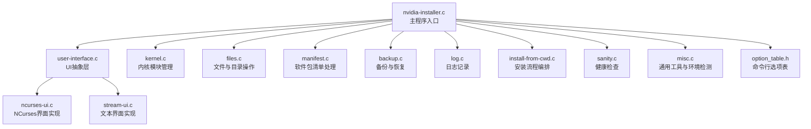
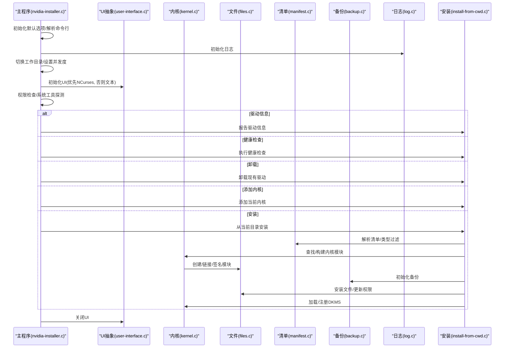
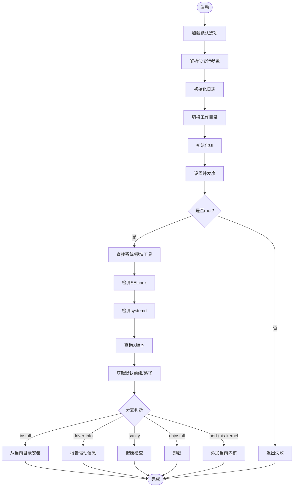
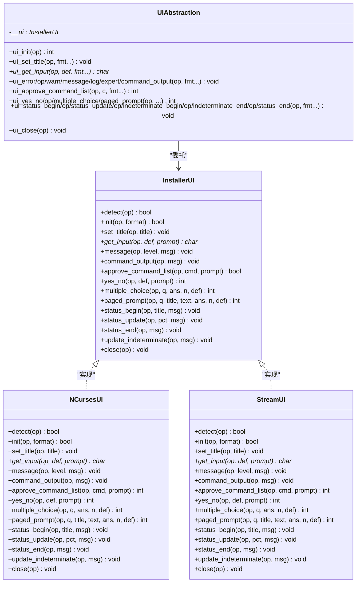
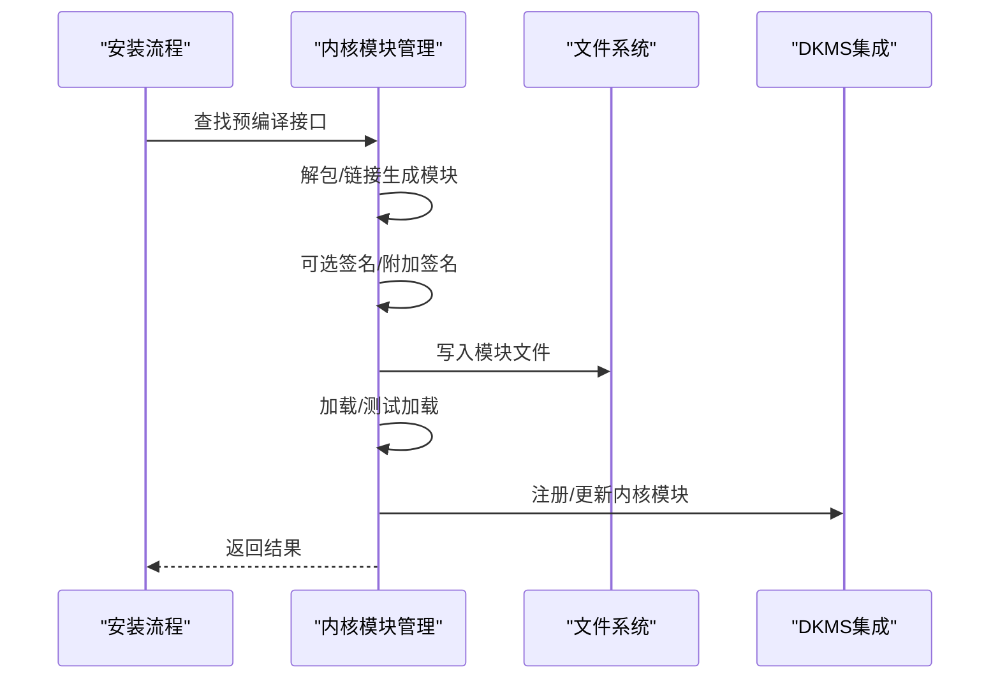
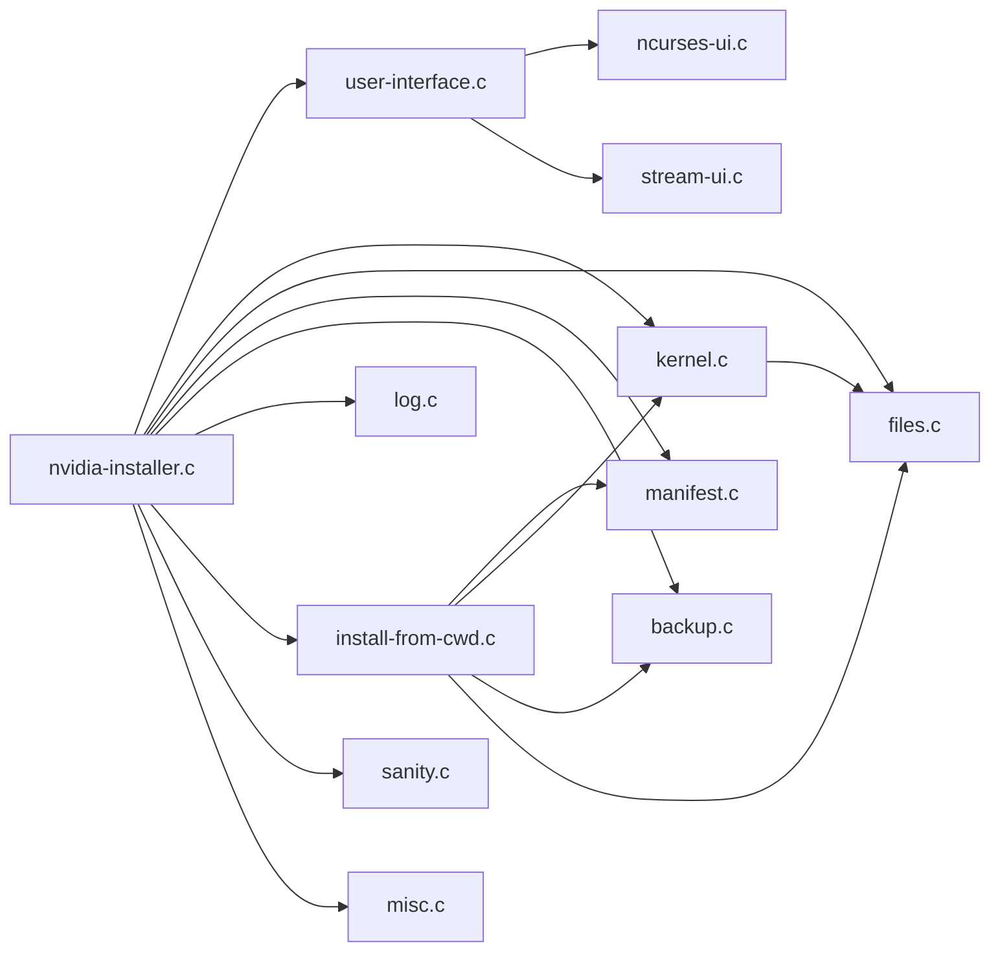

# 核心模块详解

<cite>
**本文档引用的文件**
- [nvidia-installer.c](file://nvidia-installer.c)
- [nvidia-installer.h](file://nvidia-installer.h)
- [kernel.c](file://kernel.c)
- [kernel.h](file://kernel.h)
- [user-interface.c](file://user-interface.c)
- [user-interface.h](file://user-interface.h)
- [ncurses-ui.c](file://ncurses-ui.c)
- [stream-ui.c](file://stream-ui.c)
- [files.c](file://files.c)
- [manifest.c](file://manifest.c)
- [backup.c](file://backup.c)
- [log.c](file://log.c)
- [install-from-cwd.c](file://install-from-cwd.c)
- [sanity.c](file://sanity.c)
- [misc.c](file://misc.c)
- [option_table.h](file://option_table.h)
</cite>

## 目录
1. [简介](#简介)
2. [项目结构](#项目结构)
3. [核心组件](#核心组件)
4. [架构总览](#架构总览)
5. [详细组件分析](#详细组件分析)
6. [依赖关系分析](#依赖关系分析)
7. [性能考量](#性能考量)
8. [故障排查指南](#故障排查指南)
9. [结论](#结论)
10. [附录](#附录)

## 简介
本文件面向开发者与高级用户，系统性解析 NVIDIA 安装程序的核心模块，覆盖主程序初始化流程、命令行参数处理、UI 抽象层（NCurses 与文本界面）、内核模块管理（编译/加载/卸载与 DKMS 集成）、文件管理系统与软件包清单、备份恢复策略与日志记录，并提供可操作的配置选项与使用模式说明。

## 项目结构
项目采用“按职责分层”的组织方式：顶层入口负责初始化与流程控制；核心子系统分别处理 UI、内核模块、文件与清单、备份与日志等；公共头文件统一定义数据结构与接口契约。

图表来源
- [nvidia-installer.c:648-762](file://nvidia-installer.c#L648-L762)
- [user-interface.c:116-239](file://user-interface.c#L116-L239)
- [kernel.c:1-800](file://kernel.c#L1-L800)
- [files.c:1-200](file://files.c#L1-L200)
- [manifest.c:1-200](file://manifest.c#L1-L200)
- [backup.c:137-198](file://backup.c#L137-L198)
- [log.c:65-157](file://log.c#L65-L157)
- [install-from-cwd.c:96-200](file://install-from-cwd.c#L96-L200)
- [sanity.c:33-86](file://sanity.c#L33-L86)
- [misc.c:100-156](file://misc.c#L100-L156)
- [option_table.h:126-200](file://option_table.h#L126-L200)

章节来源
- [nvidia-installer.c:648-762](file://nvidia-installer.c#L648-L762)
- [user-interface.c:116-239](file://user-interface.c#L116-L239)
- [kernel.c:1-800](file://kernel.c#L1-L800)
- [files.c:1-200](file://files.c#L1-L200)
- [manifest.c:1-200](file://manifest.c#L1-L200)
- [backup.c:137-198](file://backup.c#L137-L198)
- [log.c:65-157](file://log.c#L65-L157)
- [install-from-cwd.c:96-200](file://install-from-cwd.c#L96-L200)
- [sanity.c:33-86](file://sanity.c#L33-L86)
- [misc.c:100-156](file://misc.c#L100-L156)
- [option_table.h:126-200](file://option_table.h#L126-L200)

## 核心组件
- 主程序入口与流程控制：负责初始化默认选项、解析命令行、初始化日志、切换工作目录、初始化 UI、并发度设置、权限检查、系统工具探测、查询 X 版本、路径前缀、驱动信息/健康检查/卸载/添加内核/安装等流程分支。
- 命令行参数系统：通过统一的选项表与解析器，支持常见与高级选项，兼容“nvidia-uninstall”调用名触发卸载模式。
- 用户界面抽象：动态选择 NCurses 或内置文本 UI，支持进度条、问答、分页提示、不确定进度指示等。
- 内核模块管理：确定内核源码/输出路径、预编译接口扫描、链接生成、签名、加载/卸载、DKMS 集成、模块类型选择。
- 文件与清单：递归删除/触摸、清单项属性与类型、文件类型过滤与安装决策。
- 备份与恢复：备份目录与日志格式、版本/描述写入、安装前后文件状态记录、卸载时恢复。
- 日志系统：初始化日志文件、记录命令行、环境变量、时间戳与关键状态。
- 健康检查：检测已安装驱动版本与文件完整性。

章节来源
- [nvidia-installer.c:119-640](file://nvidia-installer.c#L119-L640)
- [option_table.h:126-792](file://option_table.h#L126-L792)
- [user-interface.c:116-239](file://user-interface.c#L116-L239)
- [kernel.c:85-800](file://kernel.c#L85-L800)
- [files.c:56-200](file://files.c#L56-L200)
- [manifest.c:55-200](file://manifest.c#L55-L200)
- [backup.c:137-200](file://backup.c#L137-L200)
- [log.c:65-157](file://log.c#L65-L157)
- [sanity.c:33-86](file://sanity.c#L33-L86)

## 架构总览
下图展示主程序与核心子系统的交互关系与数据流。

图表来源
- [nvidia-installer.c:648-762](file://nvidia-installer.c#L648-L762)
- [install-from-cwd.c:96-200](file://install-from-cwd.c#L96-L200)
- [kernel.c:85-800](file://kernel.c#L85-L800)
- [files.c:56-200](file://files.c#L56-L200)
- [manifest.c:55-200](file://manifest.c#L55-L200)
- [backup.c:137-200](file://backup.c#L137-L200)
- [log.c:65-157](file://log.c#L65-L157)

## 详细组件分析

### 主程序初始化与流程控制
- 默认选项加载：集中于内存分配与默认值设定，涵盖日志开关、SELinux 选项、DKMS 开关、模块安装开关、路径前缀、临时目录等。
- 命令行解析：识别“nvidia-uninstall”调用名、帮助打印、版本打印、专家模式、静默模式、调试模式、无问题模式、内核模块仅安装、跳过模块加载/卸载、X 配置、内核源码/输出/包含路径、模块签名脚本/密钥/哈希、系统服务集成、文件类型目标覆盖等。
- 流程控制：根据选项分支执行驱动信息、健康检查、卸载、添加内核或从当前目录安装；安装流程中进行 PCI 设备扫描、系统工具与模块工具探测、SELinux/systemd 检测、X 版本查询、路径前缀获取、并发度设置、权限检查、初始化备份、安装文件、加载模块、建议重启等。

图表来源
- [nvidia-installer.c:119-640](file://nvidia-installer.c#L119-L640)
- [nvidia-installer.c:648-762](file://nvidia-installer.c#L648-L762)

章节来源
- [nvidia-installer.c:119-640](file://nvidia-installer.c#L119-L640)
- [nvidia-installer.c:648-762](file://nvidia-installer.c#L648-L762)

### 命令行参数处理与选项表
- 统一选项表：集中定义所有命令行选项及其行为标志（如是否仅在卸载模式可用、是否总是显示帮助等），便于维护与扩展。
- 解析器：基于选项表逐项解析，支持字符串/布尔/整数参数，错误时打印帮助并退出。
- 兼容性：自动识别“nvidia-uninstall”调用名以进入卸载模式；支持“--advanced-help”打印高级选项。

章节来源
- [option_table.h:126-792](file://option_table.h#L126-L792)
- [nvidia-installer.c:225-640](file://nvidia-installer.c#L225-L640)

### 用户界面模块设计模式
- 抽象层：通过全局 UI 指针与派发表，屏蔽具体 UI 实现差异；支持 NCurses、宽字符 NCurses 变体与内置文本 UI。
- 动态加载：UI 以嵌入二进制的共享库形式存在，运行时提取到临时文件并 dlopen，失败则回退至内置文本 UI。
- 信号处理：捕获多种致命信号，确保 UI 资源清理。
- 进度与交互：支持确定/不确定进度、消息/命令输出、输入框、多选、分页提示、专家模式日志等。

图表来源
- [user-interface.c:116-239](file://user-interface.c#L116-L239)
- [ncurses-ui.c:151-200](file://ncurses-ui.c#L151-L200)
- [stream-ui.c:59-76](file://stream-ui.c#L59-L76)

章节来源
- [user-interface.c:116-239](file://user-interface.c#L116-L239)
- [ncurses-ui.c:151-200](file://ncurses-ui.c#L151-L200)
- [stream-ui.c:59-76](file://stream-ui.c#L59-L76)

### 内核管理模块：编译、加载与 DKMS 集成
- 路径确定：内核源码/输出路径自动探测，支持专家模式交互确认；拒绝常见无效路径。
- 预编译接口：扫描预编译接口，解包并链接生成完整内核模块；支持附加签名与 CRC 校验。
- 编译与签名：调用 make/ld，支持签名脚本定位与哈希算法推断；可选择模块类型（专有/开源）。
- 加载/卸载：测试加载、加载、卸载；支持跳过加载/卸载选项；与 DKMS 集成注册与管理。
- 并发与统计：估算构建输出行数用于进度条；支持单模块重建与失败诊断。

图表来源
- [install-from-cwd.c:194-200](file://install-from-cwd.c#L194-L200)
- [kernel.c:502-549](file://kernel.c#L502-L549)
- [kernel.c:672-762](file://kernel.c#L672-L762)

章节来源
- [kernel.c:85-800](file://kernel.c#L85-L800)
- [install-from-cwd.c:59-79](file://install-from-cwd.c#L59-L79)

### 文件管理系统与软件包清单
- 清单解析：定义文件类型与能力位，支持安装可选类型过滤、继承路径、冲突检测等。
- 文件操作：递归删除目录、递归 touch 更新时间、权限设置、符号链接处理等。
- 安装决策：依据清单类型与选项决定是否安装；支持覆盖文件类型目标路径。

章节来源
- [manifest.c:55-200](file://manifest.c#L55-L200)
- [files.c:56-200](file://files.c#L56-L200)
- [install-from-cwd.c:59-79](file://install-from-cwd.c#L59-L79)

### 备份恢复策略与日志记录
- 备份策略：安装前创建备份目录与日志，记录版本/描述；安装后可按日志恢复。
- 日志记录：初始化日志文件、记录时间戳、命令行、PATH 等；支持非 root 场景下的替代路径。

章节来源
- [backup.c:137-198](file://backup.c#L137-L198)
- [log.c:65-157](file://log.c#L65-L157)

### 健康检查与辅助工具
- 健康检查：检测已安装驱动版本与文件完整性，给出重装建议。
- 权限与环境：检查有效 UID 是否为 root；调整工作目录；查询 X 版本；检测系统工具与模块工具。

章节来源
- [sanity.c:33-86](file://sanity.c#L33-L86)
- [misc.c:100-156](file://misc.c#L100-L156)

## 依赖关系分析
- 主程序依赖 UI、内核、文件、清单、备份、日志、安装流程、健康检查与通用工具。
- UI 抽象依赖 NCurses/宽字符 NCurses 库与内置文本 UI 实现。
- 内核模块管理依赖文件系统、清单、通用工具与系统工具链。
- 安装流程依赖清单、内核模块管理、备份与文件系统。

图表来源
- [nvidia-installer.c:648-762](file://nvidia-installer.c#L648-L762)
- [user-interface.c:116-239](file://user-interface.c#L116-L239)
- [kernel.c:85-800](file://kernel.c#L85-L800)
- [files.c:56-200](file://files.c#L56-L200)
- [manifest.c:55-200](file://manifest.c#L55-L200)
- [backup.c:137-198](file://backup.c#L137-L198)
- [log.c:65-157](file://log.c#L65-L157)
- [install-from-cwd.c:96-200](file://install-from-cwd.c#L96-L200)
- [sanity.c:33-86](file://sanity.c#L33-L86)
- [misc.c:100-156](file://misc.c#L100-L156)

章节来源
- [nvidia-installer.c:648-762](file://nvidia-installer.c#L648-L762)
- [user-interface.c:116-239](file://user-interface.c#L116-L239)
- [kernel.c:85-800](file://kernel.c#L85-L800)
- [files.c:56-200](file://files.c#L56-L200)
- [manifest.c:55-200](file://manifest.c#L55-L200)
- [backup.c:137-198](file://backup.c#L137-L198)
- [log.c:65-157](file://log.c#L65-L157)
- [install-from-cwd.c:96-200](file://install-from-cwd.c#L96-L200)
- [sanity.c:33-86](file://sanity.c#L33-L86)
- [misc.c:100-156](file://misc.c#L100-L156)

## 性能考量
- 并发度：通过并发度设置提升安装阶段的并行化程度，缩短整体耗时。
- 输出估计：构建阶段估算输出行数以优化进度条显示体验。
- 工具链：尽量复用已发现的系统工具与模块工具，避免重复探测开销。
- I/O 优化：批量文件操作与权限设置，减少系统调用次数。

## 故障排查指南
- 权限不足：确保以 root 运行；若非 root，部分场景允许使用临时目录作为日志路径。
- 内核源码缺失：提供明确提示与建议路径；可通过选项指定内核源码/输出路径。
- UI 初始化失败：自动回退至内置文本 UI；检查终端尺寸与信号处理。
- 模块签名失败：检查签名脚本、密钥与哈希算法；必要时手动指定。
- 备份/恢复异常：检查备份目录权限与磁盘空间；核对备份日志格式。

章节来源
- [misc.c:100-156](file://misc.c#L100-L156)
- [kernel.c:75-81](file://kernel.c#L75-L81)
- [user-interface.c:189-239](file://user-interface.c#L189-L239)
- [log.c:73-85](file://log.c#L73-L85)
- [backup.c:137-198](file://backup.c#L137-L198)

## 结论
该安装程序通过清晰的模块划分与抽象层设计，实现了跨平台、可扩展且可诊断的驱动安装流程。主程序负责统一调度，UI 层提供一致的用户体验，内核模块管理与文件系统操作保证了安装的可靠性，备份与日志体系提供了完善的审计与恢复能力。开发者可基于现有接口与选项表快速扩展新功能或适配新的发行版环境。

## 附录
- 常用命令行选项要点
  - 基础：版本、帮助、专家模式、静默、无问题、调试、日志文件名、临时目录。
  - 内核模块：内核源码/输出/包含路径、模块安装路径、模块类型、DKMS 开关、模块签名脚本/密钥/哈希。
  - 文件与路径：OpenGL/X/Wine 前缀与库目录、应用配置路径、文档路径、图标/桌面文件路径等。
  - 系统服务：systemd 集成、rebuild initramfs、禁用/启用某些模块（UVM/DRM/PeerMem）。
  - 兼容性：强制 SELinux、跳过 depmod、覆盖文件类型目标等。

章节来源
- [option_table.h:126-792](file://option_table.h#L126-L792)
- [nvidia-installer.h:499-560](file://nvidia-installer.h#L499-L560)