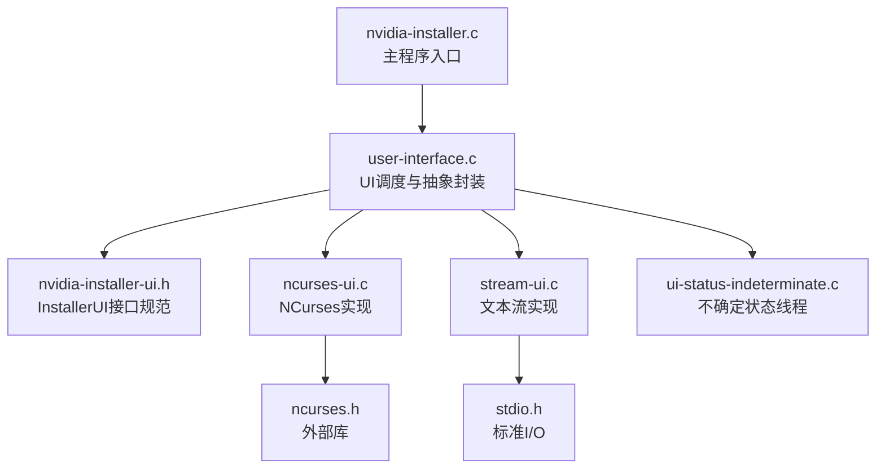
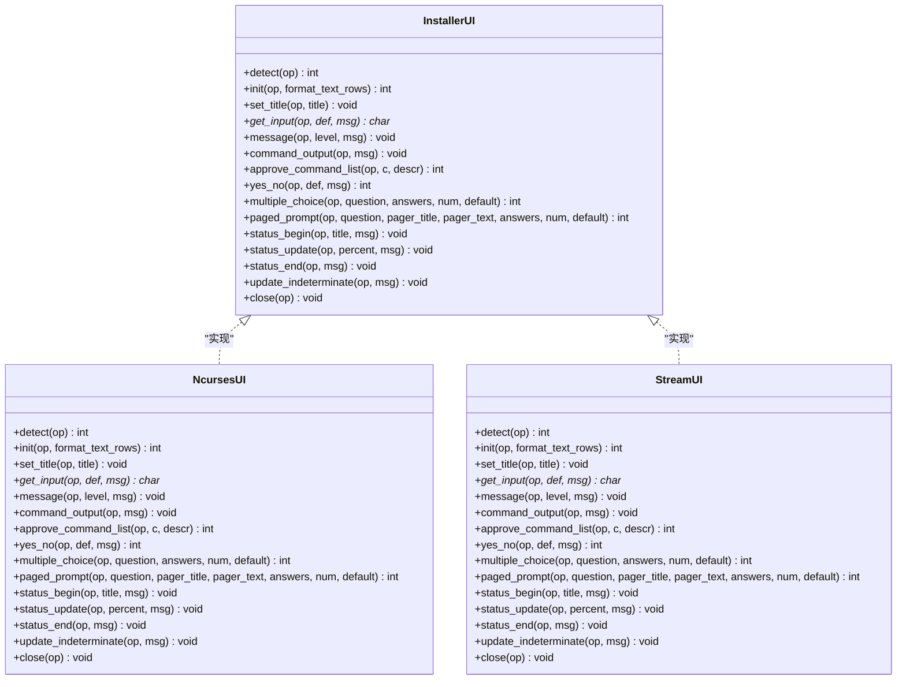
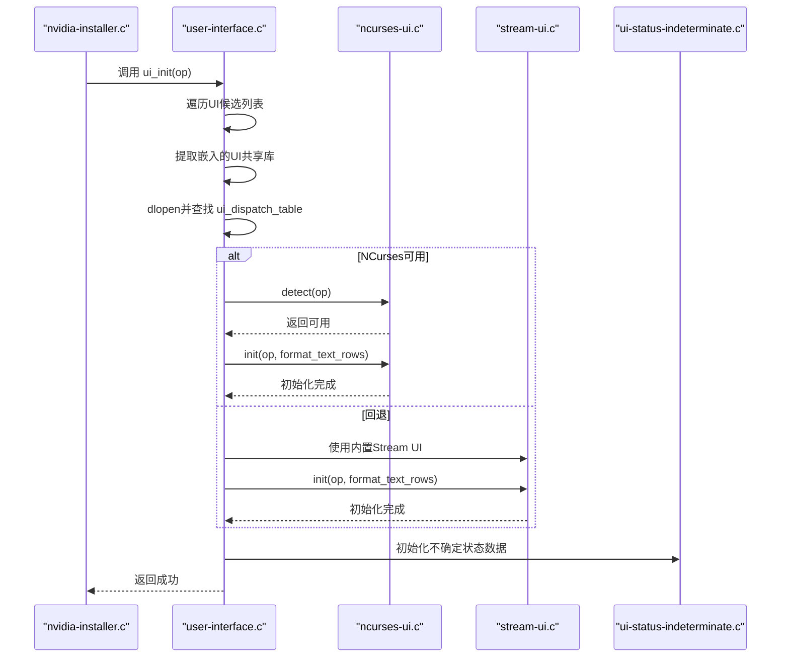
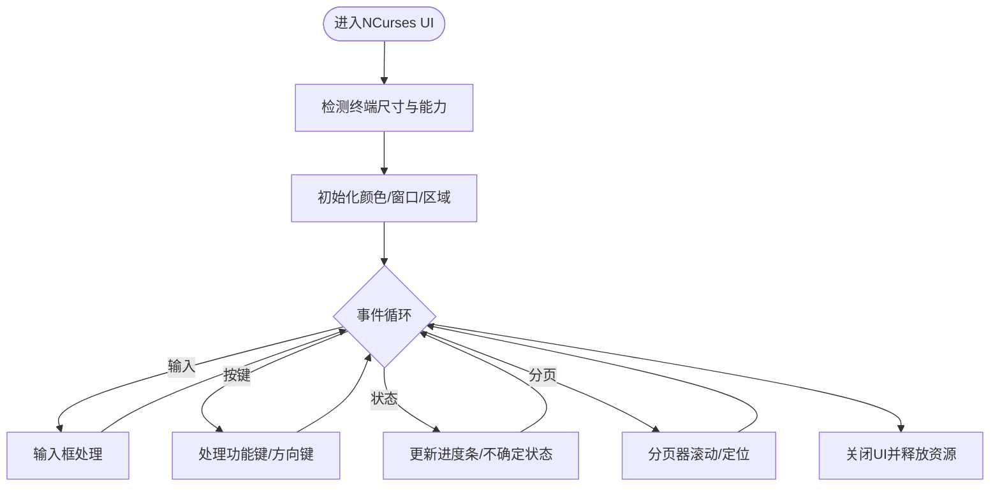
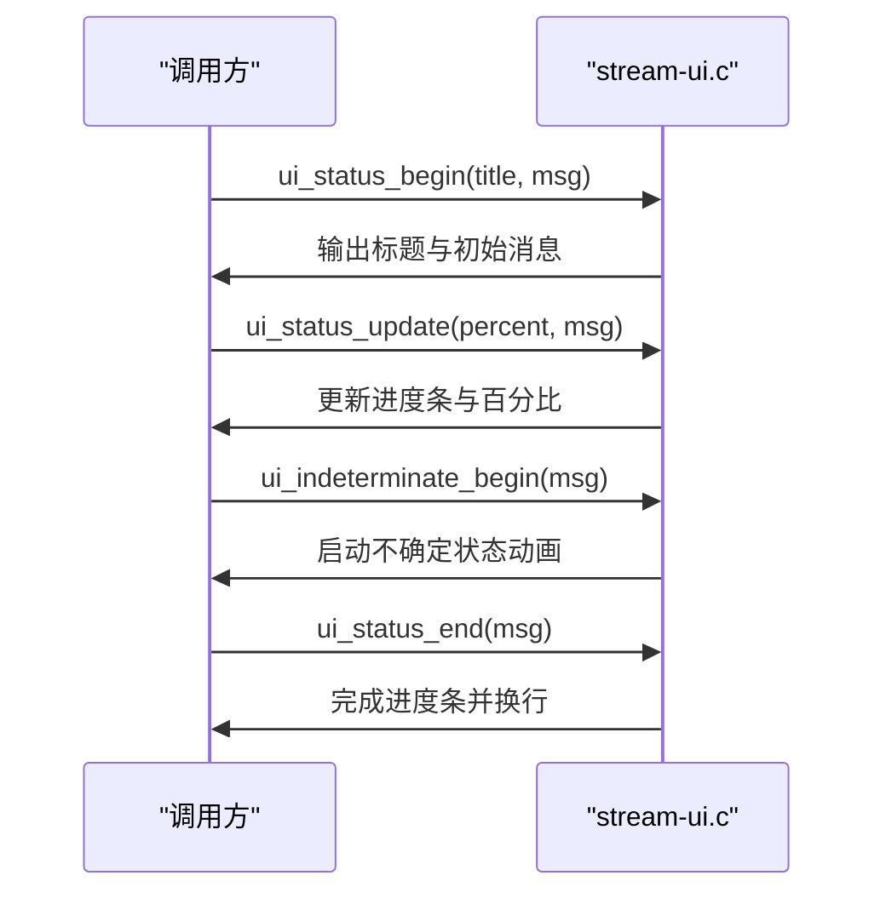
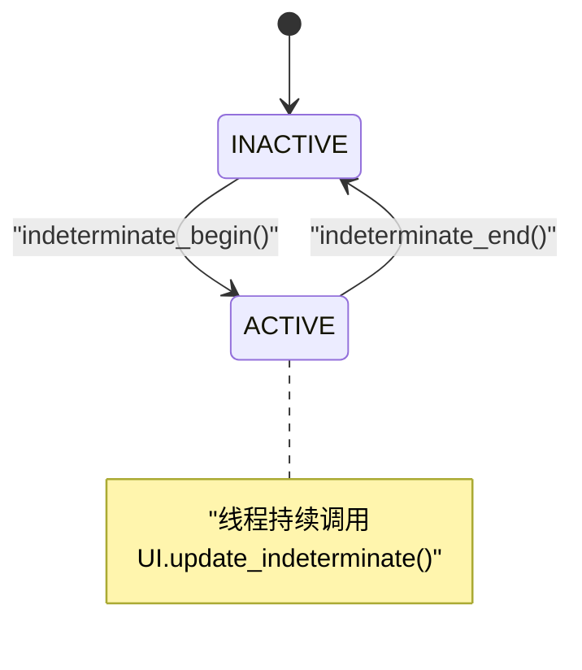
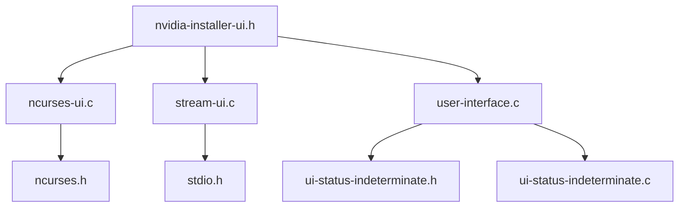

# 用户界面模块

<cite>
**本文档引用的文件**
- [nvidia-installer-ui.h](file://nvidia-installer-ui.h)
- [user-interface.h](file://user-interface.h)
- [user-interface.c](file://user-interface.c)
- [ncurses-ui.c](file://ncurses-ui.c)
- [stream-ui.c](file://stream-ui.c)
- [ui-status-indeterminate.c](file://ui-status-indeterminate.c)
- [ui-status-indeterminate.h](file://ui-status-indeterminate.h)
- [nvidia-installer.h](file://nvidia-installer.h)
- [nvidia-installer.c](file://nvidia-installer.c)
</cite>

## 目录
1. [简介](#简介)
2. [项目结构](#项目结构)
3. [核心组件](#核心组件)
4. [架构总览](#架构总览)
5. [详细组件分析](#详细组件分析)
6. [依赖关系分析](#依赖关系分析)
7. [性能考虑](#性能考虑)
8. [故障排除指南](#故障排除指南)
9. [结论](#结论)
10. [附录](#附录)

## 简介
本文件面向开发者与维护者，系统性阐述用户界面（UI）模块的设计与实现，重点覆盖：
- UI抽象层设计：通过统一的InstallerUI调度表定义接口规范，支持多实现策略（NCurses、文本流等）
- NCurses界面实现：屏幕布局、颜色管理、键盘事件处理、交互式对话框与进度条
- 文本界面（stream-ui）：简化实现，适用于无终端或自动化场景
- 状态指示器：不确定状态的视觉反馈与进度显示机制
- 初始化流程、事件循环与资源管理
- 扩展与定制UI的技术指导

## 项目结构
UI模块由三层组成：
- 抽象层：定义统一的UI接口规范（InstallerUI）
- 实现层：NCurses实现与文本流实现
- 调度层：动态加载UI共享库、选择可用UI并初始化

图表来源
- [nvidia-installer.c:1-200](file://nvidia-installer.c#L1-L200)
- [user-interface.c:116-238](file://user-interface.c#L116-L238)
- [nvidia-installer-ui.h:39-176](file://nvidia-installer-ui.h#L39-L176)
- [ncurses-ui.c:245-261](file://ncurses-ui.c#L245-L261)
- [stream-ui.c:59-75](file://stream-ui.c#L59-L75)

章节来源
- [nvidia-installer.c:1-200](file://nvidia-installer.c#L1-L200)
- [user-interface.c:116-238](file://user-interface.c#L116-L238)

## 核心组件
- InstallerUI接口规范：定义UI能力集合（检测、初始化、标题设置、输入、消息、命令输出、确认、问答、分页提示、状态与不确定状态、关闭）
- UI调度器：按优先级尝试加载NCurses UI（含宽字符变体），失败则回退到内置文本流UI；初始化不确定状态线程
- NCurses实现：基于自绘区域与按钮，实现消息框、输入框、进度条、分页器
- 文本流实现：基于printf/fgets的最小化UI，适合无终端或自动化
- 不确定状态线程：独立线程驱动不确定状态动画，通过互斥量安全切换状态

章节来源
- [nvidia-installer-ui.h:39-176](file://nvidia-installer-ui.h#L39-L176)
- [user-interface.c:116-238](file://user-interface.c#L116-L238)
- [ncurses-ui.c:245-261](file://ncurses-ui.c#L245-L261)
- [stream-ui.c:59-75](file://stream-ui.c#L59-L75)
- [ui-status-indeterminate.c:30-126](file://ui-status-indeterminate.c#L30-L126)

## 架构总览
UI模块采用“接口抽象 + 多实现 + 动态加载”的架构，确保在不同环境下自动选择最优UI，并保持一致的调用体验。

图表来源
- [nvidia-installer-ui.h:39-176](file://nvidia-installer-ui.h#L39-L176)
- [ncurses-ui.c:245-261](file://ncurses-ui.c#L245-L261)
- [stream-ui.c:59-75](file://stream-ui.c#L59-L75)

## 详细组件分析

### UI抽象层与调度器
- 接口规范：通过InstallerUI结构体定义所有UI能力，保证实现一致性
- 调度策略：优先尝试NCurses UI（含宽字符变体），失败则回退到内置Stream UI
- 动态加载：UI以共享库形式嵌入二进制，运行时提取到临时文件并dlopen
- 不确定状态：通过独立线程与互斥量控制，避免阻塞UI主线程

图表来源
- [user-interface.c:116-238](file://user-interface.c#L116-L238)
- [ncurses-ui.c:281-301](file://ncurses-ui.c#L281-L301)
- [stream-ui.c:174-194](file://stream-ui.c#L174-L194)
- [ui-status-indeterminate.c:30-43](file://ui-status-indeterminate.c#L30-L43)

章节来源
- [user-interface.c:116-238](file://user-interface.c#L116-L238)
- [user-interface.c:683-754](file://user-interface.c#L683-L754)
- [ui-status-indeterminate.c:30-126](file://ui-status-indeterminate.c#L30-L126)

### NCurses界面实现
- 屏幕布局：自绘Header/Footer/Message区域，避免ncurses窗口的已知问题
- 颜色管理：可选颜色对，不支持时自动降级为反显
- 键盘事件：禁用回显与缓冲，启用功能键/方向键；支持Ctrl+L重绘
- 对话框与输入：消息框带OK按钮，输入框支持左右移动、删除、滚动预览
- 分页器：支持上下翻页与百分比定位，底部状态栏显示位置信息
- 进度条：支持确定与不确定两种模式，支持实时更新与动画

图表来源
- [ncurses-ui.c:281-301](file://ncurses-ui.c#L281-L301)
- [ncurses-ui.c:310-374](file://ncurses-ui.c#L310-L374)
- [ncurses-ui.c:405-634](file://ncurses-ui.c#L405-L634)
- [ncurses-ui.c:828-1042](file://ncurses-ui.c#L828-L1042)
- [ncurses-ui.c:1480-1600](file://ncurses-ui.c#L1480-L1600)

章节来源
- [ncurses-ui.c:310-374](file://ncurses-ui.c#L310-L374)
- [ncurses-ui.c:405-634](file://ncurses-ui.c#L405-L634)
- [ncurses-ui.c:828-1042](file://ncurses-ui.c#L828-L1042)
- [ncurses-ui.c:1480-1600](file://ncurses-ui.c#L1480-L1600)

### 文本界面（Stream UI）
- 设计目标：最小化依赖，确保在任何环境中可用
- 能力覆盖：输入、消息、命令输出（专家模式）、确认、问答、多选、分页提示、状态与不确定状态
- 状态条：水平进度条与百分比，不确定状态以移动光标动画呈现

图表来源
- [stream-ui.c:471-517](file://stream-ui.c#L471-L517)
- [stream-ui.c:501-507](file://stream-ui.c#L501-L507)

章节来源
- [stream-ui.c:174-194](file://stream-ui.c#L174-L194)
- [stream-ui.c:216-234](file://stream-ui.c#L216-L234)
- [stream-ui.c:243-272](file://stream-ui.c#L243-L272)
- [stream-ui.c:298-323](file://stream-ui.c#L298-L323)
- [stream-ui.c:332-356](file://stream-ui.c#L332-L356)
- [stream-ui.c:404-435](file://stream-ui.c#L404-L435)
- [stream-ui.c:446-462](file://stream-ui.c#L446-L462)
- [stream-ui.c:471-517](file://stream-ui.c#L471-L517)
- [stream-ui.c:501-507](file://stream-ui.c#L501-L507)

### 状态指示器与不确定状态
- 数据结构：封装互斥量、线程与状态枚举
- 生命周期：begin启动线程并设置ACTIVE；end等待线程结束并设置INACTIVE
- 线程工作：周期性调用UI的update_indeterminate回调，驱动动画
- 并发安全：通过互斥量保护状态访问，避免竞态

图表来源
- [ui-status-indeterminate.c:30-126](file://ui-status-indeterminate.c#L30-L126)
- [user-interface.c:575-626](file://user-interface.c#L575-L626)

章节来源
- [ui-status-indeterminate.h:31-47](file://ui-status-indeterminate.h#L31-L47)
- [ui-status-indeterminate.c:30-126](file://ui-status-indeterminate.c#L30-L126)
- [user-interface.c:575-626](file://user-interface.c#L575-L626)

### 初始化流程、事件循环与资源管理
- 初始化：选择UI -> 加载共享库 -> 检测 -> 初始化 -> 注册信号处理器 -> 处理延迟消息
- 事件循环：NCurses中通过wgetch轮询事件；Stream UI在需要时同步刷新
- 资源管理：分配DataStruct/RegionStruct/PagerStruct等，退出时逐级释放；UI关闭时清理临时文件

章节来源
- [user-interface.c:116-238](file://user-interface.c#L116-L238)
- [ncurses-ui.c:310-374](file://ncurses-ui.c#L310-L374)
- [ncurses-ui.c:1052-1070](file://ncurses-ui.c#L1052-L1070)
- [user-interface.c:646-661](file://user-interface.c#L646-L661)

## 依赖关系分析
- 外部依赖：NCurses用于图形化UI；标准I/O用于文本UI
- 内部依赖：UI调度器依赖选项结构与日志系统；不确定状态线程依赖UI回调
- 可能的耦合点：UI实现与格式化文本函数FormatTextRows的耦合；NCurses实现对终端尺寸的依赖

图表来源
- [nvidia-installer-ui.h:26-27](file://nvidia-installer-ui.h#L26-L27)
- [ncurses-ui.c:23-30](file://ncurses-ui.c#L23-L30)
- [stream-ui.c:25-37](file://stream-ui.c#L25-L37)
- [user-interface.c:36-41](file://user-interface.c#L36-L41)
- [ui-status-indeterminate.h:17-41](file://ui-status-indeterminate.h#L17-L41)

章节来源
- [nvidia-installer-ui.h:26-27](file://nvidia-installer-ui.h#L26-L27)
- [ncurses-ui.c:23-30](file://ncurses-ui.c#L23-L30)
- [stream-ui.c:25-37](file://stream-ui.c#L25-L37)
- [user-interface.c:36-41](file://user-interface.c#L36-L41)
- [ui-status-indeterminate.h:17-41](file://ui-status-indeterminate.h#L17-L41)

## 性能考虑
- NCurses渲染：尽量减少wrefresh调用次数，批量绘制后再刷新；在状态更新时使用非阻塞模式读取按键
- 文本UI：进度条仅在百分比变化时打印，避免频繁输出
- 不确定状态：动画节拍与usleep配合，避免过度占用CPU
- 资源回收：及时释放临时文件与内存，避免泄漏

## 故障排除指南
- UI无法初始化
  - 检查终端尺寸是否小于最小要求（宽度/高度阈值）
  - 确认NCurses库可用且颜色支持正常
  - 查看日志输出的“Unable to initialize”或“Unable to load”
- 输入异常
  - NCurses输入框支持Backspace/Delete/方向键；若无效，检查终端类型与ncurses版本
  - 文本UI需确保stdin可读
- 进度条不显示
  - 确认调用了ui_status_begin并传入有效参数
  - 文本UI在静默模式下可能不输出
- 不确定状态无响应
  - 检查线程创建与互斥量初始化是否成功
  - 确保在循环中调用update_indeterminate回调

章节来源
- [ncurses-ui.c:281-301](file://ncurses-ui.c#L281-L301)
- [ncurses-ui.c:310-374](file://ncurses-ui.c#L310-L374)
- [stream-ui.c:174-194](file://stream-ui.c#L174-L194)
- [user-interface.c:162-184](file://user-interface.c#L162-L184)
- [ui-status-indeterminate.c:93-108](file://ui-status-indeterminate.c#L93-L108)

## 结论
该UI模块通过清晰的抽象层与多实现策略，在保证功能一致性的同时兼顾了跨平台与环境适配。NCurses实现提供了丰富的交互能力，而文本流实现确保了在受限环境中的可用性。不确定状态线程与调度器的结合，使得复杂任务的可视化反馈成为可能。建议在新场景下遵循现有接口规范，复用调度器逻辑，快速集成新的UI实现。

## 附录

### UI接口使用模式与示例路径
- 初始化与关闭
  - [user-interface.c:116-238](file://user-interface.c#L116-L238)
  - [user-interface.c:646-661](file://user-interface.c#L646-L661)
- 消息与输入
  - [user-interface.c:247-288](file://user-interface.c#L247-L288)
  - [ncurses-ui.c:405-634](file://ncurses-ui.c#L405-L634)
  - [stream-ui.c:216-234](file://stream-ui.c#L216-L234)
- 状态与不确定状态
  - [user-interface.c:538-642](file://user-interface.c#L538-L642)
  - [ncurses-ui.c:828-1042](file://ncurses-ui.c#L828-L1042)
  - [stream-ui.c:471-517](file://stream-ui.c#L471-L517)
  - [stream-ui.c:501-507](file://stream-ui.c#L501-L507)
- 分页与多选
  - [ncurses-ui.c:816-822](file://ncurses-ui.c#L816-L822)
  - [ncurses-ui.c:1480-1600](file://ncurses-ui.c#L1480-L1600)
  - [stream-ui.c:404-435](file://stream-ui.c#L404-L435)
  - [stream-ui.c:446-462](file://stream-ui.c#L446-L462)

### 自定义UI开发步骤
- 定义实现文件与InstallerUI调度表
  - 参考：[ncurses-ui.c:245-261](file://ncurses-ui.c#L245-L261)，[stream-ui.c:59-75](file://stream-ui.c#L59-L75)
- 实现detect/init/close以满足调度器要求
  - 参考：[ncurses-ui.c:281-301](file://ncurses-ui.c#L281-L301)，[stream-ui.c:162-166](file://stream-ui.c#L162-L166)
- 实现核心UI功能（输入、消息、状态等）
  - 参考：[ncurses-ui.c:405-634](file://ncurses-ui.c#L405-L634)，[stream-ui.c:216-272](file://stream-ui.c#L216-L272)
- 在调度器中注册UI候选
  - 参考：[user-interface.c:120-140](file://user-interface.c#L120-L140)
- 集成不确定状态线程（如需）
  - 参考：[user-interface.c:575-626](file://user-interface.c#L575-L626)，[ui-status-indeterminate.c:93-126](file://ui-status-indeterminate.c#L93-L126)