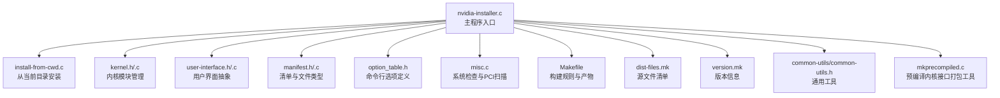
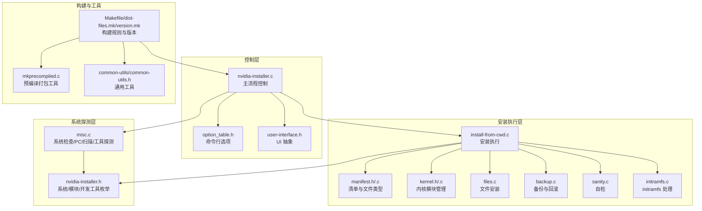
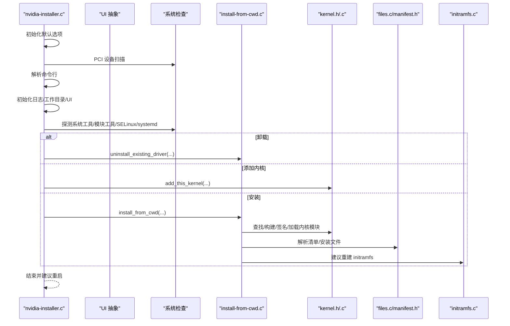
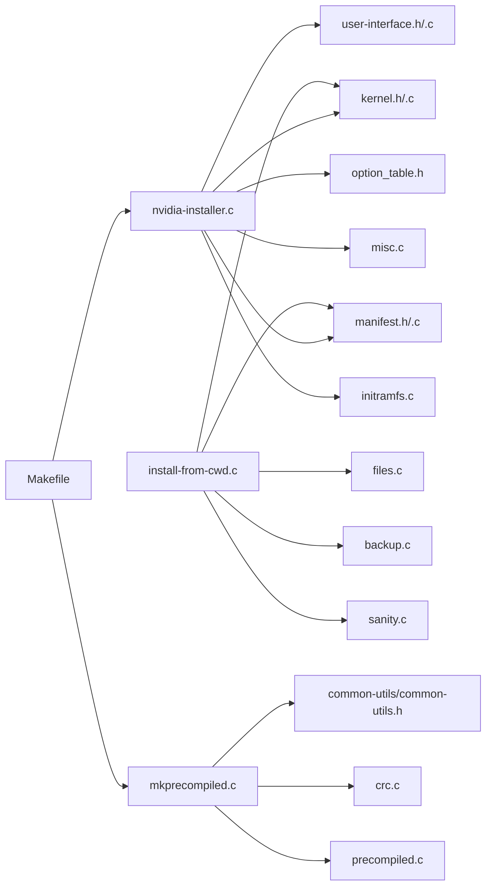

# 项目概述

<cite>
**本文引用的文件**
- [README](file://README)
- [nvidia-installer.c](file://nvidia-installer.c)
- [nvidia-installer.h](file://nvidia-installer.h)
- [Makefile](file://Makefile)
- [dist-files.mk](file://dist-files.mk)
- [version.mk](file://version.mk)
- [kernel.h](file://kernel.h)
- [user-interface.h](file://user-interface.h)
- [manifest.h](file://manifest.h)
- [option_table.h](file://option_table.h)
- [install-from-cwd.c](file://install-from-cwd.c)
- [mkprecompiled.c](file://mkprecompiled.c)
- [misc.c](file://misc.c)
- [common-utils/common-utils.h](file://common-utils/common-utils.h)
</cite>

## 目录
1. [引言](#引言)
2. [项目结构](#项目结构)
3. [核心组件](#核心组件)
4. [架构总览](#架构总览)
5. [详细组件分析](#详细组件分析)
6. [依赖分析](#依赖分析)
7. [性能考虑](#性能考虑)
8. [故障排查指南](#故障排查指南)
9. [结论](#结论)
10. [附录](#附录)

## 引言
本项目是 NVIDIA 在 Linux 系统上的图形驱动安装器（nvidia-installer），用于自动化安装、升级与卸载 NVIDIA 驱动程序。其核心目标是在不同发行版与内核版本下，通过统一的安装流程完成驱动软件包的解析、校验、内核模块构建与加载、用户态库与配置文件的部署，并处理与系统现有组件（如 X Server、DKMS、SELinux、systemd、initramfs）的集成。

本安装器支持多种安装模式与可选组件（如 UVM、DRM、PeerMem），并通过命令行选项提供细粒度控制；同时内置预编译内核接口（precompiled kernel interfaces）机制，以减少内核模块编译时间并提升兼容性。

## 项目结构
项目采用“按职责分层”的组织方式：入口程序负责参数解析与流程编排，核心模块负责内核模块管理、文件清单与安装、用户界面抽象、PCI 设备扫描与系统检查等。公共工具库提供通用的字符串处理、路径操作、版本编码等能力。

图表来源
- [nvidia-installer.c](file://nvidia-installer.c)
- [install-from-cwd.c](file://install-from-cwd.c)
- [kernel.h](file://kernel.h)
- [user-interface.h](file://user-interface.h)
- [manifest.h](file://manifest.h)
- [option_table.h](file://option_table.h)
- [misc.c](file://misc.c)
- [Makefile](file://Makefile)
- [dist-files.mk](file://dist-files.mk)
- [version.mk](file://version.mk)
- [common-utils/common-utils.h](file://common-utils/common-utils.h)
- [mkprecompiled.c](file://mkprecompiled.c)

章节来源
- [Makefile](file://Makefile)
- [dist-files.mk](file://dist-files.mk)
- [version.mk](file://version.mk)

## 核心组件
- 主程序入口与流程编排
  - 负责默认选项初始化、PCI 设备扫描、命令行解析、日志初始化、工作目录调整、UI 初始化、并发度设置、系统工具与模块工具探测、X 版本查询、前缀与路径推导、驱动信息/自检/卸载/添加内核/安装等分支选择。
- 内核模块管理
  - 提供内核模块类型（专有/开源）、预编译接口查找与匹配、内核源码与输出路径确定、接口与模块构建、模块签名、加载与卸载、配置项测试等功能。
- 文件清单与安装
  - 解析 .manifest，识别文件类型与能力位，决定安装路径与是否安装某类文件；支持覆盖安装路径、符号链接处理与冲突文件备份策略。
- 用户界面抽象
  - 统一的消息输出、确认提示、进度状态、分页提示、命令列表审批等接口，支持 ncurses 与无 UI 模式。
- 系统检查与集成
  - 扫描 PCI 设备、检测 nouveau 冲突、SELinux 与 systemd 支持、initramfs 重建建议、X 服务器状态、开发工具与系统工具可用性等。
- 构建与打包
  - Makefile 定义产物（安装器、预编译打包工具、手册页）、条件编译（ncurses 版本）、对象文件规则与 UI 动态库打包为只读数据等。

章节来源
- [nvidia-installer.c](file://nvidia-installer.c)
- [nvidia-installer.h](file://nvidia-installer.h)
- [kernel.h](file://kernel.h)
- [user-interface.h](file://user-interface.h)
- [manifest.h](file://manifest.h)
- [option_table.h](file://option_table.h)
- [install-from-cwd.c](file://install-from-cwd.c)
- [misc.c](file://misc.c)
- [Makefile](file://Makefile)

## 架构总览
安装器采用“入口程序 + 子系统模块 + 工具库”的分层架构。入口程序作为控制中心，调用各子系统完成安装流程；子系统之间通过统一的数据结构（Options、Package、CommandList 等）交互；工具库提供跨平台与跨模块的通用能力。

图表来源
- [nvidia-installer.c](file://nvidia-installer.c)
- [option_table.h](file://option_table.h)
- [user-interface.h](file://user-interface.h)
- [install-from-cwd.c](file://install-from-cwd.c)
- [manifest.h](file://manifest.h)
- [kernel.h](file://kernel.h)
- [misc.c](file://misc.c)
- [Makefile](file://Makefile)
- [dist-files.mk](file://dist-files.mk)
- [version.mk](file://version.mk)
- [mkprecompiled.c](file://mkprecompiled.c)
- [common-utils/common-utils.h](file://common-utils/common-utils.h)

## 详细组件分析

### 入口程序与控制流
- 默认选项初始化：设置日志开关、默认前缀、UI 名称、SELinux 选项、并发度、是否安装 UVM/DRM/PeerMem 等。
- 命令行解析：基于选项表解析所有命令行参数，支持“专家模式”“静默模式”“跳过问题”“禁用 nouvau 检查”“仅安装内核模块”等。
- 流程编排：根据选项决定打印版本/帮助、报告驱动信息、执行自检、卸载、添加内核或从当前目录安装；安装完成后建议重启。

图表来源
- [nvidia-installer.c](file://nvidia-installer.c)
- [install-from-cwd.c](file://install-from-cwd.c)
- [kernel.h](file://kernel.h)
- [manifest.h](file://manifest.h)
- [misc.c](file://misc.c)
- [initramfs.c](file://initramfs.c)

章节来源
- [nvidia-installer.c](file://nvidia-installer.c)
- [option_table.h](file://option_table.h)
- [user-interface.h](file://user-interface.h)
- [misc.c](file://misc.c)

### 内核模块管理
- 模块类型与路径：支持“专有/开源”两种内核模块类型，自动推导安装路径与源码/输出路径。
- 预编译接口：扫描预编译目录（用户指定、系统路径、.run 包内 usr/src/nv/precompiled），匹配当前内核版本字符串，避免编译。
- 构建与签名：根据配置构建接口与模块，支持模块签名脚本与密钥路径；可选择 DKMS 注册。
- 加载与卸载：在安装前后进行模块加载/卸载测试，处理冲突模块与运行时依赖。

图表来源
- [kernel.h](file://kernel.h)
- [install-from-cwd.c](file://install-from-cwd.c)
- [mkprecompiled.c](file://mkprecompiled.c)

章节来源
- [kernel.h](file://kernel.h)
- [install-from-cwd.c](file://install-from-cwd.c)
- [mkprecompiled.c](file://mkprecompiled.c)

### 文件清单与安装
- 清单解析：从 .manifest 读取条目，识别文件类型（内核模块、OpenGL 库、X 模块、系统服务单元、配置文件等）与能力位。
- 安装决策：根据 Options 中的布尔标志与文件类型列表决定是否安装；支持覆盖特定类型的安装路径。
- 符号链接与冲突处理：对共享库与模块生成必要的符号链接；对冲突文件进行备份或删除策略。

章节来源
- [manifest.h](file://manifest.h)
- [install-from-cwd.c](file://install-from-cwd.c)
- [nvidia-installer.h](file://nvidia-installer.h)

### 用户界面抽象
- 统一消息接口：错误、警告、普通消息、日志、专家级信息、命令输出等。
- 交互接口：确认/多选/分页提示/进度状态/不确定状态指示器。
- UI 实现：支持 ncurses 与无 UI 模式，动态加载 UI 插件并打包为只读二进制数组。

章节来源
- [user-interface.h](file://user-interface.h)
- [nvidia-installer.c](file://nvidia-installer.c)
- [Makefile](file://Makefile)

### 系统检查与集成
- PCI 设备扫描：使用 libpciaccess 扫描 NVIDIA 显卡设备，识别遗留设备与是否具备 VGA/3D 类别。
- 冲突检测：检测 nouveau 是否正在使用，必要时提示禁用；检查 X 服务器状态与 SELinux/systemd 支持。
- 开发工具与系统工具：探测 ldconfig、grep、dmseg、objcopy、openssl、pkg-config、systemctl、tar 等工具是否存在。
- initramfs：在安装后建议重建 initramfs，确保新内核模块被正确纳入。

章节来源
- [misc.c](file://misc.c)
- [nvidia-installer.h](file://nvidia-installer.h)
- [initramfs.c](file://initramfs.c)

### 构建与打包工具
- 主安装器构建：Makefile 定义 nvidia-installer、mkprecompiled、makeself 帮助脚本与手册页生成规则；支持 ncurses 多版本动态库打包。
- 预编译打包工具：mkprecompiled 用于将预编译内核接口与模块打包为可复用包，包含信息提取、匹配与解包逻辑。
- 版本与宏：version.mk 提供驱动版本信息，生成头文件供程序使用。

章节来源
- [Makefile](file://Makefile)
- [dist-files.mk](file://dist-files.mk)
- [version.mk](file://version.mk)
- [mkprecompiled.c](file://mkprecompiled.c)

## 依赖分析
- 内部依赖
  - nvidia-installer.c 依赖 kernel.h、user-interface.h、manifest.h、option_table.h、misc.c 等模块。
  - install-from-cwd.c 依赖 manifest.h、kernel.h、files.c、backup.c、sanity.c、initramfs.c 等。
  - mkprecompiled.c 依赖 common-utils.h、crc.c、precompiled.c。
- 外部依赖
  - ncurses（UI）、pciutils（PCI 设备访问）、make/ld 等构建工具。
  - 运行时依赖：系统工具（ldconfig、depmod、systemctl、tar 等）、内核头文件与 DKMS（可选）。

图表来源
- [nvidia-installer.c](file://nvidia-installer.c)
- [install-from-cwd.c](file://install-from-cwd.c)
- [kernel.h](file://kernel.h)
- [user-interface.h](file://user-interface.h)
- [manifest.h](file://manifest.h)
- [option_table.h](file://option_table.h)
- [misc.c](file://misc.c)
- [mkprecompiled.c](file://mkprecompiled.c)
- [Makefile](file://Makefile)

章节来源
- [Makefile](file://Makefile)
- [dist-files.mk](file://dist-files.mk)

## 性能考虑
- 并发度：支持通过命令行设置并发级别，以并行化可并行的任务（如内核模块构建）。
- 预编译接口：优先使用预编译接口可显著减少内核模块编译时间，尤其在多内核环境或 CI 场景。
- UI 动态库打包：将 UI 插件打包为只读数据，避免运行时查找库的问题，同时减少启动开销。
- I/O 优化：在安装过程中尽量批量执行命令与文件写入，减少多次系统调用。

## 故障排查指南
- 常见问题
  - 缺少开发工具：确保已安装 ncurses 与 pciutils 的开发包；安装器会探测并报错。
  - 新内核未匹配：若未找到匹配的预编译接口，将触发内核模块编译；检查内核源码与输出路径配置。
  - nouveau 冲突：安装器默认检测并建议禁用 nouveau；可通过选项跳过检查或显式禁用。
  - SELinux 与 systemd：安装器会尝试自动设置 SELinux 上下文与 systemd 单元文件；若失败，检查相关工具可用性。
- 自检与日志
  - 使用自检选项快速验证现有安装状态；查看默认日志文件位置以便定位问题。
- 回滚与备份
  - 安装过程中对冲突文件进行备份；卸载流程可恢复备份文件。

章节来源
- [nvidia-installer.c](file://nvidia-installer.c)
- [misc.c](file://misc.c)
- [install-from-cwd.c](file://install-from-cwd.c)
- [README](file://README)

## 结论
本项目以简洁而稳健的方式实现了 NVIDIA 驱动在 Linux 系统上的自动化安装与升级。通过清晰的模块划分、完善的系统检查与集成、灵活的命令行控制与 UI 抽象，以及对预编译内核接口与多内核环境的良好支持，nvidia-installer 能够在不同发行版与硬件环境下提供一致且可靠的安装体验。对于初学者，其默认行为与交互设计降低了使用门槛；对于高级用户与系统管理员，丰富的选项与可扩展的 UI/钩子机制提供了足够的灵活性。

## 附录
- 适用场景
  - 服务器与工作站图形加速驱动安装与维护
  - 需要与 DKMS、systemd、SELinux 等系统特性集成的环境
  - 需要预编译内核接口以减少编译时间的场景
- 目标用户
  - Linux 系统管理员与运维工程师
  - 需要稳定图形驱动的开发者与终端用户
  - 集成商与发行版打包人员（配合预编译接口与 makeself 帮助脚本）
- 与其他 NVIDIA 工具的关系
  - 与 nvidia-xconfig、nvidia-settings、nvidia-bug-report.sh 等工具共同构成 NVIDIA 驱动生态；安装器负责驱动安装与内核模块集成，其他工具负责配置与诊断。